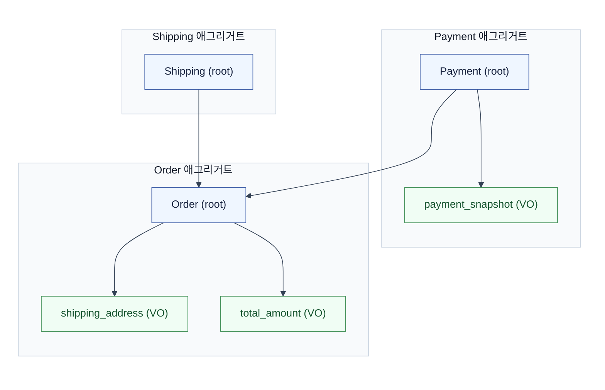

# DDD 애그리거트(Aggregate)

DDD 전술 패턴의 핵심. **"함께 변경되어야 하고, 함께 일관성을 지켜야 하는 객체들의 묶음"** = 애그리거트. 그 묶음의 **일관성 경계(consistency boundary)** 이자 **트랜잭션 단위**다.



## 구성 요소
- **Entity**: **식별자(ID)** 로 구분, 수명주기 있고 가변. (예: `Order`)
- **Value Object(VO)**: **값**으로 구분, 불변, 자체 ID 없음. (예: `Money`, `Address`)
- **Aggregate**: 엔티티·VO의 묶음 = 일관성 경계.
- **Aggregate Root**: 애그리거트의 **유일한 진입점**(루트 엔티티). 외부는 **루트를 통해서만** 내부에 접근하고, **루트의 ID로만** 참조.

## 4대 규칙 (Vaughn Vernon — Effective Aggregate Design)
1. **불변식(invariant)을 경계 안에서 보호.** 루트가 내부 규칙을 강제. (예: "주문은 `CONFIRMED` 상태의 결제로만 생성")
2. **작게 설계.** 큰 애그리거트 = 동시성 충돌·락·성능 문제. 꼭 같이 바뀌는 것만 묶는다.
3. **애그리거트 간 참조는 ID로** (객체 직접 참조 X). → 느슨한 결합, 독립 로딩/저장.
4. **한 트랜잭션 = 한 애그리거트 수정.** 여러 애그리거트에 걸치면 → **결과적 일관성(eventual consistency) + 도메인 이벤트**로 연결.

## Repository
- 저장/조회는 **애그리거트 단위**(루트 기준). `OrderRepository.save(order)` — 내부 VO까지 통째로.
- 한 트랜잭션에서 보통 **애그리거트 하나** 로드·수정·저장.

## Bounded Context와의 관계
- 애그리거트들이 사는 **의미 경계**가 Bounded Context. 같은 단어도 컨텍스트마다 다른 의미.

## 흔한 오해
- **애그리거트 ≠ 테이블 1:1.** 한 애그리거트가 여러 테이블일 수도, VO가 컬럼(`jsonb`)일 수도.
- **루트 우회 금지.** 내부 엔티티를 외부에서 직접 조작하면 불변식이 깨짐.
- **크게 만들지 마라.** "연관 있으니 다 한 애그리거트"는 함정 → 동시성·성능 붕괴. 같이 **반드시** 바뀌는 것만.

## Spring/JPA 실무 관점

### 애그리거트 경계와 `@Transactional`

```java
@Service
@Transactional
public class OrderService {
    public void confirm(Long orderId) {
        Order order = orderRepository.findById(orderId).orElseThrow();
        order.confirm();  // 상태 전이 — 루트 메서드로만
        // 별도 애그리거트(결제)는 이벤트로 연결
        eventPublisher.publish(new OrderConfirmed(orderId));
    }
}
```

- 한 트랜잭션에서 `Order`만 수정. `Payment`는 같은 트랜잭션에서 직접 수정하지 않고 이벤트로 연결.
- `order.confirm()`이 루트의 메서드. 외부에서 `order.setStatus(CONFIRMED)`로 직접 바꾸면 불변식 우회.

### ID 참조 vs 객체 참조

```java
// ID 참조 (권장) — 느슨한 결합
@Entity
class Order {
    @Column(name = "member_id")
    private Long memberId;  // Member 객체가 아닌 ID
}

// 객체 참조 (FK + @ManyToOne) — 편하지만 경계가 묶임
@Entity
class Order {
    @ManyToOne(fetch = LAZY)
    @JoinColumn(name = "member_id")
    private Member member;  // member.setName()으로 우회 가능
}
```

- ID 참조: 애그리거트 간 독립 로딩·저장. `Order` 저장 시 `Member`를 함께 persist할 필요 없음.
- 객체 참조: 편하지만 경계가 흐려진다. `@ManyToOne`은 기본이 EAGER(과거) → 항상 LAZY로.
- 실무 타협: 조회 성능·편의성이 필요하면 객체 참조를 쓰되, **수정은 루트를 통해서만** 규칙을 강제.

### 이벤트 발행과 Outbox

한 트랜잭션에서 애그리거트를 수정하면서 이벤트를 발행해야 할 때:

```java
@Transactional
public void confirm(Long orderId) {
    Order order = orderRepository.findById(orderId).orElseThrow();
    order.confirm();
    
    // outbox에 같은 트랜잭션으로 INSERT — DB 원자성 보장
    outboxRepository.save(new OutboxEvent("OrderConfirmed", orderId));
}
```

- 커밋 후 `ApplicationEventPublisher`로 발행하면, 커밋 실패 시 이벤트 유실.
- Outbox 패턴으로 DB 커밋과 이벤트 발행을 원자적으로 묶고, 별도 프로세스가 outbox를 읽어 Kafka 등으로 발행.

### 값 객체(Value Object) 매핑

```java
@Embeddable
public record Money(
    @Column(name = "amount") BigDecimal amount,
    @Column(name = "currency") String currency
) {}

@Entity
class Order {
    @Embedded
    private Money totalPrice;  // 불변, 자체 ID 없음
}
```

- VO는 `@Embeddable` + `@Embedded`로 매핑. 불변이므로 `record`로 정의.
- `Money`는 `BigDecimal` 원시값 대신 도메인 의미를 가진다. `add()`, `multiply()` 등 도메인 로직을 VO에 둔다.

### Repository는 루트만

```java
// O — 루트만 Repository
interface OrderRepository extends JpaRepository<Order, Long> {}

// X — 내부 엔티티에 Repository를 만들면 경계 우회
interface OrderItemRepository extends JpaRepository<OrderItem, Long> {}
```

- `OrderItem`은 `Order`를 통해서만 접근해야. `OrderItemRepository`를 만들면 외부에서 직접 조작 가능해 불변식이 깨짐.
- 조회용은 별도 query service로 분리하되, 수정은 루트를 통해서만.
