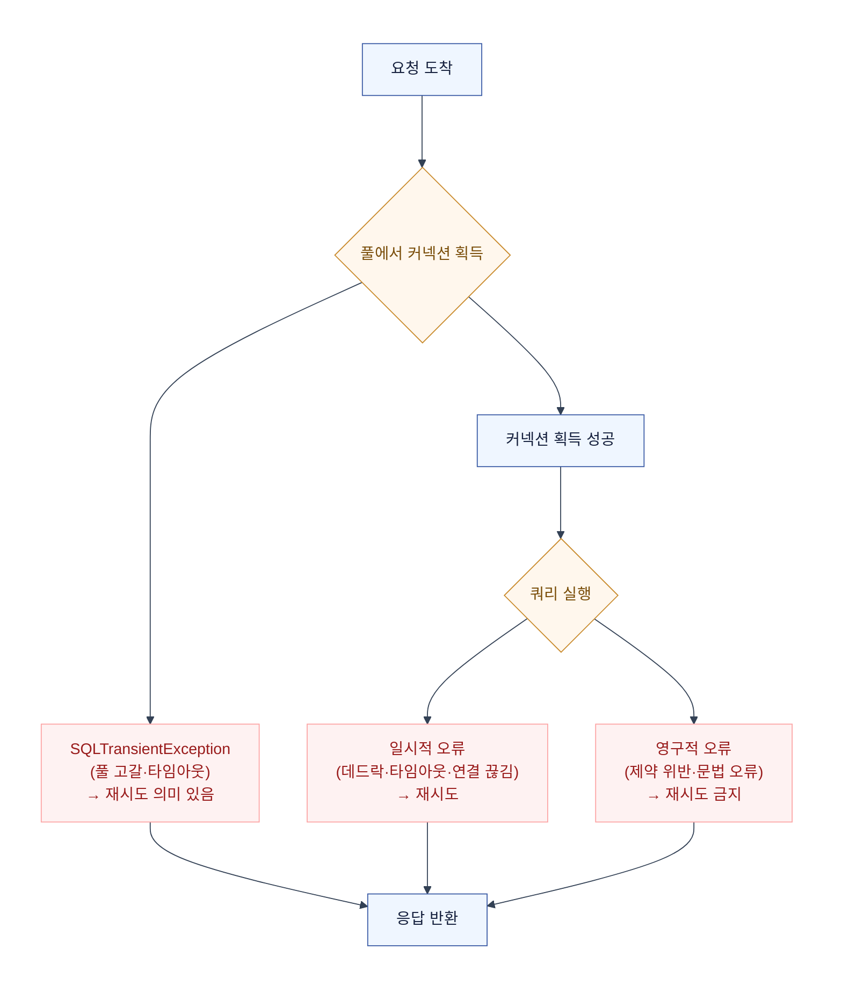

# 커넥션 풀 (Connection Pool)

TCP 연결은 비싸다. 핸드셰이크(3-way) + TLS 핸드셰이크 + 커넥션 생성 비용이 매 요청마다 발생하면 병목이 된다. 커넥션 풀은 미리 만들어둔 연결을 재사용해서 이 비용을 없애는 거다.

## 1. 왜 필요한가

### TCP 연결 비용

```
요청마다 새 연결:
  TCP 핸드셰이크 (RTT 1회) → TLS 핸드셰이크 (RTT 1~2회) → 데이터 전송 → 연결 종료
  = 매 요청마다 2~3 RTT 낭비

풀 사용:
  최초: 연결 생성 (1회)
  이후: 풀에서 빌림 → 재사용 → 반납
  = RTT 낭비 없음
```

| | 매 요청 새 연결 | 커넥션 풀 |
|---|---|---|
| TCP 핸드셰이크 | 매번 | 최초 1회 |
| TLS 핸드셰이크 | 매번 | 최초 1회 |
| 연결 생성 비용 | 매번 | amortized |
| 동시 연결 수 | 요청 수만큼 | 풀 크기만큼 제한 |
| 장애 전파 | 무제한 | 풀 크기로 제한 |

## 2. 세 가지 관점에서의 커넥션 풀

게이트웨이(호출자 ↔ OpenAI 중계)를 만드는 서버 개발자 관점으로 보면, 커넥션 풀이 세 군데서 각각 다르게 동작한다.

### ① 클라이언트 (→게이트웨이)

클라이언트가 게이트웨이에 요청을 보낼 때:

- 클라이언트 측 HTTP 커넥션 풀 (OkHttp, Apache HttpClient 등)
- keep-alive로 연결 재사용
- 클라이언트가 관리하는 풀이므로 게이트웨이 입장에서는 제어 불가

### ② 게이트웨이 서버 (inbound) — Tomcat / Netty

게이트웨이가 클라이언트의 요청을 받을 때. 여기가 핵심이다.

#### Tomcat (Spring MVC 기본)

Tomcat은 **스레드 기반** 모델이다. 요청 1개 = 스레드 1개.

```
클라이언트 요청 → Tomcat Connector → 스레드 풀에서 스레드 할당 → Servlet 처리 → 스레드 반납
```

| Tomcat 설정 | 의미 | 기본값 |
|---|---|---|
| `server.tomcat.threads.max` | 최대 스레드 수 | 200 |
| `server.tomcat.threads.min-spare` | 최소 대기 스레드 | 10 |
| `server.tomcat.max-connections` | 최대 동시 연결 수 | 8192 (NIO) / `maxThreads` (BIO) |
| `server.tomcat.accept-count` | 연결 큐 (풀 가득 찼을 때 대기) | 100 |
| `server.tomcat.keep-alive-timeout` | keep-alive 연결 대기 시간 | connectionTimeout과 동일 |

- **NIO Connector** (기본): 스레드가 블로킹되지 않게 I/O multiplexing을 사용. `maxConnections`(8192)가 `maxThreads`(200)보다 크기 때문에, 200개 스레드로 8192개 연결을 처리할 수 있다. keep-alive 연결이 대기 중일 때 스레드를 잡지 않음.
- **BIO Connector** (레거시): 요청 1개 = 스레드 1개가 연결 종료까지 점유. `maxConnections` = `maxThreads`. Spring Boot 3부터 제거됨.
- **APR/native**: JNI 기반 고성능 커넥터. 잘 안 씀.

```yaml
server:
  tomcat:
    threads:
      max: 200
      min-spare: 10
    max-connections: 8192
    accept-count: 100
    connection-timeout: 5s
    keep-alive-timeout: 75s
```

#### 가상 스레드 (Virtual Thread, Java 21+)

가상 스레드를 켜면 Tomcat이 플랫폼 스레드 대신 가상 스레드를 사용한다.

```yaml
spring:
  threads:
    virtual:
      enabled: true
```

- 스레드 풀 크기 제한(`max: 200`)이 의미가 없어진다 — 요청마다 가상 스레드를 생성하므로 사실상 무제한.
- 블로킹 I/O(HTTP, DB) 대기 중에 캐리어 스레드를 놓아주므로, 적은 플랫폼 스레드로 수만 요청을 처리 가능.
- **커넥션 풀과의 관계**: 스레드는 무제한이지만, **DB 커넥션 풀이나 HTTP 클라이언트 풀은 여전히 제한**된다. 스레드가 많아져도 풀 크기 이상의 동시 처리는 안 됨 → 풀 대기가 발생.

#### Netty (WebFlux / Reactor Netty)

Netty는 **이벤트 루프 기반**이다. 스레드가 요청에 묶이지 않는다.

```
클라이언트 요청 → EventLoop (고정 스레드 수) → Channel → 비동기 처리 → EventLoop로 복귀
```

| Netty / Reactor Netty 설정 | 의미 | 기본값 |
|---|---|---|
| `EventLoopGroup` 스레드 수 | 이벤트 루프 스레드 | CPU 코어 수 × 2 |
| `maxConnections` | 최대 연결 수 | 무제한 (OS 한계) |
| `pendingAcquireTimeout` | 커넥션 풀 대기 타임아웃 | 45s |
| `maxIdleTime` | 유휴 연결 제거 | 45s (Reactor Netty) |
| `responseTimeout` | 응답 타임아웃 | 무제한 |

- Tomcat(NIO)과의 차이: Tomcat은 요청 처리 중 블로킹 시 스레드가 대기하지만, Netty는 블로킹 없이 다른 채널을 처리한다.
- **EventLoop는 스레드 풀이 아니다**: 스레드 수가 고정적이고, 각 EventLoop가 수천 개의 Channel을 담당한다.
- Reactor Netty의 `ConnectionProvider`가 HTTP 클라이언트 커넥션 풀을 관리한다.

```kotlin
// Reactor Netty — 커넥션 풀 설정
val provider = ConnectionProvider.builder("custom")
    .maxConnections(100)
    .pendingAcquireTimeout(Duration.ofSeconds(10))
    .maxIdleTime(Duration.ofSeconds(30))
    .build()

val client = HttpClient.create(provider)
    .responseTimeout(Duration.ofSeconds(30))
```

### ③ SDK (게이트웨이→OpenAI) — 아웃바운드 커넥션 풀

게이트웨이가 OpenAI(또는 다운스트림)를 호출할 때:

| 클라이언트 | 풀 방식 | 주요 설정 |
|---|---|---|
| Apache HttpClient | `PoolingHttpClientConnectionManager` | `maxPerRoute`, `maxTotal` |
| OkHttp | `ConnectionPool` | `maxIdleConnections`, `keepAliveDuration` |
| Reactor Netty | `ConnectionProvider` | `maxConnections`, `pendingAcquireTimeout` |
| Java HttpClient (Java 11+) | 내장 풀 없음 | 매 요청 새 연결 또는 직접 관리 |

```kotlin
// OkHttp — 커넥션 풀 설정
val pool = ConnectionPool(
    maxIdleConnections = 20,
    keepAliveDuration = 5, TimeUnit.MINUTES
)
val client = OkHttpClient.Builder()
    .connectionPool(pool)
    .connectTimeout(3, TimeUnit.SECONDS)
    .readTimeout(30, TimeUnit.SECONDS)
    .build()
```

## 3. HikariCP — DB 커넥션 풀

Spring Boot의 기본 DB 커넥션 풀. 게이트웨이가 DB를 호출할 때 사용.

| 설정 | 의미 | 기본값 |
|---|---|---|
| `maximumPoolSize` | 최대 커넥션 수 | 10 |
| `minimumIdle` | 최소 유휴 커넥션 | maximumPoolSize와 동일 |
| `connectionTimeout` | 풀에서 커넥션 획득 대기 시간 | 30s |
| `idleTimeout` | 유휴 커넥션 제거 | 10min |
| `maxLifetime` | 커넥션 최대 수명 | 30min |
| `leakDetectionThreshold` | 커넥션 누수 감지 | 0 (비활성) |

```yaml
spring:
  datasource:
    hikari:
      maximum-pool-size: 20
      minimum-idle: 10
      connection-timeout: 5000  # 5s — 풀 대기 타임아웃
      idle-timeout: 600000      # 10min
      max-lifetime: 1800000      # 30min
      leak-detection-threshold: 30000  # 30s
```

### HikariCP가 빠른 이유

- **ConcurrentBag**: ConcurrentLinkedQueue 대신 thread-local + hand-off 패턴으로 커넥션을 빌림. 락 경합 최소화.
- **스레드가 커넥션을 직접 고른다**: TLAB(Thread-Local Allocation Buffer)에서 먼저 찾고, 없으면 공유 목록에서 찾는다.
- 풀에서 빌리는 비용이 거의 0에 가깝다.

### 커넥션 풀 크기 공식

HikariCP 공식 권장:

```
poolSize = ((core_count × 2) + effective_spindle_count)
```

- CPU 코어 × 2: I/O 대기 시간을 고려한 여유
- effective_spindle_count: 디스크 수 (SSD는 보통 1로 계산)

예: 4코어 CPU, SSD → `poolSize = (4 × 2) + 1 = 9`

- **풀이 크다고 좋은 게 아니다**: 커넥션이 많으면 DB가 동시에 처리할 쿼리가 많아져서 CPU/메모리 경합이 심해지고, 컨텍스트 스위칭 비용이 증가한다.
- **작게 잡는 게 성능이 더 나을 수 있다**: DB 부하가 줄어들고, 각 쿼리의 응답 시간이 빨라진다.

## 4. 커넥션 풀 고갈 시나리오

가장 흔한 장애 패턴:

```
다운스트림(OpenAI)이 느려짐
 → 아웃바운드 커넥션이 오래 점유됨
 → 풀에 빈 커넥션이 없음
 → 새 요청은 connectionTimeout(30s)까지 대기
 → Tomcat 스레드도 커넥션 대기로 점유됨
 → 스레드 풀도 고갈
 → 새 클라이언트 요청 거부 (503)
```

### 방어 전략

| 전략 | 설명 |
|---|---|
| **타임아웃** | 아웃바운드 read timeout을 짧게 → 커넥션이 빨리 반납됨 |
| **Bulkhead (격벽)** | 다운스트림별로 커넥션 풀 분리 → 한 다운스트림 장애가 전체로 번지지 않음 |
| **Circuit Breaker** | 실패율이 높으면 호출 자체를 차단 → 커넥션 낭비 방지 |
| **풀 크기 제한** | 무한정 키우지 않음 → DB/다운스트림 보호 |
| **Load Shedding** | 풀이 가득 차면 즉시 429/503 → 대기하지 않음 |

```kotlin
// Reactor Netty — 다운스트림별 커넥션 풀 분리 (Bulkhead)
val openAiProvider = ConnectionProvider.builder("openai")
    .maxConnections(50)
    .pendingAcquireTimeout(Duration.ofSeconds(5))
    .build()

val anthropicProvider = ConnectionProvider.builder("anthropic")
    .maxConnections(30)
    .pendingAcquireTimeout(Duration.ofSeconds(5))
    .build()

val openAiClient = HttpClient.create(openAiProvider)
val anthropicClient = HttpClient.create(anthropicProvider)
// OpenAI 장애가 Anthropic 풀로 번지지 않음
```

## 5. Tomcat vs Netty — 커넥션 관점 비교

| | Tomcat (NIO) | Netty (Reactor Netty) |
|---|---|---|
| 모델 | 스레드 풀 + NIO | EventLoop + Channel |
| 요청당 스레드 | 1개 할당 (블로킹 시 대기) | 없음 (EventLoop가 여러 Channel 처리) |
| 스레드 수 | `maxThreads` (기본 200) | CPU 코어 × 2 (고정) |
| 최대 연결 | `maxConnections` (기본 8192) | 무제한 (OS 한계) |
| 블로킹 I/O | 스레드가 대기 | EventLoop가 다른 Channel 처리 |
| 가상 스레드 | 스레드 대기를 저렴하게 | 불필요 (이미 비블로킹) |
| 적합 | 전통적 Spring MVC, 동기 처리 | WebFlux, 비동기 스트리밍, 고동시성 |
| 커넥션 풀 | Tomcat Connector가 관리 | ConnectionProvider가 관리 |

## 6. 커넥션 누수 (Connection Leak)

커넥션을 빌리고 반납하지 않으면 풀이 고갈된다.

### 원인

```kotlin
// 나쁜 예 — 커넥션 반납 안 됨
fun findUser(id: Long): User {
    val conn = dataSource.connection  // 빌림
    val result = conn.prepareStatement("SELECT ...").executeQuery()
    // conn.close() 안 함 → 누수!
    return result
}
```

### 해결

```kotlin
// 좋은 예 — use로 자동 반납
fun findUser(id: Long): User {
    dataSource.connection.use { conn ->  // use = try-finally close
        conn.prepareStatement("SELECT ...").use { stmt ->
            stmt.executeQuery().use { rs ->
                return mapUser(rs)
            }
        }
    }
}
```

- HikariCP `leakDetectionThreshold`를 설정하면, 커넥션이 N초 이상 반납되지 않을 때 로그를 남긴다.
- Spring `@Transactional`은 트랜잭션 종료 시 커넥션을 자동 반납한다.
- **가장 흔한 누수 원인**: `@Transactional` 안에서 외부 API를 호출하면, API 대기 시간만큼 DB 커넥션을 점유 → 풀 고갈. 외부 호출은 트랜잭션 밖으로 빼야 한다.

## 7. JDBC 예외 처리와 재시도

커넥션 풀 관점에서 예외는 **어디서 발생했는가**가 중요하다.  
발생 지점에 따라 재시도가 의미 있는지, 즉시 실패해야 하는지가 달라진다.

### 예외 분류 — 3단계



### 예외 유형별 대응

| 예외 | SQLState / 클래스 | 재시도 | 대응 |
|---|---|---|---|
| 풀 고갈 (timeout) | `SQLTransientException` | O (짧게) | `connectionTimeout` 확인, 풀 크기 점검 |
| 데드락 | MySQL `1213`, PG `40P01` | O | `@Retryable`, 잠금 순서 정렬 |
| 락 타임아웃 | PG `55P03` | O | `lock_timeout` 설정, 재시도 |
| 연결 끊김 | `SQLRecoverableException` | O | 커넥션 무효화, 새 커넥션으로 재시도 |
| 제약 위반 | `SQLIntegrityConstraintViolationException` | X | 데이터 수정, 재시도 무의미 |
| 문법 오류 | `SQLSyntaxErrorException` | X | 쿼리 수정 |
| 데이터 오류 | `SQLDataException` | X | 데이터 수정 |

> 핵심: **일시적(transient) 오류만 재시도**한다.  
> 영구적 오류를 재시도하면 같은 에러가 계속 반복된다.

### Spring의 예외 계층

Spring은 JDBC의 `SQLException`을 `DataAccessException` 계층으로 변환한다.  
`SQLExceptionTranslator`가 SQLState·vendor code를 보고 매핑한다.

```text
DataAccessException (루트)
  ├── NonTransientDataAccessException    → 재시도 금지
  │     ├── DataIntegrityViolationException  (제약 위반)
  │     └── DataAccessException              (문법 오류 등)
  │
  └── TransientDataAccessException       → 재시도 대상
        ├── ConcurrencyFailureException      (데드락)
        ├── PessimisticLockingFailureException (락 획득 실패)
        └── QueryTimeoutException            (쿼리 타임아웃)
```

`SQLException`의 `getNextException()`으로 chained exception을 따라가면,  
실제 원인(SQLState)을 찾을 수 있다.

### 재시도 구현 — `@Retryable`

```kotlin
@Retryable(
    retryFor = [
        ConcurrencyFailureException::class,        // 데드락
        PessimisticLockingFailureException::class,  // 락 타임아웃
        QueryTimeoutException::class,               // 쿼리 타임아웃
        CannotAcquireLockException::class,           // 락 획득 실패
    ],
    backoff = Backoff(delay = 100, multiplier = 2, maxDelay = 1000),
    maxAttempts = 3
)
@Transactional
fun deductStock(id: Long, qty: Long) {
    val stock = stockRepository.findByIdForUpdate(id)
    stock.decrease(qty)
    stockRepository.save(stock)
}
```

| `@Retryable` 설정 | 의미 |
|---|---|
| `retryFor` | 재시도할 예외 클래스 |
| `noRetryFor` | 재시도하지 않을 예외 (영구적 오류) |
| `maxAttempts` | 최대 시도 횟수 (기본 3) |
| `backoff.delay` | 첫 재시도 대기 (ms) |
| `backoff.multiplier` | 지수 백오프 배수 |
| `backoff.maxDelay` | 최대 대기 시간 |
| `recover` | 전부 실패 시 호출할 fallback 메서드 |

> **`@Retryable`이 `@Transactional` 바깥에 와야 한다.**  
> 재시도 = 새 트랜잭션으로 들어가야 하므로,  
> 프록시 순서가 `Retry → Transaction`이어야 한다.  
> 반대면 같은 트랜잭션 안에서 재시도 → 이미 롤백된 상태라 의미 없음.

### 복구 — `@Recover`

```kotlin
@Recover
fun recoverDeductStock(e: ConcurrencyFailureException, id: Long, qty: Long) {
    // 3번 재시도 전부 실패
    log.error("stock deduct failed after retries: id={}", id, e)
    throw IllegalStateException("재고 차감 실패 — 잠시 후 다시 시도해주세요")
}
```

`@Recover` 메서드는 첫 파라미터가 예외, 나머지가 원본 메서드 파라미터와 같아야 한다.  
전부 실패 시 호출되며, 최종 응답을 사용자에게 반환한다.

### 커넥션 풀 단위 예외 처리

| 상황 | 예외 | 대응 |
|---|---|---|
| 풀 고갈 (대기 초과) | `SQLTimeoutException` | 503 Service Unavailable + 알림 |
| 커넥션 검증 실패 | `SQLTransientConnectionException` | HikariCP `connectionTestQuery` / `keepaliveTime` |
| 커넥션 누수 | `PoolInitializationException` | `leakDetectionThreshold` 로그 확인 |
| DB 다운 | `SQLRecoverableException` | Circuit Breaker 차단 → 503 |

### HikariCP 설정으로 예외 줄이기

```yaml
spring:
  datasource:
    hikari:
      # 커넥션 생존 확인 (대여 시 + 주기적)
      connection-test-query: SELECT 1          # 또는 connection-test-query 생략 (JDBC4 isValid)
      keepalive-time: 300000                    # 5분마다 keepalive (HikariCP 4.x+)
      # 커넥션 최대 수명 (DB 방화벽 타임아웃보다 짧게)
      max-lifetime: 1800000                     # 30분
      # 풀 획득 타임아웃 (길면 스레드 고갈)
      connection-timeout: 5000                  # 5초
      # 검증 타임아웃
      validation-timeout: 3000                  # 3초
      # 누수 감지
      leak-detection-threshold: 30000           # 30초
```

| 설정 | 역할 | 장애 예방 |
|---|---|---|
| `connection-test-query` / `isValid` | 대여 전 커넥션이 살아있는지 확인 | 끊긴 커넥션으로 쿼리 → 예외 방지 |
| `keepalive-time` | 유휴 커넥션 주기적 검증 | 방화벽이 끊은 dead 커넥션 제거 |
| `max-lifetime` | 커넥션 주기적 교체 | 오래된 커넥션의 누적 불안정 방지 |
| `connection-timeout` | 풀 대기 최대 시간 | 스레드가 무한 대기하지 않도록 |
| `validation-timeout` | 검증 쿼리 타임아웃 | 검증 자체가 느려지는 것 방지 |
| `leak-detection-threshold` | 대여 후 N초 미반납 시 로그 | 누수 조기 발견 |

> `max-lifetime`은 DB나 방화벽의 idle timeout보다 **짧아야** 한다.  
> AWS RDS의 기본 `wait_timeout`이 8시간이지만,  
> 로드밸런서나 방화벽이 그보다 먼저 끊을 수 있다.  
> 끊긴 커넥션을 풀이 모르고 대여하면 → `SQLRecoverableException`.

## 8. 실무 체크리스트

| 항목 | 권장 |
|---|---|
| DB 풀 크기 | `(CPU 코어 × 2) + 디스크 수` 수준. 크다고 좋은 게 아님 |
| HTTP 클라이언트 풀 | 다운스트림별 분리 (Bulkhead) |
| 풀 획득 타임아웃 | 짧게 (5s 이내). 길면 장애 전파 |
| read timeout | 풀 반납 속도에 직결. 짧게 |
| 누수 감지 | HikariCP `leakDetectionThreshold` 30s 설정 |
| `@Transactional` 안 외부 호출 | 금지. DB 커넥션 점유 |
| 가상 스레드 | 스레드는 무제한이지만 풀은 제한 → 풀 대기 주의 |
| 모니터링 | 풀 사용률, 대기 시간, 활성 커넥션 수 메트릭 수집 |
