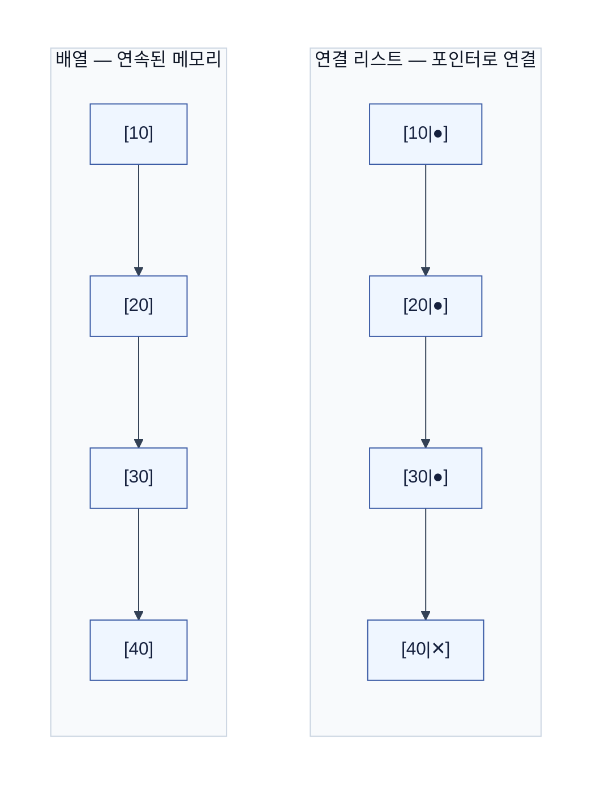
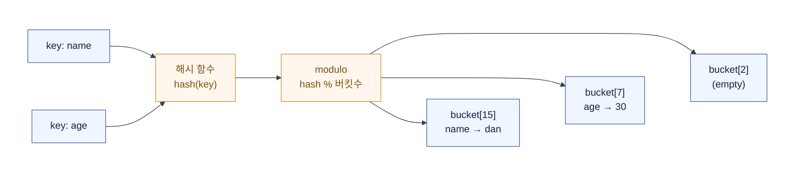
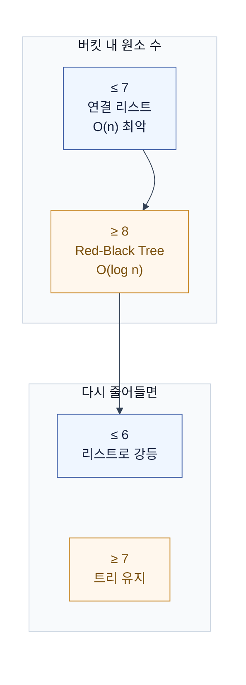

# 자료구조 (Data Structure)

데이터를 어떻게 담을지 결정하는 그릇.  
같은 데이터라도 담는 방식에 따라 찾는 속도가 100배 차이 난다.  
그래서 "어떤 자료구조를 쓰느냐"가 곧 성능이 된다.

## 왜 자료구조를 알아야 하는가

직접 Red-Black Tree를 구현할 일은 없다.  
하지만 **선택**은 매일 한다.

- `HashMap` vs `List` — 조회가 O(1)인지 O(n)인지
- `ArrayList` vs `LinkedList` — 중간 삽입이 많은지
- `PriorityQueue` vs `ArrayDeque` — 우선순위가 필요한지

선택을 잘하려면, 각 구조가 **무엇을 빠르게 하고 무엇을 느리게 하는지** 알아야 한다.

## 1. 배열 (Array) vs 연결 리스트 (Linked List)

가장 근본적인 둘.  
메모리에 데이터를 **연속으로** 놓느냐, **흩어놓고 연결**하느냐의 차이다.

### 배열 — 연속된 메모리

인덱스만 알면 `주소 = 시작주소 + 인덱스 × 크기`로 즉시 접근한다.  
이것이 **O(1) 임의 접근**이다.

```text
메모리:  [10][20][30][40][50]
인덱스:    0   1   2   3   4
           ↑
인덱스 2 접근 → 시작주소 + 2 × 4byte = 즉시 도달
```

**장점**: 임의 접근 O(1). CPU 캐시 지역성이 좋다 (연속된 메모리를 한 번에 읽으므로).  
**단점**: 중간 삽입·삭제 시 뒤의 원소를 전부 밀어야 한다 → O(n).  
크기를 미리 정해야 한다 (동적 배열은 resize 시 O(n) 복사 발생, but amortized O(1)).

### 연결 리스트 — 포인터로 연결

각 노드가 **데이터 + 다음 노드의 주소**를 가진다.  
메모리는 흩어져 있어도 포인터로 연결한다.

```text
[10|●] → [20|●] → [30|●] → [40|✕]
 데이터  next    데이터  next
```

**장점**: 삽입·삭제가 O(1) (포인터만 바꾸면 됨, 단 위치를 이미 알고 있을 때).  
**단점**: 임의 접근이 안 된다. 처음부터 따라가야 한다 → O(n).  
포인터 저장에 메모리가 추가로 든다. 캐시 지역성이 나쁘다.

### 비교



| | 배열 | 연결 리스트 |
|---|---|---|
| 임의 접근 | **O(1)** | O(n) |
| 끝 삽입 | O(1) amortized | O(1) |
| 중간 삽입·삭제 | O(n) | **O(1)** (위치를 안다면) |
| 메모리 | 데이터만 | 데이터 + 포인터 |
| 캐시 지역성 | 좋음 | 나쁨 |

> 실무에서는 **배열을 기본으로 쓴다**.  
> Java `ArrayList`, Kotlin `listOf` / `mutableListOf`(기본 ArrayList)가 전부 배열 기반이다.  
> 연결 리스트는 캐시 미스 비용이 커서, 일반적인 웹 서비스에서는 거의 쓰지 않는다.

## 2. 스택 (Stack)과 큐 (Queue)

배열이나 연결 리스트 위에 **접근 규칙**을 얹은 구조.  
"어떻게 넣고 빼는가"만 다를 뿐, 내부 저장은 배열이나 리스트로 한다.

### 스택 — LIFO (Last In First Out)

마지막에 넣은 것이 먼저 나온다.  
책을 위로 쌓고, 꺼낼 때도 맨 위부터.

```text
push 1 → [1]
push 2 → [1, 2]
push 3 → [1, 2, 3]
pop   → 3 나옴 → [1, 2]
```

- **시간복잡도**: push / pop / peek 전부 O(1)
- **언제**: 함수 호출 스택, undo, 괄호 짝맞추기, DFS(깊이 우선 탐색)

### 큐 — FIFO (First In First Out)

먼저 넣은 것이 먼저 나온다.  
줄을 서는 것과 같다.

```text
offer 1 → [1]
offer 2 → [1, 2]
offer 3 → [1, 2, 3]
poll   → 1 나옴 → [2, 3]
```

- **시간복잡도**: offer / poll / peek 전부 O(1)
- **언제**: 작업 대기열, BFS(너비 우선 탐색), 메시지 큐, 이벤트 루프

### 실무에서 만나는 곳

- **JVM call stack**: 메서드 호출 시 스택 프레임 push, 반환 시 pop
- **BlockingQueue**: 스레드 풀의 작업 대기열 (Tomcat `accept-count` 큐)
- **ArrayDeque**: Stack 대신 이걸 쓰라 (Java `Stack`은 동기화 오버헤드 + 상속 설계 문제)

## 3. 해시 테이블 (Hash Table)

**가장 많이 쓰이는 자료구조**.  
`HashMap`, `ConcurrentHashMap`, Redis의 기반이 전부 이것이다.

핵심 아이디어는 단 하나다.  
**키를 배열의 인덱스로 바꿔서, 배열처럼 O(1)에 접근한다.**

### 해시가 되는 원리 — 3단계

```text
① 해시 함수: 키 → 정수
    "name" → hash("name") → 0x7A3F → 30207

② modulo: 정수 → 버킷 인덱스
    30207 % 16 (버킷 수) → 15

③ 저장: bucket[15] = ("name", "dan")
```

배열은 인덱스를 알면 `O(1)`에 접근한다.  
해시 테이블은 **키 → 인덱스 변환**을 해서,  
배열의 O(1) 장점을 키 기반 조회로 가져온다.



### 해시 함수의 조건

같은 키는 항상 같은 인덱스가 나와야 한다.  
다른 키는 될 수 있으면 다른 인덱스가 나와야 한다.  
이것이 잘 안 되면 충돌이 빵빵 터진다.

| 조건 | 의미 | 위반 시 |
|---|---|---|
| 결정적 | 같은 키 → 항상 같은 해시값 | 조회 자체가 안 됨 |
| 균일 분포 | 키들이 버킷에 골고루 퍼짐 | 한 버킷에 몰리면 O(n) |
| 빠른 계산 | 해시 자체가 O(1)이어야 함 | 해시가 느리면 O(1) 의미 없음 |

Java의 `String.hashCode()`는 Horner's method로 O(n)에 계산한다.  
문자열이 길면 해시 계산 자체가 비용이 된다.

### 충돌 (Collision) — 불가피한 현실

버킷이 16개인데 키가 100개면,  
비둘기집 원리로 **충돌은 무조건** 일어난다.

```text
hash("name") % 16 = 7
hash("eman") % 16 = 7  ← 충돌!

둘 다 bucket[7]로 가야 한다
```

해결 방식은 크게 두 가지다.

#### Chaining (체이닝) — 같은 버킷을 리스트로 연결

```text
bucket[7]: (name, dan) → (eman, foo) → (user, bar)
bucket[8]: (age, 30)
bucket[9]: (empty)
```

충돌이 나면 그 버킷에 연결 리스트로 매단다.  
조회 시 리스트를 순회해야 하므로,  
버킷당 원소가 k개면 **O(k)**가 된다.

#### Open Addressing (개방 주소법) — 빈 버킷을 찾아감

```text
bucket[7]: (name, dan)  ← 이미 차 있음
            ↓ 다음 빈칸 탐색 (Linear Probing)
bucket[8]: (eman, foo)  ← 여기에 저장
bucket[9]: (age, 30)
```

충돌이 나면 다음 빈 버킷을 찾아간다.  
캐시 지역성이 좋지만,  
버킷이 꽉 차면 성능이 급락한다.

#### 비교

| | Chaining | Open Addressing |
|---|---|---|
| 충돌 처리 | 리스트로 연결 | 빈 칸 탐색 |
| 공간 | 포인터 추가 비용 | 버킷만큼만 |
| 캐시 | 나쁨 (흩어진 리스트) | 좋음 (연속 메모리) |
| 꽉 찰 때 | 리스트 길어짐 → O(n) | 탐색 실패 → 급락 |
| 삭제 | 리스트에서 제거만 | 삭제 자리 표시 필요 (tombstone) |
| 채택 | **Java HashMap** | Python dict, Go map |

### Load Factor — 언제 늘릴까

버킷이 꽉 차가면 충돌이 늘고 성능이 떨어진다.  
그래서 **얼마나 찼는지**를 지켜본다.

```text
load factor = 원소 수 / 버킷 수
```

임계값을 넘으면 버킷 배열을 2배로 늘리고 전체를 다시 해싱한다.  
이것을 **resize** 또는 **rehash**라고 한다.

| 구현 | 기본 버킷 수 | resize 임계 | resize 비용 |
|---|---|---|---|
| Java `HashMap` | 16 | load factor 0.75 | O(n) — 전체 재해싱 |
| Python `dict` | 8 | 사용률 2/3 | O(n) |
| Go `map` | 1 | load factor 6.5 | O(n), 점진적 |

> resize는 O(n)이지만 자주 일어나지 않으므로  
> **amortized O(1)**로 동작한다.  
> `ArrayList`의 resize와 같은 원리다.

### Java HashMap 내부 구조

Java `HashMap`은 Chaining을 쓰되,  
버킷당 원소가 많아지면 리스트를 **트리로 승격**시킨다.



| 임계값 | 의미 |
|---|---|
| 버킷당 원소 ≥ **8** | 리스트 → Red-Black Tree로 전환 |
| 버킷당 원소 ≤ **6** | 트리 → 리스트로 강등 (7은 중간 지대) |
| 버킷 수 × load factor(0.75) | 배열 resize (2배 확장) |

> 왜 8인가?  
> 8개 이하면 리스트가 더 가볍다.  
> 8을 넘으면 트리의 O(log n)가 리스트의 O(n)보다 유리해진다.  
> 6과 8 사이에 **히스테리시스**(왕복 지연)를 둬서,  
> 경계에서 리스트↔트리가 빈번히 전환되는 것을 막는다.

### 해시 테이블의 함정 — 최악의 경우

해시 함수가 나쁘면 모든 키가 같은 버킷으로 몰린다.  
그러면 해시 테이블이 연결 리스트처럼 동작해서 **O(n)**이 된다.

```text
최악: 모든 키가 bucket[0]으로 몰림
bucket[0]: (a) → (b) → (c) → (d) → (e) → ... → (z)
bucket[1]: (empty)
...
조회: 처음부터 끝까지 순회 → O(n)
```

Java 8 이전에는 이것이 **DoS 공격 벡터**였다.  
공격자가 같은 해시값을 가지는 키를 수천 개 보내면,  
서버의 `HashMap`이 O(n)으로 퇴화해서 CPU가 고갈됐다.  
Java 8의 트리 전환이 이것을 O(log n)으로 완화했다.

### 실무

| 구현 | 특징 | 쓰임 |
|---|---|---|
| `HashMap` | 동기화 안 됨 | 단일 스레드 기본 |
| `LinkedHashMap` | 삽입 순서 유지 | 순서 보존 캐시 |
| `ConcurrentHashMap` | 버킷 단위 lock | 동시성 환경 |
| **Redis** | 전체가 해시 테이블 기반 | in-memory 저장소 |
| DB **hash index** | 등치(`=`)만 가능 | 범위 검색 안 됨 → B-tree가 표준 |

> DB 인덱스는 해시가 아닌 **B-tree**를 쓴다.  
> 해시는 등치(`=`) 검색은 O(1)이지만,  
> 범위(`>`, `<`, `BETWEEN`) 검색이 안 된다.  
> 자세한 것은 [인덱스 문서](./2606-index.md)에서 B-tree를 함께 볼 것.

## 4. 트리 (Tree)

계층 구조를 표현하는 자료구조.  
폴더 구조, 조직도, DOM 트리, JSON 중첩 객체가 전부 트리다.

```text
        root
       /    \
     A       B
    / \     / \
   C   D   E   F
```

### 이진 탐색 트리 (BST, Binary Search Tree)

이진 트리(자식 최대 2개) 중에서,  
**왼쪽 자식 < 부모 < 오른쪽 자식**을 만족하는 것.

```text
       5
      / \
     3   8
    / \   \
   1   4   9
```

정렬된 상태를 유지해서 탐색이 빠르다.  
평균 O(log n), but 한쪽으로 치우치면 연결 리스트처럼 → 최악 O(n).

**균형 잡기**: AVL 트리, Red-Black Tree → 치우치지 않게 자동 회전.  
최악도 O(log n)을 보장한다.

### 실무

- **B-tree**: DB 인덱스의 기반. 이진이 아닌 다진 트리(m-way). 디스크 I/O에 최적화
- **Red-Black Tree**: Java `TreeMap`, `HashMap` 버킷 내 트리 전환
- **Trie**: 자동완성, 접두사 검색 (각 노드가 문자 1개)

## 5. 힙 (Heap)

**우선순위 큐(Priority Queue)**를 구현하는 자료구조.  
완전 이진 트리이되, 부모가 자식보다 항상 크거나(최대 힙) 작다(최소 힙).

```text
최소 힙 — 부모가 항상 자식보다 작음

       1
      / \
     3   2
    / \
   7   4
```

- **루트 조회(최솟값/최댓값)**: O(1)
- **삽입·삭제**: O(log n) — 끝에 넣고 부모와 비교하며 위로/아래로 조정
- 배열로 구현: 부모 = `i/2`, 왼쪽 자식 = `2i`, 오른쪽 자식 = `2i+1`

### 실무

- **PriorityQueue**: 작업 스케줄링 (우선순위 높은 것부터 처리)
- **Top-K 문제**: N개 중 상위 K개만 뽑기 — 힙 크기 K로 유지 → O(N log K)
- **다익스트라**: 최단 경로 탐색에서 다음 방문 노드를 고를 때

## 6. 그래프 (Graph)

트리의 상위 개념.  
노드(정점, vertex)와 간선(edge)으로 이루어지며, **사이클이 허용**된다.

```text
A --- B
|     |
C --- D
```

| 표현 방식 | 구조 | 공간 | 특징 |
|---|---|---|---|
| **인접 행렬** | 2차원 배열 | O(V²) | 조회 O(1). 간선이 적으면 낭비 |
| **인접 리스트** | 각 노드마다 리스트 | O(V+E) | 공간 효율. 조회 O(degree) |

### 탐색

| | BFS (너비 우선) | DFS (깊이 우선) |
|---|---|---|
| 자료구조 | 큐 | 스택 (또는 재귀) |
| 탐색 순서 | 가까운 것부터 | 끝까지 가고 돌아옴 |
| 최단 경로 | 가중치 없으면 가능 | 보장 안 됨 |

### 실무

그래프를 **직접 구현**할 일은 드물다.  
하지만 **개념**은 설계 곳곳에 등장한다.

- 애그리거트 간 참조 관계 → 방향 그래프
- Gradle 모듈 의존성 → DAG(Directed Acyclic Graph)
- Spring Bean 의존성 주입 → 순환 참조 감지에 DFS 사용

## 7. 시간복잡도 요약

| 자료구조 | 접근 | 탐색 | 삽입 | 삭제 |
|---|---|---|---|---|
| 배열 | **O(1)** | O(n) | O(n) | O(n) |
| 연결 리스트 | O(n) | O(n) | **O(1)** ※ | **O(1)** ※ |
| 스택 (top) | **O(1)** | O(n) | **O(1)** | **O(1)** |
| 큐 (front) | **O(1)** | O(n) | **O(1)** | **O(1)** |
| 해시 테이블 | — | **O(1)** avg | **O(1)** avg | **O(1)** avg |
| BST (균형) | O(log n) | O(log n) | O(log n) | O(log n) |
| 힙 (root) | **O(1)** | O(n) | O(log n) | O(log n) |

> ※ 위치를 이미 알고 있을 때.  
> 탐색 후 삽입·삭제라면 탐색 비용 O(n)이 추가된다.

## 마무리 — 백엔드 개발자와 자료구조

자료구조는 "구현"보다 **"선택"**의 문제다.  
무엇을 쓸지 아는 것이, 어떻게 만들지 아는 것보다 중요하다.

- `HashMap`의 버킷이 트리로 전환되는 것을 알면 → 동시성 설계가 보인다
- DB 인덱스가 **B-tree**라는 것을 알면 → 인덱스 설계가 보인다
- `BlockingQueue`가 **FIFO**라는 것을 알면 → 스레드 풀 동작이 보인다
- Redis가 **해시 테이블 기반**이라는 것을 알면 → 메모리 설계가 보인다

자료구조를 알면,  
코드 한 줄의 의미가 달라 보이기 시작한다.
