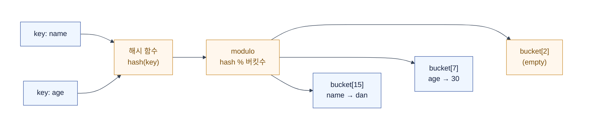

# 자료구조 (Data Structure)

| 자료구조 | 조회 | 삽입 | 삭제 | 적합한 용례 |
|---|---|---|---|---|
| 배열 (Array) | O(1) (index) | O(n) (중간) | O(n) | 인덱스 접근, 순차 탐색, 캐시 친화적 |
| 연결리스트 (LinkedList) | O(n) | O(1) (양끝) | O(1) (양끝) | 중간 삽입/삭제 빈번, 크기 예측 불가 |
| 스택 (Stack) | O(n) | O(1) | O(1) | 함수 콜 스택, 실행 취소, 괄호 짝 검사 |
| 큐 (Queue) | O(n) | O(1) | O(1) | 작업 대기열, BFS, 이벤트 버퍼 |
| 해시테이블 (HashMap) | O(1) | O(1) | O(1) | 키-값 조회, 캐시, 중복 제거, 집합 연산 |
| 트리 (BST) | O(log n) | O(log n) | O(log n) | 정렬된 데이터, 범위 검색, 자동 정렬 |
| 힙 (Heap) | O(1) (peek) | O(log n) | O(log n) | 우선순위 큐, Top-K, 스케줄링 |
| 그래프 (Graph) | O(V+E) | O(1) | O(1) | 관계 표현, 최단 경로, SNS 친구 추천 |
| 셋 (Set) | O(1) | O(1) | O(1) | 중복 제거, 집합 연산 (교집합·합집합·차집합) |

> 위 복잡도는 평균(average) 기준이다. 해시 충돌, 트리 불균형 등 최악의 경우는 다를 수 있다.

## 1. 배열 (Array)

메모리에 데이터를 **연속으로** 놓는 구조.  
인덱스만 알면 `주소 = 시작주소 + 인덱스 × 크기`로 즉시 접근한다 — **O(1) 임의 접근**.

```text
메모리:  [10][20][30][40][50]
인덱스:    0   1   2   3   4
           ↑
인덱스 2 접근 → 시작주소 + 2 × 4byte = 즉시 도달
```

- **장점**: 임의 접근 O(1). CPU 캐시 지역성이 좋다 (연속된 메모리를 한 번에 읽으므로)
- **단점**: 중간 삽입·삭제 시 뒤의 원소를 전부 밀어야 한다 → O(n)

동적 배열은 크기가 부족하면 더 큰 배열을 만들어 복사한다.  
이때 **O(n)** 비용이 발생하지만 자주 일어나지 않으므로 **amortized O(1)**로 동작한다.

## 2. 연결 리스트 (Linked List)

각 노드가 **데이터 + 다음 노드의 주소**를 가진다.  
메모리는 흩어져 있어도 포인터로 연결한다.

```text
[10|●] → [20|●] → [30|●] → [40|✕]
 데이터  next    데이터  next
```

- **장점**: 삽입·삭제가 O(1) (포인터만 바꾸면 됨, 단 위치를 이미 알고 있을 때)
- **단점**: 임의 접근이 안 된다. 처음부터 따라가야 한다 → O(n)  
  포인터 저장에 메모리가 추가로 든다. 캐시 지역성이 나쁘다.

## 3. 스택 (Stack)

LIFO (Last In First Out) — 마지막에 넣은 것이 먼저 나온다.

```text
push 1 → [1]
push 2 → [1, 2]
push 3 → [1, 2, 3]
pop   → 3 나옴 → [1, 2]
```

- **시간복잡도**: push / pop / peek 전부 O(1)
- **용례**: 함수 호출 스택, 실행 취소(undo), 괄호 짝 검사, DFS

## 4. 큐 (Queue)

FIFO (First In First Out) — 먼저 넣은 것이 먼저 나온다.

```text
offer 1 → [1]
offer 2 → [1, 2]
offer 3 → [1, 2, 3]
poll   → 1 나옴 → [2, 3]
```

- **시간복잡도**: offer / poll / peek 전부 O(1)
- **용례**: 작업 대기열, BFS, 메시지 큐, 이벤트 루프

## 5. 해시 테이블 (Hash Table)

키를 배열의 인덱스로 바꿔서, 배열처럼 O(1)에 접근하는 구조.

### 해시가 되는 원리 — 3단계

```text
① 해시 함수: 키 → 정수
    "name" → hash("name") → 0x7A3F → 30207

② modulo: 정수 → 버킷 인덱스
    30207 % 16 (버킷 수) → 15

③ 저장: bucket[15] = ("name", "dan")
```



### 해시 충돌 (Collision)

버킷이 16개인데 키가 100개면, 비둘기집 원리로 **충돌은 무조건** 일어난다.

```text
hash("name") % 16 = 7
hash("eman") % 16 = 7  ← 충돌!

둘 다 bucket[7]로 가야 한다
```

#### Chaining (체이닝) — 같은 버킷을 리스트로 연결

```text
bucket[7]: (name, dan) → (eman, foo) → (user, bar)
bucket[8]: (age, 30)
bucket[9]: (empty)
```

충돌이 나면 그 버킷에 연결 리스트로 매단다.  
버킷당 원소가 k개면 조회는 **O(k)**.

#### Open Addressing (개방 주소법) — 빈 버킷을 찾아감

```text
bucket[7]: (name, dan)  ← 이미 차 있음
            ↓ 다음 빈칸 탐색 (Linear Probing)
bucket[8]: (eman, foo)  ← 여기에 저장
bucket[9]: (age, 30)
```

| | Chaining | Open Addressing |
|---|---|---|
| 충돌 처리 | 리스트로 연결 | 빈 칸 탐색 |
| 공간 | 포인터 추가 비용 | 버킷만큼만 |
| 캐시 | 나쁨 (흩어진 리스트) | 좋음 (연속 메모리) |
| 꽉 찰 때 | 리스트 길어짐 → O(n) | 탐색 실패 → 급락 |
| 삭제 | 리스트에서 제거만 | 삭제 자리 표시 필요 (tombstone) |

### Load Factor — 언제 늘릴까

```text
load factor = 원소 수 / 버킷 수
```

버킷이 꽉 차가면 충돌이 늘고 성능이 떨어진다.  
임계값을 넘으면 버킷 배열을 2배로 늘리고 전체를 다시 해싱한다 — **resize** 또는 **rehash**.

> resize는 O(n)이지만 자주 일어나지 않으므로 **amortized O(1)**로 동작한다.

### 해시 충돌 최악의 경우

해시 함수가 나쁘면 모든 키가 같은 버킷으로 몰린다.  
해시 테이블이 연결 리스트처럼 동작해서 **O(n)**이 된다.

```text
최악: 모든 키가 bucket[0]으로 몰림
bucket[0]: (a) → (b) → (c) → (d) → ... → (z)
bucket[1]: (empty)
조회: 처음부터 끝까지 순회 → O(n)
```

이것이 **DoS 공격 벡터**가 되기도 한다.  
공격자가 같은 해시값을 가지는 키를 수천 개 보내면,  
해시 테이블이 O(n)으로 퇴화해서 CPU가 고갈된다.

> DB 인덱스는 해시가 아닌 **B-tree**를 쓴다.  
> 해시는 등치(`=`) 검색은 O(1)이지만, 범위(`>`, `<`, `BETWEEN`) 검색이 안 된다.

### 셋 (Set)

셋은 **값이 없는 해시 테이블**이다.  
키만 존재하고, "이 원소가 있는가?"를 O(1)에 판별한다.

```text
Set: {"apple", "banana", "cherry"}

contains("banana")  → true  (hash("banana") → bucket 찾기 → equals 비교)
contains("grape")   → false
add("grape")        → {"apple", "banana", "cherry", "grape"}
add("apple")         → 무시 (이미 있음)
```

- **조회·삽입·삭제**: O(1) (해시 테이블과 동일)
- **용례**: 중복 제거, 집합 연산 (교집합·합집합·차집합), 화이트리스트/블랙리스트

> 셋은 "키만 있는 HashMap"이다.  
> `HashSet`의 내부는 `HashMap<E, Object>` — 값 자리에 더미 객체를 넣는다.

## 6. 트리 (Tree)

계층 구조를 표현하는 자료구조.  
폴더 구조, 조직도, DOM 트리, JSON 중첩 객체가 전부 트리다.

### 이진 탐색 트리 (BST)

이진 트리(자식 최대 2개) 중에서,  
**왼쪽 자식 < 부모 < 오른쪽 자식**을 만족하는 것.

```text
       5
      / \
     3   8
    / \   \
   1   4   9
```

정렬된 상태를 유지해서 탐색이 빠르다.  
평균 O(log n), but 한쪽으로 치우치면 연결 리스트처럼 → 최악 O(n).

**균형 잡기**: AVL 트리, Red-Black Tree → 치우치지 않게 자동 회전.  
최악도 O(log n)을 보장한다.

### 실무에서 만나는 트리

- **B-tree**: DB 인덱스의 기반. 이진이 아닌 다진 트리(m-way). 디스크 I/O에 최적화
- **Red-Black Tree**: 균형 이진 탐색 트리. `TreeMap` 등 정렬된 키-값 저장에 사용
- **Trie**: 자동완성, 접두사 검색 (각 노드가 문자 1개)

## 7. 힙 (Heap)

**우선순위 큐(Priority Queue)**를 구현하는 자료구조.  
완전 이진 트리이되, 부모가 자식보다 항상 크거나(최대 힙) 작다(최소 힙).

```text
최소 힙 — 부모가 항상 자식보다 작음

       1
      / \
     3   2
    / \
   7   4
```

- **루트 조회(최솟값/최댓값)**: O(1)
- **삽입·삭제**: O(log n) — 끝에 넣고 부모와 비교하며 위로/아래로 조정
- **배열로 구현**: 부모 = `i/2`, 왼쪽 자식 = `2i`, 오른쪽 자식 = `2i+1`

### 용례

- **작업 스케줄링**: 우선순위 높은 것부터 처리
- **Top-K 문제**: N개 중 상위 K개만 뽑기 — 힙 크기 K로 유지 → O(N log K)
- **다익스트라**: 최단 경로 탐색에서 다음 방문 노드를 고를 때

## 8. 그래프 (Graph)

노드(정점, vertex)와 간선(edge)으로 이루어지며, **사이클이 허용**된다.  
트리의 상위 개념이다.

```text
A --- B
|     |
C --- D
```

| 표현 방식 | 구조 | 공간 | 특징 |
|---|---|---|---|
| **인접 행렬** | 2차원 배열 | O(V²) | 조회 O(1). 간선이 적으면 낭비 |
| **인접 리스트** | 각 노드마다 리스트 | O(V+E) | 공간 효율. 조회 O(degree) |

### 탐색

| | BFS (너비 우선) | DFS (깊이 우선) |
|---|---|---|
| 자료구조 | 큐 | 스택 (또는 재귀) |
| 탐색 순서 | 가까운 것부터 | 끝까지 가고 돌아옴 |
| 최단 경로 | 가중치 없으면 가능 | 보장 안 됨 |

## 시간복잡도 요약

| 자료구조 | 접근 | 탐색 | 삽입 | 삭제 |
|---|---|---|---|---|
| 배열 | **O(1)** | O(n) | O(n) | O(n) |
| 연결 리스트 | O(n) | O(n) | **O(1)** ※ | **O(1)** ※ |
| 스택 (top) | **O(1)** | O(n) | **O(1)** | **O(1)** |
| 큐 (front) | **O(1)** | O(n) | **O(1)** | **O(1)** |
| 해시 테이블 | — | **O(1)** avg | **O(1)** avg | **O(1)** avg |
| BST (균형) | O(log n) | O(log n) | O(log n) | O(log n) |
| 힙 (root) | **O(1)** | O(n) | O(log n) | O(log n) |

> ※ 위치를 이미 알고 있을 때.  
> 탐색 후 삽입·삭제라면 탐색 비용 O(n)이 추가된다.
