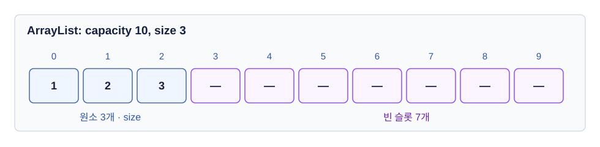
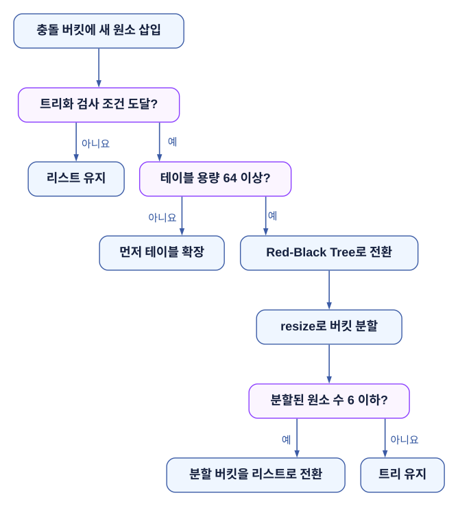

# Java / Kotlin 자료구조 실전

| 자료구조 | 구현체 | 실무 사용 | 비고 |
|---|---|---|---|
| 동적 배열 | `ArrayList` | ✅ 기본 리스트 | `listOf`/`mutableListOf`도 내부적으로 ArrayList |
| 동적 배열 | `CopyOnWriteArrayList` | ⚠️ 읽기 위주 동시성 | 쓰기마다 전체 복사. 읽기 무락 |
| 동적 배열 | `Vector` | ❌ 레거시 | `CopyOnWriteArrayList` 또는 `ConcurrentHashMap`으로 대체 |
| 연결 리스트 | `LinkedList` | ❌ 거의 안 씀 | 캐시 미스 비용이 큼. `ArrayDeque`가 더 빠름 |
| 스택·큐 (Deque) | `ArrayDeque` | ✅ 스택·큐 대용 | `Stack`·`LinkedList` 대신 이걸 써라 |
| 스택 | `Stack` | ❌ 사용 금지 | `synchronized` 오버헤드 + 설계 문제 |
| 큐 | `PriorityQueue` | ⚠️ 우선순위 필요 시만 | 기본 최소 힙, `Comparator`로 변경 |
| 큐 (동기화) | `ArrayBlockingQueue` | ✅ 스레드 풀 작업 대기열 | bounded. Tomcat, ExecutorService |
| 큐 (동기화) | `LinkedBlockingQueue` | ✅ ExecutorService 기본 큐 | unbounded |
| 해시 테이블 | `HashMap` | ✅ 기본 맵 | 버킷당 8개 초과 시 Red-Black Tree 전환 |
| 해시 테이블 | `LinkedHashMap` | ✅ 순서 보존 캐시 | 삽입 순서 또는 접근 순서(LRU) 유지 |
| 해시 테이블 (동기화) | `ConcurrentHashMap` | ✅ 동시성 환경 | 버킷 단위 lock. `synchronizedMap`보다 경합 적음 |
| 해시 테이블 (동기화) | `Hashtable` | ❌ 레거시 | `ConcurrentHashMap`으로 대체 |
| 트리 (Red-Black Tree) | `TreeMap` | ⚠️ 정렬 필요 시만 | `firstKey()`, `subMap()` 등 범위 연산 |

## 배열 기반 리스트

### ArrayList — capacity

```java
List<Integer> list = new ArrayList<>(100);  // capacity = 100, size = 0
```

- **capacity**: 내부 배열의 물리적 크기. 원소가 없어도 메모리를 점유
- **size**: 실제 원소 수

capacity가 꽉 차면 resize 발생 — 새 배열(기존 1.5배)을 만들고 복사.  
이때 **O(n)** 비용이 발생하지만 자주 일어나지 않으므로 **amortized O(1)**.

```java
// 내부 동작 (간략화)
int newCapacity = oldCapacity + (oldCapacity >> 1);  // 1.5배
Object[] newArr = new Object[newCapacity];
System.arraycopy(oldArr, 0, newArr, 0, size);  // O(n) 복사
```

> 대량의 데이터를 넣을 게 확실하면 `new ArrayList<>(expectedSize)`로 미리 잡는 것이 성능에 유리.



> 파란 칸 = 원소(size=3), 회색 칸 = 빈 공간(capacity=10).  
> 7칸이 비어 있어도 메모리는 10칸분을 점유한다.

### 배열 기반 리스트 구현체

| 구현체 | 내부 구조 | 특징 |
|---|---|---|
| `ArrayList` | 동적 배열 | 기본. `add` amortized O(1), 중간 삽입 O(n) |
| `Arrays.asList()` | 고정 배열 | 크기 변경 불가. `add` 호출 시 `UnsupportedOperationException` |
| `Collections.emptyList()` | 싱글톤 | 불변 빈 리스트. 새 객체 생성 없음 |
| `CopyOnWriteArrayList` | 복제 배열 | 쓰기마다 전체 배열 복사. 읽기 무락, 쓰기 느림. 동시성 환경 |

### 연결 리스트 구현체

| 구현체 | 특징 |
|---|---|
| `LinkedList` | 이중 연결 리스트. `List` + `Deque` 구현. 중간 삽입 O(1)이지만 탐색 O(n) |
| `ArrayDeque` | 배열 기반 Deque. `LinkedList`보다 거의 항상 빠름 — 캐시 지역성 |

> 실무에서는 `ArrayList`를 기본으로 쓴다.  
> Kotlin `listOf` / `mutableListOf`도 기본이 `ArrayList`다.  
> 연결 리스트는 캐시 미스 비용이 커서 거의 쓰지 않는다.

## 스택

| 구현체 | 특징 |
|---|---|
| `Stack` | 동기화 오버헤드 + 상속 설계 문제로 **사용 금지** |
| `ArrayDeque` | 배열 기반. `Stack` 대신 이걸 쓰는 것이 권장 |
| `Deque` 인터페이스 | `push()` / `pop()` 제공. `ArrayDeque`로 구현 |

> `Stack`은 `Vector`를 상속해서 모든 메서드가 `synchronized`다.  
> 단일 스레드에서도 락 비용이 발생하므로, `ArrayDeque`를 쓰는 것이 정석이다.

## 큐

| 구현체 | 특징 | 용례 |
|---|---|---|
| `ArrayDeque` | 배열 기반. 가벼움 | 일반적인 큐 |
| `LinkedList` | 연결 리스트 기반. `ArrayDeque`보다 느림 | 거의 안 씀 |
| `PriorityQueue` | 힙 기반. 우선순위 순으로 poll | 작업 스케줄링 |
| `ArrayBlockingQueue` | 배열 기반. 스레드 안전. bounded | 스레드 풀 작업 대기열 (Tomcat) |
| `LinkedBlockingQueue` | 연결 리스트 기반. 스레드 안전. capacity 지정 가능 | `newFixedThreadPool`은 사실상 무한 용량으로 사용 |

> `BlockingQueue`는 큐 + 동기화.  
> 큐가 비어 있으면 `take()`가 대기하고, 꽉 차면 `put()`이 대기한다.  
> 스레드 풀의 작업 대기열이 이것이다.

## 해시 테이블

### Java HashMap 내부 구조

Java `HashMap`은 Chaining을 쓰되,  
버킷당 원소가 많아지면 리스트를 **트리로 승격**시킨다.



| OpenJDK 21 구현 조건 | 의미 |
|---|---|
| `TREEIFY_THRESHOLD = 8` | 충돌 리스트가 길어지면 트리화 검사. 일반 `putVal` 경로에서는 기존 8개에 새 노드를 붙일 때 호출 |
| `MIN_TREEIFY_CAPACITY = 64` | 테이블 용량이 64 미만이면 트리화 대신 먼저 resize |
| `UNTREEIFY_THRESHOLD = 6` | resize로 트리를 분할할 때, 분할된 쪽의 원소가 6개 이하면 리스트로 전환 |
| 원소 삭제 | 트리 모양과 내부 조건에 따라 리스트로 돌아갈 수 있음. 항상 6개라는 규칙은 아님 |
| `size > capacity × loadFactor` | 일반적인 전체 테이블 resize 조건. 기본 load factor는 0.75 |

이 값은 Java API의 영구 계약이 아니라 특정 OpenJDK 구현의 선택이다.  
트리화는 충돌 비용을 줄이지만, 올바른 `hashCode()`와 키 설계를 대신하지 않는다.

### 해시 충돌 DoS 공격

Java 8 이전에는 해시 충돌이 **DoS 공격 벡터**였다.  
공격자가 같은 해시값을 가지는 키를 수천 개 보내면,  
서버의 `HashMap`이 O(n)으로 퇴화해서 CPU가 고갈됐다.  
Java 8의 트리 전환이 이것을 O(log n)으로 완화했다.

### 해시 테이블 구현체

| 구현체 | 특징 | 쓰임 |
|---|---|---|
| `HashMap` | 동기화 안 됨 | 단일 스레드 기본 |
| `LinkedHashMap` | 삽입 순서 유지 | 순서 보존 캐시 |
| `ConcurrentHashMap` | 버킷 단위 lock | 동시성 환경 |
| `TreeMap` | Red-Black Tree. 키 정렬 | 범위 검색, 정렬된 순회 |

> `ConcurrentHashMap`은 버킷 단위로 lock을 잡는다.  
> `HashMap`이 전체에 lock을 걸면(`Collections.synchronizedMap`) 경합이 심하지만,  
> `ConcurrentHashMap`은 버킷별 lock이므로 다른 버킷은 동시에 접근 가능하다.

## 트리

| 구현체 | 트리 종류 | 특징 |
|---|---|---|
| `TreeMap` | Red-Black Tree | 키 정렬 유지. `firstKey()`, `lastKey()`, `subMap()` 등 범위 연산 |
| `HashMap` 버킷 | Red-Black Tree | 버킷당 원소 ≥ 8일 때 리스트에서 트리로 승격 |
| `TreeSet` | Red-Black Tree | `TreeMap`의 key-only 버전 |

## 힙

| 구현체 | 특징 |
|---|---|
| `PriorityQueue` | 최소 힙 기본. `Comparator`로 우선순위 변경 |
| `PriorityBlockingQueue` | 스레드 안전 버전 |

## 참고

- [OpenJDK 21 — HashMap](https://github.com/openjdk/jdk21u/blob/master/src/java.base/share/classes/java/util/HashMap.java) — 트리화·resize·리스트 복귀 조건의 구분을 반영했다.
