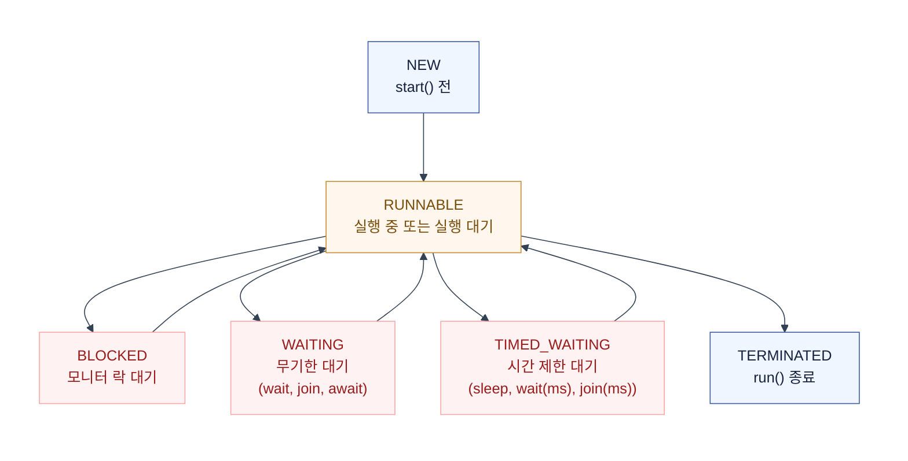

# Java 동시성 기초 — JMM, volatile, Iterator, 스레드 덤프

`ConcurrentHashMap`이 왜 thread-safe인지, `HashMap`을 동시에 수정하면 왜 깨지는지.  
이 질문에 답하려면 **Java Memory Model(JMM)**부터 시작해야 한다.

이 문서는 메모리 가시성 → 동시성 컬렉션 → 스레드 덤프 분석까지 한 흐름으로 정리한다.

## 1. Java Memory Model (JMM)

JMM은 **스레드가 언제 다른 스레드의 변경을 "보는가"**를 정의한다.  
"보지 못하면" — 스레드 A가 쓴 값을 스레드 B가 못 읽는다. 이것이 동시성 버그의 근원이다.

### 가시성 문제 — 왜 안 보이는가

CPU는 메인 메모리(RAM)에서 직접 읽지 않는다.  
빠르기 위해 **CPU 캐시**에 복사해두고 거기서 읽고 쓴다.

```text
스레드 A          스레드 B
  │                 │
  ▼                 ▼
CPU 캐시 A       CPU 캐시 B
  │                 │
  └──── 메인 메모리 ────┘
        (shared)
```

- 스레드 A가 캐시 A에 `flag = true`를 쓴다.  
- 스레드 B는 캐시 B를 보는데, 아직 `false`다.  
- 언제 메인 메모리로 flush 되고, 언제 B의 캐시가 invalidate 되는가?

**JMM 없이는 "언제"를 보장할 수 없다.** 영원히 안 보일 수도 있다.  
JMM은 이것을 **happens-before** 규칙으로 정의한다.

### happens-before — "A가 B보다 먼저 일어났음을 보장"

한 액션이 다른 액션보다 **반드시 먼저 보이도록** 강제하는 규칙.  
happens-before가 성립하면, 앞 쪽의 쓰기가 뒤 쪽의 읽기에 보인다.

| 규칙 | 의미 |
|---|---|
| 프로그램 순서 | 같은 스레드 안에서 코드 순서대로 |
| 모니터 락 | `synchronized` 블록 해제 → 같은 락 획득 |
| `volatile` 쓰기 → 읽기 | volatile 필드 쓰기 → 같은 필드 읽기 |
| 스레드 시작 | `Thread.start()` → run() 첫 액션 |
| 스레드 종료 | 스레드의 모든 액션 → `join()` 반환 |
| `transitive` | A happens-before B, B happens-before C → A happens-before C |

> 핵심: **`synchronized`와 `volatile`은 happens-before를 만든다.**  
> 그래서 이 둘을 쓰면 "안 보이는" 문제가 사라진다.

### 재배치 (Reordering) — 컴파일러·CPU가 순서를 바꾼다

JMM이 없으면, 컴파일러와 CPU가 성능을 위해 **명령어 순서를 바꿀 수 있다.**

```text
// 스레드 A가 작성한 코드
data = 42;        // ①
flag = true;      // ②

// CPU가 재배치 후 (데이터 의존성이 없으니 바꿀 수 있음)
flag = true;      // ② 먼저
data = 42;        // ① 나중에
```

스레드 B가 `flag == true`를 보고 `data`를 읽으면,  
`data`가 아직 42가 아닐 수 있다.  
**단일 스레드에서는 결과가 같으므로 문제 없다.  
하지만 다중 스레드에서는 치명적이다.**

`volatile`은 이 재배치를 막아준다.  
`volatile` 쓰기 앞의 모든 쓰기는, `volatile` 쓰기 전에 완료된다.

## 2. volatile — 가시성 보장

`volatile`은 **두 가지**를 보장한다:

| 보장 | 내용 |
|---|---|
| 가시성 | volatile 쓰기 → 즉시 메인 메모리 flush. 읽기 → 캐시 안 보고 메인에서 읽음 |
| 재배치 금지 | volatile 앞뒤의 일반 필드 쓰기/읽기 순서를 바꾸지 못함 |

### volatile이 "안 되는" 것

```kotlin
@Volatile
private var count = 0

// 스레드 A, B가 동시에 실행
fun increment() {
    count++  // ← 안전하지 않다!
}
```

`count++`는 `read + add + write` 세 단계다.  
`volatile`은 각 단계의 가시성을 보장하지만,  
**세 단계를 원자적으로 묶지 않는다.**

```text
스레드 A: count 읽음(0) → 1 더함 → 쓰기(1)
스레드 B: count 읽음(0) → 1 더함 → 쓰기(1)
결과: 2가 되어야 하는데 1이 됨 (lost update)
```

> `volatile`은 **가시성**을 준다.  
> 하지만 **원자성**은 주지 않는다.  
> 원자성이 필요하면 `AtomicInteger`, `synchronized`, 또는 `LongAdder`를 써야 한다.

### volatile vs synchronized

| | `volatile` | `synchronized` |
|---|---|---|
| 가시성 | O | O |
| 원자성 (복합 연산) | X | O |
| 상호 배제 | X | O |
| 블로킹 | 없음 (non-blocking) | 있음 (블록 진입 대기) |
| 성능 | 빠름 | 느림 (락 경합) |
| 언제 | 단순 flag, 단일 읽기/쓰기 | 복합 연산, 임계구역 |

```kotlin
// volatile이 적합한 경우 — 단순 flag
@Volatile
private var running = true

fun stop() { running = false }

fun loop() {
    while (running) {
        // 스레드가 running 변경을 즉시 봄
    }
}

// synchronized가 필요한 경우 — 복합 연산
private val lock = Any()
private var count = 0

fun increment() {
    synchronized(lock) {
        count++  // read-modify-write가 원자적으로 묶임
    }
}
```

### Atomic — CAS 기반 원자 연산

`volatile` + CAS를 합친 것이 `java.util.concurrent.atomic` 패키지다.

```kotlin
private val count = AtomicInteger(0)

fun increment() {
    count.incrementAndGet()  // 원자적 increment, 락 없음
}
```

`AtomicInteger.incrementAndGet()`은 내부적으로 **CAS(Compare-And-Swap)**를 쓴다:

```text
1. 현재 값 읽기 (예: 5)
2. 새 값 계산 (6)
3. CAS: "메모리 값이 5면 6으로 바꿔라"
4. 성공 → 완료. 실패(누가 먼저 바꿈) → 1번부터 재시도
```

락을 안 쓰므로 스레드가 블로킹되지 않는다.  
경합이 낮으면 `synchronized`보다 빠르다.  
경합이 높으면 CAS 재시도가 폭증해서 오히려 느려질 수 있다.

| 도구 | 원리 | 적합 |
|---|---|---|
| `AtomicInteger` / `AtomicLong` | CAS | 카운터, 시퀀스 |
| `LongAdder` | 분산 카운터 (셀별로 나눔) | 고경합 카운터 (metrics) |
| `AtomicReference` | CAS on reference | lock-free 자료구조 |
| `AtomicStampedReference` | CAS + 버전 | ABA 문제 방지 |

## 3. 동시성 컬렉션 — Iterator의 차이

`HashMap`과 `ConcurrentHashMap`의 가장 큰 차이는  
**iterator의 동작 방식**에 있다.

### fail-fast iterator — `HashMap`, `ArrayList`

한 스레드가 iterate 하는 동안 다른 스레드가 구조를 수정하면,  
즉시 `ConcurrentModificationException`을 던진다.

```kotlin
val map = HashMap<String, Int>()
map["a"] = 1
map["b"] = 2

// 스레드 A: iterate
for ((k, v) in map) {
    println("$k = $v")
}

// 스레드 B: 수정
map["c"] = 3  // ← ConcurrentModificationException!
```

**원리**: 컬렉션 내부에 `modCount`(수정 횟수)가 있다.  
iterator 생성 시 `modCount`를 기억하고,  
`next()` 호출마다 현재 `modCount`와 비교한다.  
다르면 → "누가 수정했다" → 예외.

```text
iterator 생성: expectedModCount = modCount (예: 5)

next() 호출:
  if (modCount != expectedModCount)  // 누가 6으로 바꿈
      throw ConcurrentModificationException
```

> **주의**: fail-fast는 "문제를 알려주는" 것이지,  
> "안전하게 순회하는" 것이 아니다.  
> 예외가 안 나온다고 동시 수정이 안전한 것이 아니다 —  
> 단지 "감지를 못 했을 뿐"일 수도 있다 (race window).

### weakly consistent iterator — `ConcurrentHashMap`, `CopyOnWriteArrayList`

`ConcurrentHashMap`의 iterator는 **fail-fast가 아니다**.  
수정이 일어나도 예외를 던지지 않는다.

대신 **약한 일관성**을 보장한다:

- iterator 생성 시점에 **존재했던** 요소는 순회한다
- 생성 **이후** 추가된 요소는 순회할 수도 있고, 안 할 수도 있음
- 순회 중 삭제된 요소는 "없는 것"으로 처리

```kotlin
val map = ConcurrentHashMap<String, Int>()
map["a"] = 1
map["b"] = 2

// 스레드 A: iterate (예외 없음)
for ((k, v) in map) {
    println("$k = $v")
    Thread.sleep(100)
}

// 스레드 B: 수정 (예외 안 남)
map["c"] = 3
map.remove("a")
// A의 iterator는 예외 없이 계속됨
// "c"가 보일 수도 있고, "a"가 안 보일 수도 있음
```

### 비교

| | fail-fast | weakly consistent |
|---|---|---|
| 동시 수정 시 | `ConcurrentModificationException` | 예외 없음 |
| 순회 중 수정 감지 | O (modCount) | X |
| 순회 중 추가 요소 | 예외 발생 | 볼 수도 있고 안 볼 수도 있음 |
| 채택 | `HashMap`, `ArrayList`, `LinkedList` | `ConcurrentHashMap`, `CopyOnWriteArrayList` |
| 언제 | 단일 스레드 | 다중 스레드 |

### ConcurrentHashMap 내부 구조

Java 8 기준, `ConcurrentHashMap`은 **버킷 단위 synchronized**를 쓴다.

```text
bucket[0]  → (k1, v1) → (k2, v2)     ← bucket[0]만 잠금
bucket[1]  → (k3, v3)                 ← 동시에 bucket[1]은 다른 스레드가 접근 가능
bucket[2]  → (empty)                  ← 잠금 없음
```

- 읽기: 락 없이 (volatile read). 여러 스레드가 동시에 읽을 수 있음
- 쓰기: 해당 버킷의 head 노드에 `synchronized` 걸고 수정. 다른 버킷은 영향 없음
- 버킷이 비어있으면 CAS로 첫 노드를 삽입 (락 없음)

> Java 7의 `ConcurrentHashMap`은 **Segment(16개 분할 락)** 구조였다.  
> Java 8부터 Segment를 버리고, **버킷 단위 락 + CAS**로 세분화되었다.  
> 락 경합이 훨씬 줄었다.

### CopyOnWriteArrayList — 읽기가 압도적으로 많을 때

쓰기 시 **전체 배열을 복사**한다. 읽기는 락 없이, 복사된 불변 배열을 읽는다.

```kotlin
val list = CopyOnWriteArrayList<Int>()

// 읽기 스레드: 락 없이 읽음 (빠름)
list.forEach { println(it) }

// 쓰기 스레드: 전체 복사 (느림)
list.add(42)  // 기존 배열 복사 → 새 요소 추가 → 교체
```

- 읽기: O(1), 락 없음, 절대 예외 없음
- 쓰기: O(n) (배열 복사), 락 있음
- 적합: 리스너 목록, 설정 값, 읽기 90% 이상

## 4. 스레드 생명주기와 상태

JVM 스레드는 6가지 상태를 갖는다 (`Thread.State`).



| 상태 | 의미 | 어떻게 진입하는가 |
|---|---|---|
| `NEW` | 생성됐지만 `start()` 안 함 | `Thread()` 생성자 |
| `RUNNABLE` | 실행 중이거나 OS 스케줄러 대기 | `start()` 호출 |
| `BLOCKED` | 모니터 락 획득 대기 | `synchronized` 진입 시 락이 점유됨 |
| `WAITING` | 다른 스레드가 깨워줄 때까지 무기한 대기 | `Object.wait()`, `Thread.join()`, `LockSupport.park()` |
| `TIMED_WAITING` | 시간 제한 대기 | `Thread.sleep(ms)`, `wait(ms)`, `join(ms)`, `parkNanos(ns)` |
| `TERMINATED` | `run()` 종료 (정상 또는 예외) | run() 반환 또는 예외 |

### BLOCKED vs WAITING — 핵심 차이

이 둘을 구분하는 것이 스레드 덤프 분석의 핵심이다.

| | BLOCKED | WAITING |
|---|---|---|
| 대상 | **모니터 락** (`synchronized`) | 조건/신호 (`wait`, `join`, `park`) |
| 진입 | `synchronized` 블록 진입 시 락이 없음 | `wait()`, `join()`, `LockSupport.park()` |
| 탈출 | 락 소유자가 해제 → OS가 스케줄 | `notify()`, `notifyAll()`, `unpark()`, `interrupt()` |
| 스케줄러 | 락 획득 시 OS가 자동 스케줄 | 깨운 뒤에야 RUNNABLE로 전환 가능 |

> `ReentrantLock`으로 대기하는 스레드는 **WAITING** 상태다.  
> `synchronized`로 대기하는 스레드는 **BLOCKED** 상태다.  
> 둘 다 락을 기다리지만, JMM 관점에서 대기 메커니즘이 다르다.  
> `ReentrantLock`은 `LockSupport.park()`를 쓰고,  
> `synchronized`는 JVM 모니터(모니터 락)를 쓴다.

## 5. 스레드 덤프 분석 — 장애 현장에서

스레드 덤프는 **특정 시점의 모든 스레드 상태 스냅샷**이다.  
"왜 서버가 응답 안 하는가"를 진단할 때 가장 먼저 봐야 한다.

### 덤프 뜨기

```bash
# PID 확인
jps

# 스레드 덤프
jstack <pid> > thread_dump.txt

# 또는 (Java 8+)
kill -3 <pid>  # SIGQUIT → stdout에 덤프 출력

# 또는 (프로덕션 권장)
jcmd <pid> Thread.print > thread_dump.txt
```

### 읽는 법 — 핵심 지표

덤프에서 보는 것은 **3가지**다:

1. 스레드 이름과 상태
2. 락 소유자 (who owns the lock)
3. 대기자 (who is waiting for the lock)

```text
"http-nio-8080-exec-3" #32 daemon prio=5 os_prio=31
   java.lang.Thread.State: BLOCKED (on object monitor)
   at com.example.OrderService.process(OrderService.java:45)
   - waiting to lock <0x000000076b3a8f10>    ← 이 락을 기다림
   at com.example.OrderController.handle(OrderController.java:20)

"http-nio-8080-exec-1" #28 daemon prio=5 os_prio=31
   java.lang.Thread.State: RUNNABLE
   at com.example.StockService.deduct(StockService.java:78)
   - locked <0x000000076b3a8f10>              ← 이 락을 보유 중!
   at com.example.OrderService.process(OrderService.java:42)
```

여기서:
- `exec-3`이 `0x...8f10` 락을 **기다리고** 있음 (BLOCKED)
- `exec-1`이 `0x...8f10` 락을 **보유**하고 있음 (RUNNABLE)

### 병목 패턴 — BLOCKED가 N개

```text
exec-1  → RUNNABLE, locked 0xABCD    (락 소유자)
exec-2  → BLOCKED, waiting 0xABCD    (대기)
exec-3  → BLOCKED, waiting 0xABCD    (대기)
exec-4  → BLOCKED, waiting 0xABCD    (대기)
exec-5  → BLOCKED, waiting 0xABCD    (대기)
...
```

1개의 스레드가 락을 잡고 오래 걸리는 작업을 하면,  
나머지가 전부 BLOCKED로 대기한다.  
→ Tomcat 스레드 풀이 고갈되고, 신규 요청이 503으로 떨어진다.

**해결 방향**:
- 락 안에서 외부 API / DB 호출을 빼기 (락 범위 최소화)
- `synchronized` → `ReentrantLock` + `tryLock(timeout)`으로 전환
- 구조적으로 분리 (비동기, 메시지 큐)

### 병목 패턴 — WAITING이 N개

```text
pool-1-thread-1 → WAITING (parking)
  at sun.misc.Unsafe.park
  - parking to wait for <0x1234>
  at java.util.concurrent.locks.AbstractQueuedSynchronizer$ConditionObject

pool-1-thread-2 → WAITING (parking)
  at sun.misc.Unsafe.park
  - parking to wait for <0x1234>
```

스레드들이 `Condition`이나 `CompletableFuture`를 기다리고 있다.  
`0x1234`의 소유자가 깨워주지 않으면 전부 무한 대기.

**원인**:
- `CountDownLatch.countDown()`이 안 호출됨
- `CompletableFuture`의 `complete()`가 안 됨
- 외부 API 응답이 오지 않아 `Future.get()`이 블로킹

### 데드락 — jstack이 찾아준다

JVM은 **모니터 락 데드락을 자동 탐지**한다.  
`jstack` 마지막에 "Found 1 deadlock" 섹션이 나온다:

```text
Found one Java-level deadlock:
=============================
"http-nio-8080-exec-2":
  waiting to lock monitor 0x00007f... (object 0x000000076b3a8f10, a java.lang.Object),
  which is held by "http-nio-8080-exec-1"

"http-nio-8080-exec-1":
  waiting to lock monitor 0x00007f... (object 0x000000076b3a8e00, a java.lang.Object),
  which is held by "http-nio-8080-exec-2"
```

| 스레드 | 보유 락 | 대기 락 |
|---|---|---|
| exec-1 | `0x...8e00` | `0x...8f10` (exec-2가 보유) |
| exec-2 | `0x...8f10` | `0x...8e00` (exec-1이 보유) |

순환 대기. 둘 다 영원히 풀리지 않는다.

> `ReentrantLock` 기반 데드락은 `jstack`이 자동 감지하지 않는다.  
> 모니터 락(`synchronized`)만 감지한다.  
> `ReentrantLock` 데드락은 덤프를 수동으로 분석해야 한다 —  
> 각 스레드의 `locked`와 `waiting` 관계를 직접 매칭.

### 분석 체크리스트

| 단계 | 보는 것 |
|---|---|
| 1. 전체 상태 분포 | BLOCKED / WAITING 스레드가 몇 개인가 |
| 2. 락 소유자 추적 | BLOCKED 스레드가 기다리는 락을 누가 갖고 있는가 |
| 3. 스택 트레이스 | 락 소유자가 지금 무슨 코드를 실행 중인가 |
| 4. 데드락 확인 | jstack 끝에 "Found N deadlock"이 있는가 |
| 5. WAITING 원인 | park하는 스레드가 무엇을 기다리는가 (Condition, Future, Latch) |
| 6. 스레드 이름 | `http-nio-exec-*` (Tomcat), `pool-*` (스레드 풀), `ForkJoinPool` (병렬) |

### 실무 도구

| 도구 | 용도 |
|---|---|
| `jstack <pid>` | 커맨드라인 스레드 덤프 |
| `jcmd <pid> Thread.print` | Java 8+ 권장 |
| `jconsole` / `VisualVM` | GUI 실시간 모니터링 + 덤프 |
| `Arthas` (Alibaba) | 프로덕션 온라인 진단, `thread` 명령어 |
| Spring Boot Actuator | `/threaddump` 엔드포인트로 HTTP 덤프 |

```bash
# Spring Boot Actuator
curl http://localhost:8080/actuator/threaddump | jq '.threads[] | select(.threadState == "BLOCKED") | {name: .threadName, lock: .lockInfo}'
```

## 6. 실무 요약

| 개념 | 한 줄 |
|---|---|
| JMM | 스레드 간 가시성 규칙. happens-before로 보장 |
| volatile | 가시성 O, 원자성 X. flag 용도 |
| synchronized | 가시성 O + 원자성 O. 느림 |
| Atomic (CAS) | 락 없는 원자성. 경합 낮을 때 빠름 |
| fail-fast iterator | 동시 수정 시 즉시 예외 (HashMap, ArrayList) |
| weakly consistent | 동시 수정 허용, 예외 없음 (ConcurrentHashMap) |
| BLOCKED | synchronized 락 대기 |
| WAITING | wait/join/park 대기 (조건 기반) |
| jstack | 스레드 덤프. 락 소유자·대기자·데드락 확인 |
