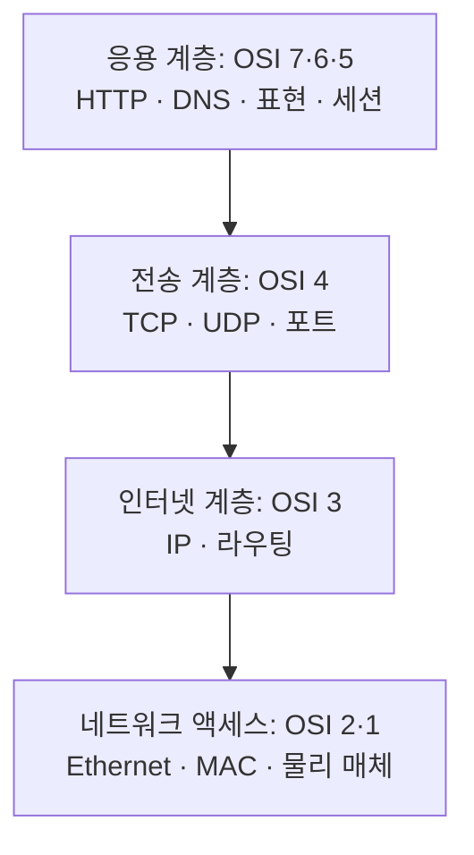
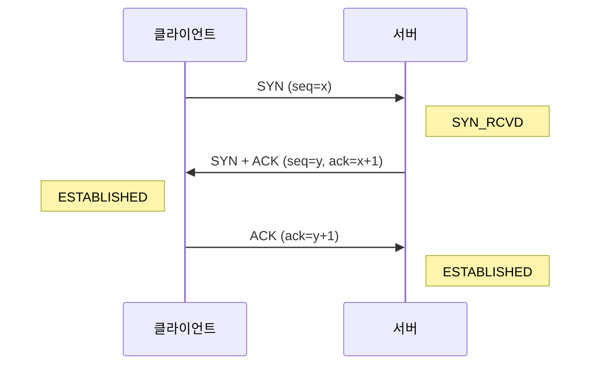
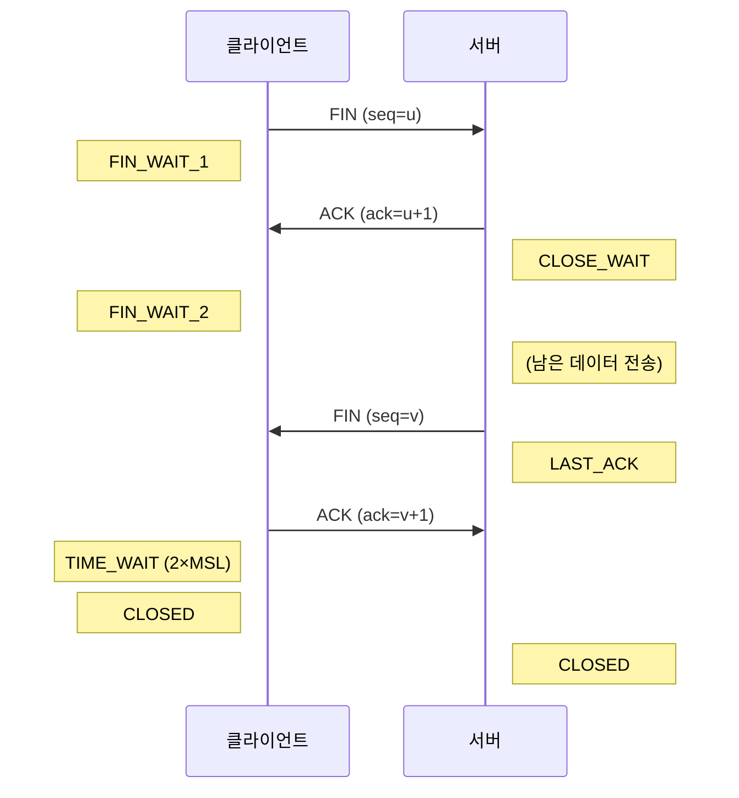
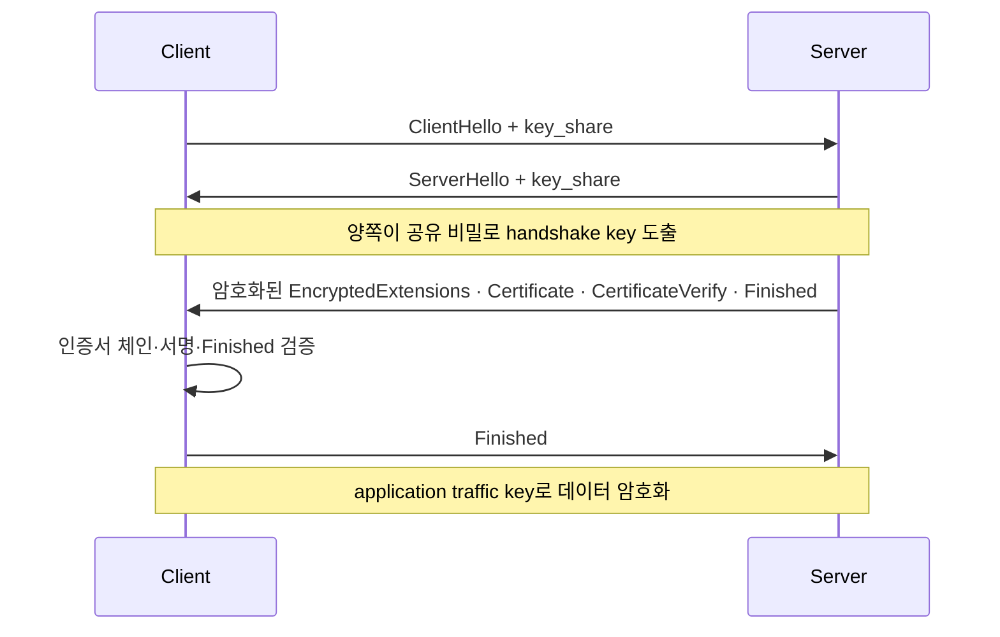
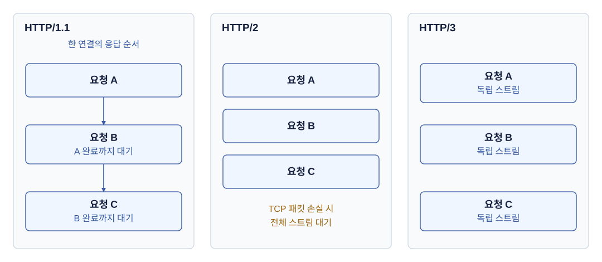
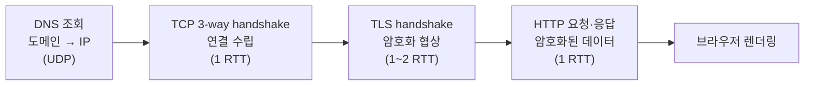

# 네트워크 기초 — OSI, TCP/IP, 핸드셰이크, HTTP/HTTPS

## 1. 왜 계층으로 나누는가

네트워크는 전기 신호부터 HTTP 요청까지 단계가 많다.  
한 번에 다루면 복잡하므로 **계층(Layer)**으로 나눈다.  
각 층은 아래 층을 믿고, 자기 책임만 다한다.

> HTTP 개발자는 TCP가 어떻게 분할·재조립하는지 몰라도 된다.  
> "TCP가 알아서 보내준다"를 믿고, HTTP 메시지만 만들면 된다.

## 2. OSI 7계층 vs TCP/IP 4계층

OSI는 **이론적 기준**, TCP/IP는 **실제 인터넷이 쓰는 모델**이다.



> OSI 5·6·7층이 TCP/IP에서는 **응용층 하나**로 합쳐진다.  
> 실무에서는 TCP/IP 4계층으로 이해하면 충분하다.

| 계층 | 프로토콜 | 책임 |
|---|---|---|
| 응용 | HTTP, HTTPS, DNS | 개발자가 직접 다루는 층. 브라우저, `curl`, Spring `RestTemplate` |
| 전송 | TCP, UDP | 신뢰성(TCP) vs 속도(UDP). **포트 번호**로 프로세스 식별 |
| 인터넷 | IP | **목적지 컴퓨터 찾기** (라우팅). IP 주소 |
| 네트워크 액세스 | Ethernet, Wi-Fi | 물리적 전송. MAC 주소, 스위치, 케이블 |

## 3. TCP vs UDP

| | TCP | UDP |
|---|---|---|
| 연결 | 연결 지향 (3-way handshake) | 비연결 |
| 신뢰성 | 보장 (재전송, 순서) | 보장 안 함 |
| 순서 | 보장 | 보장 안 함 |
| 속도 | 느림 (오버헤드) | 빠름 |
| 헤더 | 20 byte | 8 byte |
| 사용 | HTTP, HTTPS, 이메일 | DNS, 영상 스트리밍, 게임 |

> **HTTP/3 (QUIC)**는 UDP 기반이다.  
> TCP는 커널 영역이라 개선이 어려운데,  
> UDP 위에서 애플리케이션 단에서 신뢰성을 직접 구현하면 더 빠르게 발전시킬 수 있다.

## 4. TCP 3-way handshake — 연결 맺기



| 단계 | 방향 | 의미 |
|---|---|---|
| 1. SYN | 클 → 서버 | "연결하자" (`seq=x`) |
| 2. SYN-ACK | 서버 → 클 | "나도 준비됐어" (`seq=y, ack=x+1`) |
| 3. ACK | 클 → 서버 | "알겠어" (`ack=y+1`) |

3번이 필요한 이유: 2번만으로는 서버가 "클라이언트가 내 SYN을 받았는지" 모른다.  
마지막 ACK로 양쪽 모두 연결 성립을 확신한다.

> TCP 연결에는 최소 1 RTT가 든다 (SYN → SYN-ACK).  
> 이후 ACK는 첫 데이터와 함께 보낼 수 있다.

## 5. TCP 4-way handshake — 연결 끊기



| 단계 | 방향 | 의미 |
|---|---|---|
| 1. FIN | 클 → 서버 | "나 다 보냈어" |
| 2. ACK | 서버 → 클 | "알겠어" |
| 3. FIN | 서버 → 클 | "나도 다 보냈어" (남은 데이터 전송 후) |
| 4. ACK | 클 → 서버 | "알겠어" |

### TIME_WAIT

마지막 ACK를 보낸 클라이언트는 **TIME_WAIT** 상태로 대기한다 (2 × MSL, 약 60~120초).  
마지막 ACK가 유실되면 서버가 FIN을 재전송하는데, 클라이언트가 이미 닫혀있으면 응답 못 한다.

> TIME_WAIT가 **서버 장애의 흔한 원인**이다.  
> 짧은 연결이 많이 발생하면 TIME_WAIT 소켓이 쌓여 포트가 고갈된다.  
> 해결책이 **커넥션 풀(keep-alive)**이다 — 한 번 맺은 연결을 재사용하면 이 과정 자체가 생략된다.  
> 자세한 것은 [커넥션 풀 문서](./2607-connection-pool.md) 참조.

## 6. HTTP vs HTTPS

| | HTTP | HTTPS |
|---|---|---|
| 포트 | 80 | 443 |
| 암호화 | 없음 (평문) | TLS |
| 인증 | 없음 | 서버 인증서 (CA 서명) |
| 무결성 | 보장 안 됨 | 보장 (변조 감지) |
| 성능 | 빠름 | 핸드셰이크 비용 |

> **TLS**는 **SSL**의 후속 버전이다.  
> "SSL 인증서"라고 부르지만 실제로는 TLS 1.2 / 1.3을 쓴다.

## 7. TLS 핸드셰이크 — 암호화 협상

HTTPS 첫 연결:

```text
TCP 3-way handshake (1 RTT)
    → TLS handshake (1~2 RTT)
        → 암호화된 데이터 전송
```

### TLS 1.2 (2 RTT)



### 인증과 키 합의는 다른 역할이다

위 그림은 인증서 기반 TLS 1.3의 일반적인 full handshake를 단순화한 것이다.  
PSK 재개, HelloRetryRequest, 클라이언트 인증은 생략했다.

| 역할 | 동작 |
|---|---|
| 인증서 검증 | CA 서명, 호스트 이름, 유효기간 등으로 서버 공개키의 신뢰 확인 |
| 서버 인증 | `CertificateVerify` 서명으로 서버의 개인키 보유 확인 |
| 키 합의 | 임시 (EC)DHE 공개값을 교환하고 양쪽에서 공유 비밀 도출 |
| 데이터 보호 | 공유 비밀에서 도출한 대칭키로 암호화·무결성 검증 |

TLS 1.3은 클라이언트가 대칭키를 RSA 공개키로 암호화해 보내는 방식을 사용하지 않는다.  
서명도 단순히 “개인키로 암호화”한다고 설명하기보다, 메시지의 진위 검증 연산으로 구분한다.

### TLS 1.3과 재연결

일반적인 full handshake는 1 RTT다. 재개 시 0-RTT early data를 사용할 수 있지만,  
재전송 공격에 대한 제약이 있으므로 부작용 있는 요청에 무조건 적용하지 않는다.

## 8. HTTP 버전 — 1.0 → 1.1 → 2 → 3

| 버전 | 연결 | 핵심 변화 | 문제 |
|---|---|---|---|
| HTTP/1.0 | 요청마다 TCP 연결 새로 맺음 | — | 매번 3-way handshake 비용 |
| HTTP/1.1 | keep-alive (연결 재사용) | 파이프라이닝 도입 | **HOL blocking** (앞 요청이 느리면 뒤가 막힘) |
| HTTP/2 | 한 연결에 여러 요청 동시 (multiplexing) | 바이너리 프레임, 헤더 압축(HPACK) | TCP HOL blocking (패킷 손실 시 전체 멈춤) |
| HTTP/3 | QUIC (UDP 기반) | TCP HOL 근본 해결, 0-RTT 연결 | UDP 미지원 환경 가능성 |

### HOL blocking — 왜 버전이 올라가는가

HTTP/1.1의 문제: 하나의 TCP 연결에서 응답이 순차로 와야 한다.  
첫 요청이 느리면, 뒤의 빠른 요청도 대기해야 한다. (Application layer HOL blocking)

HTTP/2 해결: 한 연결에서 여러 요청을 동시에 보낸다 (multiplexing).  
하지만 TCP 자체가 순서 보장을 하므로, **패킷 하나가 손실되면 전체 연결이 멈춘다**. (TCP layer HOL blocking)

HTTP/3 해결: TCP를 버리고 UDP 기반 QUIC을 쓴다.  
스트림마다 독립적이라, 한 스트림에서 패킷 손실이 있어도 다른 스트림은 멈추지 않는다.



> HTTP/2의 multiplexing은 **같은 TCP 연결**에서 여러 요청을 동시에 보내는 것이다.  
> TCP 위에서 동작하므로, TCP 레벨 패킷 손실이 모든 요청에 영향을 미친다.  
> HTTP/3은 UDP 기반 QUIC으로 이를 근본적으로 해결한다.

## 9. 전체 흐름 — URL을 치면



| 단계 | 내용 | 비용 |
|---|---|---|
| 1. DNS 조회 | 도메인 → IP (UDP) | — |
| 2. TCP handshake | 연결 수립 | 1 RTT |
| 3. TLS handshake | 암호화 설정 | TLS 1.2: 2 RTT, 1.3: 1 RTT |
| 4. HTTP 요청·응답 | 암호화된 데이터 전송 | 1 RTT |
| 5. 브라우저 렌더링 | HTML 파싱, CSS/JS 로드 | — |

```text
HTTPS 첫 연결 (TLS 1.2): DNS + TCP(1 RTT) + TLS(2 RTT) + HTTP(1 RTT) = 약 4 RTT
HTTPS 첫 연결 (TLS 1.3): DNS + TCP(1 RTT) + TLS(1 RTT) + HTTP(1 RTT) = 약 3 RTT
```

> 매 요청마다 DNS + TCP + TLS를 반복하면 3~4 RTT를 낭비한다.  
> 커넥션 풀(keep-alive)로 연결을 재사용하면 TCP + TLS 비용이 0이 되고 HTTP(1 RTT)만 남는다.

## 참고

- [RFC 8446 §2](https://datatracker.ietf.org/doc/html/rfc8446#section-2) — TLS 1.3 인증서 기반 full handshake와 키 합의 설명을 반영했다. PSK·클라이언트 인증은 그림에서 생략했다.
