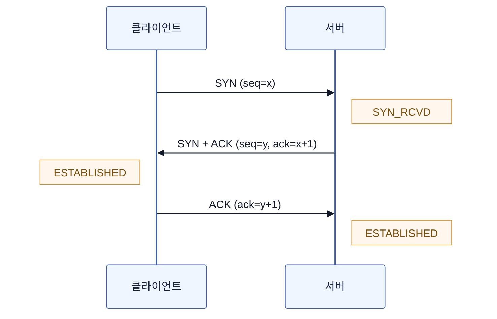
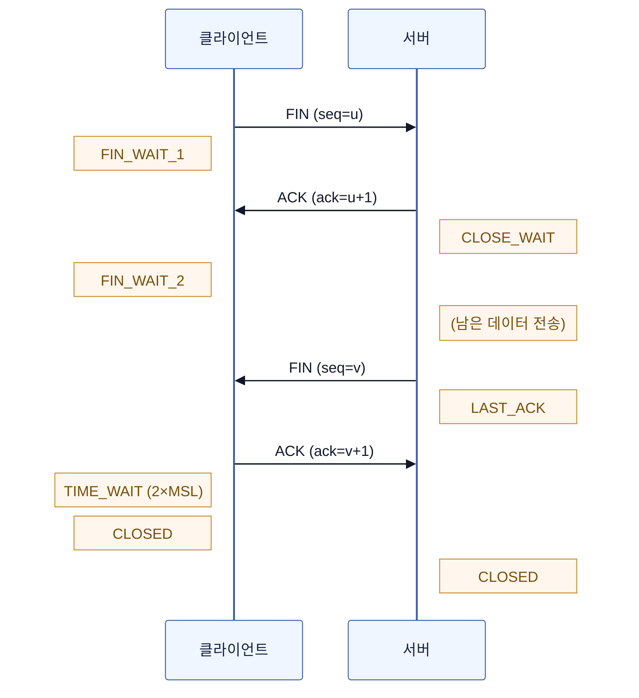
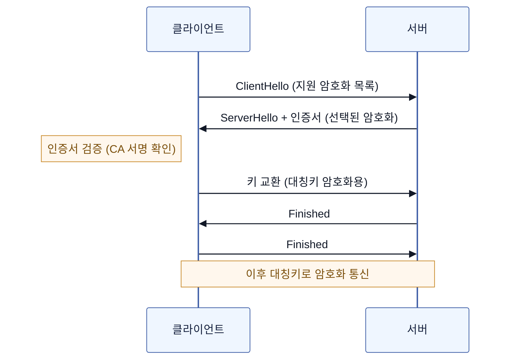
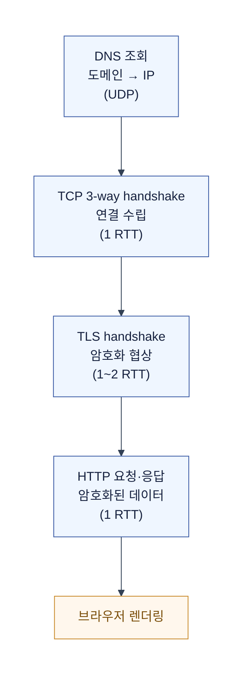

# 네트워크 기초 — OSI, TCP/IP, 핸드셰이크, HTTP/HTTPS

브라우저에 URL을 치는 순간,  
케이블의 전기 신호부터 Spring 컨트롤러까지 수많은 단계를 거친다.

이 문서는 그 단계들을 한 흐름으로 정리한다.  
"왜 계층인가"에서 시작해서, "URL을 치면 일어나는 일"으로 끝맺는다.

## 1. 왜 계층으로 나누는가

네트워크는 복잡하다.  
케이블의 전기 신호부터, 브라우저의 HTTP 요청까지, 한 번에 이해하려면 머리가 아프다.

그래서 **계층(Layer)**으로 나눈다.  
각 층은 아래 층이 해주는 일을 믿고, 자기 층의 책임만 다한다.

> "아래 층이 알아서 보내줄 거야. 나는 내 역할만 하면 돼."

예를 들어, HTTP를 다루는 개발자는  
TCP가 어떻게 분할·재조립하는지 알 필요가 없다.  
"TCP가 알아서 보내준다"를 믿고, HTTP 메시지만 만들면 된다.  
이것이 **계층화**의 핵심이다.

## 2. OSI 7계층 vs TCP/IP 4계층

두 모델이 있다.  
OSI는 **이론적 기준**이고, TCP/IP는 **실제 인터넷이 쓰는 모델**이다.

| OSI 7계층 | TCP/IP 4계층 | 역할 | 대표 프로토콜 |
|---|---|---|---|
| 7. 응용 (Application) | 응용 (Application) | 사용자 인터페이스 | HTTP, DNS, SMTP |
| 6. 표현 (Presentation) | ↑ (합쳐짐) | 데이터 변환·암호화 | TLS, JPEG |
| 5. 세션 (Session) | ↑ (합쳐짐) | 연결 관리 | — |
| 4. 전송 (Transport) | 전송 (Transport) | 신뢰성·분할·포트 | **TCP**, **UDP** |
| 3. 네트워크 (Network) | 인터넷 (Internet) | 경로 찾기·라우팅 | **IP**, ICMP |
| 2. 데이터링크 (Data Link) | 네트워크 액세스 (Network Access) | 물리 연결·프레임 | Ethernet, MAC |
| 1. 물리 (Physical) | ↑ (합쳐짐) | 전기 신호 | 케이블, 광섬유 |

> OSI 5·6·7층이 TCP/IP에서는 **응용층 하나**로 합쳐진다.  
> 실무에서는 TCP/IP 4계층으로 이해하면 충분하다.

### 각 층이 하는 일 (TCP/IP 기준)

**응용 (Application)** — HTTP, HTTPS, DNS  
개발자가 직접 다루는 층. 브라우저, `curl`, Spring `RestTemplate`이 여기서 동작한다.

**전송 (Transport)** — TCP, UDP  
데이터를 **신뢰성 있게** 보낼지(TCP), **빠르게** 보낼지(UDP) 결정한다.  
**포트 번호**가 여기서 동작한다. IP는 컴퓨터까지, 포트는 프로세스까지.

**인터넷 (Internet)** — IP  
**목적지 컴퓨터를 찾아간다.** 라우팅.  
IP 주소가 이 층의 주소다.

**네트워크 액세스 (Network Access)** — Ethernet, Wi-Fi  
물리적으로 데이터를 보낸다. MAC 주소, 스위치, 케이블.

## 3. TCP vs UDP

전송 계층의 두 선택지.  
"신뢰성"과 "속도"의 트레이드오프다.

| | TCP | UDP |
|---|---|---|
| 연결 | 연결 지향 (3-way handshake) | 비연결 |
| 신뢰성 | 보장 (재전송, 순서) | 보장 안 함 |
| 순서 | 보장 | 보장 안 함 |
| 속도 | 느림 (오버헤드) | 빠름 |
| 헤더 | 20 byte | 8 byte |
| 사용 | HTTP, HTTPS, 이메일 | DNS, 영상 스트리밍, 게임 |

**TCP**는 "다 받았어? 순서 맞아?"를 계속 확인한다.  
빠지면 다시 보내고, 순서가 바뀌면 맞춘다.  
그 대가로 느리다.

**UDP**는 그냥 보낸다.  
받았든 못 받았든 신경 쓰지 않는다.  
빠르지만, 데이터가 유실될 수 있다.

### 왜 HTTP는 TCP인가

웹 요청은 하나도 빠지면 안 된다.  
HTML이 반쯤 오면 페이지가 깨진다.  
그래서 **신뢰성**이 우선인 TCP를 쓴다.

> **HTTP/3 (QUIC)**는 UDP 기반이다.  
> TCP는 커널 영역이라 개선이 어려운데,  
> UDP 위에서 애플리케이션 단에서 신뢰성을 직접 구현하면 더 빠르게 발전시킬 수 있다.  
> "TCP의 신뢰성 + UDP의 속도"를 애플리케이션에서 직접 다루는 것.

## 4. TCP 3-way handshake — 연결을 맺는 법

TCP 연결은 전화를 거는 것과 비슷하다.  
"거기 있어?" → "응, 있어. 너도 보낼 거야?" → "응" → 통신 시작.



### 과정

1. **SYN** (클 → 서버): "연결하자" (`seq=x`)
2. **SYN-ACK** (서버 → 클): "좋아, 나도 준비됐어" (`seq=y, ack=x+1`)
3. **ACK** (클 → 서버): "알겠어" (`ack=y+1`)

이 3번의 교환 후, 양쪽이 **ESTABLISHED** 상태가 되고 데이터를 보낼 수 있다.

### 왜 3번인가

2번으로는 부족하다.  
클라이언트가 SYN을 보내고, 서버가 SYN-ACK를 보내면,  
서버는 "클라이언트가 내 SYN을 받았는지" 아직 모른다.  
클라이언트가 마지막 ACK를 보내야, **양쪽 다** 연결 성립을 확신한다.

> TCP 연결에는 최소 1 RTT가 든다 (SYN → SYN-ACK가 1 RTT).  
> 이후 ACK는 첫 데이터와 함께 보낼 수 있다.

## 5. TCP 4-way handshake — 연결을 끄는 법

연결을 끊을 때는 4번 교환한다.  
양쪽이 각자 "보낼 거 다 보냈어"라고 확인해야 하기 때문이다.



### 과정

1. **FIN** (클 → 서버): "나 다 보냈어, 끊을래"
2. **ACK** (서버 → 클): "알겠어"
3. 서버가 남은 데이터 마저 보냄 → **FIN** (서버 → 클): "나도 다 보냈어"
4. **ACK** (클 → 서버): "알겠어"

### TIME_WAIT — 마지막 ACK 뒤에 기다리는 이유

마지막 ACK를 보낸 클라이언트는 **TIME_WAIT** 상태로 대기한다.  
보통 2 × MSL(Maximum Segment Lifetime, 약 60~120초).

왜 기다리는가?  
마지막 ACK가 유실될 수 있다.  
유실되면 서버는 FIN을 다시 보내는데, 클라이언트가 이미 닫아버리면 응답을 못 한다.  
그래서 "혹시 모르니 좀 기다린다".

> 이 TIME_WAIT가 **서버 장애의 흔한 원인**이다.  
> 짧은 연결이 많이 발생하면 TIME_WAIT 소켓이 쌓여서 포트가 고갈된다.  
> 해결책이 **커넥션 풀(keep-alive)**이다.  
> 한 번 맺은 연결을 재사용하면, 이 과정 자체가 생략된다.  
> 자세한 것은 [커넥션 풀 문서](./2607-connection-pool.md) 참조.

## 6. HTTP vs HTTPS

### HTTP — 평문 통신

데이터를 암호화하지 않고 보낸다.  
중간자(공공 Wi-Fi, ISP)가 내용을 그대로 읽을 수 있다.

```text
클라이언트 --(평문)--> 서버
"password=1234"  ← 그대로 노출
```

### HTTPS — HTTP + TLS

HTTP 위에 **TLS(Transport Layer Security)**를 얹은 것.  
데이터를 암호화해서, 중간자가 읽어도 의미를 알 수 없다.

```text
클라이언트 --(TLS 암호화)--> 서버
"password=1234" → [암호문] → 복호화 → "password=1234"
```

### 차이

| | HTTP | HTTPS |
|---|---|---|
| 포트 | 80 | 443 |
| 암호화 | 없음 | TLS |
| 인증 | 없음 | 서버 인증서 (CA 서명) |
| 무결성 | 보장 안 됨 | 보장 (변조 감지) |
| 성능 | 빠름 | 핸드셰이크 비용 |

> **TLS**는 **SSL**의 후속 버전이다.  
> 이름이 SSL로 굳어져서 "SSL 인증서"라고 부르지만,  
> 실제로는 TLS 1.2 / 1.3을 쓴다.

## 7. TLS 핸드셰이크 — 암호화 협상

HTTPS는 TCP 연결 위에 **TLS 핸드셰이크**를 추가한다.  
그래서 HTTPS 첫 연결은:

```text
TCP 3-way handshake (1 RTT)
    → TLS handshake (1~2 RTT)
        → 암호화된 데이터 전송
```

### TLS 1.2 (2 RTT)



### 왜 비대칭키(공개키)로 계속 안 하고, 대칭키로 바꾸나

공개키 암호화는 느리다.  
그래서 핸드셰이크 때만 공개키로 **대칭키를 안전하게 교환**하고,  
이후 데이터는 빠른 **대칭키**로 암호화한다.

> **대칭키**: 같은 키로 암호화·복호화. 빠르지만 키를 안전하게 공유해야 함.  
> **비대칭키(공개키)**: 공개키로 암호화, 개인키로 복호화. 느리지만 키 교환 걱정 없음.  
> TLS는 **둘을 조합**한다 — 비대칭키로 대칭키를 교환하고, 이후 대칭키로 통신.

### TLS 1.3 (1 RTT)

TLS 1.3은 1-RTT로 단축했다.  
핸드셰이크 메시지를 줄이고, 키 교환을 첫 패킷에 포함시켰다.  
0-RTT 모드(재연결 시 첫 패킷부터 데이터 전송)도 지원한다.

## 8. 전체 흐름 — 브라우저에 URL을 치면

지금까지의 모든 단계가 연결된다.



### 단계별

1. **DNS 조회**: 도메인 이름 → IP 주소 (UDP, 빠름)
2. **TCP 3-way handshake**: 클라이언트 ↔ 서버 연결 (1 RTT)
3. **TLS handshake** (HTTPS): 암호화 설정 (TLS 1.2: 2 RTT, TLS 1.3: 1 RTT)
4. **HTTP 요청 전송**: 암호화된 데이터 전송
5. **서버 처리**: Spring이 요청을 받고 응답
6. **HTTP 응답**: 암호화된 데이터 반환
7. **브라우저 렌더링**: HTML 파싱, CSS/JS 로드

```text
HTTPS 첫 연결 총 비용 (TLS 1.2 기준):
  DNS(UDP) + TCP(1 RTT) + TLS(2 RTT) + HTTP(1 RTT)
  = 약 4 RTT 후 첫 바이트 도착

TLS 1.3이면:
  DNS(UDP) + TCP(1 RTT) + TLS(1 RTT) + HTTP(1 RTT)
  = 약 3 RTT
```

> 이것이 **커넥션 풀**과 **keep-alive**가 중요한 이유다.  
> 매 요청마다 DNS + TCP + TLS를 반복하면 3~4 RTT를 낭비한다.  
> 한 번 맺은 연결을 재사용하면, TCP + TLS 비용이 0이 되고  
> HTTP 요청·응답(1 RTT)만 남는다.

## 요약

| 개념 | 한 줄 |
|---|---|
| OSI 7계층 | 이론적 참조 모델. 7층으로 쪼갬 |
| TCP/IP 4계층 | 실제 인터넷 모델. 응용·전송·인터넷·네트워크 액세스 |
| TCP | 신뢰성. 3-way로 연결, 4-way로 종료 |
| UDP | 빠르지만 신뢰성 없음. DNS, 스트리밍, HTTP/3 |
| 3-way handshake | SYN → SYN-ACK → ACK |
| 4-way handshake | FIN → ACK → FIN → ACK (+ TIME_WAIT) |
| HTTP | 평문 통신. 포트 80 |
| HTTPS | HTTP + TLS. 암호화. 포트 443 |
| TLS handshake | 공개키로 대칭키 교환 → 이후 대칭키로 통신 |
| TIME_WAIT | 마지막 ACK 유실 대비 대기. 포트 고갈 원인 |
