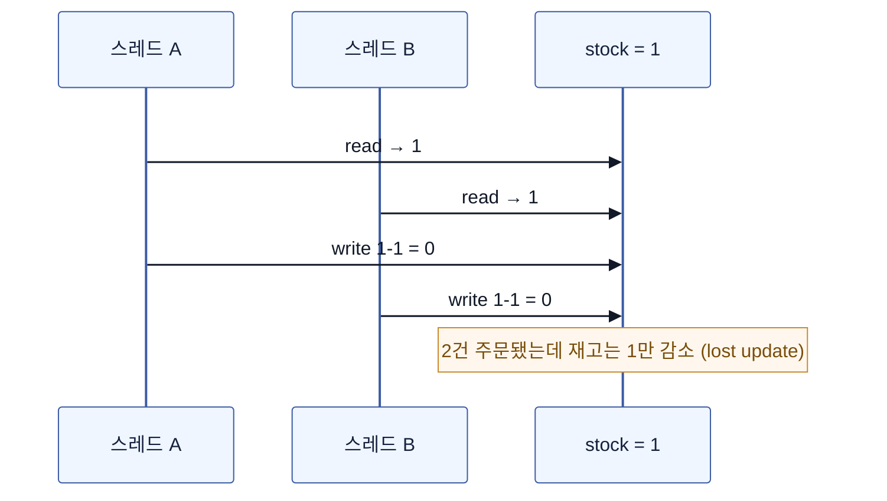
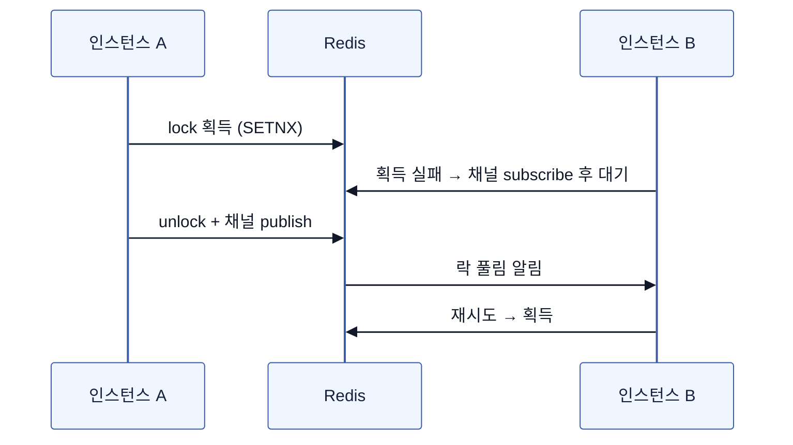
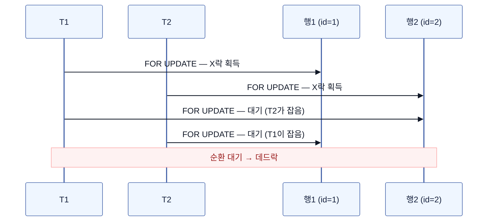

# Race Condition과 동시성 제어 — 단일 앱에서 분산 락까지

여러 스레드/프로세스가 **공유 자원을 동시에 읽고-수정-쓰면** 실행 순서에 따라 결과가 달라지는 문제.

전형적 패턴은 **read-modify-write**(재고 차감)와 **check-then-act**(중복 가입 검사 후 insert).  
아래는 "재고 1개 남았는데 주문 2건 동시 진입" 시나리오로, 아키텍처가 커지는 순서대로 해법을 밟는다.



## 0단계 — 단일 인스턴스: JVM 락

인스턴스 1대, 경합 지점이 JVM 안에만 있을 때. `synchronized` 또는 `ReentrantLock`.

```java
public synchronized void decrease(Long id, Long qty) {
    Stock stock = stockRepository.findById(id).orElseThrow();
    stock.decrease(qty);
    stockRepository.saveAndFlush(stock);
}
```

- **함정: `@Transactional`과 같이 쓰면 깨진다.** 트랜잭션은 프록시가 감싸므로 실제 순서는 `트랜잭션 시작 → synchronized 진입/탈출 → 커밋`. **락이 풀린 뒤 커밋 전** 틈에 다른 스레드가 옛 값을 읽는다. → 락 범위가 트랜잭션 범위를 **감싸야** 안전.
- `ReentrantLock`은 `tryLock(timeout)`·공정성(fairness)·조건 변수 등 세밀 제어가 필요할 때.
- **한계**: 락의 유효 범위가 JVM 하나. 인스턴스가 2대만 돼도 무력화(→ 2단계).

### Kotlin 코루틴 / 가상 스레드(VT)라면

실행 모델이 바뀌면 "스레드를 세우는 락"이 독이 된다.

```kotlin
val mutex = Mutex()

suspend fun decrease(id: Long, qty: Long) = mutex.withLock {
    val stock = stockRepository.findById(id) ?: error("없음")
    stock.decrease(qty)
    stockRepository.save(stock)
}
```

- **코루틴**: `synchronized`/`ReentrantLock`은 대기 시 **스레드 자체를 블로킹**해 코루틴의 이점을 없애고, `synchronized` 블록 안에선 suspend 호출도 못 한다. 대신 `kotlinx.coroutines.sync.Mutex` — `withLock`은 대기 중 스레드를 놓아주는 **suspend 락**. 동시 N개 허용은 `Semaphore(n)`.
- **가상 스레드(virtual thread, Java 21+)**: `synchronized` 블록 안에서 블로킹하면 캐리어 스레드에 **피닝(pinning)** — 플랫폼 스레드가 그대로 묶여 VT의 장점이 사라진다. JDK 24(JEP 491)에서 해소됐지만, 그 전 버전이면 `ReentrantLock`이 정석.

두 모델의 동시성 도구 대응표. 철학 차이가 핵심 — 코루틴은 "스레드 블로킹 금지"라서 **suspend 전용 도구를 새로** 배워야 하고, VT는 "블로킹이 싸졌다"라서 **기존 `java.util.concurrent`를 그대로** 쓴다:

| 목적 | 코루틴 (kotlinx.coroutines) | 가상 스레드 (java.util.concurrent) | 주의 |
|---|---|---|---|
| 상호배제 (1개) | `Mutex.withLock { }` | `ReentrantLock` (블로킹돼도 VT가 캐리어에서 내려와 저렴) | **`Mutex`는 재진입 불가**(ReentrantLock과 다름!) · `synchronized`는 JDK 24 전 피닝 |
| 동시 N개 제한 | `Semaphore(n).withPermit { }` | `j.u.c.Semaphore(n)` | 외부 API 동시 호출 제한 등. 이름까지 같지만 **다른 클래스** |
| 완료 대기 | `Job.join()` / `Deferred.await()` | `Future.get()` / `CompletableFuture.join()` | VT에선 `get()` 블로킹이 죄가 아니다 |
| 신호·조건 대기 | `Channel` / `CompletableDeferred` | `Condition` / `CountDownLatch` | |

- 어느 쪽이든 **락의 범위는 여전히 프로세스 하나** — 스케일 아웃하면 똑같이 무력화.

## 1단계 — RDB를 붙였다: DB가 락의 진실 공급원

경합 지점이 DB의 행(row)이라면, **락도 DB에 맡기는 게 자연스럽다.** DB는 이미 공유 지점이므로 스케일 아웃해도 유효하다.

| 방식 | 원리 | 장점 | 단점 / 함정 |
|---|---|---|---|
| **낙관적 락(optimistic)** | `@Version` 컬럼. UPDATE 시 버전 비교, 다르면 실패 | 락 점유 없음 → 경합 **적을 때** 가장 저렴 | 충돌 시 **재시도 로직**을 직접 작성. 경합 높으면 재시도 폭증 |
| **비관적 락 — 배타락 (X락)** | `SELECT … FOR UPDATE`. JPA `@Lock(PESSIMISTIC_WRITE)`. 다른 트랜잭션의 읽기·쓰기 모두 차단 | 충돌 자체를 차단 → 경합 **높을 때** 안정적. 갱신 목적에 적합 | 락 대기로 커넥션 점유·**[데드락 유발 가능](#데드락--락이-만드는-교착)** |
| **비관적 락 — 공유락 (S락)** | `SELECT … FOR SHARE`. JPA `@Lock(PESSIMISTIC_READ)`. 다른 트랜잭션의 읽기는 허용, 쓰기만 차단 | 읽기 일관성 확보. 여러 트랜잭션이 동시에 공유락 보유 가능 | 배타락이 필요한 트랜잭션은 모든 공유락이 풀릴 때까지 대기 |
| **네임드 락(named lock)** | 행이 아닌 **임의 문자열**에 락. MySQL `GET_LOCK('key')`, PG `pg_advisory_lock` | 행이 아직 없어도(INSERT 경합) 잠글 수 있음, 테이블 락 회피 | 트랜잭션과 별개로 **명시적 해제 필수**. 락용 커넥션이 따로 필요해 풀 고갈 주의 |

락 모드(배타/공유)가 "어떻게 잠그느냐"라면, 락 범위는 "어디까지 잠그느냐"다. 범위가 잘못되면 로우락이 테이블락으로 확장된다.

| 범위 | 언제 발생 | 함정 |
|---|---|---|
| **로우락** | `WHERE id = ? FOR UPDATE` (PK 조회) | 가장 이상적 — 타겟 행만 잠김 |
| **갭락** | 범위 조회 `WHERE id BETWEEN 10 AND 20` | 빈 공간을 잠가 INSERT 대기 유발. MySQL InnoDB 기본(넥스트키락) |
| **테이블락** | 인덱스 안 타는 `FOR UPDATE`, DDL | 풀스캔하면서 모든 행에 락 → 사실상 테이블락. **`FOR UPDATE`는 인덱스가 전제** |

PostgreSQL은 갭락이 없고 로우락만 있다. MySQL InnoDB는 넥스트키락(로우락 + 갭락)이 기본 동작이다.

### MVCC — 락 없이 읽는 법

MVCC(Multi-Version Concurrency Control)는 읽기에 락을 안 잡는 핵심 메커니즘이다. 쓰기가 락으로 충돌을 막는다면, 읽기는 **과거 버전(snapshot)**을 보여줘서 락 없이 동작한다.

- 트랜잭션이 행을 수정하면, DB는 **이전 버전을 보존**한다. 다른 트랜잭션이 읽을 때 수정 중인 행의 락을 기다리지 않고, 자기 트랜잭션 시작 시점의 스냅샷을 읽는다.
- 그래서 `SELECT`는 `FOR UPDATE`가 없으면 **락 없이 동작**한다. 읽기가 쓰기를 막지 않고, 쓰기가 읽기를 막지 않는다.
- 이게 "비관적 락을 쓸 때 `SELECT`와 `SELECT ... FOR UPDATE`가 다른 이유"다. 일반 `SELECT`는 snapshot 읽기(MVCC), `FOR UPDATE`는 현재 값 읽기 + 락 획득이다.

**격리 수준에 따라 MVCC가 보여주는 버전이 다르다:**

| 격리 수준 | Dirty Read | Non-Repeatable Read | Phantom Read | 설명 |
|---|---|---|---|---|
| READ UNCOMMITTED | ❌ 가능 | ❌ 가능 | ❌ 가능 | 커밋 안 된 데이터도 읽음. 거의 안 씀 |
| READ COMMITTED (PG 기본) | ✅ 방지 | ❌ 가능 | ❌ 가능 | 커밋된 데이터만 읽지만, 같은 행을 다시 읽으면 값이 바뀔 수 있음 |
| REPEATABLE READ (MySQL 기본) | ✅ 방지 | ✅ 방지 | ❌ 가능(MySQL은 방지) | 트랜잭션 시작 시점 스냅샷 유지. MySQL은 갭락으로 phantom도 방지 |
| SERIALIZABLE | ✅ 방지 | ✅ 방지 | ✅ 방지 | 모든 읽기에 락. 동시성 포기 |

- **READ COMMITTED vs REPEATABLE READ**: READ COMMITTED는 문장마다 새 스냅샷, REPEATABLE READ는 트랜잭션 시작 시 스냅샷 고정.
- **Lost update와의 관계**: MVCC는 읽기 일관성을 주지만, "읽고 수정해서 쓰는" 패턴(read-modify-write) 자체를 막아주진 않는다. 읽은 값이 snapshot이라서, 그 사이 다른 트랜잭션이 바꾼 값을 모른 채 덮어쓰면 lost update. 그래서 낙관적 락(`@Version`)이나 비관적 락(`FOR UPDATE`)이 필요한 것이다.

```java
// JPA — 비관적 락, 조회 시점에 행을 잠근다
@Lock(LockModeType.PESSIMISTIC_WRITE)
@Query("select s from Stock s where s.id = :id")
Stock findByIdForUpdate(Long id);
```

```kotlin
// Exposed — forUpdate() 로 행을 잠근다
transaction {
    StockTable.select { StockTable.id eq id }
        .forUpdate()  // SELECT ... FOR UPDATE
        .single()
}
```

- 낙관 vs 비관 선택 기준 = **충돌 빈도**. 마이페이지 수정처럼 드물면 낙관, 선착순 재고처럼 잦으면 비관.
- 사실 이 예제의 최적해는 락 없이 원자적 UPDATE 한 방: `UPDATE stock SET qty = qty - 1 WHERE id = ? AND qty >= 1` → 영향 행 수로 성패 판단. **락은 "읽은 값으로 애플리케이션 로직을 태워야 할 때" 필요**하다. (이 패턴의 확장은 [원자적 업데이트](#원자적-업데이트--락을-아예-쓰지-않는-길) 섹션에서.)

### 네임드 락 더 파기 — "Redis 없는 분산 락"

- **네임드 락은 그 자체로 분산 락이다.** 락이 공유 지점(DB)에 있으므로 인스턴스 N대에 유효. 락 하나 때문에 Redis를 새로 들이기 싫을 때의 실용해 — Flyway(PG advisory lock)·ShedLock(JDBC)이 내부적으로 같은 원리를 쓴다.
- **유량이 돌면 부적합.** 락 대기가 **커넥션을 통째로 점유**하는데, RDB 커넥션은 스레드+메모리가 붙는 비싼 자원 — 경합이 잦으면 풀 고갈 → 전면 장애. 락 전용 DataSource 분리가 정석이지만, 그 수고를 할 시점이면 Redis가 낫다. **적정선은 저빈도 조정**(배치 중복 방지·마이그레이션·리더 흉내).
- **서버가 죽으면 락도 풀린다.** 커넥션 종료 = 락 자동 해제라 고아 락이 없다(Redis처럼 TTL 튜닝이 필요 없는 장점). 단, **프로세스만 죽으면** OS가 소켓을 닫아 즉시 해제되지만 **머신 다운·네트워크 단절**이면 DB가 죽은 커넥션을 인지할 때까지(TCP keepalive·`wait_timeout`) 락이 한동안 남을 수 있다.
- **락 상태를 SQL로 조회할 수 있다**: MySQL `IS_USED_LOCK('key')`·`performance_schema.metadata_locks`(USER LEVEL LOCK, 대기 세션까지 표시), PG `pg_locks WHERE locktype='advisory'`(키가 숫자 해시라 문자열→숫자 매핑 규칙 필요). 락 릭 의심 시 범인 세션을 찾아 `KILL`하면 회수.
- PG엔 `pg_advisory_xact_lock`(트랜잭션 종료 시 자동 해제)이 있어 MySQL `GET_LOCK`의 "명시적 해제 깜빡" 함정을 피할 수 있다.

### DB 락의 두 가지 한계

- **보호 대상이 행에 결합**: 낙관·비관 락이 잠글 수 있는 건 "그 DB에 존재하는 행"뿐. DB 밖 자원은 걸 곳이 없다 — 이를 우회하는 게 임의 문자열을 잠그는 네임드 락(위 참조).
- **원자성이 DB 경계를 못 넘는다** (더 근본적): 락이 상호배제를 완벽히 보장해도, 롤백되는 건 **DB 상태뿐**이다. 임계구역 안에서 외부 API 호출·Kafka 발행을 하면 — 롤백 시 "DB는 되돌아갔는데 메일은 이미 나감", 커밋 직후 죽으면 "커밋은 됐는데 이벤트 유실". 해법은 락이 아니라 패턴이다:
  - **Transactional Outbox**: 이벤트를 같은 트랜잭션으로 outbox 테이블에 INSERT(DB 안이니 원자적) → 별도 프로세스가 폴링/CDC로 발행. "커밋과 발행의 원자성"을 우회 확보.
  - 되돌릴 수 없는 외부 호출은 **커밋 후로** 빼고, 실패는 **보상 트랜잭션(saga)** — 마무리의 결과적 일관성으로 이어지는 입구가 여기다.

## 2단계 — Redis 분산 락

배경조건은 **스케일 아웃**. 인스턴스 N대가 되는 순간 락별로 운명이 갈린다:

- `synchronized`/`ReentrantLock`/`Mutex` → **무력화**. 락이 JVM별로 따로 존재.
- DB 락(낙관·비관·네임드) → **여전히 유효**. 락의 위치가 공유 지점(DB)이기 때문.
- 대신 모든 인스턴스의 락 경합이 **DB로 집중**된다 — 대기 커넥션이 풀을 점유하고, 트래픽이 크면 락 처리 자체가 DB 부하가 된다.

그래서 락 저장소를 DB에서 Redis로 분리한다. 싱글 스레드 + 인메모리라 락 연산이 싸고 빠르며, DB 부하와 분리된다.

**방법 1 — 스핀락(spin lock)**: `SET key val NX PX 3000`(SETNX + TTL)으로 획득 시도, 실패하면 sleep 후 재시도 루프. Lettuce로 직접 구현하는 방식.

**방법 2 — pub/sub (Redisson)**: 락 해제 시 채널로 알림을 쏘고, 대기자는 **구독하고 잠들어 있다가** 알림에 깨어나 재시도. 스핀이 없어 Redis 부하가 낮다. Spring 진영의 **사실상 표준(de facto)** — 기본 클라이언트 Lettuce엔 락 구현이 없어 직접 짜야 하는 반면, Redisson은 완성된 `RLock`(+분산 Semaphore·CountDownLatch 등)을 제공하기 때문.



```java
// Redisson RLock — pub/sub 기반 (방법 2)
// waitTime 10초 안에 획득 시도, 획득하면 leaseTime 3초 뒤 자동 해제
// 대기 중에는 스핀하지 않고 Redis 채널을 subscribe 하고 잠듦 → 락 해제 알림에 깨어남
RLock lock = redissonClient.getLock("stock:" + id);
try {
    if (!lock.tryLock(10, 3, TimeUnit.SECONDS)) {
        throw new IllegalStateException("락 획득 실패");
    }
    stockService.decrease(id, qty);   // 트랜잭션은 이 안에서 시작·커밋
} finally {
    if (lock.isHeldByCurrentThread()) lock.unlock();
}
```

- **TTL(leaseTime)은 필수**: 락 잡은 인스턴스가 죽으면 영원히 잠기므로 만료로 회수. Redisson은 leaseTime을 안 주면 **watchdog** — 별도 라이브러리가 아니라 Redisson 내장 타이머로, **보유자 JVM 안에서** 10초마다 락 TTL을 30초로 리셋(`lockWatchdogTimeout`의 1/3 주기). 프로세스가 죽으면 타이머도 죽어 최대 30초 내 자동 회수.
  - "watchdog(감시 타이머)"은 임베디드 시스템에서 온 관용어: **주기적으로 신호를 주지 않으면 자동으로 조치가 발동**하는 타이머. 일반화하면 **리스(lease) 패턴** — "권리를 짧게 빌리고, 갱신으로 살아 있음을 증명하고, 갱신이 멈추면 자동 정리". 같은 구조가 도처에 있다: Kafka 컨슈머 heartbeat(끊기면 리밸런싱), K8s liveness probe(실패하면 재시작), DHCP 임대 갱신, 네임드 락의 커넥션 keepalive. **"명시적 해제를 믿지 말고, 살아 있음의 증명이 끊기면 회수한다"**는 분산 시스템의 기본기.
- **TTL 길이는 비대칭 트레이드오프**: 너무 길면 보유자 사망 시 복구 지연(가용성 비용), 너무 짧으면 작업 중 락이 풀려 동시 진입(**정확성 비용 — 이쪽이 훨씬 아프다**). "짧게"가 아니라 **최악 작업 시간(GC pause·DB 지연 포함)보다 여유 있게**. leaseTime을 명시하면 watchdog이 꺼지므로, 기본은 생략(= 자동 연장 + 사망 시 최대 30초 내 회수)이 정답에 가깝다.
- **서버가 꺼지면?** ① 대기자가 죽으면 — pub/sub 구독은 **커넥션 귀속**이라 구독자 목록에서 즉시 제거, 잔여물 없음(네임드 락의 커넥션 귀속과 같은 대칭). ② 보유자가 죽으면 — unlock이 없으니 해제 알림도 영영 없지만, 대기자는 **무한정이 아니라 "락의 남은 TTL만큼만" 잠들었다가** 알림 없이도 깨어나 재시도한다(이벤트 + 타임아웃 폴백 이중 대기). 보유자의 watchdog도 같이 죽어 lease 만료로 락이 회수되므로 starvation 없음. ③ Redis failover — Redisson이 재연결 시 자동 재구독하지만, 비동기 복제로 인한 락 유실(아래)은 별개.
- 0단계와 같은 함정 재현 주의: **락 안에서 트랜잭션이 시작되고 커밋까지 끝나야** 한다(락 해제가 커밋보다 먼저면 안 됨).
- 스핀락 vs pub/sub = 폴링 vs 이벤트. 경합이 조금이라도 있으면 pub/sub이 낫다.

## 데드락 — 락이 만드는 교착

락으로 경합을 막으면 **락끼리 서로를 기다리는 교착(deadlock)** 이라는 새 문제가 생긴다. JVM 락·DB 락·Redis 락 어디든 발생하지만, **실무에서 가장 자주 만나는 건 RDB 데드락** — DB가 교착을 자동 탐지해 한쪽을 희생시키므로 로그로 바로 보인다.

### 교착 상태 4조건 (Coffman conditions)

락 기반 시스템에서 데드락이 발생하려면 아래 4가지가 **동시에** 성립해야 한다:

| 조건 | 의미 | 예 |
|---|---|---|
| 상호 배제 (mutual exclusion) | 자원은 한 번에 하나만 점유 | 행에 X락 — 동시에 하나의 트랜잭션만 |
| 점유 대기 (hold and wait) | 자원을 잡은 채 다른 자원을 대기 | A가 행1 잠그고 행2를 대기 |
| 비선점 (no preemption) | 강제로 뺏을 수 없음 — 소유자가 놓아야만 해제 | `FOR UPDATE` 락은 타임아웃 전 안 풀림 |
| 순환 대기 (circular wait) | 대기 그래프가 원을 이룸 | A→행2 대기, B→행1 대기 |

**예방(prevention)** 은 이 중 하나를 깨는 것: 순환 대기를 깨려면 **모든 트랜잭션이 같은 순서로 락을 획득** (정렬된 순서 보장). 점유 대기를 깨려면 필요한 락을 한 번에 전부 획득. 하지만 이런 정렬은 비즈니스 로직이 커지면 지키기 어렵다.

**회피(avoidance)** 는 실행 시점에 안전한 순서를 계산 — 학술적으로는 Banker's algorithm이 유명하지만 실무에선 거의 안 쓴다. RDB에선 이 대신 **자동 탐지(detection)와 타임아웃**으로 간다.

### Spring `@Transactional` + `FOR UPDATE` 데드락 시나리오

가장 흔한 패턴 — 두 트랜잭션이 **서로 다른 순서로** 행을 잠글 때:



Spring 코드로:

```java
@Transactional
public void transfer(Long from, Long to, Long amount) {
    // 비관적 락으로 계좌 조회 — 여기서 행 순서가 중요
    Account fromAcct = accountRepository.findByIdForUpdate(from);
    Account toAcct = accountRepository.findByIdForUpdate(to);
    fromAcct.withdraw(amount);
    toAcct.deposit(amount);
}
```

`transfer(1, 2, 100)` 과 `transfer(2, 1, 50)` 이 동시에 들어오면, 한쪽은 `1→2` 순서로, 다른 쪽은 `2→1` 순서로 잠금 → **순서가 꼬여 데드락**.

**예방: 락 획득 순서를 전역적으로 통일** — 항상 작은 ID부터 잠그면 순환 대기가 생길 수 없다:

```java
@Transactional
public void transfer(Long from, Long to, Long amount) {
    // ID 순으로 정렬해서 일관된 잠금 순서 보장
    Long first = Math.min(from, to);
    Long second = Math.max(from, to);
    accountRepository.findByIdForUpdate(first);   // 항상 작은 ID 먼저
    accountRepository.findByIdForUpdate(second);
    // ... 이체 로직
}
```

### DB가 잡아준다 — 데드락 탐지 (detection)

**RDB는 교착을 자동으로 탐지**한다 — 대기 그래프(wait-for graph)를 유지하다가 순환(cycle)이 발견되면, 한 트랜잭션을 **희생자(victim)** 로 골라 강제 롤백시킨다. MySQL은 `SHOW ENGINE INNODB STATUS`, PostgreSQL은 `pg_stat_activity` + `pg_locks`로 대기 관계를 볼 수 있다.

희생 트랜잭션은 에러를 던진다 — Spring에선 `@Transactional`이 잡지 못하는 **언체크 예외**로 전파:

- MySQL: `SQLException` — `errno 1213` (Deadlock found)
- PostgreSQL: `PSQLException` — SQLSTATE `40P01` (deadlock_detected)

Spring 재시도:

```java
@Retryable(
    retryFor = { CannotAcquireLockException.class, PessimisticLockingFailureException.class },
    backoff = @Backoff(delay = 100, multiplier = 2, maxDelay = 1000),
    maxAttempts = 3
)
@Transactional
public void transfer(Long from, Long to, Long amount) { ... }
```

- `@Retryable`은 데드락 예외를 잡아 재실행 — `@Transactional`과 함께 쓸 땐 **프록시 순서 주의**: 재시도가 트랜잭션을 감싸야 (retry → new transaction), `@Retryable`이 `@Transactional` 바깥에 와야 한다.
- 재시도 중 데드락이 또 나면? 정렬된 잠금 순서로 **근본 원인을 없애야** 한다. 재시도는 임시방편.

### 타임아웃으로 방어

데드락이 아니어도 락 대기가 길어지면 **커넥션이 고갈**된다. 모든 DB에 락 대기 타임아웃이 있다:

| DB | 설정 | 기본값 |
|---|---|---|
| MySQL | `innodb_lock_wait_timeout` | 50초 |
| PostgreSQL | `lock_timeout` | 0 (무한) — **명시 설정 필수** |

```sql
-- PostgreSQL: 세션 레벨 타임아웃
SET lock_timeout = '5s';
```

- 타임아웃이 발생하면 `LockTimeoutException`(Hibernate) / `PSQLException`(SQLSTATE `55P03`) — 재시도 가능한 에러.
- **PG는 `lock_timeout` 기본이 무한**이므로 명시하지 않으면 한 트랜잭션이 행을 잡고 느려지면 전체가 멈춘다. Spring Boot에선 `spring.jpa.properties.hibernate.jdbc.lock_timeout` 또는 DataSource URL에 `&lock_timeout=5000` 설정.

### 실무 체크리스트

- **RDB 데드락 detection이 1차 방어선** — DB가 잡아주므로 무한 교착은 안 일어난다. 희생자는 에러 → 재시도.
- **락 획득 순서 정렬이 근본 해결** — ID 정렬·비즈니스 키 정렬로 순환 대기를 원천 차단. 여러 행을 잠글 땐 **반드시 정렬**.
- **타임아웃은 필수** — PG는 특히 기본이 무한이므로 명시 설정. 대기가 길어지면 커넥션 풀 고갈 → 전면 장애.
- **재시도는 보조 수단** — `@Retryable`로 일시적 데드락은 흡수하지만, 빈번하면 잠금 순서·범위를 재검토.

## 심화 — 분산 락의 한계 (짧게)

- **TTL 만료 + STW(GC pause)**: A가 락을 잡고 멈춘 사이 TTL 만료 → B가 락 획득 → A가 깨어나 자기가 락 주인인 줄 알고 계속 진행 → **둘이 동시 진입**. 완전한 방어는 **fencing token**(단조 증가 토큰을 저장소가 검증)까지 필요.
- **Redlock**: Redis 여러 대 과반수 획득으로 단일 장애점을 없애려는 알고리즘. 시계 의존성 때문에 안전성 논쟁(Kleppmann vs antirez)이 유명. 대부분의 서비스는 단일 Redis(+HA) 락으로 충분하고, 락이 뚫려도 치명적이면 DB 제약(UNIQUE 등)을 최후 방어선으로.

## 원자적 업데이트 — 락을 아예 쓰지 않는 길

지금까지 모든 해법이 "락으로 임계구역을 보호"하는 방향이었다. 하지만 경합의 본질은 **read-modify-write** — 읽고, 애플리케이션에서 수정하고, 다시 쓰는 사이 틈이 생긴다. 이 틈을 없애는 가장 직접적인 방법은 **연산 자체를 DB가 원자적으로 수행**하게 하는 것이다. 락 대기·데드락·TTL 튜닝이 전부 필요 없어진다.

> 1단계에서 "원자적 UPDATE 한 방"으로 잠깐 언급했던 패턴을 여기서 확장한다.

### 조건부 UPDATE — 한 번에 검사하고 갱신

재고 차감의 정석:

```sql
UPDATE stock SET qty = qty - 1 WHERE id = ? AND qty >= 1
```

- DB가 **행 수준 X락을 잡고** `qty >= 1` 검사 → 차감을 **단일 연산**으로 수행. 읽고-수정하는 틈이 없으므로 두 요청이 동시에 들어와도 한쪽은 영향 행 0 → 실패.
- 애플리케이션은 **영향받은 행 수(affected rows)** 로 성패를 판단:

```java
@Transactional
public boolean decrease(Long id, Long qty) {
    int updated = stockRepository.decreaseQty(id, qty);  // UPDATE ... WHERE qty >= ?
    if (updated == 0) {
        throw new IllegalStateException("재고 부족");
    }
    return true;
}
```

```java
@Modifying
@Query("UPDATE Stock s SET s.qty = s.qty - :qty WHERE s.id = :id AND s.qty >= :qty")
int decreaseQty(@Param("id") Long id, @Param("qty") Long qty);
```

- **락이 필요 없는 이유**: DB가 UPDATE 실행 시 **암묵적으로 행에 X락을 잡는다** (원자적 연산의 부산물). 명시적 `FOR UPDATE`가 필요 없다. 두 트랜잭션이 동시에 같은 행을 UPDATE하면, 하나는 락 대기 후 재실행 — 이때 `qty >= 1` 조건이 **현재 값으로 재평가**되므로, 이미 0이 된 행은 0행 업데이트 → 실패.

### CAS (Compare-And-Swap) 패턴 — 낙관적 락의 원시 형태

조건부 UPDATE의 원리를 일반화하면 **CAS 패턴** — "현재 값이 내가 읽은 값과 같으면 갱신":

```sql
-- version 컬럼 기반 (JPA @Version과 동일 원리)
UPDATE account SET balance = balance - 100, version = version + 1
WHERE id = ? AND version = ?
```

- `version`이 내가 읽었을 때와 같으면 → 그동안 누구도 수정 안 함 → 안전하게 갱신. 다르면 → 누가 먼저 바꿨음 → 0행 → 재시도.
- **낙관적 락(`@Version`)은 이 CAS를 프레임워크가 자동화한 것**. 수동 CAS는 JPA 없이 SQL로 직접 쓸 때 유용.

```java
// JPA — 수동 CAS, 복잡한 조건이 있을 때
@Transactional
public boolean withdraw(Long id, Long amount, Long expectedVersion) {
    int updated = accountRepository.casWithdraw(id, amount, expectedVersion);
    if (updated == 0) {
        return false;  // 버전 불일치 → 호출자가 재시도
    }
    return true;
}
```

```java
@Modifying
@Query("UPDATE Account a SET a.balance = a.balance - :amount, a.version = a.version + 1 " +
       "WHERE a.id = :id AND a.version = :expectedVersion")
int casWithdraw(@Param("id") Long id, @Param("amount") Long amount,
                @Param("expectedVersion") Long expectedVersion);
```

```kotlin
// Exposed — 수동 CAS
transaction {
    val updated = AccountTable.update({
        (AccountTable.id eq id) and (AccountTable.version eq expectedVersion)
    }) {
        it[balance] = balance - amount
        it[version] = version + 1
    }
    if (updated == 0) return false  // 버전 불일치 → 재시도
    true
}
```

- **경합이 적을 때** 최고의 성능 — 락 점유 없이 충돌 시에만 재시도 비용. 경합이 높으면 재시도 폭주 → 이땐 비관적 락으로 전환.
- CAS의 본질은 "락 없이 원자적 보장"이 아니라 **"락 없이 충돌 감지 + 재시도"** — 실패를 감지하고 재시도하는 책임은 애플리케이션에 있다.

### INSERT ... ON CONFLICT (upsert) — 존재 여부 경합의 해법

"중복 가입 검사 후 INSERT" (check-then-act) 패턴은 SELECT와 INSERT 사이에 틈이 있다. UNIQUE 제약 + upsert로 원자적으로:

```sql
-- PostgreSQL
INSERT INTO coupon_usage (user_id, coupon_id, used_at)
VALUES (?, ?, now())
ON CONFLICT (user_id, coupon_id) DO NOTHING
-- ON CONFLICT (user_id, coupon_id) DO UPDATE SET used_at = now()
```

```sql
-- MySQL
INSERT INTO coupon_usage (user_id, coupon_id, used_at)
VALUES (?, ?, now())
ON DUPLICATE KEY UPDATE used_at = now()
```

- `ON CONFLICT`는 **UNIQUE 제약 위반을 애플리케이션 에러가 아니라 UPSERT로 전환**. 두 요청이 동시에 INSERT해도 DB가 하나만 인정, 나머지는 `DO NOTHING` 또는 `DO UPDATE`로 처리.
- `DO NOTHING` → 영향 행 0으로 "이미 있음" 판단, `DO UPDATE` → 갱신으로 처리. 락 없이, 예외 없이, 원자적으로.
- **유일한 주의점**: UNIQUE 제약이 걸려 있어야 한다. 제약 없이는 단순 중복 INSERT가 되어버린다.

```java
// JPA — upsert는 벤더 한계로 native query 필요
@Repository
public interface CouponUsageRepository extends JpaRepository<CouponUsage, Long> {

    @Modifying
    @Query(value = """
        INSERT INTO coupon_usage (user_id, coupon_id, used_at)
        VALUES (:userId, :couponId, now())
        ON CONFLICT (user_id, coupon_id) DO NOTHING
        """, nativeQuery = true)
    int upsertIfAbsent(@Param("userId") Long userId, @Param("couponId") Long couponId);
}
```

```kotlin
// Exposed — insertIgnore / onConflict 로 upsert
transaction {
    // DO NOTHING
    CouponUsageTable.insertIgnore {
        it[userId] = userId
        it[couponId] = couponId
        it[usedAt] = LocalDateTime.now()
    }
    // DO UPDATE
    CouponUsageTable.insertOnConflict(
        CouponUsageTable.userId, CouponUsageTable.couponId,
        onUpdate = listOf(CouponUsageTable.usedAt to LocalDateTime.now())
    ) {
        it[userId] = userId
        it[couponId] = couponId
        it[usedAt] = LocalDateTime.now()
    }
}
```

### 락을 대체할 수 있을 때 vs 없을 때

| 상황 | 원자적 연산 가능? | 예 |
|---|---|---|
| 단순 증감·감소 | ✅ | 재고 차감 `SET qty = qty - 1` |
| 단순 상태 전이 | ✅ | `SET status = 'PAID' WHERE status = 'PENDING'` |
| 존재 여부 검사 후 INSERT | ✅ | `INSERT ... ON CONFLICT` |
| 읽은 값으로 복잡한 비즈니스 로직 | ❌ | 재고 차감 후 포인트 적립·쿠폰 발급까지 해야 함 → 여러 행 갱신 |
| 여러 행을 원자적으로 갱신 | ❌ | 이체(두 계좌) → 트랜잭션 + 락 |
| 갱신 결과를 애플리케이션이 즉시 써야 함 | ❌ | 차감된 재고 수치로 알림 발송 → 갱신 후 SELECT 필요 |

- **가능할 때**: 락·대기·데드락 전부 회피. 성능과 단순성 모두 최고. 경합이 높아도 DB 행 락 하나로 끝.
- **불가능할 때**: 원자적 연산으로는 "한 행"만 보호된다. 여러 행에 걸친 일관성이나, 갱신 결과로 애플리케이션 로직을 태워야 하면 **락(비관·낙관)이나 트랜잭션 아웃박스**로 돌아간다.
- **선택 기준**: "이 연산을 SQL 한 문장으로 표현할 수 있는가?" → YES면 원자적 UPDATE, NO면 락. 경합 빈도는 그 다음 문제 — 원자적 연산이 가능하면 경합이 높아도 락보다 낫다.

## 마무리 — 락 없이 사는 법: 결과적 일관성 (짧게)

락은 "지금 즉시 하나만"을 강제하는 대신 대기·병목을 산다. 규모가 더 커지면 **경합 자체를 없애는** 방향으로:

- **직렬화**: 같은 키의 요청을 Kafka **파티션 키**로 몰아 한 컨슈머가 순서대로 처리 → 경합 소멸, 대신 응답은 비동기.
- **결과적 일관성(eventual consistency)**: 지금 당장 정확하지 않아도 **언젠가 수렴**하면 OK로 설계. 실패 시 보상 트랜잭션(saga)으로 되돌림.
- 즉, 최종 단계의 답은 "더 좋은 락"이 아니라 **락이 필요 없는 설계**. [→ Kafka 구조](./260617-kafka-구조.md)

## 선택 가이드

| 상황 | 선택 |
|---|---|
| 단일 인스턴스, 공유 자원이 메모리 | `synchronized` / `ReentrantLock` |
| 단일 인스턴스 + 코루틴/가상 스레드 | `Mutex.withLock` / (VT는 `ReentrantLock`) |
| 경합이 드묾 | 낙관적 락 (`@Version`) + 재시도 |
| 경합이 잦고 행이 존재 | 비관적 락 (`FOR UPDATE`) |
| 여러 행을 잠글 때 순서 꼬임 | 락 획득 순서 정렬 + 타임아웃 + `@Retryable` ([데드락](#데드락--락이-만드는-교착) 참조) |
| 행이 없거나(INSERT 경합) 로직 단위 잠금 | 네임드 락 |
| 스케일 아웃 + DB 부하 분리 | Redisson (pub/sub) |
| 조건부 증감처럼 단순 갱신 | 락 대신 원자적 UPDATE 한 방 ([원자적 업데이트](#원자적-업데이트--락을-아예-쓰지-않는-길) 참조) |
| 임계구역에 외부 호출·이벤트 발행 포함 | 락으로 못 지킴 → outbox·커밋 후 호출·saga |
| 초대규모·비동기 허용 | 큐 직렬화 + 결과적 일관성 |
