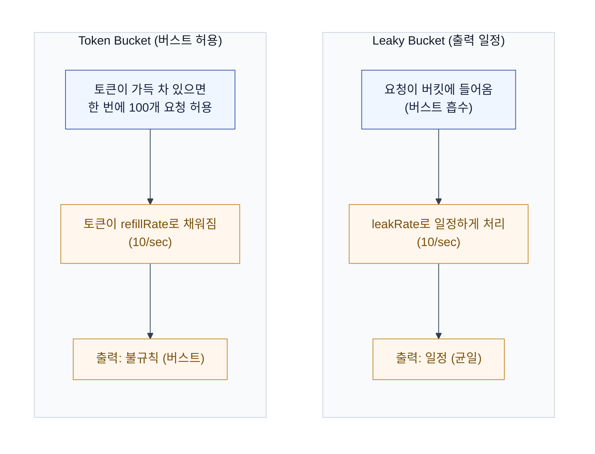
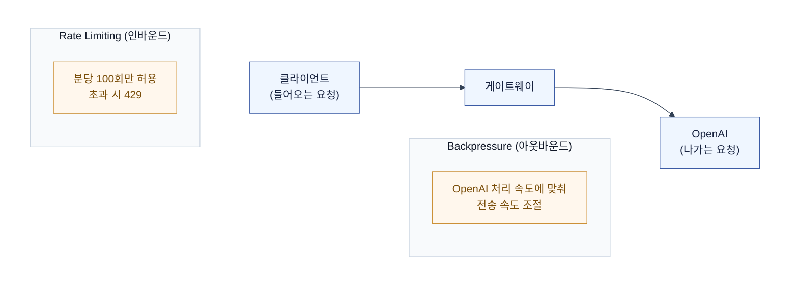

# Rate Limiting — 요청량 제어

API 게이트웨이에서 가장 많이 하는 일 중 하나가 "요청을 적당히 막는 것"이다. 트래픽 폭주, 악의적 공격, 다운스트림 보호 — 전부 레이트 리밋으로 시작한다.

## 1. 왜 필요한가

| 상황 | 없으면 | 있으면 |
|---|---|---|
| 트래픽 폭주 | 서버 다운, cascading failure | 초과분 거부, 서버 보호 |
| 악의적 공격 | 무한 요청으로 자원 고갈 | 제한 내 호출만 허용 |
| 다운스트림 보호 | OpenAI 등 외부 API quota 소진 | 분당 호출 수 제어 |
| 과금 보호 | 테넌트별 비용 무한 증가 | 예산/요청 한도로 제어 |
| 공정성 | 한 클라이언트가 자원 독점 | 클라이언트별 공정 분배 |

## 2. 알고리즘 — 5가지

| 알고리즘 | 원리 | 버스트 | 출력 속도 | 메모리 | 정확도 | 적합 |
|---|---|---|---|---|---|---|
| **Fixed Window** | 고정 시간 구간별 카운트 (Redis INCR + EXPIRE) | 허용 | 불규칙 | 낮음 | 낮음 | 단순 제한. 경계에서 2배 몰림 |
| **Sliding Window** | 이전 윈도우 가중치를 현재에 반영 | 완화 | 불규칙 | 낮음 | 중간 | 일반적. 경계 몰림 완화 |
| **Sliding Log** | 요청 타임스탬프를 ZSET에 전부 저장 | 허용 | 불규칙 | 높음 | 높음 | 정확하지만 고트래픽에서 비쌈 |
| **Token Bucket** | 토큰이 refillRate로 채워지고, 요청마다 1개 소모 | 허용 | 평균 제어 | 낮음 | 중간 | **API 게이트웨이 권장**. AWS, Stripe 사용 |
| **Leaky Bucket** | 요청이 버킷에 들어오고 leakRate로 일정하게 처리 | 흡수 | 일정 | 낮음 | 중간 | 백프레셔, 다운스트림 보호 |

### Token Bucket vs Leaky Bucket



## 3. 백프레셔 vs 레이트 리밋

둘은 목적이 다르다.



| | Rate Limiting | Backpressure |
|---|---|---|
| 목적 | 호출자 제한 (들어오는 양 제어) | 다운스트림 보호 (나가는 양 제어) |
| 방향 | 인바운드 | 아웃바운드 |
| 누가 결정 | API 제공자의 정책 | 다운스트림의 처리 능력 |
| 거부 방식 | 429 Too Many Requests | 큐잉, 지연, 또는 드랍 |
| 예시 | "분당 100회만 허용" | "OpenAI가 분당 50개만 처리 가능 → 그에 맞춰 속도 조절" |

### 백프레셔 시나리오

```
클라이언트 → 게이트웨이 → OpenAI
                    ↓
           OpenAI가 429 반환 (quota 초과)
                    ↓
           게이트웨이가 OpenAI로의 요청 속도를 낮춤
                    ↓
           클라이언트에는 429 또는 지연된 응답 반환
```

- **Push 방식** (게이트웨이 → OpenAI): 게이트웨이가 OpenAI 처리 속도에 맞춰 보내는 양을 조절. Leaky Bucket이 적합.
- **Pull 방식** (OpenAI → 게이트웨이): OpenAI가 처리할 수 있을 때만 가져가기. 큐 기반 (Kafka 등).
- Reactor의 `onBackpressureBuffer`, `onBackpressureDrop`, `onBackpressureLatest`도 같은 개념.

```kotlin
// Reactor — 백프레셔 처리
openAiTokenFlux
    .onBackpressureBuffer(100)  // 최대 100개까지 버퍼링
    .onBackpressureDrop()       // 버퍼 초과 시 드랍
    .onBackpressureLatest()     // 최신 것만 유지
```

### 게이트웨이에서의 실무 적용

| 상황 | 전략 |
|---|---|
| 테넌트별 요청 제한 | Token Bucket (Redis 기반, Bucket4j) |
| OpenAI 다운스트림 보호 | Leaky Bucket (출력 속도 고정) |
| OpenAI 429 수신 | Circuit Breaker + Retry-After 존중 |
| 스트리밍 토큰 속도 제어 | inter-token timeout (Timeout 문서 참조) |

## 4. 구현 — Redis 기반

### Token Bucket (Redis Lua)

원자성을 보장하려면 Lua 스크립트로 토큰 계산 + 갱신을 한 번에 해야 한다.

```kotlin
@Component
class RateLimiter(
    private val redisTemplate: StringRedisTemplate
) {
    private val script = """
        local key = KEYS[1]
        local capacity = tonumber(ARGV[1])
        local refillRate = tonumber(ARGV[2])
        local now = tonumber(ARGV[3])
        local requested = tonumber(ARGV[4])

        local bucket = redis.call('HMGET', key, 'tokens', 'lastRefill')
        local tokens = tonumber(bucket[1]) or capacity
        local lastRefill = tonumber(bucket[2]) or now

        local elapsed = now - lastRefill
        local refilled = math.min(capacity, tokens + (elapsed * refillRate))

        if refilled >= requested then
            refilled = refilled - requested
            redis.call('HMSET', key, 'tokens', refilled, 'lastRefill', now)
            redis.call('EXPIRE', key, 3600)
            return 1
        else
            redis.call('HMSET', key, 'tokens', refilled, 'lastRefill', now)
            redis.call('EXPIRE', key, 3600)
            return 0
        end
    """.trimIndent()

    fun isAllowed(key: String, capacity: Int, refillRate: Double): Boolean {
        val result = redisTemplate.execute(
            DefaultRedisScript(script, Long::class.java),
            listOf("rate:$key"),
            capacity.toString(),
            refillRate.toString(),
            System.currentTimeMillis().toString(),
            "1"
        )
        return result == 1L
    }
}
```

### 왜 Lua 스크립트인가

```kotlin
// 나쁜 예 — 두 명령 사이에 원자성 없음
val tokens = redis.get("rate:$key")   // 1. 읽기
val newTokens = tokens - 1             // 2. 계산
redis.set("rate:$key", newTokens)      // 3. 쓰기
// 1과 3 사이에 다른 요청이 끼어들면 토큰이 음수가 됨
```

- Redis는 싱글 스레드라 개별 명령은 원자적이지만, **여러 명령을 나눠서 쓰면 원자성이 깨짐**.
- Lua 스크립트는 Redis에서 원자적으로 실행됨 — 중간에 다른 명령이 끼어들 수 없음.
- **직접 구현하지 말고 검증된 라이브러리를 쓰는 게 정석**.

## 5. Bucket4j — 실무 표준

Spring 진영에서 가장 많이 쓰는 레이트 리밋 라이브러리. Token Bucket 알고리즘 기반.

### 로컬 (단일 인스턴스)

```kotlin
import io.github.bucket4j.Bandwidth
import io.github.bucket4j.Bucket
import io.github.bucket4j.Refill
import java.time.Duration

@Component
class RateLimiter {
    // 테넌트별 버킷
    private val buckets = ConcurrentHashMap<String, Bucket>()

    fun resolveBucket(tenantId: String): Bucket {
        return buckets.computeIfAbsent(tenantId) {
            Bucket.builder()
                .addLimit(
                    Bandwidth.classic(
                        100,  // capacity
                        Refill.intervally(100, Duration.ofMinutes(1))  // 분당 100개 채움
                    )
                )
                .build()
        }
    }

    fun isAllowed(tenantId: String): Boolean {
        return resolveBucket(tenantId).tryConsume(1)
    }
}
```

### 분산 (Redis 기반)

```kotlin
import io.github.bucket4j.distributed.redis.RedissonProxyManager
import io.github.bucket4j.distributed.proxy.ProxyManager
import org.redisson.api.RedissonClient

@Configuration
class RateLimiterConfig {
    @Bean
    fun proxyManager(redissonClient: RedissonClient): ProxyManager<String> {
        return RedissonProxyManager(redissonClient)
    }
}

@Component
class DistributedRateLimiter(
    private val proxyManager: ProxyManager<String>
) {
    fun isAllowed(tenantId: String): Boolean {
        val bucket = proxyManager.builder().build(
            "rate:$tenantId",
            { BucketConfiguration.builder()
                .addLimit(Bandwidth.classic(100, Refill.intervally(100, Duration.ofMinutes(1))))
                .build() }
        )
        return bucket.tryConsume(1)
    }
}
```

- 분산 환경에서는 Redisson + Bucket4j 조합이 사실상 표준.
- 로컬에서는 ConcurrentHashMap으로 관리하다가, 스케일 아웃하면 Redis 기반으로 전환.
- **Lettuce에는 락 구현이 없는 것처럼**, Bucket4j의 로컬 버킷도 분산 환경에서는 무력화 — 반드시 Redis 기반 ProxyManager를 써야 함.

## 6. HTTP 응답 — 429 + 헤더

레이트 리밋 초과 시 표준 응답:

```
HTTP/1.1 429 Too Many Requests
Retry-After: 30
X-RateLimit-Limit: 100
X-RateLimit-Remaining: 0
X-RateLimit-Reset: 1700000060
```

| 헤더 | 의미 |
|---|---|
| `Retry-After` | 재시도까지 대기 시간(초) — 클라이언트가 존중해야 함 |
| `X-RateLimit-Limit` | 테넌트의 총 한도 |
| `X-RateLimit-Remaining` | 남은 요청 수 |
| `X-RateLimit-Reset` | 한도 리셋 시각 (Unix timestamp) |

```kotlin
// Spring — 레이트 리밋 필터
@Component
class RateLimitFilter(
    private val rateLimiter: DistributedRateLimiter
) : OncePerRequestFilter() {
    override fun doFilterInternal(
        request: HttpServletRequest,
        response: HttpServletResponse,
        filterChain: FilterChain
    ) {
        val tenantId = extractTenantId(request)
        if (!rateLimiter.isAllowed(tenantId)) {
            response.status = 429
            response.setHeader("Retry-After", "60")
            response.setHeader("X-RateLimit-Limit", "100")
            response.setHeader("X-RateLimit-Remaining", "0")
            response.contentType = "application/json"
            response.writer.write("""{"error":"rate_limit_exceeded","message":"분당 100회를 초과했습니다"}""")
            return
        }
        filterChain.doFilter(request, response)
    }
}
```

## 7. 분산 환경에서의 함정

### 클럭 드리프트

- 인스턴스 N대의 시계가 미세하게 다름 → 토큰 계산 시각이 어긋날 수 있음.
- Redis의 `TIME` 명령을 기준으로 사용하면, 모든 인스턴스가 같은 시간을 볼 수 있음.

### Race Condition

- 두 인스턴스가 동시에 같은 키의 토큰을 소모 → 원자성 깨짐.
- Lua 스크립트 또는 Redisson 분산 락으로 해결.

### 핫 키

- 특정 테넌트의 키에 트래픽이 몰리면, Redis 단일 샤드가 병목.
- 키를 샤딩하거나, 로컬 캐시(1차) + Redis(2차) 다층 구성으로 분산.

## 8. 실무 체크리스트

| 항목 | 권장 |
|---|---|
| 알고리즘 | API 게이트웨이 → Token Bucket, 다운스트림 보호 → Leaky Bucket |
| 라이브러리 | Bucket4j (Redis 기반 ProxyManager) |
| 분산 | 반드시 Redis 기반. 로컬 버킷은 단일 인스턴스에서만 |
| 원자성 | Lua 스크립트 또는 검증된 라이브러리 사용. 직접 INCR + EXPIRE 금지 |
| 응답 | 429 + `Retry-After` + `X-RateLimit-*` 헤더 |
| 백프레셔 | 다운스트림 429 수신 시 Circuit Breaker + 속도 감속 |
| 버스트 | Token Bucket은 버스트 허용. 다운스트림이 버스트를 못 버티면 Leaky Bucket |
| 모니터링 | 거부율, 토큰 소진 시간, 429 응답 수 메트릭 |
| 키 설계 | 테넌트별 분리. IP 기반은 공유 IP(NAT)에서 부정확 |
| 로컬 + 분산 | Caffeine(1차, 짧은 TTL) + Redis(2차) 다층으로 Redis 부하 감소 |
