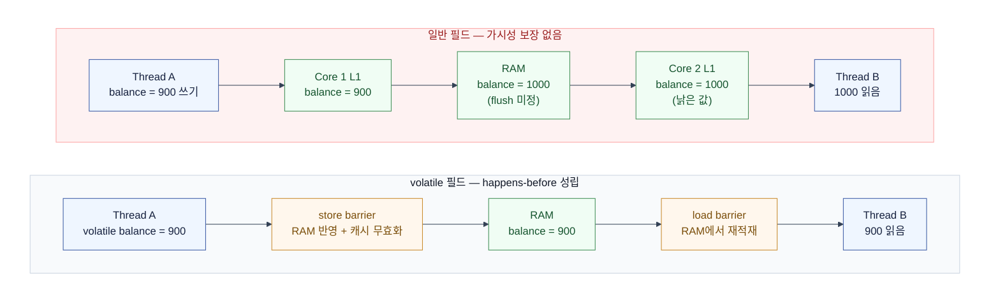
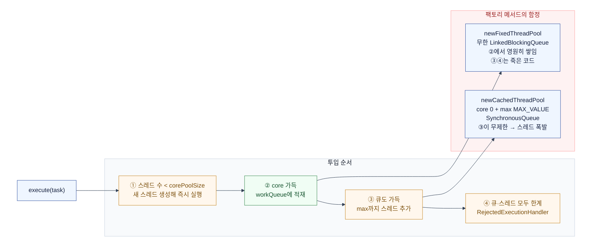

# Java Concurrency — JMM부터 CompletableFuture까지, virtual thread 시대의 JVM 동시성

> **이 문서의 범위와 출처**  
> Java 동시성 아티클 시리즈(JMM·synchronized·Lock·CAS·ThreadPoolExecutor·CompletableFuture·concurrent collections)의  
> **주제 구성만 차용**하고, 본문은 자체 서술했다. 원문은 유료 미리보기만 접근 가능해 인용·요약이 아니다.

이 문서는 **JVM 프로세스 안**의 동시성만 다룬다.  
DB 락·Redis 분산 락·요청량 제어·멱등성은 이미 별도 문서가 있으므로 경계를 명확히 나눈다.

| 주제 | 이 문서 | 기존 문서 |
|------|---------|-----------|
| 가시성·happens-before·volatile | ✅ | — |
| monitor 내부·lock 팽창 | ✅ | — |
| `ReentrantLock` / `ReadWriteLock` / `Condition` | ✅ | [race-condition](./2607-race-condition.md) 0단계에 개요 |
| CAS·`Atomic*`·`LongAdder`·ABA | ✅ (JVM 레벨) | [race-condition](./2607-race-condition.md) (DB 낙관적 락·조건부 UPDATE) |
| `ThreadPoolExecutor` | ✅ | [connection-pool](./2607-connection-pool.md) (Tomcat 요청 스레드) |
| `CompletableFuture` | ✅ | — |
| livelock·starvation | ✅ | — |
| deadlock (Coffman·탐지·타임아웃) | 진단 도구만 | [race-condition](./2607-race-condition.md) |
| concurrent collection **동시성 계약** | ✅ | — |
| concurrent collection **구현체 선택표** | — | [java-collections](./2607-java-collections.md) |
| rate limiting | — | [rate-limiting](./2607-rate-limiting.md) |
| 결제 멱등성 | — | [payment-ledger-design](./2608-payment-ledger-design.md) |

전제: JDK 21+ (virtual thread GA), Kotlin, Spring MVC.  
비동기 프레임워크(WebFlux) 없이 블로킹 코드 + virtual thread를 기본 스택으로 둔다.

---

## 1. JMM & volatile — 언제 보이는가

### 정의

Java Memory Model(JSR-133)은 **한 스레드가 쓴 값이 다른 스레드에 언제 보이는지**를 규정하는 명세다.  
"언제"가 명세로 필요한 이유는 하드웨어다.  
L1 캐시 접근은 ~1ns, RAM은 ~100ns — 100배 차이라 CPU는 코어별 로컬 사본으로 일한다.



동시성 버그는 세 갈래로 갈린다.  
**가시성**(쓴 값이 안 보임), **재정렬**(컴파일러·CPU가 순서를 바꿈), **원자성**(중간에 끼어듦).  
volatile은 앞의 둘을 해결하고, 세 번째는 해결하지 못한다.

### happens-before — 순서를 보장하는 규칙

"A happens-before B"이면 A의 모든 쓰기가 B에서 보인다.  
실무에서 기억할 규칙은 다섯 개다.

| 규칙 | 내용 |
|------|------|
| program order | 같은 스레드 안의 앞 문장 → 뒤 문장 |
| monitor lock | 같은 락의 unlock → 다음 lock |
| volatile | volatile 쓰기 → 이후의 volatile 읽기 |
| thread start | `Thread.start()` 호출 이전의 쓰기 → 새 스레드의 모든 코드 |
| thread join | 종료한 스레드의 모든 쓰기 → `join()` 반환 이후 |

전이성이 있다. A→B, B→C면 A→C다.  
`synchronized` 블록이 가시성까지 해결하는 이유가 두 번째 규칙이다.

### 언제 volatile을 쓰는가

| 상황 | volatile로 충분한가 |
|------|--------------------|
| 종료 플래그 (`@Volatile var running = false`) | ✅ 쓰기 1곳, 읽기 다수 |
| 캐시 무효화 세대 번호 (쓰기 후 통째로 교체) | ✅ 참조 교체는 원자적 |
| double-checked locking의 인스턴스 필드 | ✅ **필수** (없으면 부분 초기화 객체 노출) |
| 카운터 `count++` | ❌ read-modify-write는 원자적이지 않다 → `AtomicLong` |
| 잔액 검사 후 차감 | ❌ 불변식이 두 연산에 걸침 → 락 |

### 최소 예제

```kotlin
class ShutdownFlag {
    @Volatile
    private var running = true

    fun stop() { running = false }   // 쓰기 1곳

    fun loop() {
        while (running) {            // volatile 없으면 캐시된 true를 영원히 읽는다
            pollOnce()
        }
    }
}
```

`@Volatile`을 빼면 JIT가 루프 밖으로 필드 읽기를 끌어내(hoisting) 무한 루프가 된다.  
"운영에서 shutdown이 안 걸린다"는 버그의 전형이다.

---

## 2. synchronized & monitor — JVM이 락을 쥐는 방식

### 정의

모든 Java 객체는 **monitor** 하나를 갖는다.  
monitor는 소유자(owner) + 진입 대기 큐(entry set) + 조건 대기 큐(wait set)로 이뤄진다.  
`synchronized` 블록은 바이트코드 `monitorenter` / `monitorexit`로 컴파일된다.

락은 한 번에 뚱뚱해지지 않고 단계적으로 팽창한다.

| 단계 | 동작 | 비용 |
|------|------|------|
| thin lock | 객체 헤더(mark word)에 CAS로 소유자 기록. 경합 시 짧게 spin | 수십 ns |
| inflated monitor | OS 수준 monitor로 승격, 대기 스레드를 `park()` | 컨텍스트 스위치 (µs) |

biased locking은 JDK 15에서 기본 비활성·deprecated, JDK 18에서 제거됐다.  
따라서 "단일 스레드 재진입은 공짜"라는 옛 전제는 이제 성립하지 않는다.

재진입은 보장된다. 같은 스레드가 같은 monitor를 다시 잡으면 카운터만 올라간다.  
그래서 `synchronized` 메서드가 다른 `synchronized` 메서드를 호출해도 자기 자신과 데드락하지 않는다.

### 언제 쓰는가

- 임계 구역이 **짧고**, 조건 대기·타임아웃·취소가 필요 없을 때.
- 락 해제를 JVM에 맡기고 싶을 때 — `try/finally`를 잊을 위험이 없다.
- 락 안에서 **네트워크·DB 호출은 금지**. 락 보유 시간이 외부 지연에 묶인다.

virtual thread에서 `synchronized` 안에서 블로킹하면 캐리어 스레드 피닝이 발생한다.  
JDK 24(JEP 491)에서 해소됐으나 그 이전 런타임이면 `ReentrantLock`이 정석이다.  
자세한 내용은 [race-condition 문서](./2607-race-condition.md)에 있다.

### 최소 예제 — wait/notify의 필수 관용구

```kotlin
class Handoff<T> {
    private val lock = Object()
    private var value: T? = null

    fun put(v: T) = synchronized(lock) {
        value = v
        lock.notifyAll()          // monitor를 쥔 상태에서만 호출 가능
    }

    fun take(): T = synchronized(lock) {
        while (value == null) {    // if가 아니라 while — spurious wakeup 방어
            lock.wait()            // wait은 monitor를 놓고 잔다
        }
        val v = value!!
        value = null
        v
    }
}
```

`if (value == null) lock.wait()`로 쓰면 안 된다.  
`notifyAll`로 깨어난 여러 스레드 중 하나만 값을 가져가므로, 나머지는 조건을 다시 확인해야 한다.

---

## 3. ReentrantLock / ReadWriteLock / Condition — synchronized로 부족할 때

### 정의

`synchronized`가 못 하는 것을 API로 노출한 락이다.  
공통 제약: **해제를 코드가 책임진다.** `try/finally`가 아니면 락이 새어 나간다.

| 필요 | API | `synchronized`로 가능? |
|------|-----|----------------------|
| 즉시 실패 | `tryLock()` | ❌ |
| 최대 N초만 대기 | `tryLock(3, SECONDS)` | ❌ |
| 취소(인터럽트) 응답 | `lockInterruptibly()` | ❌ |
| 조건별 대기 집합 분리 | `newCondition()` 여러 개 | ❌ (wait set 하나) |
| 락 A 잡고 B 잡은 뒤 A 놓기 | 명시적 `unlock()` | ❌ (블록 구조에 묶임) |
| FIFO 순서 보장 | `ReentrantLock(true)` | ❌ |

`ReadWriteLock`은 읽기 다수 / 쓰기 배타다.  
읽기 비중이 압도적이고 임계 구역이 길 때만 이득이다.  
읽기가 끊이지 않으면 writer starvation이 생기므로 `ReentrantReadWriteLock(true)`로 공정 모드를 검토한다.

`StampedLock`은 낙관적 읽기(`tryOptimisticRead` → `validate`)로 더 빠르지만  
**재진입 불가**, `Condition` 미지원이라 쓰기 전에 제약을 확인해야 한다.

### livelock과 starvation — 예외를 던지지 않는 버그

deadlock은 멈추지만, 이 둘은 **돌면서 진행하지 않는다.**

| 증상 | 원인 | 해법 |
|------|------|------|
| livelock | 모두 `tryLock` 실패 → 롤백 → 동시에 재시도 → 무한 반복 | 재시도 간격에 랜덤 jitter, 시도 횟수 상한 |
| starvation | 비공정 락 + 불균형 부하. 특정 스레드가 계속 밀림 | 공정 모드, 작업 큐 분리(bulkhead) |
| starvation | 공용 풀을 긴 작업이 점유 | 작업 성격별 전용 풀 (5장) |

진단은 스레드 덤프로 한다.

```bash
jcmd <pid> Thread.print
```

- `BLOCKED (on object monitor)` 다수 + 같은 락 주소 → 락 경합.
- `Found one Java-level deadlock` → JVM이 직접 알려준다.
- 상태는 `RUNNABLE`인데 진행이 없고 CPU만 쓴다 → livelock 의심.

### 최소 예제 — Condition 두 개로 만드는 bounded buffer

```kotlin
class BoundedBuffer<T>(private val capacity: Int) {
    private val lock = ReentrantLock()
    private val notFull = lock.newCondition()
    private val notEmpty = lock.newCondition()
    private val items = ArrayDeque<T>()

    fun put(item: T) {
        lock.lock()
        try {
            while (items.size == capacity) notFull.await()
            items.addLast(item)
            notEmpty.signal()          // 소비자만 깨운다
        } finally {
            lock.unlock()
        }
    }

    fun take(): T {
        lock.lock()
        try {
            while (items.isEmpty()) notEmpty.await()
            val item = items.removeFirst()
            notFull.signal()           // 생산자만 깨운다
            return item
        } finally {
            lock.unlock()
        }
    }
}
```

`synchronized` + `notifyAll`이면 생산자·소비자가 뒤섞여 깨어난다(thundering herd).  
`Condition`을 둘로 나누면 필요한 쪽만 깨우므로 헛깨움이 사라진다.

> 실무에서 이 클래스를 직접 쓸 일은 없다. `ArrayBlockingQueue`가 정확히 이 구현이다.  
> 이 예제의 값은 "왜 `Condition`이 두 개 필요한가"를 보는 것이다.

---

## 4. Atomic & CAS — 락이 너무 비쌀 때

### 정의

`synchronized`의 대가는 **블로킹**이다.  
한 스레드가 monitor를 쥐면 나머지는 잠든다 — 고부하에서 컨텍스트 스위치가 병목이 된다.

CAS(Compare-And-Swap)는 락 없이 같은 일을 한다.  
"현재 값이 여전히 expected면 new로 바꿔라"를 CPU 명령 하나(`cmpxchg`)로 수행한다.  
실패하면 다시 읽고 재시도한다 — 잠들지 않고 진행하므로 lock-free다.

```kotlin
// AtomicLong.incrementAndGet()의 실체
do {
    val current = get()
} while (!compareAndSet(current, current + 1))
```

### 경합이 심하면 CAS도 답이 아니다

CAS는 실패할 때마다 루프를 돈다.  
스레드 32개가 같은 카운터를 때리면 대부분이 재시도만 반복하며 CPU를 태운다.

`LongAdder`는 값을 여러 셀로 쪼개(striping) 스레드별로 다른 셀을 갱신한다.  
대신 `sum()`은 셀을 순회한 결과라 **원자적 스냅샷이 아니다.**

| 용도 | 선택 |
|------|------|
| 읽기가 잦고 정확한 현재 값이 필요 | `AtomicLong` |
| 쓰기 폭주 + 읽기는 드묾 (지표·처리량 카운터) | `LongAdder` |
| 값 + 버전을 함께 비교해야 함 | `AtomicStampedReference` |
| 여러 필드의 불변식을 지켜야 함 | **락** (CAS로 불가) |

### ABA 문제

CAS는 "값이 같다"만 본다. A→B→A로 되돌아온 사이를 구분하지 못한다.  
스택 pop처럼 노드를 재사용하는 구조에서 실제 문제가 된다.  
`AtomicStampedReference`로 버전을 함께 비교하면 해결된다.

### 층위 구분 — JVM CAS vs DB 낙관적 락

이름은 같지만 다른 계층이다.

- **JVM CAS**: 한 프로세스의 메모리 워드. 나노초 단위, 실패 시 즉시 재시도.
- **DB 낙관적 락** (`UPDATE ... WHERE version = ?`): 여러 인스턴스가 공유하는 행. 실패는 트랜잭션 재시도.

스케일 아웃하면 JVM CAS는 **아무것도 보장하지 않는다.**  
인스턴스가 2대면 각자의 `AtomicLong`을 올릴 뿐이다.  
분산 환경의 원자적 갱신은 [race-condition 문서](./2607-race-condition.md)를 본다.

### 최소 예제

```kotlin
// 단일 변수 read-modify-write → atomic으로 충분
private val activeRequests = AtomicInteger()

fun tryAcquire(limit: Int): Boolean =
    activeRequests.updateAndGet { cur -> if (cur < limit) cur + 1 else cur } <= limit

// 처리량 지표 → 쓰기 폭주, 읽기는 스크레이핑 시점뿐
private val processed = LongAdder()
fun onDone() = processed.increment()
fun snapshot(): Long = processed.sum()
```

---

## 5. ThreadPoolExecutor — 팩토리 메서드를 쓰지 않는 이유

### 정의

`Executors.newFixedThreadPool(10)`은 편하지만 운영에서 위험하다.  
이유를 보려면 작업이 풀에 들어가는 순서를 알아야 한다.



핵심은 **큐가 스레드보다 먼저 찬다**는 점이다.  
큐가 무한하면 ③단계에 도달할 수 없어 `maximumPoolSize`가 장식이 된다.  
부하가 늘면 응답이 느려지는 대신 큐가 조용히 자라 heap을 먹는다.

### 거부 정책 — 넘칠 때 무엇을 하는가

| 정책 | 동작 | 언제 |
|------|------|------|
| `AbortPolicy` (기본) | `RejectedExecutionException` | 실패를 즉시 알려야 할 때 |
| `CallerRunsPolicy` | 호출 스레드가 직접 실행 | **백프레셔**. 제출 속도가 자연히 느려진다 |
| `DiscardPolicy` | 조용히 버림 | 지표·로그처럼 유실 허용 |
| `DiscardOldestPolicy` | 가장 오래된 작업을 버리고 넣음 | 최신 값만 의미 있을 때 |

결제·정산 경로에서 `Discard*`는 쓰지 않는다.  
유실이 허용되지 않는 작업은 애초에 큐가 아니라 DB(Outbox)에 넣는다.

### 사이징

| 작업 성격 | 크기 |
|-----------|------|
| CPU-bound | `코어 수 + 1` |
| IO-bound (virtual thread 없이) | `코어 수 × (1 + 대기시간/연산시간)` |

### virtual thread 시대에 풀이 남는 자리

virtual thread가 GA된 뒤 "IO 대기를 감추기 위한 스레드 풀"은 목적을 잃었다.  
`spring.threads.virtual.enabled=true`면 요청 스레드는 이미 virtual thread다.  
그럼에도 `ThreadPoolExecutor`는 두 용도로 남는다.

1. **CPU-bound 병렬 처리** — virtual thread는 CPU를 늘려주지 않는다. 코어 수만큼의 플랫폼 스레드 풀이 맞다.
2. **동시성 상한 = bulkhead** — 외부 API가 "동시 5개"를 요구하면 그 상한을 만드는 도구가 필요하다.  
   virtual thread는 무제한이라 상한을 만들지 못한다. 이때는 풀 대신 `Semaphore`도 답이다.

virtual thread는 **풀링하지 않는다.**  
`Executors.newVirtualThreadPerTaskExecutor()`는 풀이 아니라 작업당 스레드 생성기다.  
생성 비용이 거의 없으므로 재사용할 이유가 없다.

### 최소 예제

```kotlin
// CPU-bound 전용 풀. 큐를 bounded로 두고 백프레셔를 택한다.
@Bean
fun settlementExecutor(): ExecutorService {
    val cores = Runtime.getRuntime().availableProcessors()
    return ThreadPoolExecutor(
        cores, cores,                          // core = max, 고정
        0L, TimeUnit.MILLISECONDS,
        ArrayBlockingQueue(500),               // 무한 큐 금지
        Thread.ofPlatform().name("settle-", 0).factory(),  // 이름 필수
        ThreadPoolExecutor.CallerRunsPolicy(), // 넘치면 제출 측이 느려진다
    )
}
```

`threadFactory`로 이름을 붙이는 것은 취향이 아니다.  
스레드 덤프에 `pool-3-thread-7`만 남으면 어느 기능이 막혔는지 알 수 없다.

---

## 6. CompletableFuture — 부하에서 무너지지 않는 조합

### 정의

`CompletableFuture`는 "미래의 값 + 그 값에 이어 붙일 연산"이다.  
문제는 **어디서 실행되는가**다.

`supplyAsync(supplier)`처럼 executor를 생략하면 `ForkJoinPool.commonPool()`로 간다.  
commonPool의 병렬도는 `availableProcessors - 1` — 8코어 머신에서 7스레드다.  
JVM 전체가 공유하는 풀이므로, 여기서 HTTP 호출을 블로킹하면  
`parallelStream()`을 포함한 애플리케이션의 모든 async 작업이 그 뒤에 줄을 선다.

**규칙: `*Async` 계열은 executor 인자를 항상 명시한다.**

### 예외 처리 세 가지의 차이

| 메서드 | 예외를 소비? | 정상 값도 받음? | 용도 |
|--------|-------------|----------------|------|
| `exceptionally { }` | ✅ 대체 값 반환 | ❌ | 폴백 값 |
| `handle { v, e -> }` | ✅ | ✅ | 성공·실패 통합 변환 |
| `whenComplete { v, e -> }` | ❌ 그대로 전파 | ✅ | 로깅·정리 (부수 효과) |

`join()`은 `CompletionException`(unchecked)으로 감싸 던지고,  
`get()`은 `ExecutionException`·`InterruptedException`(checked)을 던진다.  
원인을 볼 때는 `cause`를 벗겨야 한다.

타임아웃은 `orTimeout(3, SECONDS)` 또는 `completeOnTimeout(fallback, 3, SECONDS)`로 건다.  
단, 이는 **future를 실패시킬 뿐 작업 자체를 취소하지 않는다.**  
HTTP 클라이언트의 read timeout을 따로 걸어야 실제 연결이 끊긴다.

### virtual thread 시대의 위치

fan-out 3개를 호출해 합치는 코드를 두 방식으로 쓰면 차이가 드러난다.

```kotlin
// (A) CompletableFuture — executor 명시 필수
val a = CompletableFuture.supplyAsync({ pricing.quote(id) }, ioExecutor)
val b = CompletableFuture.supplyAsync({ risk.score(id) }, ioExecutor)
CompletableFuture.allOf(a, b).join()
val result = merge(a.join(), b.join())

// (B) virtual thread — 블로킹 코드 그대로, 스택 트레이스가 온전하다
Executors.newVirtualThreadPerTaskExecutor().use { ex ->
    val fa = ex.submit<Quote> { pricing.quote(id) }
    val fb = ex.submit<Score> { risk.score(id) }
    val result = merge(fa.get(), fb.get())   // VT에선 get() 블로킹이 죄가 아니다
}
```

(B)가 읽기 쉽고 디버깅이 쉽다. 예외가 호출 스택에 그대로 남는다.  
그럼에도 `CompletableFuture`가 남는 자리는 세 곳이다.

- 라이브러리가 이미 `CompletableFuture`를 반환할 때 (`java.net.http.HttpClient` 등).
- 콜백 API를 future로 감쌀 때 (`complete()` / `completeExceptionally()` 브리지).
- 값이 준비되기 전에 소비자에게 핸들을 넘겨야 할 때.

**새 코드에서 IO 팬아웃을 짜려고 `CompletableFuture`를 꺼내지 않는다.**  
구조적 동시성(`StructuredTaskScope`)은 아직 preview이므로, 지금은 (B)가 기본형이다.

---

## 7. Concurrent Collections — 동시성 계약 읽기

구현체 선택표는 [java-collections 문서](./2607-java-collections.md)에 있다.  
여기서는 그 문서에 없는 **계약**을 본다. 스레드 안전이 무엇을 보장하지 않는가.

### `HashMap`을 공유하면 무슨 일이 나는가

- Java 7까지: resize 중 링크가 순환하며 **무한 루프** — CPU 100%로 고착.
- Java 8+: 무한 루프는 사라졌지만 항목 유실·`null` 반환이 남는다.
- 순회 중 수정: `ConcurrentModificationException` (fail-fast, 감지 보장은 없음).

### `ConcurrentHashMap`의 세 가지 함정

**① `size()`는 근사치다.**  
동시 갱신 중에는 정확한 값이 아니다. 정확한 카운트가 필요하면 애초에 맵으로 세지 않는다.

**② 개별 연산은 원자적이지만 조합은 아니다.**

```kotlin
// ❌ get과 put 사이에 다른 스레드가 끼어든다
if (!map.containsKey(k)) map.put(k, v)

// ✅ 원자적 단일 연산
map.putIfAbsent(k, v)
map.computeIfAbsent(k) { loadFrom(db) }
map.merge(k, 1L, Long::sum)
```

**③ `computeIfAbsent`의 매핑 함수 안에서 같은 맵을 건드리면 안 된다.**  
해당 bin의 락을 쥔 상태로 호출되므로 재귀 접근은 `IllegalStateException("Recursive update")` 또는 교착이다.  
매핑 함수는 짧고 순수하게 유지한다. 그 안에서 DB·HTTP 호출은 락 보유 시간을 외부 지연에 묶는다.

반복자는 **weakly consistent**다. 순회 시작 이후의 변경이 보일 수도, 안 보일 수도 있다.  
대신 `ConcurrentModificationException`은 던지지 않는다.

### 나머지 계약 요약

| 컬렉션 | 계약 | 주의 |
|--------|------|------|
| `CopyOnWriteArrayList` | 쓰기마다 배열 전체 복사, 읽기 무락 | 반복자는 스냅샷 — 최신 값 아님. 쓰기 O(n) |
| `ArrayBlockingQueue` | bounded, 단일 락 | 크기 고정. 백프레셔 만들기에 적합 |
| `LinkedBlockingQueue` | 기본 **무제한**, put/take 이중 락 | 기본값 그대로 쓰면 OOM 경로 (5장) |
| `SynchronousQueue` | 용량 0, 직접 핸드오프 | 소비자가 없으면 제출이 막힌다 |
| `ConcurrentSkipListMap` | 정렬 유지 + 동시성, 무락 | `O(log n)`. `TreeMap`+락보다 경합에 강함 |
| `Collections.synchronizedMap` | 모든 메서드에 단일 락 | 복합 연산 원자성 없음. 순회는 직접 동기화 |

`Collections.synchronizedMap`은 "스레드 안전"이지만 경합에선 `ConcurrentHashMap`에 밀린다.  
전체 락이라 코어를 늘려도 처리량이 늘지 않는다.

---

## 8. 선택 가이드

| 상황 | 선택 |
|------|------|
| 플래그 하나를 스레드 간 전파 | `@Volatile` |
| 단일 변수 read-modify-write | `AtomicInteger` / `AtomicLong` |
| 쓰기 폭주 카운터 | `LongAdder` |
| 짧은 임계 구역, 조건 대기 없음 | `synchronized` |
| 타임아웃·취소·조건 분리 필요 | `ReentrantLock` (+ `Condition`) |
| 읽기 압도적 + 긴 임계 구역 | `ReentrantReadWriteLock` |
| 여러 필드의 불변식 | 락 (CAS 불가) |
| IO 팬아웃 | virtual thread + `Future.get()` |
| CPU-bound 병렬 처리 | 고정 크기 `ThreadPoolExecutor` |
| 외부 API 동시 호출 상한 | `Semaphore` 또는 bounded 풀 |
| 여러 인스턴스 간 상호배제 | JVM 락 아님 → [분산 락](./2607-race-condition.md) |

## 9. 실무 체크리스트

- `Executors.newFixedThreadPool` / `newCachedThreadPool`을 쓰지 않는다. 큐를 bounded로 명시한다.
- `*Async` 호출에 executor 인자가 빠진 곳이 없는지 grep한다 — commonPool 오염.
- 모든 스레드 풀에 `threadFactory` 이름을 붙인다. 덤프 가독성이 장애 대응 시간을 정한다.
- 락 안에서 DB·HTTP 호출을 하지 않는다.
- `wait` / `await`는 항상 `while` 루프 안에서 조건을 재확인한다.
- `ReentrantLock`의 `unlock()`은 반드시 `finally`에 둔다.
- `containsKey` → `put` 패턴을 `putIfAbsent` / `computeIfAbsent`로 바꾼다.
- 스케일 아웃 계획이 있다면, JVM 락으로 지키던 불변식을 DB 제약으로 옮긴다.
- 지표에 `activeCount`, `queue.size()`, 거부 횟수를 노출한다. 큐 길이는 조용히 자란다.
