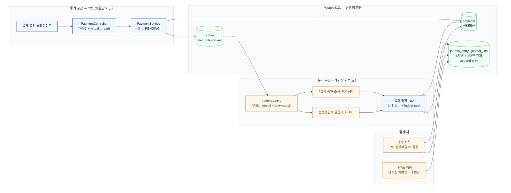

# 결제·정산 시스템 설계 — 복식부기 원장

결제·정산 도메인에서 가장 중요한 두 가지는 **금액의 정확성**과  
**외부 시스템(PG·충전사업자) 연동의 장애 안전성**이다.  
이 설계의 핵심은 **복식부기(double-entry bookkeeping)** 를 은유가 아니라  
DB 제약으로 강제하는 불변량 메커니즘으로 쓰는 것이다.

모든 금액 변화는 append-only 복식분개로만 기록되고,  
원장(ledger)이 유일한 신뢰의 원천(source of truth)이 된다.

## 핵심 원칙 세 가지

| 원칙 | 의미 | 왜 |
|---|---|---|
| **복식부기 원장 = 신뢰 원천** | 모든 돈의 이동을 차변(debit)·대변(credit) 엔트리 쌍으로만 기록. 잔액 테이블은 projection | 단일 금액 컬럼 변경은 오류가 숨지만, 차대 쌍은 한쪽만 들어가면 시산표가 깨져 즉시 탐지 |
| **외부 호출은 트랜잭션 밖** | DB 트랜잭션 안에서 PG·충전사업자 HTTP 호출 금지. Transactional Outbox로 분리 | 외부 지연이 DB 커넥션을 점유하고, 커밋 후 호출 실패 시 부분 커밋이 남아 정합성이 깨짐 |
| **정정은 역분개로만** | 성공한 분개는 UPDATE·DELETE 불가. 취소·오발급은 원거래를 뒤집은 새 분개(reversal)로 기록 | append-only 원장은 감사 추적 가능하고, 우연히 과거를 바꿔 시산표를 망가뜨리지 않음 |

## 아키텍처 전체



## 1. 핵심 도메인 모델 — 계정과목 차트(CoA)와 분개

복식부기는 5대 계정 유형(자산·부채·자본·수익·비용) 중  
이 도메인에 필요한 것만 사용한다. 사용자 잔액도 "고객 예수금"이라는 **부채 계정**으로 표현한다.

| 계정 | 유형 | 의미 |
|---|---|---|
| `CASH_PG_RECEIVABLE` | 자산 | PG로부터 받을 돈(승인됐지만 미정산) |
| `CASH_BANK` | 자산 | 정산 입금된 은행 예치금 |
| `ISSUER_RECEIVABLE` | 자산 | 충전사업자에 대한 채권 |
| `USER_PREPAID_LIABILITY` | 부채 | 사용자 선불충전금/포인트 잔액(우리가 갚을 돈) |
| `MERCHANT_PAYABLE` | 부채 | 가맹점에 지급할 돈 |
| `FEE_REVENUE` | 수익 | 결제/충전 수수료 |
| `ROUNDING_DIFF` | 부채/자산 | 반올림 끝수 (오차를 숨기지 않고 드러냄) |
| `RECONCILIATION_SUSPENSE` | 자산/부채 | 조사 중인 대사 차이 |

대표 분개 패턴:

| 사건 | 차변(debit) | 대변(credit) |
|---|---|---|
| PG 결제 승인 | `CASH_PG_RECEIVABLE` | `MERCHANT_PAYABLE` |
| PG 정산 (총 10,000, 수수료 300, 실입금 9,700) | `CASH_BANK` 9,700 + `FEE_REVENUE` 300 | `CASH_PG_RECEIVABLE` 10,000 |
| 포인트 충전 | `ISSUER_RECEIVABLE` | `USER_PREPAID_LIABILITY` |
| 포인트 사용 | `USER_PREPAID_LIABILITY` | `MERCHANT_PAYABLE` |
| 환불·취소 | 원거래 대변 계정 | 원거래 차변 계정 (역분개) |

```sql
CREATE TABLE journal_entry (
  id            BIGSERIAL PRIMARY KEY,
  entry_type    TEXT NOT NULL,          -- CHARGE, PAYMENT, SETTLEMENT, REVERSAL, ADJUSTMENT
  reversal_of   BIGINT REFERENCES journal_entry(id),  -- 역분개 대상
  source_ref    TEXT NOT NULL,          -- payment_id 등 업무 식별자
  business_event_id TEXT NOT NULL,      -- 멱등성
  currency      CHAR(3) NOT NULL DEFAULT 'KRW',
  status        TEXT NOT NULL,          -- PENDING, POSTED
  created_at    TIMESTAMPTZ NOT NULL DEFAULT now()
);

CREATE TABLE journal_line (
  id         BIGSERIAL PRIMARY KEY,
  entry_id   BIGINT NOT NULL REFERENCES journal_entry(id),
  account_id BIGINT NOT NULL REFERENCES account(id),
  direction  TEXT NOT NULL CHECK (direction IN ('DEBIT','CREDIT')),
  amount     BIGINT NOT NULL CHECK (amount > 0)   -- 원 단위 정수 (부동소수점 금지)
);

-- 멱등성: 같은 업무 사건은 한 번만 분개
CREATE UNIQUE INDEX uq_business_event
  ON journal_entry(business_event_id, entry_type);

-- 역분개도 한 번만
CREATE UNIQUE INDEX uq_reversal
  ON journal_entry(reversal_of)
  WHERE reversal_of IS NOT NULL;
```

> **금액은 정수(원 단위)로 저장한다.**  
> `double`/`float`는 반올림 오차를 만들어 복식부기의 정확성을 무너뜨린다.  
> 수수료율 계산 등에서 발생하는 끝수는 `ROUNDING_DIFF` 계정에 명시적으로 분개해  
> 오차를 숨기지 않고 계정으로 드러낸다 — 이것이 복식부기 방식이다.

## 2. 복식부기 불변량 강제 — DB + 앱 이중 방어

복식부기의 핵심 불변량: **모든 분개에서 `Σ차변 = Σ대변`**.  
이것을 애플리케이션 검증만에 맡기면 버그가 통과할 수 있다.  
DB 수준에서 물리적으로 강제해야 한다.

### 문제: 일반 CHECK 제약으로는 안 됨

행 단위 `CHECK`는 같은 `entry_id`의 **여러 행 합계**를 검증할 수 없다.  
엔트리를 3개 INSERT하는 동안 중간 상태는 불균형일 수밖에 없다.

### 해결: 게시 함수 단일화 + DEFERRABLE constraint trigger

**(1) 쓰기 권한 단일화** — 앱 역할에 직접 INSERT/UPDATE/DELETE 권한을 주지 않는다.  
`post_journal_transaction(...)` 저장 함수만 장부 쓰기 권한을 갖는다.

```sql
-- 커밋 시점에 분개 단위 균형 검증 (DEFERRABLE: 중간 상태 허용, 커밋 순간 검사)
CREATE OR REPLACE FUNCTION assert_entry_balanced() RETURNS trigger AS $$
BEGIN
  IF (SELECT COALESCE(SUM(CASE direction WHEN 'DEBIT' THEN amount ELSE -amount END), 0)
      FROM journal_line WHERE entry_id = NEW.entry_id) <> 0 THEN
    RAISE EXCEPTION 'unbalanced entry %', NEW.entry_id;
  END IF;
  RETURN NULL;
END $$ LANGUAGE plpgsql;

CREATE CONSTRAINT TRIGGER trg_entry_balanced
  AFTER INSERT ON journal_line
  DEFERRABLE INITIALLY DEFERRED
  FOR EACH ROW EXECUTE FUNCTION assert_entry_balanced();

-- append-only: 원장은 수정·삭제 불가, 정정은 역분개로만
REVOKE UPDATE, DELETE ON journal_entry, journal_line FROM app_role;
```

```sql
-- 게시 함수: 권한 단일화 + 균형 검증 + 상태 전이를 한 트랜잭션에서
CREATE FUNCTION post_journal_transaction(
  p_entry_type TEXT, p_source_ref TEXT, p_business_event_id TEXT,
  p_lines journal_line[]  -- (account_id, direction, amount) 튜플 배열
) RETURNS BIGINT AS $$
DECLARE v_id BIGINT;
BEGIN
  INSERT INTO journal_entry(entry_type, source_ref, business_event_id, status)
  VALUES (p_entry_type, p_source_ref, p_business_event_id, 'POSTED')
  RETURNING id INTO v_id;

  INSERT INTO journal_line(entry_id, account_id, direction, amount)
  SELECT v_id, l.account_id, l.direction, l.amount FROM unnest(p_lines) l;

  -- 균형 검증 (trigger가 커밋 시점에도 검증하지만, 함수 내에서 빠른 실패)
  IF (SELECT SUM(CASE direction WHEN 'DEBIT' THEN amount ELSE -amount END)
      FROM journal_line WHERE entry_id = v_id) <> 0 THEN
    RAISE EXCEPTION 'unbalanced';
  END IF;

  RETURN v_id;
END $$ LANGUAGE plpgsql;
```

**(2) 애플리케이션 이중 검증** — 게시 전에 같은 불변량을 먼저 검사해  
DB 예외까지 가기 전에 빠르게 실패한다.

```kotlin
data class Line(val accountId: Long, val direction: Direction, val amount: Long)

@Transactional
fun post(type: EntryType, sourceRef: String, lines: List<Line>): Long {
    require(lines.all { it.amount > 0 })
    val debit = lines.filter { it.direction == DEBIT }.sumOf { it.amount }
    val credit = lines.filter { it.direction == CREDIT }.sumOf { it.amount }
    require(debit == credit) { "unbalanced: $debit != $credit" }
    return journalRepository.postViaFunction(type, sourceRef, lines)
}
```

정정은 `reverse(entryId)` 하나만 열어둔다:  
원 분개의 차·대변을 뒤집은 새 분개를 만들고 `reversal_of`로 연결한다.

## 3. 외부 연동 안전 분리 — Outbox + 상태머신 + idempotency

외부 시스템과는 2PC(분산 트랜잭션)가 불가능하므로 **최종 일관성**만 가능하다.  
4중 방어가 각각 다른 실패 모드를 커버한다.

### 트랜잭션 경계 — TX1 / 외부 / TX2

```mermaid
---
config:
  theme: base
  darkMode: false
  look: classic
  themeVariables:
    background: "#ffffff"
    primaryColor: "#ffffff"
    primaryTextColor: "#111827"
    primaryBorderColor: "#475569"
    lineColor: "#334155"
    edgeLabelBackground: "#ffffff"
---
flowchart LR
  subgraph canvas[" "]
    direction LR

    subgraph tx1["TX1 — 로컬만, 빠른 커밋"]
      direction TB
      p1["payment 생성\n상태 PENDING"]:::app
      o1["outbox row 삽입\n(idempotency key)"]:::db
      p1 --> o1
    end

    subgraph ext["외부 호출 (TX 밖, 블로킹)"]
      direction TB
      poll["Outbox Relay\nvirtual thread"]:::ctrl
      apiCall["PG/충전사업자 API\nIdempotency-Key 헤더"]:::ctrl
      poll --> apiCall
    end

    subgraph tx2["TX2 — 결과 확정"]
      direction TB
      p2["상태 전이\n(APPROVED / DECLINED)"]:::app
      l2["ledger post\n(성공 시에만)"]:::db
      p2 --> l2
    end

    o1 --> poll
    apiCall --> p2
  end

  classDef app fill:#EFF6FF,stroke:#3B5BA5,stroke-width:1px,color:#16213E
  classDef db fill:#F0FDF4,stroke:#3F8E55,stroke-width:1px,color:#14532D
  classDef ctrl fill:#FFF7ED,stroke:#C98A2B,stroke-width:1px,color:#7A4E0A
  style canvas fill:#ffffff,stroke:#ffffff,stroke-width:0px,color:#111827
  style tx1 fill:#F8FAFC,stroke:#CBD5E1,stroke-width:1px,color:#111827
  style ext fill:#FEF2F2,stroke:#FCA5A5,stroke-width:1px,color:#991B1B
  style tx2 fill:#F8FAFC,stroke:#CBD5E1,stroke-width:1px,color:#111827
```



- **TX1 (로컬만)**: `payment` row 생성(상태 `PENDING`) + `outbox` row 삽입. 외부 호출 없음 → 빠른 커밋.
- **외부 호출 (TX 밖)**: Outbox relay가 virtual thread에서 블로킹 HTTP로 호출.  
  헤더에 `Idempotency-Key: payment-{id}-approve` 부착 → 재시도해도 중복 승인 안 됨.
- **TX2 (결과 확정)**: 응답에 따라 상태 전이 + 성공 시에만 `LedgerService.post()`.  
  원장에는 **확정된 돈만** 기록된다.

> 외부 호출 중에는 DB 트랜잭션과 커넥션을 보유하지 않는다.  
> virtual thread는 스레드 수 제한이 사라지지만, DB 커넥션 풀이 새 병목이 되므로  
> TX1/TX2 분리 구조가 여기서도 이득이다.

### 상태머신 — 타임아웃은 실패가 아니다

```
PENDING → APPROVAL_SENT → APPROVED → SETTLED
                        ↘ DECLINED
          APPROVAL_SENT → UNKNOWN (타임아웃) → 조회 API로 APPROVED/DECLINED 확정
APPROVED → REVERSING → REVERSED (보상: 원장에 역분개 기록)
```

**핵심 규칙 두 가지:**

1. **타임아웃은 실패가 아니라 `UNKNOWN`이다.**  
   PG가 승인했는데 응답만 유실했을 수 있다. 무조건 재시도하면 **이중 승인**이 발생한다.  
   먼저 **조회 API**로 결과를 확인한 뒤 확정한다.

2. **외부 시스템 2개가 얽히는 흐름(결제 승인 + 포인트 발급)은 saga로 푼다.**  
   앞 단계 성공 후 뒤 단계가 최종 실패하면, 앞 단계를 취소 API + 역분개로 보상한다.

### idempotency key

외부 요청의 멱등키는 내부 시도 ID에서 결정적으로 생성한다.  
`(provider, operation, idempotency_key)`에 UNIQUE 제약을 둬  
외부 실행과 장부 분개의 중복을 각각 방지한다.

```
UNKNOWN 상태에서는 동일 멱등키로 재호출하기 전에
외부 거래 조회 API를 우선 호출한다.
조회 API가 없으면 동일 멱등키 재시도.
충전사업자가 멱등성·조회 둘 다 지원 안 하면
자동 재시도를 제한하고 수동 복구 큐로 보낸다.
```

## 4. 정산·대사 흐름 — 원장이 신뢰의 원천

PG·충전사업자는 정산/대사 파일을 주기적(일/월)으로 제공한다.  
이를 내부 원장과 매칭해 불일치를 탐지·해소한다.

### 대사 4분류

```
MATCHED          — 내부·외부 일치 → 정산 확정 분개
EXTERNAL_ONLY   — 외부에만 있음 → 내부 유실(TX2 실패 등) → 누락 분개 보정
INTERNAL_ONLY   — 내부에만 있음 → UNKNOWN 미해소 또는 외부 실패 → 역분개/이월
AMOUNT_MISMATCH — 금액 불일치 → 원인 확정 후 조정 분개 (자동 수정 X)
```

`AMOUNT_MISMATCH`는 자동으로 기존 장부를 수정하지 않는다.  
원인 확정 후 수수료 조정·역분개 또는 승인된 `RECONCILIATION_SUSPENSE` 분개를  
**새 거래로** 게시한다.

### 일일 자가 검증 (시산표)

매일 다음 검증을 수행한다. 복식부기 덕에 어디선가 한쪽만 기록되는 버그가 있으면  
시산표 검사가 반드시 걸러낸다.

```
전체 및 통화별 차변 합계 = 대변 합계
장부상 PG 채권 = PG 미정산 승인 잔액
장부상 충전사업자 채권 = 사업자 원장 잔액
은행 실입금 = PG 정산 순액
```

## 5. Spring MVC + virtual threads 구현 관점

- `spring.threads.virtual.enabled=true` — 요청 스레드·`@Scheduled` 모두 virtual thread.  
  PG 호출은 `RestClient`(블로킹)로 그냥 쓴다. WebFlux 불필요: 블로킹 HTTP 대기가  
  platform thread를 점유하지 않는다.
- Outbox relay는 `@Scheduled` 폴러가 `FOR UPDATE SKIP LOCKED`로 배치를 집어  
  virtual thread executor에 건별 제출. 다중 인스턴스에서도 안전.
- 시그니처는 전부 `fun` + 블로킹 반환. `suspend`/`Flow` 사용 안 함.
- 공급자별 semaphore/bulkhead, connect/read timeout, 제한된 재시도,  
  circuit breaker를 둔다. virtual thread는 동시성 비용을 낮출 뿐  
  외부 시스템 용량을 늘리지는 않는다.

```kotlin
@Scheduled(fixedDelay = 1000)
fun relayOutbox() {
    val batch = outboxRepository.pollUnsent(limit = 100)  // FOR UPDATE SKIP LOCKED
    batch.forEach { msg -> vtExecutor.submit { processOne(msg) } }
}

fun processOne(msg: OutboxMessage) {
    val res = try {
        pgClient.approve(msg.payload, idempotencyKey = msg.idemKey)  // 블로킹, TX 밖
    } catch (e: SocketTimeoutException) {
        paymentService.markUnknown(msg.paymentId); return  // 조회 배치가 후속 처리
    }
    paymentService.confirm(msg.paymentId, res)  // TX2: 상태 전이 + ledger post
}
```

## 실패 모드와 방어 요약

| 실패 모드 | 방어 기제 | 근거 |
|---|---|---|
| 분개 차대 불일치 (코드 버그) | 게시 함수 + DEFERRABLE constraint trigger | C1: DB가 물리적으로 거부 |
| 외부 호출 지연이 DB 커넥션 점유 | Outbox로 TX1/TX2 분리 | C2: 외부 호출은 TX 밖 |
| 타임아웃 후 이중 승인 | UNKNOWN 상태 + 조회 API 우선 | E3: 타임아웃 ≠ 실패 |
| 재시도로 중복 처리 | idempotency key UNIQUE 제약 | E3: 중복 방지 |
| 환불·오발급 회수 | 역분개 (원장 수정 X) | C3: append-only 보존 |
| 원장과 현실 불일치 | 일 배치 대사 + 시산표 검증 | C6/E4: 주기적 탐지 |
| 반올림 오차 누적 | `ROUNDING_DIFF` 계정 명시 분개 | C5: 오차를 숨기지 않음 |

## 남은 리스크

**대사 주기보다 긴 장애는 미탐지 구간을 만든다.**  
UNKNOWN 상태 건의 조회 API가 외부 시스템에 없거나 신뢰 불가하면,  
대사 배치 전까지 최대 1일 미확정 구간이 생긴다.  
따라서 충전사업자 연동 프로토콜 확정 시  
**"결과 조회 API 존재 여부"** 를 최우선 확인 항목으로 둔다.
```
