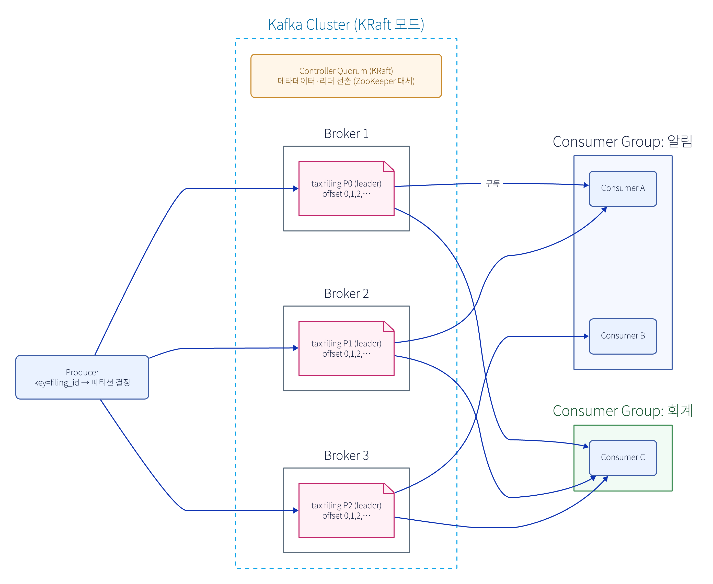
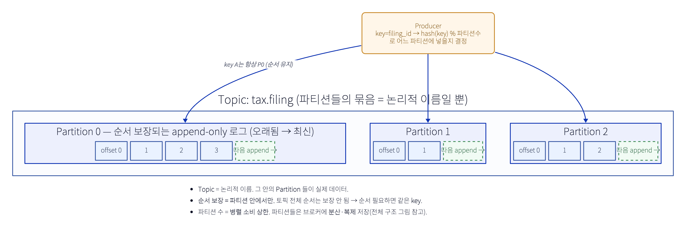
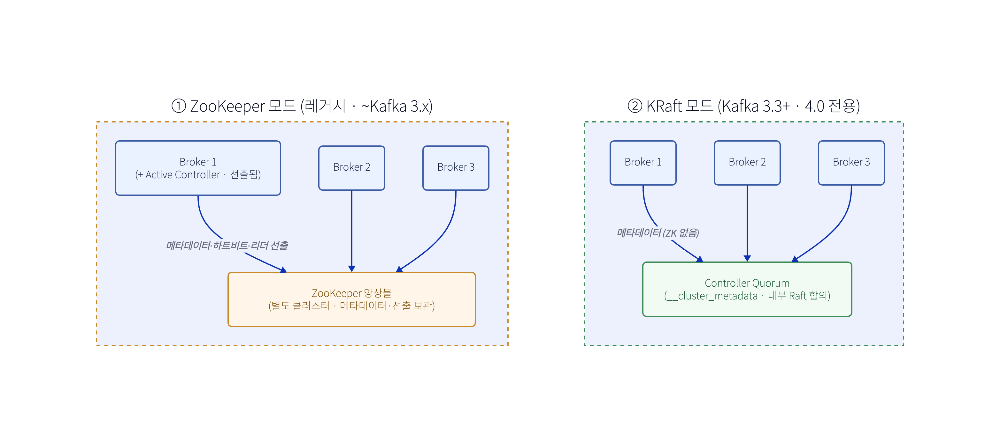

# Kafka 구조 정리

분산 **이벤트 로그**다. 메시지를 큐처럼 소비하고 버리는 게 아니라, **append-only 로그**에 쌓아두고(보관기간 동안) 여러 소비자가 각자 위치(offset)에서 읽는다.

## 핵심 용어

| 용어 | 뜻 |
|---|---|
| **Broker** | Kafka 서버 1대. 여러 broker = **Cluster**. 파티션을 나눠 보관·서빙. |
| **Topic** | 메시지 카테고리(이름). 논리적 스트림. 예: `tax.filing`. |
| **Partition** | 토픽을 쪼갠 단위 = **실제 append-only 로그**. **병렬성 + 순서**의 단위. |
| **Offset** | 파티션 내 메시지의 순번(위치). 컨슈머는 "어디까지 읽었나"를 offset으로 기억. |
| **Producer** | 발행자. 레코드의 **key**로 어느 파티션에 넣을지 결정(`hash(key) % partitions`). |
| **Consumer / Consumer Group** | 구독자. **그룹** 단위로 파티션을 나눠 읽음. |
| **Replication** | 파티션을 여러 broker에 복제(leader 1 + follower N, **ISR**). 내구성·HA. |
| **Record** | key · value · headers · timestamp. |

## 1. 파티션 = 순서와 병렬성의 단위

- **Topic = 논리적 이름**(파티션들의 묶음). **Partition = 실제 데이터** = 순서 보장되는 **append-only 로그**(offset 0,1,2…).
- **순서는 "파티션 안에서만" 보장**된다. 토픽 전체 순서는 보장 안 됨.
- 파티션 수 = **최대 병렬 소비자 수**. (한 파티션은 그룹 내 한 컨슈머만 읽음) → **순서(파티션↓) vs 병렬성(파티션↑)** 트레이드오프.

## 2. 순서 보장(ordering) — 어떻게 깨지고 어떻게 지키나

카프카 설계의 핵심. **순서 단위는 파티션**이고, 그걸 지키려면 발행·파티션·소비 3군데를 다 봐야 한다.

**(1) key 라우팅 — 순서 단위 정하기**
- `hash(key) % 파티션수` 로 파티션 결정 → **같은 key = 같은 파티션 = 순서 보장**. key 없으면 라운드로빈이라 순서 X.
- **무엇을 key로?** = "무엇 단위로 순서를 지킬까". 예: `key=filing_id` → 한 신고의 사건들(`Submitted→Accepted`)이 순서대로. (서로 다른 신고끼리는 순서 무관)

**(2) 프로듀서 함정 — 재시도 순서 역전**
- `max.in.flight.requests.per.connection > 1` + 재시도면, 앞 메시지가 실패·재전송되는 사이 **뒤 메시지가 먼저** 들어가 순서가 뒤집힐 수 있음.
- **해결: `enable.idempotence=true`** (현대 기본 권장). 시퀀스 번호로 브로커가 **정렬 + 중복 제거** → in-flight 5까지도 순서·정확히 한 번 보장. (옛날엔 `max.in.flight=1`로 낮췄지만 처리량 손해)

**(3) 파티션 수 변경 함정**
- 파티션을 **늘리면** `% N`의 N이 바뀜 → 같은 key가 **다른 파티션**으로 감 → 과거·신규가 흩어져 **순서 보장 깨짐**.
- 순서 민감하면 **파티션 수를 처음부터 넉넉히 + 고정**. (늘릴 거면 순서 끊김 감수)

**(4) 컨슈머 함정 — 병렬 처리**
- 파티션 내 순서로 **받아도**, 컨슈머가 멀티스레드/비동기로 처리하면 **처리 순서가 깨짐**.
- 파티션 단위로 **순차 처리**, 또는 key별 직렬화 큐로 처리 순서 보존.

**(5) DLT vs 순서 트레이드오프**
- 실패 메시지를 **DLT로 보내고 다음으로 진행**하면 그 key의 순서가 어긋남.
- 순서 엄격: "실패 시 그 파티션 멈추고 재시도"(blocking) ↔ 가용성 우선: "DLT 후 진행". 도메인에 맞게 선택.

**(6) 글로벌 순서가 정말 필요하면** → 파티션 1개(병렬성 포기). 보통은 **key 단위 순서로 충분**.

> 요약: **순서 = 파티션 단위 + 같은 key + `enable.idempotence` + 파티션 수 고정 + 컨슈머 순차 처리.** 한 군데만 놓쳐도 깨진다.

## 3. 컨슈머 그룹
- **그룹 안에서 파티션을 나눠** 읽는다 → 파티션당 그룹 내 **컨슈머 1개**. (그림: 알림 그룹의 A가 P0·P1, B가 P2)
- **그룹은 서로 독립** → 같은 토픽을 알림 그룹·회계 그룹이 **각자 전부** 소비(각자 offset). = pub/sub.
- 컨슈머가 죽거나 추가되면 **리밸런싱**(파티션 재분배).
- 컨슈머 < 파티션: 일부 컨슈머가 여러 파티션. 컨슈머 > 파티션: **남는 컨슈머는 논다**(파티션 수가 상한).

## 4. ZooKeeper vs KRaft

- **① ZooKeeper 모드(레거시)**: 메타데이터·컨트롤러 선출·구성 관리를 **별도 ZooKeeper 앙상블**이 담당. broker 중 1대가 **Active Controller**로 선출됨. → 클러스터 2개(Kafka+ZK) 운영.
- **② KRaft 모드(KIP-500)**: ZooKeeper 제거, **Kafka 자체가 Raft 합의**로 메타데이터 관리(`__cluster_metadata` 로그). **전용 Controller Quorum**이 그 역할.

| 항목 | ZooKeeper 모드 | KRaft 모드 |
|---|---|---|
| 메타데이터 저장 | 외부 ZooKeeper 앙상블 | 내부 Controller(Raft 로그) |
| 운영 | 클러스터 **2개**(Kafka+ZK) | **1개**(Kafka만) |
| 컨트롤러 | broker 중 1개 **선출**(단일) | **전용 quorum** |
| 메타데이터 확장성 | 수만 파티션서 병목 | 로그 기반, 큼 |
| 장애 복구 | 컨트롤러 페일오버 느림 | Raft 로그 재생, 빠름 |
| 버전 | ~3.x 기본 | 3.3+ production, **4.0(2025) 전용** |

→ 신규는 **KRaft 기본**. "주키퍼"는 레거시 얘기.

## 5. 보관(retention) & 로그 컴팩션
- **시간/크기 기반 retention**: 일정 기간/용량까지 보관 후 삭제. (큐처럼 "읽으면 삭제"가 아님)
- **Log Compaction**: key별 **최신 값만** 남기고 과거 제거 → 토픽이 "현재 상태 스냅샷"처럼 동작. (DB의 현재상태 테이블 ↔ 전체 이벤트 로그 관계와 같은 결)

## 6. 전달 보장
- **at-most-once / at-least-once / exactly-once**.
- 기본 실무는 **at-least-once**(중복 가능) → **컨슈머 멱등성 필수**. (멱등키·중복 처리와 직결)
- exactly-once: 멱등 프로듀서 + 트랜잭션(오버헤드 있음).

## 7. 토픽 설계 전략 (consume 복잡도 ↔ 순서 ↔ 토픽 수)

| 전략 | 소비 | 순서 | 단점 |
|---|---|---|---|
| **단일 토픽(모든 타입)** | consumer가 `event_type` 필터 + 관심 없는 것도 다 받음 | 글로벌 | 소비 로직 복잡·낭비 |
| **토픽 per 애그리거트** (`tax.filing`·`tax.claim`), key=id | 관심 애그리거트만 구독 + event_type은 **헤더로 가벼운 필터** | **애그리거트 내 보장** | (보통 정답) |
| **토픽 per 이벤트타입** (`filing.submitted`…) | 필터 0 | 한 애그리거트 사건이 흩어져 **순서 깨짐** | 토픽 폭발 |

핵심 트레이드오프: **나눌수록 consumer 필터는 줄지만, (같은 애그리거트 내) 순서 보장과 토픽 수가 나빠진다.** 수명주기 엔티티는 순서가 중요 → **per-애그리거트가 스윗스팟.**

> 쓰기(DB 아웃박스 테이블)와 전송(토픽)은 **독립 결정**. 단일 `domain_event` 테이블로 써놓고 → 발행 때 `aggregate_type`으로 **토픽 라우팅**도 가능.

## 8. 종소세 설계와 연결
- 큐/스트림은 SQS/SNS 대신 **Kafka(MSK)** — [종소세 아키텍처](../system-design/260611-종소세-환급-설계.md) 참고.
- `FilingSubmitted`·`ClaimApproved` → **토픽 per 애그리거트**(`tax.filing`…), **key=`aggregate_id`** 로 순서 보장, 알림·회계 그룹이 각자 소비.
- at-least-once → 컨슈머 멱등(우리 `idempotency_key`와 같은 맥락).
- 처리 실패는 **DLT(dead-letter topic)** 로 격리.
- 발행 신뢰성은 **Spring Modulith 아웃박스 → externalization** ([종소세 설계 — 테이블 성격·증적](../system-design/260611-종소세-환급-설계.md)).
