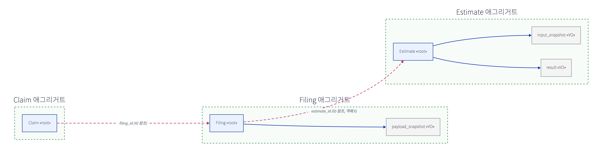

# DDD 애그리거트(Aggregate)

DDD 전술 패턴의 핵심. **"함께 변경되어야 하고, 함께 일관성을 지켜야 하는 객체들의 묶음"** = 애그리거트. 그 묶음의 **일관성 경계(consistency boundary)** 이자 **트랜잭션 단위**다.

## 구성 요소
- **Entity**: **식별자(ID)** 로 구분, 수명주기 있고 가변. (예: `Filing`)
- **Value Object(VO)**: **값**으로 구분, 불변, 자체 ID 없음. (예: `Money`, `payload_snapshot`)
- **Aggregate**: 엔티티·VO의 묶음 = 일관성 경계.
- **Aggregate Root**: 애그리거트의 **유일한 진입점**(루트 엔티티). 외부는 **루트를 통해서만** 내부에 접근하고, **루트의 ID로만** 참조.

## 4대 규칙 (Vaughn Vernon — Effective Aggregate Design)
1. **불변식(invariant)을 경계 안에서 보호.** 루트가 내부 규칙을 강제. (예: "filing은 `READY`인 estimate로만 생성")
2. **작게 설계.** 큰 애그리거트 = 동시성 충돌·락·성능 문제. 꼭 같이 바뀌는 것만 묶는다.
3. **애그리거트 간 참조는 ID로** (객체 직접 참조 X). → 느슨한 결합, 독립 로딩/저장.
4. **한 트랜잭션 = 한 애그리거트 수정.** 여러 애그리거트에 걸치면 → **결과적 일관성(eventual consistency) + 도메인 이벤트**로 연결.

## Repository
- 저장/조회는 **애그리거트 단위**(루트 기준). `FilingRepository.save(filing)` — 내부 VO까지 통째로.
- 한 트랜잭션에서 보통 **애그리거트 하나** 로드·수정·저장.

## Bounded Context와의 관계
- 애그리거트들이 사는 **의미 경계**가 Bounded Context. 같은 단어도 컨텍스트마다 다른 의미.
- (→ [종소세 설계의 바운디드 컨텍스트](../system-design/260611-종소세-환급-설계.md))

## 종소세에 적용 — 우리가 이미 내린 결정과 일치
- **애그리거트**: `Estimate`(root) · `Filing`(root) · `Claim`(root) · `RuleSet`(root, 불변). 각자 경계.
  - `Filing` 내부에 `payload_snapshot`(VO, 불변 박제), `Estimate` 내부에 `input_snapshot`·`result`(VO).
- **애그리거트 간 = ID 참조**: `filing.estimate_id`, `claim.filing_id` — 객체가 아니라 **ID**.
  → 이게 우리가 [DB FK를 안 걸고 **앱 레벨 논리 참조**](../system-design/260611-종소세-환급-설계.md)로 간 것과 **정확히 같은 원리**. (애그리거트 경계를 넘는 참조는 ID + 앱에서 무결성 관리)
- **한 트랜잭션 한 애그리거트**: `Filing` 상태 변경과 `Claim` 생성은 **별도 트랜잭션** → `FilingAccepted` **도메인 이벤트**로 이어줌.
  → 우리 [`domain_event` / Modulith 아웃박스](./260617-kafka-구조.md)와 직결. 경계를 넘는 일관성은 이벤트로.
- **불변식**: "한 `(user, tax_year, type)`에 ACCEPTED 신고 1건"은 `Filing` 루트(+`UNIQUE`)가 보호.

## 흔한 오해
- **애그리거트 ≠ 테이블 1:1.** 한 애그리거트가 여러 테이블일 수도, VO가 컬럼(`jsonb`)일 수도.
- **루트 우회 금지.** 내부 엔티티를 외부에서 직접 조작하면 불변식이 깨짐.
- **크게 만들지 마라.** "연관 있으니 다 한 애그리거트"는 함정 → 동시성·성능 붕괴. 같이 **반드시** 바뀌는 것만.
