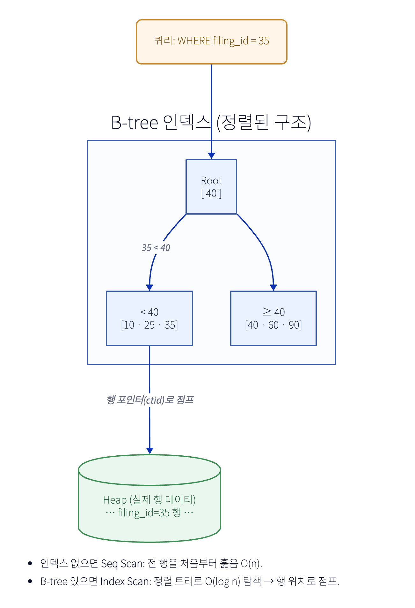

# 인덱스(Index)

테이블에서 행을 빨리 찾기 위한 **별도의 정렬된 자료구조**. 책 뒤 색인처럼, 전체를 훑지(Seq Scan) 않고 위치로 점프(Index Scan).

## 자료구조별 (PostgreSQL)

| 종류 | 잘하는 것 | 예시 |
|---|---|---|
| **B-tree** (기본) | 등치(`=`)·범위(`<,>,BETWEEN`)·정렬·`ORDER BY` | 대부분의 컬럼·PK·UNIQUE |
| **Hash** | 등치(`=`)만 | 범위 안 됨 → 거의 B-tree로 충분 |
| **GIN** | 다중 값 내부 검색 | `jsonb`·배열·전문검색 (`metadata @> …`) |
| **GiST** | 공간·범위·근접 | 위치(PostGIS)·범위 타입 |
| **BRIN** | 거대 + 물리 정렬된 테이블 | 시계열·로그 (작고 가벼움) |

## 인덱스 종류 (개념)

| 종류 | 설명 | 언제 / 예시 |
|---|---|---|
| **단일(single)** | 한 컬럼 | 단일 조건 조회 |
| **복합(composite)** | 여러 컬럼 묶음. **최좌측 접두**만 활용 | `(user_id, created_at)` 동시 조건 |
| **UNIQUE** | 유일성 제약 + 인덱스 | 멱등키 컬럼 |
| **부분(partial)** | 조건(`WHERE`) 맞는 행만 인덱싱 → 작고 빠름 | `… WHERE is_active = true` |
| **표현식(expression)** | 가공값을 인덱싱 | `lower(email)`, `(amount/100)` |
| **커버링(covering, `INCLUDE`)** | 쿼리 컬럼을 인덱스에 담아 **Index-Only Scan**(힙 안 감) | 자주 같이 읽는 컬럼 |

## 복합 인덱스 — 컬럼 순서가 핵심
- **등치(`=`) 컬럼 먼저, 범위(`<,>`) 컬럼 나중.** (범위 뒤 컬럼은 인덱스 못 탐)
- `(user_id, created_at)` 인덱스는 `user_id=?` 나 `user_id=? AND created_at=?` 엔 타지만, **`created_at` 단독**엔 못 탐(최좌측 깨짐).
- 선택도(selectivity) 높은(값 다양) 컬럼이 앞에 오면 유리.

## 트레이드오프 (공짜 아님)
- **읽기 빨라짐 ↔ 쓰기 느려짐**: INSERT/UPDATE/DELETE마다 인덱스도 갱신. + **저장공간**.
- 인덱스 **남발 금지**: 안 쓰는 인덱스는 쓰기·공간만 갉아먹음. 쿼리 패턴 보고 필요한 것만.

## 인덱스 못 타는 함정
- 컬럼에 **함수/형변환**: `WHERE lower(email)=…`, 타입 불일치 → 표현식 인덱스 필요.
- **선두 와일드카드**: `LIKE '%kim'` 못 탐(`'kim%'` 는 됨).
- **낮은 선택도**: boolean·소수 값 컬럼은 인덱스 효과 적음.
- 복합 인덱스 **최좌측 컬럼 생략**.

## Clustered vs Non-clustered
- **MySQL InnoDB**: PK = **clustered index** → 행이 **PK 순서로 물리 저장**. 그래서 랜덤 PK(UUIDv4)면 삽입 위치가 흩어져 페이지 분할↑. 2차 인덱스는 PK를 담아 재조회.
- **PostgreSQL**: 행은 **heap**에 저장(클러스터드 아님). 모든 인덱스가 heap의 `ctid`를 가리킴. `CLUSTER`는 일회성 정렬.
- → 그래서 **UUIDv7**(시간정렬)이 인덱스 지역성에 유리(특히 MySQL).

## 확인: `EXPLAIN`
- `EXPLAIN (ANALYZE, BUFFERS) SELECT …` 로 실제 계획 확인.
- **Seq Scan**(전체 훑음) → **Index Scan**(인덱스 타고 힙) → **Index Only Scan**(힙 안 감, 커버링) → **Bitmap Scan**(여러 인덱스 조합).
- "인덱스 만들었는데 왜 Seq Scan?" → 위 함정 / 통계 / 작은 테이블(옵티마이저가 풀스캔이 빠르다 판단) 점검.
