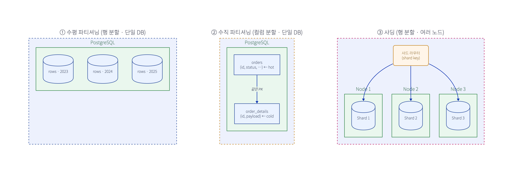

# 샤딩(Sharding) vs 파티셔닝(Partitioning)

헷갈리는 이유: **샤딩은 파티셔닝의 한 종류**다. "여러 노드에 걸친 수평 파티셔닝"이 샤딩.

## 한눈 비교 — 수평 파티셔닝 · 수직 파티셔닝 · 샤딩

| 기준 | 수평 파티셔닝 | 수직 파티셔닝 | 샤딩 |
|---|---|---|---|
| 나누는 것 | **행(rows)** | **컬럼(columns)** | **행(rows)** |
| 분산 범위 | 단일 DB | 단일 DB | **여러 노드** |
| 방식 | range / hash / list | hot/cold 컬럼 분리 | 수평 파티셔닝을 노드로 분산 |
| 목적 | 관리·프루닝·보관/파기 | hot 행 슬림(캐시·스캔↑) | **수평 확장**(용량·쓰기) |
| 트랜잭션·조인 | 로컬, 쉬움 | 합치려면 조인 | **크로스샤드 어려움**(분산 트랜잭션) |
| 예시 | 연도별 파티션 | 본문 ↔ 메타데이터 분리 | Vitess·Citus·MongoDB |

- **샤딩 = 여러 노드로 흩은 수평 파티셔닝** (샤딩 ⊂ 수평). **수직은 다른 축**(같은 노드, 컬럼 분리).
- PostgreSQL은 큰 컬럼을 **TOAST**가 자동 out-of-line 저장 → 수직 분리 없이도 대부분 해결.

## 복제(Replication)와 헷갈리지 말 것
- **분할(파티셔닝/샤딩)** = 데이터를 **쪼갬** → 용량·쓰기 확장.
- **복제(replication)** = 데이터를 **복사** → HA·읽기 확장.
- 보통 **같이** 씀: 각 샤드를 다시 복제(leader/replica). (Kafka도 partition을 broker에 분산 + 복제)

## 샤딩이 어려운 이유 (= 최후 수단인 이유)
- **샤드 키**: 잘못 고르면 **핫스팟**(쏠림).
- **크로스 샤드 쿼리**: scatter-gather → 느림·조인 제약.
- **분산 트랜잭션**: 2PC 회피 → **사가**.
- **리샤딩**: 샤드 추가 시 재분배(consistent hashing으로 완화).

## 언제 무엇을
**파티셔닝(관리/성능) → 읽기 복제본+캐시(읽기 확장) → 그래도 단일 머신 쓰기/용량 한계면 샤딩**(복잡도 큼, 최후 수단).

## 다른 맥락의 "partition" (용어 혼동 주의)
- **Kafka partition**: 토픽을 쪼갠 단위(브로커 분산) — 사실상 토픽의 샤딩·파티셔닝. (→ [Kafka 구조](./260617-kafka-구조.md))
- **CAP의 partition tolerance**: 네트워크 **분단** 내성 — 위 분할과 전혀 다른 의미.
