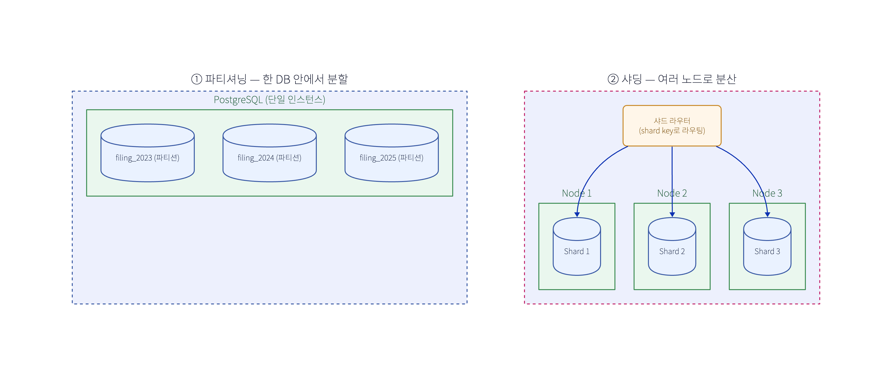

# 샤딩(Sharding) vs 파티셔닝(Partitioning)

헷갈리는 이유: **샤딩은 파티셔닝의 한 종류**다. "여러 노드에 걸친 수평 파티셔닝"이 샤딩.

## 한 줄 정의
- **파티셔닝**: 하나의 데이터셋(테이블)을 **조각(파티션)으로 분할**. 보통 **한 DB 인스턴스 안**.
- **샤딩**: 그 조각(샤드)을 **여러 DB 노드에 분산**. 단일 머신 한계를 넘기 위한 **수평 확장**.

## 비교

| 축 | 파티셔닝 | 샤딩 |
|---|---|---|
| 정의 | 한 데이터셋을 파티션으로 분할 | 파티션(샤드)을 **여러 서버**에 분산 |
| 범위 | 보통 **단일 DB 인스턴스 내** | **여러 DB 인스턴스/노드** |
| 주 목적 | 관리성·쿼리 프루닝·인덱스 축소·보관/파기 | **수평 확장**(용량·쓰기 처리량) |
| 분할 방식 | range / hash / list, + 수직(컬럼) | 보통 hash/range **키 기반 수평** |
| 트랜잭션·조인 | 같은 DB라 로컬 → 쉬움 | **크로스 샤드** 조인/트랜잭션 어려움 |
| 운영 복잡도 | 낮음 | **높음**(라우팅·리밸런싱·핫스팟·분산 트랜잭션) |
| 예시 | PostgreSQL 선언적 파티셔닝(`tax_year`) | Vitess·Citus·MongoDB sharding·앱레벨 샤딩 |

## 포함 관계
- **수평 파티셔닝**: 행을 기준으로 분할(범위/해시). → 이걸 여러 노드로 흩으면 **샤딩**.
- **수직 파티셔닝**: 컬럼 기준 분할(자주 쓰는 컬럼 / 큰 BLOB 분리). 샤딩과는 다른 축.
- 즉 **샤딩 ⊂ 수평 파티셔닝**, 단 "노드 분산"이라는 조건이 붙은 것.

## 복제(Replication)와 헷갈리지 말 것
- **분할(파티셔닝/샤딩)** = 데이터를 **쪼갬** → 용량·쓰기 확장.
- **복제(replication)** = 데이터를 **복사** → HA·읽기 확장.
- 보통 **같이** 씀: 각 샤드를 다시 복제(leader/replica). (Kafka도 partition을 broker에 분산 + 복제)

## 샤딩이 어려운 이유 (도입 전 알아야)
- **샤드 키 선택**: 잘못 고르면 **핫스팟**(한 샤드에 트래픽 쏠림). 카디널리티·분포 중요.
- **크로스 샤드 쿼리**: scatter-gather(모든 샤드 조회 후 합치기) → 느림. 조인 제약.
- **분산 트랜잭션**: 2PC는 느리고 취약 → 보통 **사가**로 회피.
- **리샤딩/리밸런싱**: 샤드 추가 시 데이터 재분배(consistent hashing 등으로 완화).

## 언제 무엇을
1. 테이블이 커서 관리/성능 이슈지만 **한 머신으로 충분** → **파티셔닝** 먼저.
2. 읽기가 많다 → **읽기 복제본 + 캐시**.
3. 그래도 **단일 머신 쓰기/용량이 한계** → 그때 **샤딩**(복잡도 크니 최후 수단).

## 다른 맥락의 "partition" (용어 혼동 주의)
- **Kafka partition**: 토픽을 쪼갠 단위(브로커 분산) — 사실상 토픽의 샤딩·파티셔닝. (→ [Kafka 구조](./260617-kafka-구조.md))
- **CAP의 partition tolerance**: 네트워크 **분단** 내성 — 위 분할과 전혀 다른 의미.

## 우리 종소세 설계와 연결
- `tax_year`로 **파티셔닝**(보관/파기·시즌 분리) 채택 — [종소세 설계](../system-design/260611-종소세-환급-설계.md).
- **샤딩은 불필요**: 신고/계산은 메시지급 초고 TPS가 아니라 PostgreSQL + 인덱스 + 읽기 복제본 + Redis로 충분. 복잡도 큰 샤딩은 도입 안 함.
