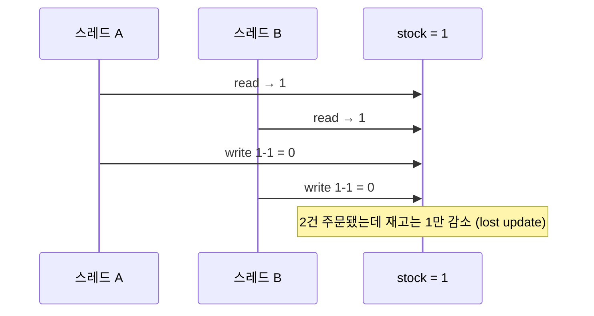
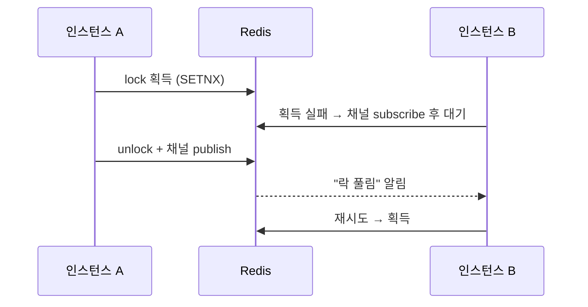

# Race Condition과 동시성 제어 — 단일 앱에서 분산 락까지

여러 스레드/프로세스가 **공유 자원을 동시에 읽고-수정-쓰면** 실행 순서에 따라 결과가 달라지는 문제. 전형적 패턴은 **read-modify-write**(재고 차감)와 **check-then-act**(중복 가입 검사 후 insert). 아래는 "재고 1개 남았는데 주문 2건 동시 진입" 시나리오로, 아키텍처가 커지는 순서대로 해법을 밟는다.



## 0단계 — 단일 인스턴스: JVM 락

인스턴스 1대, 경합 지점이 JVM 안에만 있을 때. `synchronized` 또는 `ReentrantLock`.

```java
public synchronized void decrease(Long id, Long qty) {
    Stock stock = stockRepository.findById(id).orElseThrow();
    stock.decrease(qty);
    stockRepository.saveAndFlush(stock);
}
```

- **함정: `@Transactional`과 같이 쓰면 깨진다.** 트랜잭션은 프록시가 감싸므로 실제 순서는 `트랜잭션 시작 → synchronized 진입/탈출 → 커밋`. **락이 풀린 뒤 커밋 전** 틈에 다른 스레드가 옛 값을 읽는다. → 락 범위가 트랜잭션 범위를 **감싸야** 안전.
- `ReentrantLock`은 `tryLock(timeout)`·공정성(fairness)·조건 변수 등 세밀 제어가 필요할 때.
- **한계**: 락의 유효 범위가 JVM 하나. 인스턴스가 2대만 돼도 무력화(→ 2단계).

### Kotlin 코루틴 / 가상 스레드(VT)라면

실행 모델이 바뀌면 "스레드를 세우는 락"이 독이 된다.

```kotlin
val mutex = Mutex()

suspend fun decrease(id: Long, qty: Long) = mutex.withLock {
    val stock = stockRepository.findById(id) ?: error("없음")
    stock.decrease(qty)
    stockRepository.save(stock)
}
```

- **코루틴**: `synchronized`/`ReentrantLock`은 대기 시 **스레드 자체를 블로킹**해 코루틴의 이점을 없애고, `synchronized` 블록 안에선 suspend 호출도 못 한다. 대신 `kotlinx.coroutines.sync.Mutex` — `withLock`은 대기 중 스레드를 놓아주는 **suspend 락**. 동시 N개 허용은 `Semaphore(n)`.
- **가상 스레드(virtual thread, Java 21+)**: `synchronized` 블록 안에서 블로킹하면 캐리어 스레드에 **피닝(pinning)** — 플랫폼 스레드가 그대로 묶여 VT의 장점이 사라진다. JDK 24(JEP 491)에서 해소됐지만, 그 전 버전이면 `ReentrantLock`이 정석.
- 어느 쪽이든 **락의 범위는 여전히 프로세스 하나** — 스케일 아웃하면 똑같이 무력화.

## 1단계 — RDB를 붙였다: DB가 락의 진실 공급원

경합 지점이 DB의 행(row)이라면, **락도 DB에 맡기는 게 자연스럽다.** DB는 이미 공유 지점이므로 스케일 아웃해도 유효하다.

| 방식 | 원리 | 장점 | 단점 / 함정 |
|---|---|---|---|
| **낙관적 락(optimistic)** | `@Version` 컬럼. UPDATE 시 버전 비교, 다르면 실패 | 락 점유 없음 → 경합 **적을 때** 가장 저렴 | 충돌 시 **재시도 로직**을 직접 작성. 경합 높으면 재시도 폭증 |
| **비관적 락(pessimistic)** | `SELECT … FOR UPDATE` (배타·X락). JPA `@Lock(PESSIMISTIC_WRITE)` | 충돌 자체를 차단 → 경합 **높을 때** 안정적 | 락 대기로 커넥션 점유·데드락 가능 |
| **네임드 락(named lock)** | 행이 아닌 **임의 문자열**에 락. MySQL `GET_LOCK('key')`, PG `pg_advisory_lock` | 행이 아직 없어도(INSERT 경합) 잠글 수 있음, 테이블 락 회피 | 트랜잭션과 별개로 **명시적 해제 필수**. 락용 커넥션이 따로 필요해 풀 고갈 주의 |

```java
// 비관적 락 — 조회 시점에 행을 잠근다
@Lock(LockModeType.PESSIMISTIC_WRITE)
@Query("select s from Stock s where s.id = :id")
Stock findByIdForUpdate(Long id);
```

- **배타(X) vs 공유(S)**: `FOR UPDATE`는 배타 락(읽기·쓰기 모두 차단), `FOR SHARE`는 공유 락(읽기는 허용, 쓰기만 차단). 갱신 목적이면 배타.
- 낙관 vs 비관 선택 기준 = **충돌 빈도**. 마이페이지 수정처럼 드물면 낙관, 선착순 재고처럼 잦으면 비관.
- 사실 이 예제의 최적해는 락 없이 원자적 UPDATE 한 방: `UPDATE stock SET qty = qty - 1 WHERE id = ? AND qty >= 1` → 영향 행 수로 성패 판단. **락은 "읽은 값으로 애플리케이션 로직을 태워야 할 때" 필요**하다.

### 네임드 락 더 파기 — "Redis 없는 분산 락"

- **네임드 락은 그 자체로 분산 락이다.** 락이 공유 지점(DB)에 있으므로 인스턴스 N대에 유효. 락 하나 때문에 Redis를 새로 들이기 싫을 때의 실용해 — Flyway(PG advisory lock)·ShedLock(JDBC)이 내부적으로 같은 원리를 쓴다.
- **유량이 돌면 부적합.** 락 대기가 **커넥션을 통째로 점유**하는데, RDB 커넥션은 스레드+메모리가 붙는 비싼 자원 — 경합이 잦으면 풀 고갈 → 전면 장애. 락 전용 DataSource 분리가 정석이지만, 그 수고를 할 시점이면 Redis가 낫다. **적정선은 저빈도 조정**(배치 중복 방지·마이그레이션·리더 흉내).
- **서버가 죽으면 락도 풀린다.** 커넥션 종료 = 락 자동 해제라 고아 락이 없다(Redis처럼 TTL 튜닝이 필요 없는 장점). 단, **프로세스만 죽으면** OS가 소켓을 닫아 즉시 해제되지만 **머신 다운·네트워크 단절**이면 DB가 죽은 커넥션을 인지할 때까지(TCP keepalive·`wait_timeout`) 락이 한동안 남을 수 있다.
- **락 상태를 SQL로 조회할 수 있다**: MySQL `IS_USED_LOCK('key')`·`performance_schema.metadata_locks`(USER LEVEL LOCK, 대기 세션까지 표시), PG `pg_locks WHERE locktype='advisory'`(키가 숫자 해시라 문자열→숫자 매핑 규칙 필요). 락 릭 의심 시 범인 세션을 찾아 `KILL`하면 회수.
- PG엔 `pg_advisory_xact_lock`(트랜잭션 종료 시 자동 해제)이 있어 MySQL `GET_LOCK`의 "명시적 해제 깜빡" 함정을 피할 수 있다.

### DB 락의 두 가지 한계

- **보호 대상이 행에 결합**: 낙관·비관 락이 잠글 수 있는 건 "그 DB에 존재하는 행"뿐. DB 밖 자원은 걸 곳이 없다 — 이를 우회하는 게 임의 문자열을 잠그는 네임드 락(위 참조).
- **원자성이 DB 경계를 못 넘는다** (더 근본적): 락이 상호배제를 완벽히 보장해도, 롤백되는 건 **DB 상태뿐**이다. 임계구역 안에서 외부 API 호출·Kafka 발행을 하면 — 롤백 시 "DB는 되돌아갔는데 메일은 이미 나감", 커밋 직후 죽으면 "커밋은 됐는데 이벤트 유실". 해법은 락이 아니라 패턴이다:
  - **Transactional Outbox**: 이벤트를 같은 트랜잭션으로 outbox 테이블에 INSERT(DB 안이니 원자적) → 별도 프로세스가 폴링/CDC로 발행. "커밋과 발행의 원자성"을 우회 확보.
  - 되돌릴 수 없는 외부 호출은 **커밋 후로** 빼고, 실패는 **보상 트랜잭션(saga)** — 마무리의 결과적 일관성으로 이어지는 입구가 여기다.

## 2단계 — Redis 분산 락

배경조건은 **스케일 아웃**. 인스턴스 N대가 되는 순간 락별로 운명이 갈린다:

- `synchronized`/`ReentrantLock`/`Mutex` → **무력화**. 락이 JVM별로 따로 존재.
- DB 락(낙관·비관·네임드) → **여전히 유효**. 락의 위치가 공유 지점(DB)이기 때문.
- 대신 모든 인스턴스의 락 경합이 **DB로 집중**된다 — 대기 커넥션이 풀을 점유하고, 트래픽이 크면 락 처리 자체가 DB 부하가 된다.

그래서 락 저장소를 DB에서 Redis로 분리한다. 싱글 스레드 + 인메모리라 락 연산이 싸고 빠르며, DB 부하와 분리된다.

**방법 1 — 스핀락(spin lock)**: `SET key val NX PX 3000`(SETNX + TTL)으로 획득 시도, 실패하면 sleep 후 재시도 루프. Lettuce로 직접 구현하는 방식.

**방법 2 — pub/sub (Redisson)**: 락 해제 시 채널로 알림을 쏘고, 대기자는 **구독하고 잠들어 있다가** 알림에 깨어나 재시도. 스핀이 없어 Redis 부하가 낮다. Spring 진영 표준 선택지.



```java
RLock lock = redissonClient.getLock("stock:" + id);
try {
    // waitTime 10초 안에 획득 시도, 획득하면 leaseTime 3초 뒤 자동 해제
    if (!lock.tryLock(10, 3, TimeUnit.SECONDS)) {
        throw new IllegalStateException("락 획득 실패");
    }
    stockService.decrease(id, qty);   // 트랜잭션은 이 안에서 시작·커밋
} finally {
    if (lock.isHeldByCurrentThread()) lock.unlock();
}
```

- **TTL(leaseTime)은 필수**: 락 잡은 인스턴스가 죽으면 영원히 잠기므로 만료로 회수. Redisson은 leaseTime을 안 주면 **watchdog**이 작업 중인 락을 30초 단위로 자동 연장.
- 0단계와 같은 함정 재현 주의: **락 안에서 트랜잭션이 시작되고 커밋까지 끝나야** 한다(락 해제가 커밋보다 먼저면 안 됨).
- 스핀락 vs pub/sub = 폴링 vs 이벤트. 경합이 조금이라도 있으면 pub/sub이 낫다.

## 심화 — 분산 락의 한계 (짧게)

- **TTL 만료 + STW(GC pause)**: A가 락을 잡고 멈춘 사이 TTL 만료 → B가 락 획득 → A가 깨어나 자기가 락 주인인 줄 알고 계속 진행 → **둘이 동시 진입**. 완전한 방어는 **fencing token**(단조 증가 토큰을 저장소가 검증)까지 필요.
- **Redlock**: Redis 여러 대 과반수 획득으로 단일 장애점을 없애려는 알고리즘. 시계 의존성 때문에 안전성 논쟁(Kleppmann vs antirez)이 유명. 대부분의 서비스는 단일 Redis(+HA) 락으로 충분하고, 락이 뚫려도 치명적이면 DB 제약(UNIQUE 등)을 최후 방어선으로.

## 마무리 — 락 없이 사는 법: 결과적 일관성 (짧게)

락은 "지금 즉시 하나만"을 강제하는 대신 대기·병목을 산다. 규모가 더 커지면 **경합 자체를 없애는** 방향으로:

- **직렬화**: 같은 키의 요청을 Kafka **파티션 키**로 몰아 한 컨슈머가 순서대로 처리 → 경합 소멸, 대신 응답은 비동기.
- **결과적 일관성(eventual consistency)**: 지금 당장 정확하지 않아도 **언젠가 수렴**하면 OK로 설계. 실패 시 보상 트랜잭션(saga)으로 되돌림.
- 즉, 최종 단계의 답은 "더 좋은 락"이 아니라 **락이 필요 없는 설계**. [→ Kafka 구조](./260617-kafka-구조.md)

## 선택 가이드

| 상황 | 선택 |
|---|---|
| 단일 인스턴스, 공유 자원이 메모리 | `synchronized` / `ReentrantLock` |
| 단일 인스턴스 + 코루틴/가상 스레드 | `Mutex.withLock` / (VT는 `ReentrantLock`) |
| 경합이 드묾 | 낙관적 락 (`@Version`) + 재시도 |
| 경합이 잦고 행이 존재 | 비관적 락 (`FOR UPDATE`) |
| 행이 없거나(INSERT 경합) 로직 단위 잠금 | 네임드 락 |
| 스케일 아웃 + DB 부하 분리 | Redisson (pub/sub) |
| 조건부 증감처럼 단순 갱신 | 락 대신 원자적 UPDATE 한 방 |
| 임계구역에 외부 호출·이벤트 발행 포함 | 락으로 못 지킴 → outbox·커밋 후 호출·saga |
| 초대규모·비동기 허용 | 큐 직렬화 + 결과적 일관성 |
