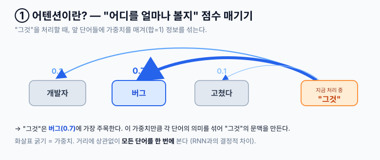
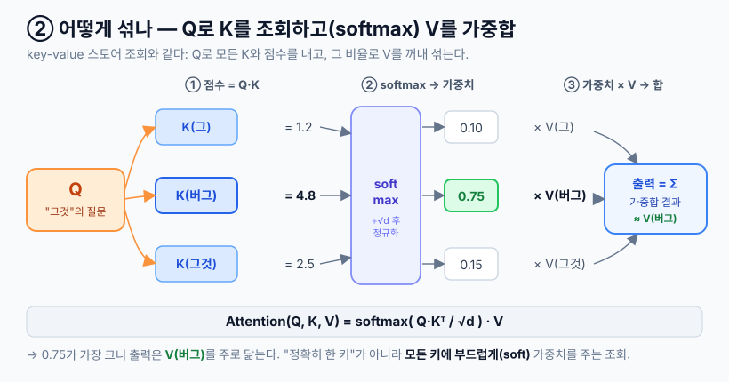
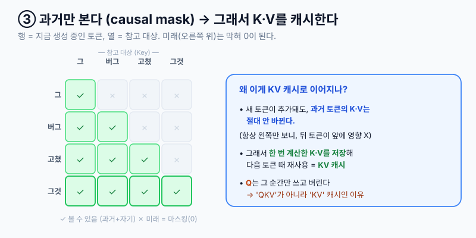

# Attention · 기초편

> 이 문서는 [KV 캐시 (기초편)](./260601-kv-cache-기초.md)의 **선행 개념**이다. "왜 K와 V만 캐싱하는가"는 결국 어텐션이 무엇인지에서 나온다.

## 1. 요약

### 1.0 가장 쉽게 (먼저 이것만 봐도 80%)

> 모델이 다음 단어를 고를 때, 앞에 나온 단어들 중 **"어디를 얼마나 참고할지"** 점수를 매겨 정보를 섞는다. 이 "주목(attend)하는" 계산이 **어텐션**이다.

예를 들어 `"그 개발자는 버그를 고쳤는데, 그것은 까다로웠다"`에서 **"그것"**을 처리할 때:

```
"그것"이 앞 단어들을 둘러보며 가중치를 매긴다
  버그   ████████████████ 0.7   ← 가장 주목
  개발자 █████ 0.2
  고쳤다 ██ 0.1
→ 이 가중치로 단어들의 의미를 섞어 "그것"의 문맥을 결정
```



**세 줄 요약:**
- 각 토큰을 **Q**(질문)·**K**(꼬리표)·**V**(내용) 세 벡터로 바꾼다
- **Q**를 앞 토큰들의 **K**와 비교해 "어디를 볼지" 가중치를 만들고, 그 가중치로 **V**를 섞는다
- 토큰끼리 **N×N로 전부 비교** → 비용이 길이의 **제곱(O(N²))** → 긴 컨텍스트가 비싼 근본 이유

> 연결고리: **K·V는 한 번 계산하면 안 바뀐다.** 그래서 다음 토큰 생성 때 재사용하려고 저장해두는 게 [KV 캐시](./260601-kv-cache-기초.md)다. 어텐션을 알면 KV 캐시는 "그 K·V를 메모해두는 것"으로 자연히 이해된다.

### 1.1 TL;DR

- 핵심 수식 한 줄: `Attention(Q, K, V) = softmax(QKᵀ / √d) · V`
- **self-attention**: 같은 시퀀스 안의 토큰들끼리 서로 본다 (Transformer의 기본)
- **causal mask**: 디코더(생성 모델)는 미래 토큰을 못 본다 → 항상 **왼쪽(과거)만** attend
- **multi-head**: 여러 "관점"으로 병렬 attend 후 합친다
- 비용 `O(N²)` → **FlashAttention**(연산·메모리 최적화), **GQA/MQA**(K/V를 head끼리 공유)로 완화. 후자는 곧 KV 캐시 크기를 줄이는 기법이다.

### 1.2 한 줄 정의

| 용어 | 한 줄 정의 | 백엔드 비유 |
|---|---|---|
| `Query (Q)` | "나는 지금 무엇을 찾고 있나" — 현재 토큰의 질문 벡터 | 검색 쿼리 |
| `Key (K)` | "나는 이런 정보를 갖고 있다" — 각 토큰의 색인 벡터 | DB 인덱스 키 |
| `Value (V)` | "실제 내용은 이거다" — 각 토큰의 내용 벡터 | 키에 매핑된 값 |
| `attention score` | Q·K 내적으로 구한 "얼마나 관련 있나" 점수 | 유사도 매칭 점수 |
| `attention weight` | score를 softmax로 정규화한 가중치(합=1) | 정규화된 검색 랭킹 |

## 2. 왜 필요한가

어텐션 이전(RNN/LSTM 등)은 토큰을 **순차적으로** 처리하며 상태를 하나의 벡터에 욱여넣었다. 두 가지 한계가 있었다:

- **장거리 의존성 손실**: 멀리 떨어진 단어 관계가 흐려진다 (문장 앞 주어 ↔ 뒤 동사)
- **병렬화 불가**: 앞 토큰을 처리해야 다음으로 넘어가니 GPU를 못 채운다

어텐션은 이 둘을 동시에 푼다 — **모든 토큰을 한 번에 펼쳐놓고**, 거리에 상관없이 토큰끼리 **직접** 연결한다. "Attention Is All You Need"(Transformer)의 핵심이 이것이다.

## 3. 동작 메커니즘 — Q, K, V

### 3.1 한 토큰이 출력되기까지

각 입력 토큰 임베딩에 학습된 가중치 행렬(`W_Q`, `W_K`, `W_V`)을 곱해 Q·K·V 세 벡터를 만든다. 그다음:

```
1) score = Q · Kᵀ            현재 토큰의 Q를, 모든 토큰의 K와 내적 → 관련도 점수
2) score / √d                점수가 너무 커지지 않게 스케일 조정 (d = head 차원)
3) softmax(...)              점수 → 합이 1인 가중치 (= attention weight)
4) weight · V                그 가중치로 모든 토큰의 V를 가중 평균 → 출력
```

핵심은 **key-value 스토어에 쿼리를 날리는 것**과 구조가 같다는 점이다. Q로 K들을 조회해 매칭 점수를 얻고, 점수만큼 V를 꺼내 섞는다. 다만 "정확히 일치하는 키 하나"가 아니라 **모든 키에 부드럽게(soft) 가중치를 주는 조회**라는 점이 다르다.



### 3.2 작은 예시로 한 스텝 따라가기

토큰 3개 `["그", "버그", "그것"]`이 있고, 지금 **"그것"의 Q**로 어텐션을 한 번 돈다고 하자.

```
"그것"의 Q  ·  각 토큰의 K   →   raw score   → /√d, softmax →  weight
─────────────────────────────────────────────────────────────────
  Q · K(그)     =   1.2                        →   0.10
  Q · K(버그)   =   4.8                        →   0.75   ← 가장 관련 높음
  Q · K(그것)   =   2.5                        →   0.15
                                                   ─────
                                                   합 1.00

출력 = 0.10·V(그) + 0.75·V(버그) + 0.15·V(그것)
       → "버그"의 내용(V)이 대부분 섞인 벡터 = "그것"의 문맥화된 표현
```

"그것"이 사실상 "버그"를 가리킨다는 걸, 가중치 0.75로 잡아낸 셈이다.

### 3.3 ❓ 그 가중치(0.75)는 누가 주나

> **아무도 직접 주지 않는다. 계산 결과로 자동으로 나온다.** "버그에 0.75"는 누가 지정한 값이 아니라 `softmax(Q·K)`가 뱉은 숫자다.

거슬러 올라가면 Q·K는 학습된 가중치 행렬에서 나온다:

```
토큰 임베딩 × W_Q → Q
토큰 임베딩 × W_K → K     └ 이 W_Q, W_K(학습된 파라미터)가 진짜 주인공
```

`W_Q`·`W_K`는 **훈련 때 데이터로 학습된 모델 파라미터**다. 사람이 "그것은 버그를 봐라"라고 규칙으로 짠 게 아니라, 방대한 텍스트에서 "이런 문맥에선 지시대명사가 앞 명사를 가리키더라"를 통계적으로 체득한 결과다. 추론 시점엔 입력에 따라 **매번 새로** 계산되고, 같은 모델이라도 입력 문장이 다르면 가중치도 달라진다.

**서비스 개발자 관점 — 무엇이 내 손잡이인가:**

| 대상 | 내 손잡이? | 설명 |
|---|---|---|
| 가중치 값 자체(0.75) | ❌ 아님 | 추론 엔진이 자동 계산. 들여다보는 건 모델 해석(interpretability)·연구 영역 |
| **무엇에 주목할지** | ✅ 맞음 | W는 고정이라도 **입력에 어떤 토큰을 넣느냐·어떤 순서로 두느냐**로 주목 대상이 바뀐다 |
| W_Q·W_K 자체 | △ 가끔 | 파인튜닝으로 추가 학습하면 주목 패턴이 바뀐다 (도메인 특화 시) |

> 즉 **숫자는 못 건드려도, "모델이 옳은 것에 주목하도록 입력을 깔아주는 것"은 내 일이다.** RAG로 관련 문서를 컨텍스트에 넣는 것도 결국 "주목할 거리를 깔아주는" 행위이고, 어텐션이 그걸 가중치로 잡아낸다. **프롬프트 설계와 RAG의 본질이 여기 있다.**

## 4. 핵심 변형 3가지

### 4.1 Self-Attention vs Cross-Attention
- **Self-attention**: Q·K·V가 **같은 시퀀스**에서 나온다. 문장이 자기 자신을 본다. LLM의 기본.
- **Cross-attention**: Q는 한 시퀀스, K·V는 다른 시퀀스. (번역의 encoder→decoder, 일부 멀티모달)

### 4.2 Causal Mask (인과 마스킹)
생성 모델은 **미래를 보면 안 된다** (다음 단어를 미리 보면 컨닝). 그래서 현재 토큰보다 **뒤에 있는 토큰의 score를 −∞로 막아** softmax에서 0이 되게 한다.

```
              볼 수 있는 대상 (열) →
              그    버그   그것
그      →     🟩    ⬜    ⬜      "그"는 자기까지만
버그    →     🟩    🟩    ⬜      "버그"는 그·버그까지
그것    →     🟩    🟩    🟩      "그것"은 전부 (단, 미래는 애초에 없음)

  🟩 볼 수 있음(과거+자기)   ⬜ 미래 = 마스킹(0)
  └ 항상 왼쪽(과거)만 본다 = decode가 한 방향으로 진행되는 이유
```



> 이 "과거만 본다" 성질이 KV 캐시를 가능하게 한다. 과거 토큰의 K·V는 새 토큰이 추가돼도 **재계산할 필요가 없다** → 그래서 캐싱이 무손실로 성립한다.

### 4.3 Multi-Head Attention
어텐션을 **여러 벌(head) 병렬로** 돌린다. head마다 다른 `W_Q/W_K/W_V`를 학습해 서로 다른 관점에 주목한다 — 어떤 head는 문법 관계, 어떤 head는 지시 대상(그것→버그) 식. 각 head 결과를 이어붙여(concat) 합친다.

```
입력 → [head1] [head2] ... [head_h]  →  concat  →  선형변환  →  출력
        (문법)  (지시)      (어순)        여러 관점을 한데 모음
```

> KV 캐시 관점: head가 많을수록 저장할 K·V도 많아진다. **GQA/MQA**는 여러 head가 K·V를 **공유**해 head 수만큼 캐시가 불어나는 걸 막는 기법 → [KV 캐시 §3.1](./260601-kv-cache-기초.md)과 직결.

## 5. 비용과 실무 연결

### 5.1 O(N²) — 트랜스포머의 근본 무게
self-attention은 토큰 N개에 대해 **모든 쌍(N×N)**의 score를 계산한다. 그래서:

- 토큰 수에 대해 연산이 **제곱**으로 증가 → 컨텍스트를 2배 늘리면 어텐션 연산은 약 4배
- 긴 RAG 프롬프트·긴 대화가 비싸고 느린 근본 이유

### 5.2 서비스 개발자가 만나는 지점

| 기술 | 어텐션과의 관계 |
|---|---|
| **KV 캐시** | 과거 토큰의 K·V를 저장해 decode 때 재계산을 없앤다. 토큰당 생성 복잡도 `O(n²)→O(n)`. → [별도 문서](./260601-kv-cache-기초.md) |
| **FlashAttention** | N×N score 행렬을 통째로 메모리에 안 올리고 블록 단위로 계산 → 메모리·속도 대폭 개선. vLLM 등이 내부적으로 사용 |
| **GQA / MQA** | 여러 head가 K·V를 공유 → KV 캐시 메모리 축소 (Llama 등 기본 채택) |
| **컨텍스트 길이 한계** | `O(N²)` 때문에 무한정 못 늘린다. sliding window·sparse attention 등으로 우회 |

> 결론(서비스 개발자 관점): 어텐션 **메커니즘을 직접 구현**할 일은 거의 없다. 하지만 "왜 긴 컨텍스트가 비싼가", "왜 KV 캐시·prefix 캐시가 효과 있는가", "GQA 모델이 왜 서빙에 유리한가"를 **설명할 수 있는 토대**가 어텐션이다. 운영 판단의 뿌리가 여기 있다.

## 6. KV 캐시로 가는 다리

어텐션을 이해했으면 KV 캐시는 한 문장으로 정리된다:

```
생성은 토큰을 1개씩 만든다 (autoregressive).
매 스텝 새 토큰의 Q를 만들고, 어텐션을 위해 "앞 토큰들의 K·V"가 필요하다.
   - Q : 과거 토큰의 Q는 더 이상 안 쓴다 (이미 그 토큰은 생성 끝)  → 캐시 안 함
   - K·V : 과거 전부가 매 스텝 또 필요하고, 값이 안 바뀐다        → 캐시함
∴ K·V만 저장 = 'KV' 캐시
```

"왜 Q는 안 캐싱하고 K·V만?"의 답이 바로 이것이다. 자세한 메모리·서빙 이야기는 [KV 캐시 (기초편)](./260601-kv-cache-기초.md)에서 이어진다.

## 7. 다음 문서 (예정)

이 문서는 **기초편**이다. 아래는 별도 심화에서 다룬다:

- positional encoding (어텐션은 순서를 모른다 — 위치 정보를 따로 주입하는 법)
- FlashAttention 내부 동작 (블록 단위 online softmax)
- sparse / sliding-window / linear attention — 긴 컨텍스트 대응 계열
- multi-head의 head별 역할 해석 (attention 시각화)

---

## 참고

- [Attention Is All You Need (Transformer 원논문)](https://arxiv.org/abs/1706.03762)
- [The Illustrated Transformer (Jay Alammar)](https://jalammar.github.io/illustrated-transformer/)
- [FlashAttention 논문](https://arxiv.org/abs/2205.14135)
- [KV 캐시 (기초편)](./260601-kv-cache-기초.md) — 이 문서의 후속
