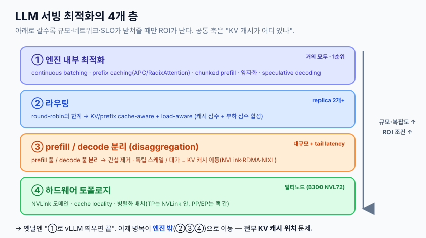
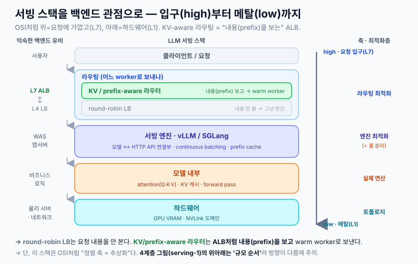
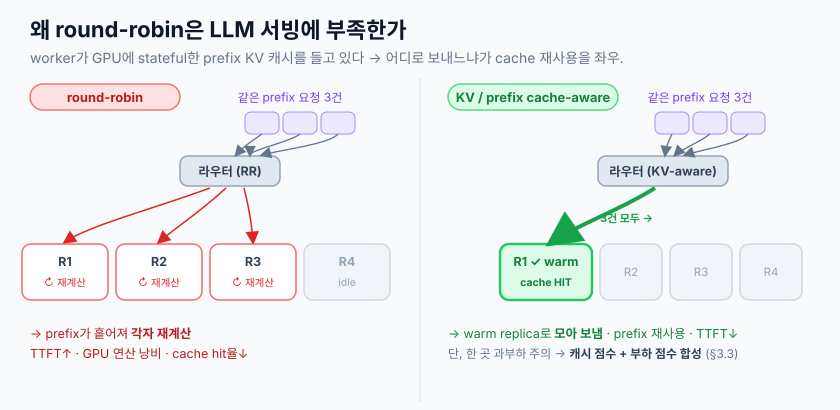
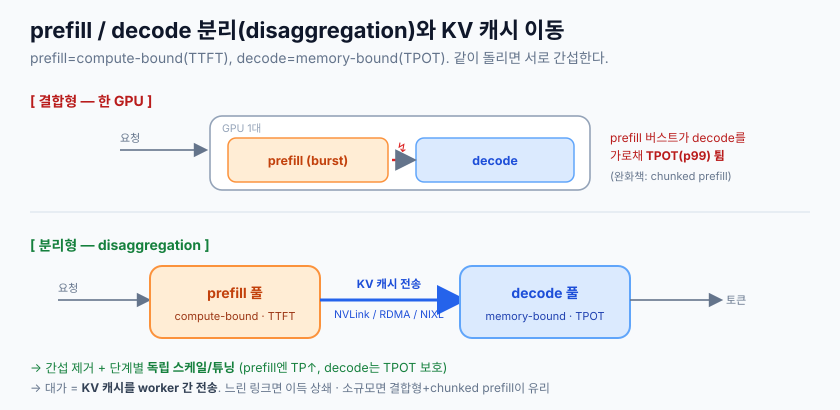
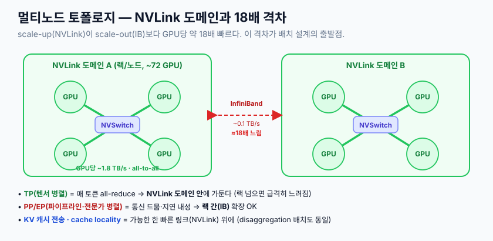

# LLM 서빙 최적화 — 엔진을 넘어 "KV 캐시·라우팅·disaggregation"으로

> 핵심 메시지 —
> **"LLM 서빙 최적화는 이제 '어떤 엔진을 띄울 것인가'를 넘어, KV 캐시가 어디에 있고, 어떤 GPU에서 decode할 것인가, 어떤 요청을 어디로 보낼 것인가의 문제로 이동하고 있다."**
>
> 이 문서는 그 관점을 [KV 캐시](./260601-kv-cache-기초.md)·[어텐션](./260603-어텐션-기초.md) 기초와 이어 정리한다. 우리가 앞에서 본 prefill/decode, TTFT/TPOT, prefix caching이 여기서 **서빙 아키텍처 결정**으로 확장된다.

## 1. 요약

### 1.0 가장 쉽게 (먼저 이것만 봐도 80%)

> LLM 서빙 최적화는 **4개 층**으로 쌓인다. 아래로 갈수록 규모가 커야 의미 있고, 운영 복잡도도 커진다.



**세 줄 요약:**
- 옛날엔 "vLLM 띄우고 끝"이었지만, 이제 병목이 **엔진 밖**(라우팅·배치·토폴로지)으로 옮겨갔다.
- 모든 결정의 중심에 **KV 캐시가 어디 있나**가 있다 — prefill로 만든 KV를 *재사용할 replica로 보내고*(라우팅), *decode할 GPU로 옮기고*(disaggregation), *빠른 링크 위에 두는*(토폴로지) 문제.
- **disaggregation·멀티노드가 모든 환경의 정답은 아니다.** 소규모면 ① 엔진 최적화로 충분하고, 규모·네트워크·SLO가 받쳐줄 때만 아래 층이 ROI가 난다.

### 1.1 TL;DR (운영 키워드)

- **TTFT는 prefill이, TPOT는 decode가 좌우** → 둘은 자원 특성도(compute vs memory-bandwidth) 다르므로 **따로 최적화**한다. ([KV 캐시 §2.1](./260601-kv-cache-기초.md))
- **round-robin은 LLM 서빙에 부적합.** worker가 GPU에 stateful한 KV/prefix 캐시를 들고 있어서, 멍청하게 분산하면 prefix 캐시 재사용이 깨진다.
- **KV/prefix cache-aware routing**: 매칭되는 prefix가 이미 떠 있는(warm) replica로 보내 TTFT를 줄인다. 단 cache-affinity만 좇으면 hot replica가 과부하 → **캐시 점수 + 부하 점수를 합성**해 라우팅.
- **disaggregation**: prefill 풀 / decode 풀을 물리적으로 분리해 상호 간섭(prefill burst가 decode TPOT를 망침)을 없앤다. 대가는 **KV 캐시를 worker 간 전송**해야 한다는 것(NVLink/RDMA/NIXL).
- **B300/NVL72**: 288GB HBM·FP4·거대 NVLink 도메인. **TP는 NVLink 안에 가두고, KV 전송은 빠른 링크 위에** 두는 게 토폴로지 설계의 핵심.

### 1.2 핵심 좌표 — prefill/decode와 지표

앞 문서에서 본 두 단계가 모든 서빙 결정의 출발점이다.

| 단계 | 특성 | 좌우하는 지표 | 최적화 수단 |
|---|---|---|---|
| **prefill** | compute-bound (연산 병목) | **TTFT** (Time To First Token) | prefix caching, chunked prefill, TP 병렬화, cache-aware routing |
| **decode** | memory-bandwidth-bound (메모리 병목) | **TPOT** (Time Per Output Token, =ITL) | continuous batching, 양자화, load-aware routing |

> ⚠️ 같은 GPU에서 둘을 같이 돌리면 **긴 prefill 버스트가 진행 중인 decode를 가로막아 TPOT(p99)가 튄다.** 이 간섭이 ③ disaggregation의 동기다.

### 1.3 백엔드 관점으로 본 스택 (LB vs ALB)

익숙한 백엔드 스택에 대응시키면 이해가 빠르다. 핵심은 **round-robin LB(L4, 내용 안 봄)** ↔ **KV/prefix-aware 라우터(ALB처럼 요청 내용을 보고 라우팅)**의 차이.



> 주의: 이 스택의 정렬 축은 **추상화(요청에 가까움 ↔ 메탈)**다. §1.0 [4계층 그림](./assets/serving-1-layers.svg)의 위아래는 **"규모/채택 순서"**라 방향이 다르다 — 둘은 같은 것을 다른 축으로 본 그림.

## 2. ① 엔진 내부 최적화 — 확립된 지형

가장 먼저, 가장 널리 적용되는 층. (대부분 [KV 캐시 §4](./260601-kv-cache-기초.md)에서 이미 다뤘으니 여기선 서빙 관점으로 요약.)

### 2.1 엔진 vs 서빙 레이어 — 층이 다르다
헷갈리기 쉬운 구분. 비유: 엔진=Flask, Triton=nginx(멀티모델 서버), KServe=Kubernetes(오케스트레이션).

| 구분 | 무엇 | 비고 |
|---|---|---|
| **vLLM** | 추론 엔진. PagedAttention 원조(UC Berkeley). 가장 넓은 모델/HW 지원, 문서 최고, 컴파일 불필요 | **대부분 vLLM으로 시작**. PyTorch 생태계 |
| **SGLang** | 추론 엔진. **RadixAttention**(KV를 radix tree로) | 공유 prefix 많은 워크로드(멀티턴·에이전트)에 강함 |
| **TensorRT-LLM** | NVIDIA 엔진. 저수준 커널 최적화, FP8/FP4 | 고동시성에서 빠를 수 있으나 **엔진 빌드(컴파일) 필요·NVIDIA 전용** = 진입장벽↑ |
| **Triton Inference Server** | 백엔드 불가지론 멀티모델 **서버**(엔진 아님) | 여러 모델 혼합 서빙엔 유리, 단일 LLM 저지연엔 standalone vLLM이 더 단순 |
| **KServe** | K8s 기반 **오케스트레이션**(엔진 아님) | 오토스케일·카나리·롤백. 위에 vLLM을 얹음 |

### 2.2 핵심 기법 (정의 → 왜)

- **Continuous batching** (= in-flight batching, iteration-level scheduling): 배치를 요청 단위가 아니라 **iteration(forward pass) 단위**로 스케줄. 끝난 요청을 즉시 빼고 대기 요청을 끼워넣는다. static batching이 "가장 느린 요청까지 GPU를 붙잡는" 낭비를 제거 → 혼합 길이·고동시성에서 처리량 **2~4배**(조건부). vLLM/SGLang/TRT-LLM 기본.
- **Prefix caching**: 공유 prefix(시스템 프롬프트·긴 문서·대화 히스토리)의 KV를 재사용해 prefill 재계산을 건너뜀. **이득은 prefill(=TTFT)에만.**
  - vLLM **APC**(Automatic Prefix Caching): 블록 레벨 해싱. `enable_prefix_caching=True` — **기본 비활성(주의)**.
  - SGLang **RadixAttention**: 토큰 레벨 radix tree → 더 세밀한 공유 자동 포착. (이게 ③ 라우팅의 prefix 매칭과도 연결)
- **Chunked prefill**: 긴 prefill을 청크로 쪼개 decode 스텝과 **인터리브** → 긴 prefill로 인한 decode stall 감소, TPOT 안정화. **vLLM V1 엔진에서 기본 활성.** `max_num_batched_tokens`로 조절(온라인 기본 8192). → ③ disaggregation의 "동일 GPU 내 완화책" 버전.
- **양자화**: 가중치(AWQ/GPTQ/FP8/INT4) + **KV 캐시 양자화(fp8)**로 VRAM·메모리 트래픽↓. Blackwell은 FP4(NVFP4) 가속. → 상세 [모델 종류 문서 §5](./260603-llm-모델-종류.md), [KV 캐시 §3.1](./260601-kv-cache-기초.md)
- **Speculative decoding**: 작은 draft가 여러 토큰을 제안 → 타깃 모델이 **한 forward pass에 병렬 검증** → 스텝당 여러 토큰 확정(출력 분포는 동일, 무손실). 방법: draft model / **EAGLE-3(현 SOTA)** / Medusa / n-gram. **트레이드오프: 저부하(저QPS)에서 유리, 고QPS·compute-bound에선 추가 연산이 오히려 손해.**

## 3. ② 라우팅 — 그 다음 병목

replica가 여러 개가 되는 순간, **"요청을 어디로 보내나"**가 새 병목이 된다.

### 3.1 왜 round-robin이 LLM엔 부족한가
stateless 웹 백엔드는 아무 인스턴스로 보내도 동일하다(상태가 외부 DB에). 그래서 round-robin으로 충분. **LLM 서빙은 각 worker가 GPU HBM 안에 stateful한 KV/prefix 캐시를 들고 있다**는 게 본질적 차이. round-robin으로 흩으면 warm cache 맞을 확률이 ~1/N로 떨어지고 GPU 부하(queue depth·KV 사용률)도 무시된다.



### 3.2 라우팅의 진화
1. **Round-robin / least-conn**: prompt 구조·캐시 위치·실제 부하를 모름. baseline.
2. **Queue-depth / load-aware**: pending 요청 수·**KV 캐시 사용률**·추정 비용으로 라우팅. (P2C, Power of Two Choices 등)
3. **Prefix / KV-cache-aware**: 매칭되는 prefix KV가 이미 떠 있는 **warm replica**로 보냄. 두 방식 —
   - radix/prefix tree 매칭(SGLang Router)
   - KV block overlap score(NVIDIA Dynamo, llm-d)
   - 멀티턴은 **session affinity**(consistent hashing)로 같은 worker 고정.
   - 효과 예: warm TTFT 340ms vs cold 2,850ms (llm-d 벤치, 조건부)

### 3.3 ★ cache locality vs load balancing 트레이드오프
> 핵심 긴장: **순수 cache-affinity는 hot replica를 과부하시킨다.** llm-d 벤치에서 prefix-aware 스코어링이 트래픽의 99.9%를 warm pod 하나에 몰아넣은 사례 — cache hit는 좋지만 부하 분산은 붕괴.

그래서 실제 라우터는 "최장 prefix 매칭 worker"를 그냥 고르지 않고 **캐시 점수 + 부하 점수를 합성한 스코어**로 고른다.
- SGLang Router: load-balance 임계치 넘으면 least-loaded로 전환
- Dynamo: overlap score + 부하 분포를 한 cost 함수에
- llm-d/GAIE: prefix score + KV 사용률 + queue depth를 여러 scorer로 가중합

### 3.4 라우팅/게이트웨이 시스템 지도

| 시스템 | 무엇 | 비고 |
|---|---|---|
| **SGLang Router** | Rust LB. worker별 RadixAttention 캐시를 근사한 radix tree로 prefix 매칭, hit-rate vs load 전환 | cache hit 20%→75% 보고(조건부) |
| **vLLM production-stack (vllm-router)** | K8s 레퍼런스 스택 라우터. round-robin/session/prefix/KV-aware/disagg 라우팅, LMCache 연동 | 오픈소스 |
| **llm-d** | K8s-native 분산 추론. prefill/decode 분리 + prefix·KV-utilization-aware 스케줄링(GAIE 확장). IBM·Google·Red Hat 주도, CNCF | 프로덕션 |
| **NVIDIA Dynamo** (KV-aware Smart Router) | 멀티노드 추론 오케스트레이션. overlap score + 부하로 라우팅 + NIXL KV 전송 | round-robin 대비 TTFT↓(조건부) |
| **LMCache** | 라우터가 아니라 **KV 캐시 레이어** — KV를 GPU 밖(CPU/disk/원격)으로 추출·공유. prefix 재사용·PD 분리 지원 | vLLM connector |
| **GAIE / Envoy AI Gateway** | K8s 표준 InferencePool + Endpoint Picker(EPP): KV 사용률·queue depth·LoRA로 endpoint 선택 | k8s-sigs/Envoy |
| **AIBrix** | vLLM용 control plane. 분산 KV runtime + locality 기반 라우팅 | vllm-project |

> 주의: 위 수치(TTFT↓, hit율, throughput×)는 전부 **벤더 자체 벤치마크**(특정 모델·HW·워크로드, 대개 high-prefix-overlap)다. 절대값이 아니라 "어떤 조건에서 어느 방향"으로 읽을 것.

## 4. ③ prefill/decode disaggregation

### 4.1 왜 분리하나
prefill(compute-bound)과 decode(memory-bound)를 **같은 GPU에서 돌리면 서로 간섭**한다 — 긴 prefill 버스트가 decode 스텝을 막아 TPOT/p99가 크게 튄다(보고에 따라 2~30배 spike, 조건부). 분리하면:
- 서로 간섭 제거
- 단계별 SLO(prefill→TTFT, decode→TPOT)에 맞춰 **독립 스케일/튜닝**
- 단계별 다른 HW/병렬화(예: Splitwise식 prefill=H100, decode=A100 이종 풀)



### 4.2 ★ 대가: KV 캐시 이동 문제
prefill worker A가 만든 KV 캐시를 decode worker B로 **옮겨야** 한다. 이게 분리의 핵심 비용. 전송 경로(빠른 순):
- **NVLink** (같은 노드/랙 내, 가장 빠름) → **RDMA/InfiniBand** (노드 간) → TCP/NVMe-oF/S3 (느림)
- **NIXL** (NVIDIA Inference Xfer Library): GPU VRAM→VRAM 직접 전송, 최적 transport 자동 선택, non-blocking. Dynamo/vLLM이 사용.
- 참고 규모: 4K 토큰·80레이어면 요청당 KV가 ~1.34GB → 느린 링크를 타면 그대로 TTFT 손해. → ④ 토폴로지가 중요한 이유.

### 4.3 시스템

| 시스템 | 무엇 | 현황 |
|---|---|---|
| **DistServe** (UCSD) | PD 분리 + goodput 최적화를 제시한 원조 연구 | OSDI'24, arXiv:2401.09670 |
| **Splitwise** (MS) | prefill/decode를 별도 풀로 + 이종 HW. KV는 InfiniBand 전송 | ISCA'24 |
| **Mooncake** (Moonshot/Kimi) | **KVCache-centric**. 유휴 CPU/DRAM/SSD로 분산 KV 풀 + RDMA Transfer Engine | FAST'25, Kimi 프로덕션, 오픈소스 |
| **NVIDIA Dynamo** | 엔진 위 오케스트레이션 레이어. KV-aware router + NIXL + 동적 prefill/decode 재구성 | GA, 프로덕션 |
| **vLLM disaggregated prefilling** | prefill/decode 인스턴스를 KV connector(NIXL 등)로 연결 | **experimental. throughput이 아니라 latency 최적화 전용**(공식 명시) |
| **SGLang PD disaggregation** | first-class 내장 | 프로덕션 |

### 4.4 ★ 언제 하고, 언제 하지 마라
**도움**: 대규모(수백~수천 GPU) / tail latency가 critical / prefill 간섭이 실제 관측 / 이종 HW로 비용 최적화.
**손해/불필요** ("모든 환경의 정답은 아니다"):
- **소규모 클러스터** — KV 전송+오케스트레이션 복잡성의 ROI 안 남 → 먼저 **chunked prefill**(동일 GPU 완화책)부터.
- **노드 간 네트워크가 약할 때** — 고속 인터커넥트 없으면 KV 전송 지연이 이득을 잡아먹음.
- **순수 throughput만 목표** — vLLM 공식: disagg는 latency 전용, throughput은 안 올림.

> 실무 진입 순서: 측정(prefill로 인한 TPOT/p99 spike 실재?) → chunked prefill → (멀티노드+고속링크면) SGLang PD 또는 vLLM disagg → 오케스트레이션은 Dynamo/llm-d.

## 5. ④ 하드웨어 토폴로지 — B300 / 멀티노드

### 5.1 B300 (Blackwell Ultra) — 추론용 강화판
| 항목 | B300 | B200 | H100 |
|---|---|---|---|
| HBM3e 용량 | **288 GB** | 192 GB | 80 GB |
| 메모리 대역폭 | **8 TB/s** | 8 TB/s | 3.35 TB/s |
| Dense NVFP4 | **15 PFLOPS** | ~10 | (미지원) |

> 서빙 함의: **288GB 대용량 HBM + FP4 가속**이 핵심. 더 큰 모델/더 긴 컨텍스트/더 많은 동시 KV 캐시를 한 GPU에 담고, FP4로 decode throughput을 올린다. HBM이 크면 **TP 차수를 낮춰** 토큰당 GPU 간 통신을 줄일 수 있다(→ 지연·처리량 동시 개선). (스펙은 NVIDIA 공식; TDP 등 일부는 구성별 편차)

### 5.2 NVLink 도메인 = "여러 GPU를 하나처럼"
**GB300 NVL72**: 72 GPU + 36 Grace CPU를 NVLink Switch로 all-to-all 연결 → 합계 20TB HBM·NVLink 130TB/s를 **하나의 메모리/연산 풀**처럼 사용. 이 72 GPU 경계가 **NVLink 도메인**. 경계 안은 빠르고, 넘으면(랙↔랙) 느려진다.
- **NVLink**: GPU당 점대점 고속 링크(NVLink5 = 1.8TB/s 양방향)
- **NVSwitch**: 그 링크들을 논블로킹 all-to-all로 묶는 스위치(이게 있어야 72 GPU가 동시에 풀 대역폭)

### 5.3 대역폭 계층 — 18배 격차가 설계의 출발점



KV 캐시를 NVLink 도메인 안에서 옮기면 거의 즉시, IB를 건너면 18배 느린 링크 → decode worker가 대기(idle). (scale-out IB는 800Gb/s ≈ 100GB/s 수준)

### 5.4 서빙 아키텍트의 토폴로지 규칙
- **TP(텐서 병렬)는 NVLink 도메인 안에 가둔다**: 매 토큰 all-reduce 통신이라 랙을 넘으면 급격히 느려짐. TP 차수 ≤ NVLink로 묶인 GPU 수.
- **랙 경계 = PP/EP(파이프라인·전문가 병렬) 경계**: 통신이 드물고 지연 내성 있어 랙 간(IB) 확장 OK.
- **KV locality 라우팅**: 같은 session/prefix 후속 요청은 KV를 가진 GPU(또는 같은 도메인)로 → ② 라우팅과 직결.
- **disaggregation 배치**: prefill/decode 풀을 같은 NVLink 도메인에 두거나 최소한 RDMA 직결 → KV 전송이 decode idle을 안 만들게.

### 5.5 B300 멀티노드에서 실험해볼 것
- round-robin vs cache-aware routing (TTFT 차이)
- 긴 system prompt / repeated prefix 워크로드에서 TTFT 변화
- prefill-heavy 워크로드가 decode latency **p99**에 주는 영향
- 멀티노드에서 cache locality/topology가 서빙 성능에 미치는 영향

## 6. 전체 그림 — 실무 의사결정 사다리

```
Q1. replica가 1개인가?
     → 엔진 내부 최적화로 충분 (①):
        continuous batching(기본) + (prefix 많으면) APC/RadixAttention
        + chunked prefill + 양자화 + (저QPS면) speculative decoding

Q2. replica가 여러 개인가?
     → 라우팅 점검 (②): round-robin 버리고 KV/prefix cache-aware + load-aware
        (cache 점수 + 부하 점수 합성)

Q3. prefill 간섭으로 decode p99가 튀는가? + 규모·고속링크 있는가?
     → prefill/decode 분리 검토 (③): 단, 측정 먼저, 소규모면 chunked prefill로
        (disaggregation은 latency 전용·복잡성 비용 큼)

Q4. 멀티노드(NVL72 등)인가?
     → 토폴로지 인지 배치 (④): TP는 NVLink 안, PP/EP는 랙 간, KV는 빠른 링크 위
```

> 한 줄 결론: **위로 갈수록 거의 모두에게 이득, 아래로 갈수록 규모·네트워크·SLO가 받쳐줄 때만 ROI.** 그리고 ②③④의 공통 축은 전부 **"KV 캐시가 어디 있나"** — 우리가 [KV 캐시 문서](./260601-kv-cache-기초.md)에서 시작한 그 개념이 서빙 아키텍처 전체를 관통한다.

## 7. 기존 문서 연결

- [어텐션 (기초편)](./260603-어텐션-기초.md) — K·V가 왜 캐싱되나(이 모든 것의 뿌리)
- [KV 캐시 (기초편)](./260601-kv-cache-기초.md) — prefill/decode, TTFT/TPOT, PagedAttention, prefix caching, 양자화, OOM
- [LLM 모델 종류](./260603-llm-모델-종류.md) — open-weight(직접 서빙 전제), 양자화 포맷, VRAM 예산

---

## 참고 (주요 출처)

**엔진/기법**
- vLLM 공식: [APC](https://docs.vllm.ai/en/latest/features/automatic_prefix_caching/), [V1 가이드/chunked prefill](https://docs.vllm.ai/en/stable/usage/v1_guide/), [speculative decoding](https://docs.vllm.ai/en/latest/features/speculative_decoding/), [FP8 KV](https://docs.vllm.ai/en/stable/features/quantization/quantized_kvcache/)
- [Anyscale — Continuous batching](https://www.anyscale.com/blog/continuous-batching-llm-inference)
- [SGLang v0.4 (RadixAttention)](https://www.lmsys.org/blog/2024-12-04-sglang-v0-4/) · [TensorRT-LLM](https://nvidia.github.io/TensorRT-LLM/overview.html)

**라우팅**
- [Red Hat — inference-aware routing](https://www.redhat.com/en/blog/same-16-gpus-twice-users-inference-aware-routing-llm-clusters) · [llm-d — KV cache aware routing](https://developers.redhat.com/articles/2025/10/07/master-kv-cache-aware-routing-llm-d-efficient-ai-inference)
- [NVIDIA Dynamo KV Router](https://docs.nvidia.com/dynamo/latest/router/README.html) · [vLLM production-stack KV-aware](https://docs.vllm.ai/projects/production-stack/en/latest/tutorials/kvaware.html)
- [Gateway API Inference Extension](https://github.com/kubernetes-sigs/gateway-api-inference-extension) · [LMCache](https://docs.lmcache.ai/)

**Disaggregation**
- [DistServe (arXiv:2401.09670)](https://arxiv.org/abs/2401.09670) · [Splitwise (MSR)](https://www.microsoft.com/en-us/research/publication/splitwise-efficient-generative-llm-inference-using-phase-splitting/) · [Mooncake (arXiv:2407.00079)](https://arxiv.org/abs/2407.00079)
- [NVIDIA Dynamo — disaggregated serving + NIXL](https://docs.dynamo.nvidia.com/dynamo/design-docs/disaggregated-serving) · [vLLM disaggregated prefilling](https://docs.vllm.ai/en/stable/features/disagg_prefill/)

**하드웨어/토폴로지**
- [NVIDIA — Inside Blackwell Ultra](https://developer.nvidia.com/blog/inside-nvidia-blackwell-ultra-the-chip-powering-the-ai-factory-era/) · [GB300 NVL72](https://www.nvidia.com/en-us/data-center/gb300-nvl72/)
- [Quantum-X800 InfiniBand](https://www.nvidia.com/en-us/networking/products/infiniband/quantum-x800/)

> 정확성 메모: 본문의 처리량/지연 배수(2~4×, TTFT↓ 등)는 대부분 **벤더·블로그 벤치마크**로 워크로드·HW·버전 의존이다. 엔진 기본값(chunked prefill V1 기본 on, APC 기본 off, vLLM disagg=experimental·latency 전용)은 vLLM 공식 문서 기준. 빠르게 바뀌는 영역이므로 도입 시 최신 버전 재확인 권장.
