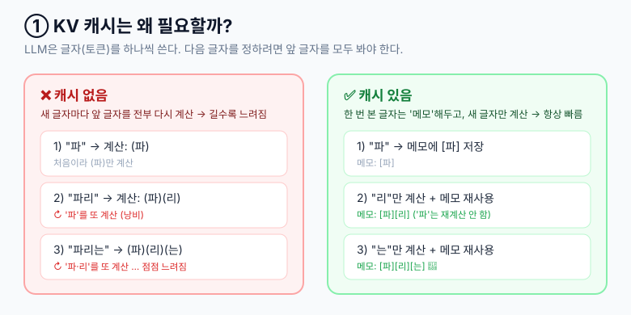
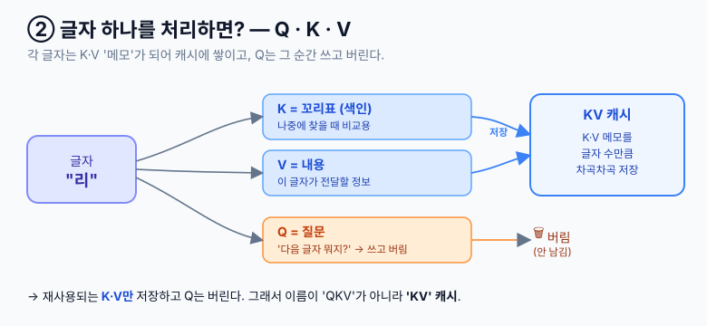
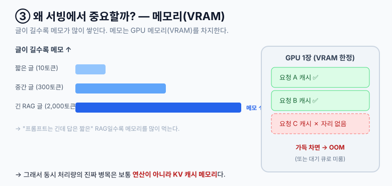

# KV 캐시 (KV Cache) · 기초편

## 1. 요약

### 1.0 가장 쉽게 (먼저 이것만 봐도 80%)

> LLM은 글을 **한 글자(토큰)씩** 쓴다. 새 글자를 정하려면 지금까지 쓴 글을 다 봐야 하는데, **매번 처음부터 다시 읽으면 느리다.** 그래서 한 번 읽은 글자는 **메모로 남겨두고 새 글자만 추가**한다. 이 메모 묶음이 **KV 캐시**다.







**세 줄 요약:**
- **K**=꼬리표(색인), **V**=내용, **Q**=질문 → Q는 쓰고 버리고 **K·V만 메모로 쌓인다** (그래서 'QKV'가 아니라 **'KV' 캐시**)
- 한 번 계산한 메모를 재사용하니 **새 글자만 계산** → 빠르다
- 메모가 글자 수만큼 쌓이니 **글이 길수록 VRAM을 많이 먹는다** → 서빙의 핵심 고민

> 여기까지가 핵심이다. 아래 2~4장은 "실제로 서버를 돌릴 때" 필요한 디테일이니, 처음 읽는다면 1.0만으로 충분하다.

### 1.1 TL;DR (운영 키워드만)

- 과거 K·V를 재사용해 재계산을 피한다 → 토큰 생성 복잡도 `O(n²) → O(n)`.
- 비용은 **VRAM**. 동시 처리량의 진짜 병목은 보통 연산이 아니라 **KV 캐시 메모리**이고, 서빙 OOM은 대부분 이 초과다.
- vLLM의 `PagedAttention`·`continuous batching`·`prefix caching`이 이를 효율화한다.
- API의 `prompt caching`(Anthropic/OpenAI)은 prefix 단위 KV 재사용을 상품화한 것이다.

### 1.2 한 줄 정의

| 용어 | 한 줄 정의 |
|---|---|
| `KV 캐시` | 디코더가 이미 계산한 토큰들의 Key/Value 텐서를 메모리에 보관해 다음 토큰 생성 시 재사용하는 캐시 |
| `prefill` | 입력 프롬프트 전체의 K/V를 한 번에 계산해 캐시에 채우는 단계 |
| `decode` | 새 토큰 1개씩 생성하며 그 토큰의 K/V만 캐시에 append 하는 단계 |

## 2. 왜 필요한가 (조금 더 자세히)

> 직관은 위 **§1.0 그림**이면 충분하다. 여기는 용어를 한 번 더 정리하는 정도.

> 📎 attention 자체가 처음이라면 [Attention (기초편)](./260603-attention-기초.md)을 먼저 보면 이 장이 훨씬 쉽다. ("왜 K·V만 캐싱하는가"의 답이 거기 있다.)

LLM은 토큰을 하나씩 생성하고(autoregressive), 새 토큰을 만들 때 attention이 **앞의 모든 토큰**을 본다. 캐시가 없으면 매 토큰마다 전체를 다시 계산해 `O(n²)`로 낭비된다. KV 캐시로 과거 K·V를 재사용하면 새 토큰분만 계산해 `O(n)`이 된다.

- **Q**(질문)는 매번 현재 토큰 것만 쓰고 버린다 → 캐시 안 함
- **K·V**는 과거 전부가 매 스텝 다시 필요하다 → 캐시함 → 그래서 'KV' 캐시

> ⚠️ **KV 캐시는 무손실이다.** K·V는 토큰에 고정 가중치를 곱한 **결정론적 값**이라, 캐시를 쓰든 매번 재계산하든 출력은 동일하다. 손실이 생기는 건 캐시가 아니라 [§3.1의 메모리 절감 기법](#31-메모리를-줄이는-기법)(양자화·eviction)을 쓸 때뿐이다.

### 2.1 두 단계: prefill vs decode

| 단계 | 하는 일 | 특성 | 병목 |
|---|---|---|---|
| prefill | 입력 프롬프트 전체를 한 번에 처리해 K/V 채움 | 연산 집약적(compute-bound), 병렬 처리 | GPU 연산량 |
| decode | 토큰을 1개씩 생성, 캐시에 누적 | 메모리 대역폭 집약적(memory-bound) | KV 캐시 읽기/VRAM |

> 운영 관점: 첫 토큰까지 걸리는 시간(TTFT, Time To First Token)은 prefill이, 이후 토큰 생성 속도(TPOT, Time Per Output Token)는 decode가 좌우한다.

## 3. 트레이드오프: 메모리를 먹는다

연산은 아꼈지만 VRAM을 잡아먹는다. 대략적인 크기 공식:

```
KV 캐시 크기 ≈ 2(K,V) × num_layers × seq_len × hidden_dim × batch_size × dtype_bytes
```

- `seq_len`(컨텍스트 길이)에 **선형 비례** -> 긴 RAG 프롬프트 = 큰 캐시
- `batch_size`에 **선형 비례** -> 동시 요청 많을수록 큰 캐시
- 그래서 LLM 서빙에서 동시 처리량의 병목은 보통 **연산이 아니라 KV 캐시 메모리**다. 컨텍스트가 길거나 배치가 크면 VRAM이 먼저 터진다.

### 3.1 메모리를 줄이는 기법

| 기법 | 아이디어 |
|---|---|
| MQA / GQA (Multi/Grouped-Query Attention) | 여러 attention head가 K/V를 공유 -> 캐시 크기 대폭 축소 (Llama 등 최신 모델 기본 채택) |
| KV 캐시 양자화(quantization) | K/V를 FP16 대신 INT8/FP8로 저장 -> 메모리 절반 이하 |
| PagedAttention | 캐시를 고정 크기 페이지로 쪼개 단편화 제거 (아래 참조) |
| Sliding window / 캐시 eviction | 오래된 토큰 K/V를 버려 긴 컨텍스트에서 메모리 상한 유지 |

## 4. 실무에서 만나는 지점 (서비스 개발자 관점)

LLM 서빙/운영 관심사와 직결되는 부분이다.

| 기술 | KV 캐시와의 관계 |
|---|---|
| **vLLM / PagedAttention** | KV 캐시를 OS 가상메모리처럼 "페이지" 단위로 관리해 메모리 단편화를 제거 -> 처리량 대폭 향상. vLLM의 핵심 |
| **Continuous batching** | 요청이 끝나면 그 KV 캐시 슬롯을 즉시 다른 요청에 재활용 -> GPU를 놀리지 않음 |
| **Prefix caching** | 여러 요청이 공유하는 prefix(시스템 프롬프트 등)의 KV를 재사용 |
| **Prompt caching (API)** | 위 prefix caching을 API 상품화한 것. 같은 prefix 반복 요청 시 KV 재사용 -> 비용·지연 감소. "긴 시스템 프롬프트를 앞에 고정"하라는 가이드가 여기서 나옴 |

### 4.1 vLLM 옵션 매핑 (Runpod 등 직접 서빙 시)

이 옵션들은 전부 KV 캐시 메모리 예산을 조절하는 손잡이다.

| 옵션 | 의미 | KV 캐시와의 관계 |
|---|---|---|
| `--gpu-memory-utilization` | GPU 메모리 중 vLLM이 쓸 비율 (기본 0.9) | 모델 가중치를 뺀 나머지가 KV 캐시 풀이 됨 |
| `--max-model-len` | 최대 컨텍스트 길이 | 요청 1건이 점유할 수 있는 캐시 상한 결정 |
| `--max-num-seqs` | 동시 처리 시퀀스(요청) 수 | 배치 크기 -> 총 캐시 수요 |
| `--kv-cache-dtype` | 캐시 저장 자료형 (`fp8` 등) | 캐시 양자화로 메모리 절감 |
| `--enable-prefix-caching` | prefix 캐시 재사용 활성화 | 공통 프롬프트 KV 재사용 |

> 💡 **OOM 트러블슈팅**: 서빙 중 "CUDA out of memory" -> 대부분 KV 캐시 초과다. 대응 순서:
> 1. `--max-model-len` 낮추기 (요청당 캐시 상한 축소)
> 2. `--max-num-seqs` 낮추기 (동시성 축소)
> 3. `--kv-cache-dtype fp8` (캐시 양자화)
> 4. GQA 채택 모델로 교체

## 5. 시나리오로 보기

이론을 실제 요청 흐름에 얹어 본다.

### 시나리오 1 — 단일 요청: "RAG 컨텍스트 2,000토큰 + 질문" → 답변 100토큰 생성

```
t0  prefill   ┌──────────────────────────────────┐
              │ 프롬프트 2,000토큰 K/V 일괄 계산    │  ← GPU 연산 빵빵 (compute-bound)
              └──────────────────────────────────┘
              KV캐시 [██████████████████ 2,000칸]   ← 첫 토큰 나오기 전 이미 이만큼 참
              (여기까지 걸린 시간 = TTFT)

t1  decode    토큰#1 생성 → 자기 K/V 1칸 append
              KV캐시 [██████████████████ 2,001]
t2  decode    토큰#2 생성 → +1칸
              KV캐시 [██████████████████ 2,002]
 …            (토큰마다 "캐시 전체 읽기" = memory-bound, 이 속도가 TPOT)
t100 decode   토큰#100 → EOS, 응답 완료
              KV캐시 [██████████████████ 2,100칸] 점유 → 요청 끝나면 해제
```

> 포인트: 긴 RAG 컨텍스트는 **첫 토큰이 나오기도 전에** 캐시를 잔뜩 점유한다. "프롬프트는 긴데 답은 짧은" RAG 워크로드가 메모리를 많이 먹는 이유.

### 시나리오 2 — 동시 요청과 OOM: vLLM 서버, KV 캐시 풀 = 10,000칸

```
요청 A(컨텍스트 4,000)  요청 B(4,000)  요청 C(4,000)  이 동시에 도착 → 합 12,000 > 10,000

KV 캐시 풀 [10,000칸]
 ├ A 할당 [████ 4,000]
 ├ B 할당 [████ 4,000]   누적 8,000  (OK)
 └ C ...  [██        ]   남은 2,000칸뿐 → C는 대기 큐로 보류
                         (continuous batching: A나 B가 끝나 칸이 비면 그때 C 투입)

만약 스케줄러 없이 셋을 한꺼번에 욱여넣으면:
   → CUDA out of memory   ← 현업에서 보는 바로 그 에러
```

> 포인트: vLLM은 OOM을 내는 대신 **들어갈 만큼만 배치에 넣고 나머지는 큐**에 둔다(`--max-num-seqs`가 이 상한). OOM이 났다면 한 요청의 컨텍스트(`--max-model-len`)가 너무 크거나 풀 자체가 작은 것.

### 시나리오 3 — prefix caching: 같은 시스템 프롬프트(1,500토큰)를 쓰는 요청 100건

```
[prefix 캐시 OFF]
 요청마다 시스템 1,500토큰을 매번 prefill 재계산
 → TTFT 매번 동일하게 느림, GPU 연산 낭비

[prefix 캐시 ON  (--enable-prefix-caching)]
 요청1     : 시스템 1,500 prefill → KV 저장        (cache write)
 요청2~100 : 저장된 1,500칸 K/V 재사용 + 질문 부분만 prefill   (cache read)
             └→ TTFT 급감, GPU 연산 급감

 ※ Anthropic/OpenAI의 prompt caching이 정확히 이 동작을, 응답의
    cache_read / cache_write 토큰(과금 항목)으로 노출한 것
```

> 포인트: "긴 공통 프롬프트는 앞에 고정하라"는 가이드가 여기서 나온다. prefix가 한 토큰이라도 달라지면 그 지점부터 캐시가 깨져 재계산된다.

## 6. prompt caching과의 관계 정리

용어가 헷갈리기 쉬워 명확히 구분한다.

| 구분 | KV 캐시 | Prompt Caching |
|---|---|---|
| 레벨 | 모델 내부(추론 엔진) 메커니즘 | API 제품 기능 |
| 범위 | 한 번의 생성 요청 내부 | 여러 요청에 걸친 prefix 재사용 |
| 노출 | 사용자에게 보이지 않음 | API 응답에 `cache_read`/`cache_write` 토큰으로 노출, 과금 항목 |
| 본질 | 토큰별 K/V 텐서 | KV 캐시를 prefix 단위로 저장/재사용한 것 |

즉 **Prompt Caching은 KV 캐시 메커니즘 위에 세운 API 기능**이다.

## 7. 다음 문서 — KV 캐시 심화 (예정)

이 문서는 **기초편**이다. 아래 주제는 별도 '심화' 문서에서 다룬다:

- PagedAttention / vLLM 내부 동작 깊게 보기
- GQA vs MQA vs MHA 메모리·품질 트레이드오프
- prompt caching의 cache write/read 과금 구조와 break-even 계산
- 멀티 GPU 서빙 시 KV 캐시 분산(tensor parallel)

## 참고

- [vLLM: PagedAttention 논문](https://arxiv.org/abs/2309.06180)
- [vLLM 공식 문서 — Engine Arguments](https://docs.vllm.ai/)
- [Anthropic — Prompt caching](https://docs.anthropic.com/en/docs/build-with-claude/prompt-caching)
