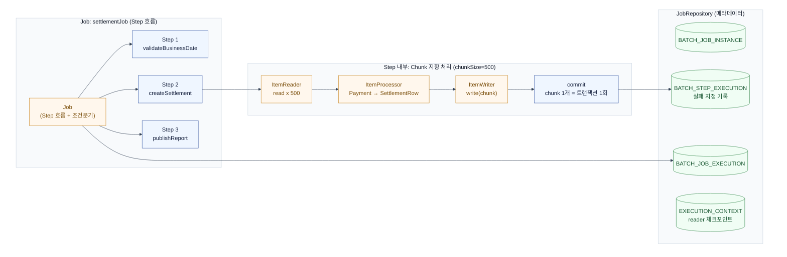
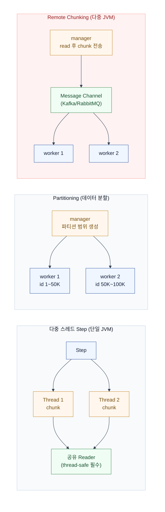

# Spring Batch

Spring Batch는 대량 데이터를 안전하게 처리하기 위한 프레임워크다.  
핵심은 **실행 상태를 저장해서 실패한 지점부터 재시작(restartability)** 할 수 있다는 것.  
일반 스케줄러 + `for`문으로는 얻을 수 없는, 프레임워크가 주는 가치다.

## 왜 스케줄러 + for문으로는 안 되는가

| 요구 | for문 + saveAll | Spring Batch |
|---|---|---|
| 100만 건 처리 중 70만 건째 실패 | 처음부터 다시 | 실패한 Step의 체크포인트부터 이어서 |
| 트랜잭션 경계 | 전체를 한 번에 커밋하거나 직접 관리 | chunk size 단위로 자동 커밋/롤백 |
| 실행 이력 추적 | 직접 로깅 | 메타데이터 테이블에 자동 기록 |
| 조건 분기(실패 시 알림 Step) | 직접 분기 코드 | Job 흐름 정의로 선언적 분기 |

정산 배치를 관통 예제로 쓴다:  
**정산 대상 결제를 읽어 일별 정산 데이터를 생성**하는 배치.

## Job, Step, JobRepository 관계



- **Job** = 실제 처리 코드가 아니라 여러 Step의 **실행 흐름**. 순차 실행이 기본이고 `ExitStatus`로 조건 분기.
- **Step** = 독립적으로 실행·재시작할 수 있는 단위. Tasklet(단순) 또는 Chunk(대량).
- **JobRepository** = 모든 실행 상태를 메타데이터 테이블에 저장 → restartability의 기반.

### Job 흐름과 조건 분기

```java
@Bean
Job settlementJob(
        JobRepository jobRepository,
        Step validateBusinessDateStep,
        Step createSettlementStep,
        Step publishReportStep) {

    return new JobBuilder("settlementJob", jobRepository)
            .start(validateBusinessDateStep)
                .on("FAILED").fail()
            .from(validateBusinessDateStep)
                .on("NO_DATA").end()
            .from(validateBusinessDateStep)
                .on("COMPLETED").to(createSettlementStep)
            .from(createSettlementStep)
                .on("COMPLETED").to(publishReportStep)
            .end()
            .build();
}
```

### 핵심 개념 구분 — restartability의 열쇠

이 구분이 있어야 "같은 파라미터로 재실행하면 실패 Step부터 이어간다"가 설명된다.

| 개념 | 의미 | 재시작과의 관계 |
|---|---|---|
| `JobInstance` | Job 이름 + 식별용 `JobParameters`로 구분되는 **논리적 작업** | 같은 식별 파라미터로 재실행해야 같은 인스턴스의 재시작으로 인식 |
| `JobExecution` | JobInstance에 대한 **개별 실행 시도** | 실패하면 새 Execution 생성, 이전 상태는 보존 |
| `StepExecution` | 각 Step의 실행 시도, read/write/skip/commit 건수 | 실패한 Step의 EXECUTION이 재시작 기준 |
| `ExecutionContext` | reader 위치 등 재시작에 필요한 체크포인트 | chunk 단위 재개의 원리 |

> **재실행 주의**: 실패한 Job을 재시작하려면 **새로운 식별 파라미터를 만들면 안 된다**.  
> 같은 `JobParameters`로 실행해야 기존 JobInstance의 재시작으로 인식된다.

## Chunk 지향 처리

Chunk 지향은 `read → process → write → commit`을 반복한다.  
**chunk size = 한 트랜잭션에서 처리할 아이템 수 = 커밋 단위**.

```text
ItemReader → ItemProcessor → ItemWriter → commit
 500건 읽고  →  변환/필터  →  한 번에 write → 트랜잭션 커밋
```

- chunk 중간 실패 시 **그 chunk만 롤백**, 이전 chunk는 이미 커밋됨.
- 따라서 **writer와 외부 API 연동은 멱등성을 고려해야 한다** — restartability가 성립하려면 Step이 멱등해야 한다.

### chunk size 트레이드오프

| chunk size | 커밋 오버헤드 | 롤백 범위 | 메모리 |
|---|---|---|---|
| 크게 (예: 5000) | ↓ 적음 | ↑ 큼 | ↑ 큼 |
| 작게 (예: 100) | ↑ 많음 | ↓ 작음 | ↓ 작음 |

### 정산 배치 예제

```java
@Configuration
class SettlementBatchConfiguration {

    private static final int CHUNK_SIZE = 500;

    @Bean
    JpaPagingItemReader<Payment> paymentReader(
            EntityManagerFactory entityManagerFactory) {

        return new JpaPagingItemReaderBuilder<Payment>()
                .name("paymentReader")
                .entityManagerFactory(entityManagerFactory)
                .queryString("""
                    select p
                    from Payment p
                    where p.settlementStatus = :status
                    order by p.id
                    """)
                .parameterValues(Map.of("status", SettlementStatus.READY))
                .pageSize(CHUNK_SIZE)
                .saveState(true)          // ExecutionContext에 reader 위치 저장 → 재시작 가능
                .build();
    }

    @Bean
    ItemProcessor<Payment, SettlementRow> settlementProcessor() {
        return payment -> new SettlementRow(
                payment.getId(),
                payment.getMerchantId(),
                payment.getAmount());
    }

    @Bean
    JdbcBatchItemWriter<SettlementRow> settlementWriter(DataSource dataSource) {
        return new JdbcBatchItemWriterBuilder<SettlementRow>()
                .dataSource(dataSource)
                .sql("""
                    insert into settlement (payment_id, merchant_id, amount)
                    values (:paymentId, :merchantId, :amount)
                    on conflict (payment_id) do nothing   -- 멱등: 재실행해도 중복 없음
                    """)
                .beanMapped()
                .build();
    }

    @Bean
    Step createSettlementStep(
            JobRepository jobRepository,
            PlatformTransactionManager transactionManager,
            JpaPagingItemReader<Payment> paymentReader,
            ItemProcessor<Payment, SettlementRow> settlementProcessor,
            JdbcBatchItemWriter<SettlementRow> settlementWriter) {

        return new StepBuilder("createSettlementStep", jobRepository)
                .<Payment, SettlementRow>chunk(CHUNK_SIZE, transactionManager)
                .reader(paymentReader)
                .processor(settlementProcessor)
                .writer(settlementWriter)
                .faultTolerant()
                .retry(TransientDataAccessException.class)   // 일시적 장애만 재시도
                .retryLimit(3)
                .skip(InvalidSettlementException.class)      // 검증 실패는 스킵
                .skipLimit(100)
                .build();
    }

    @Bean
    Job settlementJob(JobRepository jobRepository, Step createSettlementStep) {
        return new JobBuilder("settlementJob", jobRepository)
                .start(createSettlementStep)
                .build();
    }
}

record SettlementRow(long paymentId, long merchantId, BigDecimal amount) {}
```

> **Spring Batch 5 변경점**  
> deprecated된 `JobBuilderFactory`/`StepBuilderFactory` 대신 `JobBuilder`/`StepBuilder`에  
> `JobRepository`를 직접 주입한다.  
> Spring Boot 자동 설정을 쓰면 `@EnableBatchProcessing`은 보통 생략 가능하다.  
> 등록된 Job은 `JobLauncherApplicationRunner`에 의해 **애플리케이션 시작 시 자동 실행**될 수 있다.

서버 기동과 배치 실행을 분리하려면 자동 실행을 끈다:

```yaml
spring:
  batch:
    job:
      enabled: false
```

## 메타데이터 테이블과 restartability

"테이블 나열"이 아니라 **"재시작 시 프레임워크가 이 테이블에서 무엇을 읽는가"** 관점으로 본다.

| 테이블 | 역할 |
|---|---|
| `BATCH_JOB_INSTANCE` | Job 이름 + 식별 파라미터 → JobInstance 식별 |
| `BATCH_JOB_EXECUTION` | 시작·종료 시각, 실행 상태, ExitCode |
| `BATCH_JOB_EXECUTION_PARAMS` | JobParameters 저장 |
| `BATCH_STEP_EXECUTION` | Step 상태 + read/write/skip/commit/rollback 건수 |
| `BATCH_JOB_EXECUTION_CONTEXT` | Job 범위 체크포인트 |
| `BATCH_STEP_EXECUTION_CONTEXT` | reader 위치 등 Step 범위 체크포인트 |

재시작 시 Spring Batch는 **완료된 Step을 건너뛰고**,  
실패한 Step은 `ExecutionContext`의 reader 위치를 읽어 **마지막 체크포인트 이후부터** 실행한다.

### 운영 모니터링 쿼리

```sql
select step_name, status,
       read_count, write_count, filter_count,
       read_skip_count, process_skip_count, write_skip_count,
       commit_count, rollback_count
from batch_step_execution
where job_execution_id = :jobExecutionId;
```

## 실패를 다루는 법 — skip vs retry

| | retry | skip |
|---|---|---|
| 대상 오류 | 일시적(락 타임아웃, 일시적 DB 장애) — 재시도하면 성공 가능 | 검증 실패 등 같은 입력에서 반복되는 오류 |
| 전제 | 멱등 (재시도해도 같은 결과) | 일부 오염 데이터가 전체 배치를 죽이면 안 될 때 |
| 설정 | `.retry(...).retryLimit(3)` | `.skip(...).skipLimit(100)` |

```java
.faultTolerant()
.retry(TransientDataAccessException.class)   // 일시적 장애: 재시도
.retryLimit(3)
.skip(InvalidSettlementException.class)      // 검증 실패: 스킵
.skipLimit(100)
```

## 분산 배치 3패턴

분산 패턴 선택은 **"병목이 CPU인가 I/O인가, reader가 thread-safe한가"** 에서 출발한다.  
세 패턴은 **데이터를 누가 읽고 어떻게 분배하는가**가 다르다.



### 비교표

| | 다중 스레드 Step | Partitioning | Remote Chunking |
|---|---|---|---|
| 실행 위치 | 단일 JVM | 단일/다중 JVM | 다중 JVM (필수) |
| 분배 방식 | Step이 chunk를 스레드에 할당 | 데이터를 파티션(StepExecution)으로 분할 | read는 manager, process/write를 worker로 |
| 전제 조건 | thread-safe reader/writer | 파티션 키(ID 범위·날짜) 존재 | 메시징 인프라(Spring Integration + AMQP/Kafka) |
| restartability | 약화 (reader 상태 저장 불가) | 파티션별로 유지 | 메시지 유실/중복 처리 설계 필요 |
| 병목 해소 | CPU 바운드 process | reader 포함 전체 | process가 무겁고 read는 가벼울 때 |
| 한계 | JVM 한 대 한계, 순서 비결정성 | 파티션 불균향(skew), DB 경합 | 운영 복잡도 최고, 직렬화 비용 |

### 1) 다중 스레드 Step

Step 하나가 `TaskExecutor`로 여러 스레드에 chunk를 분배한다.  
같은 reader/writer가 여러 스레드에서 호출되므로 **thread-safe해야 한다**.

```java
@Bean
Step multiThreadSettlementStep(
        JobRepository jobRepository,
        PlatformTransactionManager transactionManager,
        ItemReader<Payment> threadSafeReader,
        ItemWriter<Payment> threadSafeWriter) {

    return new StepBuilder("multiThreadSettlementStep", jobRepository)
            .<Payment, Payment>chunk(500, transactionManager)
            .reader(threadSafeReader)
            .writer(threadSafeWriter)
            .taskExecutor(new SimpleAsyncTaskExecutor("settlement-"))
            .build();
}
```

> 상태를 갖는 reader를 공유하면 중복이나 누락이 발생한다.  
> `JpaPagingItemReader`는 `saveState(true)` 상태를 저장하지만,  
> 멀티스레드에서는 상태 공유가 충돌하므로 `saveState(false)`로 설정해야 한다.

### 2) Partitioning

manager가 각 worker에 **데이터가 아닌 범위**를 전달한다.  
각 worker Step은 자신의 범위를 직접 조회한다.

```java
// manager가 파티션별 ExecutionContext 생성
executionContext.putLong("minPaymentId", 1L);
executionContext.putLong("maxPaymentId", 100_000L);
```

한 파티션만 실패하면 **해당 StepExecution을 기준으로 실패 파티션만 재실행**할 수 있다.

> **주의**: 파티션 불균형(skew)이 발생하면 느린 파티션이 전체 Job 완료를 지연시킨다.  
> restartability는 유지되지만 처리 시간 보장은 별개 문제다.  
> 균등 분할이 가능한 키(예: ID 범위)를 파티션 키로 써야 한다.

### 3) Remote Chunking

manager가 데이터를 읽어 **메시지 채널**로 worker에 전송한다.  
worker는 받은 chunk를 처리·저장하고 결과를 회신한다.

```text
Partitioning:      manager → 범위 전달 → worker가 DB 조회·처리·저장
Remote Chunking:   manager가 DB 조회 → chunk 전송 → worker가 처리·저장
```

- Spring Integration + AMQP/Kafka 같은 메시징 구성이 추가로 필요.
- **메시지는 재전송될 수 있으므로** business key 기반 멱등 저장이 필수.
- manager가 병목이 되면 전체 처리량이 거기서 막힌다.

### 패턴 선택 우선순위

```
1. 단일 Step 튜닝 (chunk size, reader 최적화) — 대부분 여기서 해결
2. 파티션 키가 있으면 Partitioning — 가장 실용적인 확장
3. process만 무겁고 read가 가벼우면 Remote Chunking — 인프라 비용 큼, 실제로는 드묾
```

> 실무에서 Remote Chunking까지 가는 경우는 드물다.  
> 보통 1~2번으로 충분하다.

## 대용량 성능 — Paging vs Cursor, JPA vs JDBC

| 선택지 | 장점 | 주의점 |
|---|---|---|
| `JpaPagingItemReader` | 페이지 단위 조회, 영속성 컨텍스트 관리 | ORM 변환 비용, N+1, 데이터 변경 시 페이지 밀림 |
| Hibernate cursor reader | 스트리밍, 애플리케이션 메모리 작음 | 커서·커넥션 장시간 점유 |
| JDBC paging reader | 빠르고 메모리 안정적 | 유일하고 안정적인 정렬 키 필요 |
| JDBC cursor reader | 순차 처리 성능 좋음 | 긴 트랜잭션·연결 단절에 취약 |

> JPA 엔티티 변환이 필요 없다면 **JDBC 기반 reader + batch writer가 더 단순하고 빠르다**.

### 메모리 주의사항

- `readAll()`이나 전체 결과를 담는 컬렉션을 쓰지 않는다 — chunk 단위 스트리밍.
- processor에서 결과를 누적하지 않는다.
- JPA 사용 시 **영속성 컨텍스트가 메모리 누수의 주범** — flush/clear 주기.
- JPA `N+1`과 영속성 컨텍스트 크기를 확인.
- 병렬도는 **DB connection pool보다 무작정 크게** 설정하지 않는다.
- writer는 중복 실행을 허용하도록 **unique key + upsert**로 설계.
- 외부 API 호출 결과는 요청 ID와 처리 상태를 별도 저장.

## 실습 검증 기준

- chunk size와 DB batch size를 조정하며 처리량을 측정.
- Paging 정렬 키에는 **변경되지 않는 유일 키** 사용.
- 재시작 시나리오: 중간 실패 → 같은 파라미터로 재실행 → 실패 지점부터 이어가는지 확인.
- skip/retry 정책이 의도대로 동작하는지 로그로 검증.
- 분산 패턴 적용 시 reader thread-safety와 멱등성을 먼저 점검.
