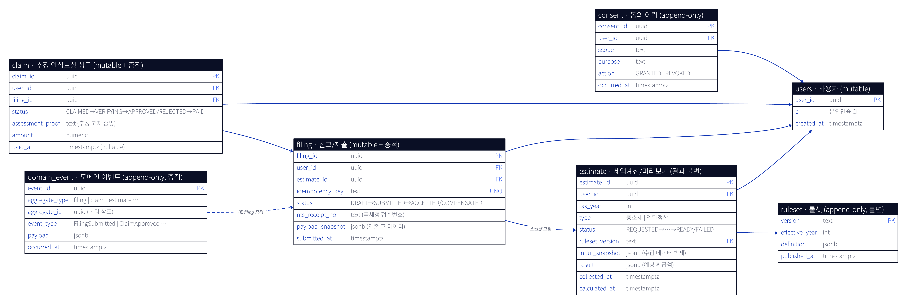
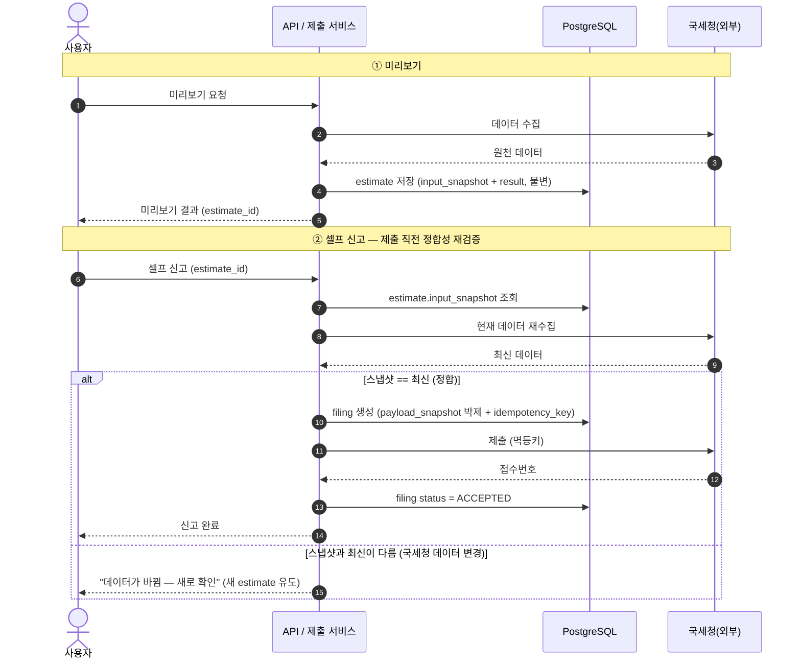

# 종합소득세 환급 / 연말정산 — 설계 (아키텍처 + 도메인)

## 0. 문제 정의 (서비스 표면)

- **숨은 환급액 찾기 (종소세)**: 못 받은 환급금 조회 + 셀프 신고
- **올해 환급액 미리보기**: 3분 만에 예상 환급 결과
- **연말정산 미리보기**: 예상 환급/납부 점검 + 절세 팁
- **추징 안심보상제**: 셀프 신고 후 추징 고지 받으면 보상 (최대 100만 원)

한 줄 요약: **국세청 데이터를 모아 → 세액을 계산해 보여주고 → 셀프 신고까지 대행하고 → 사후 추징을 보상**한다.

## 1. 이 도메인이 아키텍처적으로 까다로운 이유

| 특성 | 함의 |
|---|---|
| **느린 외부 의존 (국세청 홈택스/손택스)** | 수집이 수십 초~분, 점검·폭주·레이트리밋. 통제 불가 → 비동기·리질리언스 필수 |
| **부작용 있는 쓰기 (신고 제출)** | 결제급 정확성. 재시도 시 **이중 신고** 금지 → 멱등성·사가 |
| **민감 데이터 (주민번호·소득·계좌)** | 암호화·본인인증·마이데이터·감사·규제 |
| **세법이 매년 바뀜** | 연도별 룰셋 버저닝 + "어떤 룰로 계산했나" 재현성 |
| **시즌 폭증 (5월 종소세 / 1~2월 연말정산)** | 평소 대비 수십 배 → 오토스케일·큐 백프레셔 |
| **"타임아웃을 성공으로 오판"이 치명적** | 신고 안 됐는데 됐다고 하면 가산세·신뢰 붕괴 |

## 2. 가상 시나리오 (각 레벨이 이걸 어떻게 견디나)

> **5월 15일 밤 9시, 종소세 마감 임박.**  
> 사용자 A가 '숨은 환급액 찾기'를 누른다. 그런데 지금 국세청 홈택스는 **마감 직전 트래픽 폭주로 느리고 간헐적으로 실패**한다.  
> 사용자 A는 미리보기를 보고 만족해 '셀프 신고'를 누르는데, **제출 응답이 30초째 안 온다.**  
> 답답한 그는 앱을 끄고 다시 들어와 또 '신고'를 누른다.

터질 수 있는 것: **1️⃣** 3분 동기 대기 불가 · **2️⃣** 국세청 장애 전파 · **3️⃣** 이중 신고 · **4️⃣** 타임아웃을 성공/실패 중 뭘로 볼 것인가.

---

# 파트 1 — 아키텍처 (흐름)

## L0 — 단순 동기 (의도적으로 깨지는 그림)

> 흐름 1→3 동기 체인 · 빨강 = 국세청(외부)

가장 순진한 `앱 → API → 국세청 → 계산 → 응답` 동기 체인. **깨지는 지점:**

1. 국세청 호출 수십 초~분 → HTTP 타임아웃 · 3분 동기 대기 불가 — *시나리오 1️⃣*
2. 국세청 점검·폭주 시 전체 요청 실패 — 장애 격리(bulkhead/CB) 없음 — *2️⃣*
3. 동기 처리 → 5월 폭증에 스레드/커넥션 풀 고갈 → cascading failure
4. 상태 없음 → 중간 실패하면 처음부터 다시 — *재시도 불가*

→ 결론: **느린 외부 의존을 동기로 두면 안 된다.** (제출 3️⃣4️⃣는 아직 손도 못 댐)

---

## L1 — 비동기 잡 + 상태 관리

> 흐름 1→7 · 점선 = 폴링/상태 전이 · 빨강 = 국세청(외부)

**L0 대비 추가**: API Gateway · Kafka(잡 토픽) · Worker · PostgreSQL(상태 머신).

- 국세청 수집을 **워커 잡**으로 분리 → API는 즉시 `jobId` 반환, 사용자는 폴링으로 결과 수신 ⇒ **1️⃣3️⃣ 해결**("3분 미리보기"가 비동기로 성립).
- 진행 상태를 **PostgreSQL**(`REQUESTED→COLLECTING→CALCULATING→READY`)에 저장 → 중간 실패해도 이어서 재시도 ⇒ **4️⃣ 해결**.
- Kafka 버퍼링으로 시즌 폭증 흡수(동기 스레드 고갈 → 토픽 적체로 전환).

**아직 남은 것** → L2에서:

- 국세청이 죽으면 워커가 계속 때린다 — 보호 없음(**2️⃣ 미해결**).
- '제출'(부작용)을 아직 안 다룸 — **이중 신고**(시나리오의 "또 신고 누름") 위험 그대로.

---

## L2 — 리질리언스 + 셀프 신고 사가 + 횡단 (최종 통합본)

**L1 대비 추가** — 남은 문제를 정확히 겨냥해서 얹는다:

- **읽기 보호(2️⃣)**: Worker→국세청 경로에 Retry(backoff+jitter) · Circuit Breaker · Rate Limiter, **ElastiCache** 단기 캐시, **Kafka DLT**(dead-letter topic) ⇒ 국세청이 흔들려도 격리·완충.
- **쓰기 사가(3️⃣4️⃣)**: API Gateway→**제출 서비스**(Spring 서비스, 사가를 코드로 구동·상태는 PostgreSQL): `검증 → 제출(멱등키) → 접수확인 폴링 → 완료기록`, 실패 시 보상. 같은 멱등키 → **한 번만 접수**, 타임아웃 시 **상태 재확인 후 판단**(성공 오판 금지). *(워크플로가 길고 복잡해지면 Temporal 같은 durable workflow 엔진으로 승급)*
- **부가**: 완료 **알림 서비스**(FCM/APNs) · **S3**(원천·신고서) · 횡단(KMS/Secrets·룰셋 버저닝+계산 스냅샷·관측).

### 오케스트레이션 vs 코레오그래피 (한 설계에 둘 다 섞임)
- **제출 사가 = 오케스트레이션**: **제출 서비스**가 `검증→제출(멱등)→접수확인 폴링→완료/보상`을 **중앙에서 구동·상태 추적**. 보상·"정확히 한 번"·순서가 중요해서 **의도적으로 중앙 조정자**를 둠.
- **후속 fan-out = 코레오그래피**: `FilingAccepted` **이벤트 발행** → 알림(FCM/APNs)·회계·분석이 **각자 자율 구독·반응**. 중앙 조정자 없음 → 구독자 추가가 쉬움.
- 기준: **커맨드 + 상태 추적 = 오케스트레이션**, **이벤트 반응 연쇄 = 코레오그래피**. Kafka는 **매체일 뿐** — 매체가 패턴을 정하지 않는다.

> 읽기는 "견디기", 쓰기는 "정확히 한 번" — 이 비대칭이 설계의 뼈대.

## 맹점(Blind Spots) 체크리스트

면접에서 "그럼 이건?" 들어오는 지점 (정합성·룰셋·보상·규제는 **파트 2 '핵심 설계 결정'** 에서 데이터/모델로 다룸):

- **미리보기 ↔ 제출 정합성**: 수집 데이터가 제출 시점에 다를 수 있음 → 제출 직전 재검증 / 스냅샷 고정.
- **스크래핑 취약성**: 국세청 UI/포맷 변경 시 수집 깨짐 → 합성 모니터링(canary), 공식 API 우선.
- **계산 룰 버그**: 잘못 계산 → 가산세 책임. 룰셋 테스트·이중 계산 검증·점진 배포.
- **추징 안심보상제 악용**: 보상 청구 진위 검증(실제 추징 고지 확인), 사기 탐지, 보상 회계.
- **개인정보·규제**: 최소 수집, 보관기간, 파기, 접근 통제, 동의 이력.
- **세션·인증**: 본인인증 토큰 만료, 마이데이터 스코프, 권한.
- **시즌 외 비용**: 상시 인프라는 낭비 → 스케일 인/서버리스 혼용.

---

# 파트 2 — 도메인 모델 & DB (데이터)

> 파트 1이 "흐름"이라면 여기는 "데이터·모델". 위 맹점의 절반(정합성·룰셋·보상·규제)은 사실 도메인/데이터 결정이다.

## 데이터 저장소 — PostgreSQL 중심

큐/스트림에서 SQS/SNS(AWS 락인)를 버리고 Kafka로 간 것과 **같은 논리**로, 상태 저장도 DynamoDB(AWS 락인) 대신 **PostgreSQL 중심**으로 간다. 도메인이 죄다 관계형(조인·트랜잭션·unique 멱등키·감사 쿼리·규제 조회)이라 더 자연스럽다.

| 저장소 | 담는 것 | 이유 |
|---|---|---|
| **PostgreSQL** | 도메인 전부 + 잡 상태 (사용자·동의·룰셋·계산·신고·보상·감사) | 관계·트랜잭션·`UNIQUE` 멱등키·`JSONB` 유연성·파티셔닝(보관/파기) |
| **Redis** | 수집 결과 단기 캐시 · 폴링 응답 캐시 · 레이트리밋/락 | 국세청 보호 + 읽기 폭증 흡수 (휘발 OK) |
| **S3** | 국세청 원천 데이터(raw) · 신고서 PDF | 큰 바이너리·장기 보관 |
| **Kafka** | 잡/이벤트 토픽 + DLT | 비동기·결합도↓ (→ [Kafka 구조](../cs-study/260617-kafka-구조.md)) |

> 규모 근거: 신고/계산은 메시지 수준의 초고 TPS가 아님(시즌 피크도 수백~수천 TPS급) → PostgreSQL + 인덱스 + 읽기 복제본 + Redis로 충분. 정말 더 필요해지면 그때 폴리글랏.

## 도메인 — 바운디드 컨텍스트 / 애그리거트

> 애그리거트·경계·ID 참조의 개념은 [DDD 애그리거트](../cs-study/260618-ddd-aggregate.md) 참고. 아래는 그 개념을 종소세 도메인에 적용한 결과.

- **estimate (세액계산/미리보기)** — 미리보기 산출. 룰셋 버전 + 입력 스냅샷 + 결과. **결과 불변**.
- **filing (신고/제출)** — 셀프 신고 제출 사가. 멱등키 + 제출 스냅샷 + 접수번호.
- **ruleset (룰셋)** — 연도별 세법 룰. **불변 버전**. 계산은 항상 특정 버전 참조.
- **claim (추징 안심보상 청구)** — 청구→검증→심사→지급.
- **consent (동의 이력)** — 마이데이터 동의/철회. **append-only**(철회=새 행).
- **domain_event (도메인 이벤트)** — 증적의 본체. **append-only** 비즈니스 사실 로그.
- (수집/인증은 외부 의존: 국세청, 마이데이터 IdP)

## ERD

> PK는 UUIDv7(자연키 있으면 자연키: `ruleset.version`), `FK` 표기는 **앱 레벨 논리 참조**(DB 제약 아님) — 아래 '키·제약 정책' 참고.

## 핵심 설계 결정 (= 맹점의 해소)

### 미리보기 ↔ 제출 정합성 → **불변 스냅샷 + 참조 고정**
- **estimate는 불변**: 재계산하면 새 row(새 `estimate_id`). 한 번 만든 미리보기는 안 바뀜.
- **filing은 특정 `estimate_id`에 고정** + 제출 시점 데이터를 `payload_snapshot`에 **박제**. → "그때 본 그 결과로 신고"가 보장됨.
- **제출 직전 재검증**: 현재 국세청 데이터를 다시 수집해 estimate의 `input_snapshot`과 diff. 달라졌으면 → 사용자에게 "데이터가 바뀜, 새로 확인"(새 estimate 유도). 조용히 진행하지 않음.

### 계산 룰 버그 → **룰셋 버저닝 + 재현성**
- 모든 estimate에 `ruleset_version` 박제. "어떤 룰로 계산했나"를 언제든 재현.
- ruleset은 불변 published 버전. 룰 수정 = 새 버전 발행 + 점진 배포.

### 이중 신고 → **`idempotency_key` UNIQUE**
- filing에 `idempotency_key UNIQUE`. "또 신고" 와도 같은 키면 INSERT 충돌 → 기존 filing 반환. (FK는 앱 레벨로 가도 UNIQUE는 DB에 두는 게 안전)
- 사가 상태(`status`) 전이는 트랜잭션으로. 타임아웃 시 SUBMITTED로 단정 금지 → 접수확인 후 판정.

### 개인정보·규제 → **동의 이력 + 보관/파기 + 감사**
- `consent`에 마이데이터 스코프·목적·동의/철회 이력화(append-only).
- 보관기간: `tax_year`로 **파티셔닝** → 만료 파티션 **drop**으로 일괄 파기.
- PII(주민번호·소득)는 컬럼 암호화(KMS/pgcrypto) + Redis 캐싱 시 짧은 TTL + 최소 스코프.

## PostgreSQL 활용 포인트 (실무)

> 인덱스 종류·설계 원칙은 [인덱스](../cs-study/260618-index.md), 파티셔닝 vs 샤딩은 [샤딩 vs 파티셔닝](../cs-study/260618-sharding-partitioning.md) 참고.

- `JSONB`: `input_snapshot`·`result`·룰셋 `definition` — 스키마 유연 + 부분 인덱스(GIN).
- `UNIQUE`: 멱등키(업무 키)·자연키. **FK는 DB 제약 없이 앱 레벨 논리 참조**(→ 키·제약 정책).
- **파티셔닝**(`tax_year`): 시즌 분리 + 보관/파기 용이. (샤딩은 불필요 — 초고 TPS 도메인 아님)
- 폴링 읽기 폭증 → **읽기 복제본 + Redis 캐시**로 흡수.

## 키 · 제약 정책

### FK — 앱 레벨 논리 참조만 (DB 제약 X)
- DB `FOREIGN KEY` 제약은 걸지 않는다. 참조 무결성은 **애플리케이션에서 검증**.
- **이유**: 스키마 마이그레이션·서비스 분리 유연성(서비스가 쪼개지면 어차피 DB FK 불가). 대규모/online DDL과도 잘 맞음.
- **트레이드오프(감수)**: 고아(orphan) 가능성 → **단일 라이터 경로 + 앱 검증 + (필요시) 주기적 정합성 점검**으로 방어.
- ERD의 `FK` 표기는 **논리적 참조**일 뿐 DB 제약이 아니다.

### PK — UUIDv7(시간정렬) 기본
- surrogate PK는 **UUIDv7**: 앞부분 타임스탬프로 **거의 단조증가** → v4의 랜덤 삽입(페이지 split·인덱스 bloat) 문제 없음. 동시에 **앱 생성 가능**(사가에서 ID 선발급 → 멱등·이벤트), **비열거성**(남의 `filing_id` 추측 불가 = 보안).
- **자연키가 있으면 자연키**: `ruleset.version`(text).
- **업무 유일키는 별도 `UNIQUE`**: `filing.idempotency_key`(이중 신고 차단)는 PK와 분리.
- (옵션) 극한 성능이면 *내부 bigint + 외부 uuid* 2키 분리 — 지금은 과함.
- 비교: auto-inc는 열거 가능·선발급 불가(공개 금융 ID 부적합), 자체 채번(TSID/Snowflake)은 8B+시간정렬이나 노드ID 운영·열거 위험.

## 테이블 성격 · 증적 (금융 = 증적 강함)

"지금 상태"뿐 아니라 "어떻게 그 상태가 됐나"가 남아야 한다.

| 테이블 | 성격 | 증적 방식 |
|---|---|---|
| `ruleset` | **append-only**(불변 버전) | 자체가 이력 — UPDATE 없음 |
| `consent` | **append-only**(동의/철회=사건) | 철회도 새 행, 현재상태는 파생 |
| `estimate` | 결과 **불변** + status 전이 | 결과행 불변, 전이는 이벤트 |
| `filing` | **mutable** 현재상태 | current 행 + `domain_event`(append) |
| `claim` | **mutable** 현재상태(돈) | current 행 + `domain_event`(append) |
| `users` | mutable | 변경 이력(JaVers/Envers 선택) |
| `domain_event` | **append-only** | 증적의 본체 |

**패턴**: 수명주기 엔티티(filing/claim)는 **current-state 행(가변) + append-only 이벤트 로그**로 분리. filing은 컴팩션(최신상태), `domain_event`가 그 풀 로그(증적). `domain_event`는 `aggregate_type`으로 여러 애그리거트 공유 + Kafka로 발행되는 **비즈 사실**이라 엔티티별 history가 아니라 범용 이름.

**기술 선택**
- **1차 = 도메인 이벤트 로그**: `FilingSubmitted`·`ClaimApproved` 같은 **비즈니스 사실**을 불변 기록. **Spring Modulith 이벤트 발행 레지스트리(아웃박스) → Kafka + `domain_event` 테이블**. (→ [Kafka 구조](../cs-study/260617-kafka-구조.md))
- **이미 깔린 불변 스냅샷**(estimate 결과·filing `payload_snapshot`·ruleset version)도 증적의 큰 축.
- **2차(선택) = JaVers**: 가변 엔티티의 필드 단위 "누가 뭘 바꿈" diff. Envers는 JPA 올인 + 리비전 time-travel 원할 때.
- **규제 강도 높으면**: 이벤트/감사 스토어를 **append-only 권한(UPDATE/DELETE 차단) + (옵션) 해시 체인**으로 tamper-evident.

---

## 다음 단계 / 열린 질문

**아키텍처(L3+)**
- **A. 추징 안심보상제 워크플로우**: 청구 접수 → 추징 고지 검증 → 심사 → 지급. 사기 방지·회계 분리.
- **B. 시즌 폭증 대응**: 오토스케일링·Kafka 백프레셔·DLT·우선순위 큐·셰딩(마감 임박 사용자 우선?).
- **C. 정합성/재현성 심화**: 미리보기↔제출 데이터 정합성, 계산 스냅샷, idempotency 저장소 설계.
- **D. 멀티 리전/DR** 또는 **관측·SLO 대시보드** 구체화.

**도메인/데이터**
- **보상(claim) 사기 탐지**: 추징 고지 진위 검증을 어떻게(국세청 재조회 vs 증빙 업로드 심사)?
- **계산 엔진**: 룰셋 `definition`을 어떤 형태로(룰 DSL / 코드 + 버전 태그)?
- **멀티 연도**: 과거 연도 재신고/수정신고 시 룰셋·스냅샷 버전 매칭.
