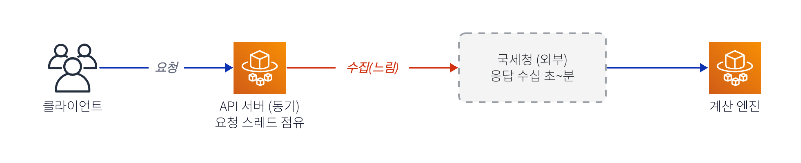
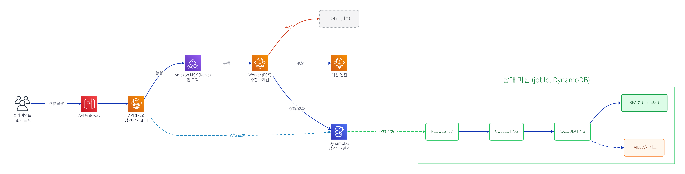
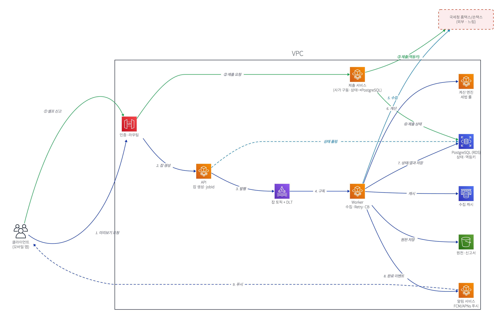

# 종합소득세 환급 / 연말정산 서비스

## 0. 문제 정의 (서비스 표면)

- **숨은 환급액 찾기 (종소세)**: 못 받은 환급금 조회 + 셀프 신고
- **올해 환급액 미리보기**: 3분 만에 예상 환급 결과
- **연말정산 미리보기**: 예상 환급/납부 점검 + 절세 팁
- **추징 안심보상제**: 셀프 신고 후 추징 고지 받으면 보상 (최대 100만 원)

한 줄 요약: **국세청 데이터를 모아 → 세액을 계산해 보여주고 → 셀프 신고까지 대행하고 → 사후 추징을 보상**한다.

## 1. 이 도메인이 아키텍처적으로 까다로운 이유

| 특성 | 함의 |
|---|---|
| **느린 외부 의존 (국세청 홈택스/손택스)** | 수집이 수십 초~분, 점검·폭주·레이트리밋. 통제 불가 → 비동기·리질리언스 필수 |
| **부작용 있는 쓰기 (신고 제출)** | 결제급 정확성. 재시도 시 **이중 신고** 금지 → 멱등성·사가 |
| **민감 데이터 (주민번호·소득·계좌)** | 암호화·본인인증·마이데이터·감사·규제 |
| **세법이 매년 바뀜** | 연도별 룰셋 버저닝 + "어떤 룰로 계산했나" 재현성 |
| **시즌 폭증 (5월 종소세 / 1~2월 연말정산)** | 평소 대비 수십 배 → 오토스케일·큐 백프레셔 |
| **"타임아웃을 성공으로 오판"이 치명적** | 신고 안 됐는데 됐다고 하면 가산세·신뢰 붕괴 |

## 2. 가상 시나리오 (각 레벨이 이걸 어떻게 견디나)

> **5월 15일 밤 9시, 종소세 마감 임박.**  
> 사용자 A가 '숨은 환급액 찾기'를 누른다. 그런데 지금 국세청 홈택스는 **마감 직전 트래픽 폭주로 느리고 간헐적으로 실패**한다.  
> 사용자 A는 미리보기를 보고 만족해 '셀프 신고'를 누르는데, **제출 응답이 30초째 안 온다.**  
> 답답한 그는 앱을 끄고 다시 들어와 또 '신고'를 누른다.

터질 수 있는 것: **①** 3분 동기 대기 불가 · **②** 국세청 장애 전파 · **③** 이중 신고 · **④** 타임아웃을 성공/실패 중 뭘로 볼 것인가.

---

## L0 — 단순 동기 (의도적으로 깨지는 그림)

가장 순진한 `앱 → API → 국세청 → 계산 → 응답` 동기 체인. **깨지는 지점:**

1. 국세청 호출 수십 초~분 → HTTP 타임아웃 · 3분 동기 대기 불가 — *시나리오 ①*
2. 국세청 점검·폭주 시 전체 요청 실패 — 장애 격리(bulkhead/CB) 없음 — *②*
3. 동기 처리 → 5월 폭증에 스레드/커넥션 풀 고갈 → cascading failure
4. 상태 없음 → 중간 실패하면 처음부터 다시 — *재시도 불가*

→ 결론: **느린 외부 의존을 동기로 두면 안 된다.** (제출 ③④는 아직 손도 못 댐)

---

## L1 — 비동기 잡 + 상태 관리

**L0 대비 추가**: API Gateway · Kafka(잡 토픽) · Worker · DynamoDB(상태 머신).

- 국세청 수집을 **워커 잡**으로 분리 → API는 즉시 `jobId` 반환, 사용자는 폴링으로 결과 수신 ⇒ **①③ 해결**("3분 미리보기"가 비동기로 성립).
- 진행 상태를 **DynamoDB**(`REQUESTED→COLLECTING→CALCULATING→READY`)에 저장 → 중간 실패해도 이어서 재시도 ⇒ **④ 해결**.
- Kafka 버퍼링으로 시즌 폭증 흡수(동기 스레드 고갈 → 토픽 적체로 전환).

**아직 남은 것** → L2에서:

- 국세청이 죽으면 워커가 계속 때린다 — 보호 없음(**② 미해결**).
- '제출'(부작용)을 아직 안 다룸 — **이중 신고**(시나리오의 "또 신고 누름") 위험 그대로.

---

## L2 — 리질리언스 + 셀프 신고 사가 + 횡단 (최종 통합본)

**L1 대비 추가** — 남은 문제를 정확히 겨냥해서 얹는다:

- **읽기 보호(②)**: Worker→국세청 경로에 Retry(backoff+jitter) · Circuit Breaker · Rate Limiter, **ElastiCache** 단기 캐시, **Kafka DLT**(dead-letter topic) ⇒ 국세청이 흔들려도 격리·완충.
- **쓰기 사가(③④)**: API Gateway→**Step Functions**(`검증 → 제출(멱등키) → 접수확인 폴링 → 완료기록`, 실패 시 보상). 같은 멱등키 → **한 번만 접수**, 타임아웃 시 **상태 재확인 후 판단**(성공 오판 금지).
- **부가**: 완료 **알림 서비스**(FCM/APNs) · **S3**(원천·신고서) · 횡단(KMS/Secrets·룰셋 버저닝+계산 스냅샷·관측).

> 읽기는 "견디기", 쓰기는 "정확히 한 번" — 이 비대칭이 설계의 뼈대. (범례·핵심 요약은 그림 안 note 참고)

> 생성: [`assets/종소세-환급-아키텍처.d2`](./assets/종소세-환급-아키텍처.d2).

---

## 맹점(Blind Spots) 체크리스트

면접에서 "그럼 이건?" 들어오는 지점:

- **미리보기 ↔ 제출 정합성**: 수집 데이터가 제출 시점에 다를 수 있음 → 제출 직전 재검증 / 스냅샷 고정.
- **스크래핑 취약성**: 국세청 UI/포맷 변경 시 수집 깨짐 → 합성 모니터링(canary), 공식 API 우선.
- **계산 룰 버그**: 잘못 계산 → 가산세 책임. 룰셋 테스트·이중 계산 검증·점진 배포.
- **추징 안심보상제 악용**: 보상 청구 진위 검증(실제 추징 고지 확인), 사기 탐지, 보상 회계.
- **개인정보·규제**: 최소 수집, 보관기간, 파기, 접근 통제, 동의 이력.
- **세션·인증**: 본인인증 토큰 만료, 마이데이터 스코프, 권한.
- **시즌 외 비용**: 상시 인프라는 낭비 → 스케일 인/서버리스 혼용.

## 다음 단계 후보 (L3+) — 같이 정하자

- **A. 추징 안심보상제 워크플로우**: 청구 접수 → 추징 고지 검증 → 심사 → 지급. 사기 방지·회계 분리.
- **B. 시즌 폭증 대응**: 오토스케일링·Kafka 백프레셔·DLT·우선순위 큐·셰딩(마감 임박 사용자 우선?).
- **C. 정합성/재현성 심화**: 미리보기↔제출 데이터 정합성, 계산 스냅샷, idempotency 저장소 설계.
- **D. 멀티 리전/DR** 또는 **관측·SLO 대시보드** 구체화.

> 다음에 이어서: 위 A~D 중 하나를 골라 L3로 그리거나, 특정 박스(예: 제출 사가의 보상 로직, 멱등키 저장 구조)를 확대해 파고들 수 있어. "여기서 이게 죽으면?"을 던지며 키우자.
