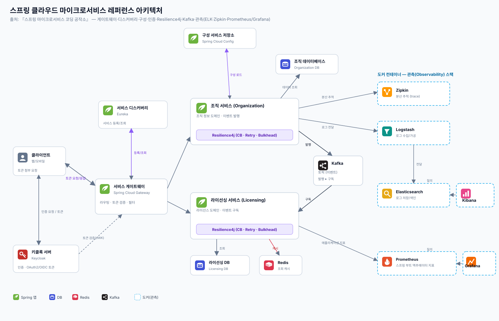

# 참고 — 스프링 클라우드 마이크로서비스 레퍼런스 아키텍처

> 출처: 『스프링 마이크로서비스 코딩 공작소』의 종합 예제 아키텍처를 SVG로 옮긴 것. 우리가 따로 본 개념들(게이트웨이·Resilience4j·Redis·관측)이 **한 그림에서 어떻게 맞물리는지** 보는 레퍼런스.

## 구성 요소

| 영역 | 컴포넌트 | 역할 |
|---|---|---|
| **엣지/인프라** | 서비스 게이트웨이 (Spring Cloud Gateway) | 단일 진입점 · 라우팅 · 토큰 검증 · 필터 |
| | 서비스 디스커버리 (Eureka) | 서비스 등록/조회 → 동적 라우팅 |
| | 구성 서비스 저장소 (Spring Cloud Config) | 외부화된 설정 중앙 관리 |
| | 키클록 (Keycloak) | 인증 · OAuth2/OIDC 토큰 발급 |
| **비즈니스** | 조직 서비스 / 라이선싱 서비스 | 도메인 서비스. 각각 **Resilience4j**(CB·Retry·Bulkhead) 탑재 |
| | 조직 DB / 라이선싱 DB | 서비스별 전용 DB (DB per service) |
| | Redis | 라이선싱 조회 캐시 |
| | Kafka 토픽 | 조직 서비스 **발행** → 라이선싱 서비스 **구독** (비동기 이벤트) |
| **관측(도커)** | Zipkin | 분산 추적(trace) |
| | Logstash → Elasticsearch → Kibana | 로그 수집·저장·질의 (ELK) |
| | Prometheus(Actuator) → Grafana | 메트릭 수집·대시보드 |

## 우리가 본 개념과의 연결

- **게이트웨이**: [모의면접 타임아웃](../cs-study/260610-모의면접-타임아웃.md)의 inbound/outbound 양면이 그대로 — 클라이언트 hop + 다운스트림 서비스 hop.
- **Resilience4j**: 타임아웃 문서의 Circuit Breaker·Retry·Bulkhead가 각 서비스에 박혀 있는 형태.
- **Redis**: [모의면접 Redis](../cs-study/260610-모의면접-레디스.md)의 조회 캐시 용도.
- **Kafka 발행/구독**: 서비스 간 비동기 통신 → 결합도↓·장애 격리. (종소세 설계의 SQS 잡 큐와 같은 결: 동기 호출을 이벤트로 분리)
- **관측 3종**: 추적(Zipkin)·로그(ELK)·메트릭(Prometheus/Grafana) — 분산 시스템 디버깅의 표준 삼각형.

## 메모

- 이 그림은 **개념 학습용 레퍼런스**다. 실서비스에선 Eureka/Config 대신 K8s 서비스 디스커버리·ConfigMap, Zipkin 대신 OpenTelemetry+Tempo 등으로 대체되기도 한다.
- 핵심은 박스 이름이 아니라 **역할의 분리**: 진입(게이트웨이) · 발견(디스커버리) · 설정(구성) · 인증(키클록) · 도메인(서비스+회복탄력성) · 비동기(Kafka) · 관측(추적·로그·메트릭).
