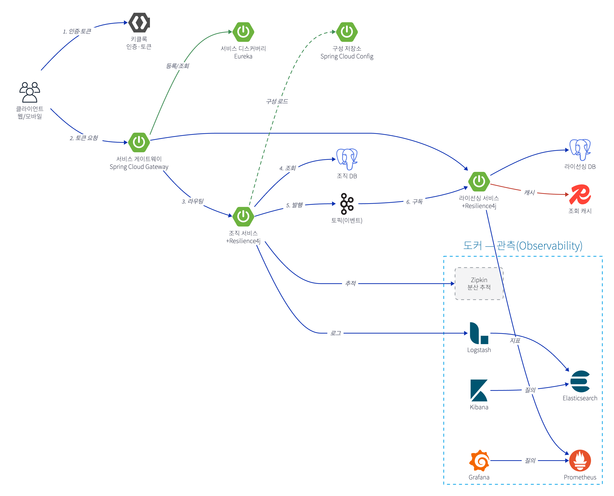

# 참고 — 스프링 클라우드 마이크로서비스 레퍼런스 아키텍처

> 출처: 『스프링 마이크로서비스 코딩 공작소』 종합 예제. **D2 + simpleicons → PNG**. 생성: [`assets/스프링-마이크로서비스-레퍼런스.d2`](./assets/스프링-마이크로서비스-레퍼런스.d2). 멀티벤더라 simpleicons(플랫 단색 글리프)로 통일, Zipkin은 박스.

> 주요 요청 흐름 1→6 · 실선 = 동기, 점선 = 비동기/구성로드 · 빨강 = 캐시 · 초록 = 디스커버리/구성 · Resilience4j = CB·Retry·Bulkhead · 관측 3종 = 추적·로그·메트릭

## 구성 요소

| 영역 | 컴포넌트 | 역할 |
|---|---|---|
| **엣지/인프라** | 서비스 게이트웨이 (Spring Cloud Gateway) | 단일 진입점 · 라우팅 · 토큰 검증 · 필터 |
| | 서비스 디스커버리 (Eureka) | 서비스 등록/조회 → 동적 라우팅 |
| | 구성 저장소 (Spring Cloud Config) | 외부화된 설정 중앙 관리 |
| | 키클록 (Keycloak) | 인증 · OAuth2/OIDC 토큰 발급 |
| **비즈니스** | 조직 서비스 / 라이선싱 서비스 | 도메인 서비스. 각각 **Resilience4j**(CB·Retry·Bulkhead) 탑재 |
| | 조직 DB / 라이선싱 DB | 서비스별 전용 DB (DB per service) |
| | Redis | 라이선싱 조회 캐시 |
| | Kafka 토픽 | 조직 서비스 **발행** → 라이선싱 서비스 **구독** |
| **관측(도커)** | Zipkin | 분산 추적(trace) |
| | Logstash → Elasticsearch → Kibana | 로그 (ELK) |
| | Prometheus(Actuator) → Grafana | 메트릭 · 대시보드 |

## 운영 셋업 메모 (그림 밖, 화살표 = 인증·시크릿·연결이 깔린다는 전제)

- **Grafana ↔ Prometheus**: 데이터소스 등록(URL+인증), 인증은 **서비스 계정 토큰**(구 API Key), 코드 관리는 **provisioning**(YAML).
- **Prometheus 스크레이프**: 각 서비스 `/actuator/prometheus`를 `scrape_config`/ServiceMonitor에 등록, 엔드포인트 접근 제한.
- **Keycloak**: realm·client 생성, client secret, 게이트웨이 토큰 검증용 **JWK URL**.
- **Eureka/Config**: 등록 자격 · Config 접근(보안 시 토큰/계정).
- **Kafka**: 토픽·컨슈머 그룹, (운영) SASL/TLS.
- **Redis/DB**: 비밀번호·시크릿(Secret Manager/Vault), TLS.

## 연결

- 게이트웨이 inbound/outbound → [모의면접 타임아웃](../cs-study/260610-모의면접-타임아웃.md)
- Redis 조회 캐시 → [모의면접 Redis](../cs-study/260610-모의면접-레디스.md)
- Kafka 발행/구독 = 종소세 설계의 Kafka 잡 토픽과 같은 결(동기 호출 → 이벤트 분리)
- 실서비스 치환: Eureka/Config → K8s 디스커버리·ConfigMap, Zipkin → OpenTelemetry+Tempo
