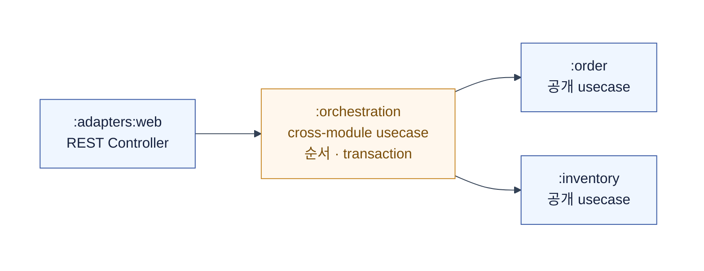

# Spring 멀티모듈 헥사고날 패키징

> 관점: Kotlin·Spring Boot로 구현하는 발주·재고 관리 서비스  
> 목표: 코드 배치, Gradle 의존성, Spring Modulith의 역할을 혼동하지 않는다.  
> 기준: Java 21+, Spring Boot 4.x, Exposed, Kafka, PostgreSQL

## 0. 결론부터

헥사고날 아키텍처의 핵심은 모듈 개수가 아니라 **의존성이 비즈니스 규칙 안쪽으로만 향하는 것**이다.

이 문서의 권장 구조는 다음과 같다.

```text
:boot
  → :adapters:*
  → :application
  → :domain
```

화살표는 Gradle compile dependency가 향하는 방향이다. adapter는 application에, application은 domain에 의존한다.

- `domain`: 순수한 비즈니스 모델과 규칙
- `application`: use case와 inbound·outbound port
- `adapters:*`: HTTP, DB, Kafka, 외부 API 구현
- `boot`: Spring Boot 실행과 조립(composition root)

`domain` 모듈에는 Spring, Exposed, Kafka가 없다. Exposed `Table`은 DB 스키마를 표현하므로 `:adapters:persistence`에 둔다.

Spring Modulith는 Gradle 멀티모듈의 대체제가 아니다. 주문·재고처럼 **비즈니스 모듈** 경계를 검증하고 이벤트로 연결할 때 선택한다.

## 1. 서로 다른 세 가지 경계

기존 글의 혼란은 헥사고날, Gradle 멀티모듈, Spring Modulith를 하나의 계층도로 본 데서 시작한다.

| 도구·개념 | 답하는 질문 | 경계를 강제하는 시점 |
|---|---|---|
| 헥사고날 | 비즈니스 규칙이 외부 기술에서 분리되었는가? | 설계·코드 리뷰 |
| Gradle 멀티모듈 | 어느 코드가 어느 JAR을 컴파일 시점에 참조할 수 있는가? | 컴파일·빌드 |
| Spring Modulith | 스프링 빈으로 구성된 비즈니스 모듈이 공개 API만 사용하는가? | 아키텍처 테스트·런타임 |

### Layer Map은 서비스 의존성 지도가 아니다

Bluetape4k의 Foundation·Data·Infrastructure·Domain Capability·Application Layer Map은 **라이브러리 생태계 분류표**로 이해하면 좋다.

이를 서비스 코드의 의존성 방향으로 그대로 옮기면 `domain + Exposed Table`처럼 서로 다른 관심사가 한 모듈에 섞인다.

라이브러리는 역할로 고르고, 서비스 코드는 포트와 어댑터 경계로 배치한다.

## 2. 전체 아키텍처

```mermaid
---
config:
  theme: base
  darkMode: false
  themeVariables:
    background: "#ffffff"
    primaryTextColor: "#111827"
    lineColor: "#334155"
    edgeLabelBackground: "#ffffff"
---
flowchart LR
  subgraph canvas[" "]
    direction LR

    web[":adapters:web<br/>REST Controller"]
    scheduler[":adapters:scheduling<br/>Scheduler"]
    consumer[":adapters:kafka<br/>Kafka Consumer"]

    input[":application<br/>Inbound Port"]
    service[":application<br/>Application Service"]
    aggregate[":domain<br/>Aggregate · Value Object"]
    rule[":domain<br/>Rule · Domain Event"]
    output[":application<br/>Outbound Port"]

    persistence[":adapters:persistence<br/>Exposed Adapter"]
    producer[":adapters:kafka<br/>Kafka Producer"]
    client[":adapters:supplier<br/>Supplier API Client"]

    kafkaIn@{ img: "https://cdn.simpleicons.org/apachekafka/231F20", label: "Kafka inbound topic", pos: "b", h: 48, constraint: "on" }
    postgres@{ img: "https://cdn.simpleicons.org/postgresql/336791", label: "PostgreSQL", pos: "b", h: 48, constraint: "on" }
    kafkaOut@{ img: "https://cdn.simpleicons.org/apachekafka/231F20", label: "Kafka outbound topic", pos: "b", h: 48, constraint: "on" }
    supplier["Supplier API"]

    kafkaIn -.-> consumer
    web --> input
    scheduler --> input
    consumer --> input
    input --> service
    service --> aggregate --> rule
    service --> output
    output -.-> persistence
    output -.-> producer
    output -.-> client
    persistence --> postgres
    producer -.-> kafkaOut
    client --> supplier
  end

  classDef inbound fill:#f5f3ff,stroke:#7c3aed,color:#111827
  classDef application fill:#eff6ff,stroke:#2563eb,color:#111827
  classDef domain fill:#ecfdf5,stroke:#059669,color:#111827
  classDef outbound fill:#fff7ed,stroke:#ea580c,color:#111827
  classDef external fill:#ffffff,stroke:#475569,color:#111827
  class web,scheduler,consumer inbound
  class input,service,output application
  class aggregate,rule domain
  class persistence,producer,client outbound
  class supplier external
  style canvas fill:#ffffff,stroke:#ffffff,stroke-width:0px,color:#111827
```

노드의 첫 줄은 Gradle module path, 둘째 줄은 그 모듈의 실행 컴포넌트다. `:adapters:kafka`는 Consumer와 Producer를 함께 가지므로 양쪽에 표시된다.

실선은 실행 흐름, 점선은 port의 구현·비동기 경계를 뜻한다. adapter는 application이 정의한 port를 구현하지만, application은 그 구현체를 모른다.

`:boot`는 요청이 거쳐 가는 runtime hop이 아니라 모듈을 조립하는 composition root다. 그래서 실행 흐름 노드로는 표시하지 않았다.

### 의존성 규칙

1. `domain`은 어떤 프로젝트 모듈에도 의존하지 않는다.
2. `application`은 `domain`만 의존한다.
3. inbound·outbound adapter는 `application`과 필요한 `domain` 타입에 의존한다.
4. `boot`만 모든 adapter를 조립하고 실행한다.
5. adapter 끼리 서로 호출하지 않는다.

## 3. Gradle 모듈과 패키지

### 3.1 모듈 트리

```text
shop/
├── domain/
├── application/
├── adapters/
│   ├── web/
│   ├── scheduling/
│   ├── persistence/
│   ├── kafka/
│   └── supplier/
├── boot/
└── docs/
```

`:adapters`는 하위 모듈을 묶는 Gradle grouping project다. 여기에는 production code를 두지 않고, `web`·`kafka`·`persistence`처럼 실제 변경 단위를 하위 모듈로 둔다.

### 3.2 패키지 트리

```text
domain/src/main/kotlin/com/example/shop/domain/
├── order/
│   ├── PurchaseOrder.kt
│   ├── OrderItem.kt
│   └── OrderCompleted.kt
└── inventory/
    └── Stock.kt

application/src/main/kotlin/com/example/shop/application/
├── order/
│   ├── port/in/CompleteOrderUseCase.kt
│   ├── port/out/LoadOrderPort.kt
│   ├── port/out/SaveOrderPort.kt
│   ├── port/out/PublishDomainEventPort.kt
│   └── service/CompleteOrderService.kt
└── inventory/
    └── ...

adapters/web/src/main/kotlin/com/example/shop/adapters/web/
└── order/OrderController.kt

adapters/scheduling/src/main/kotlin/com/example/shop/adapters/scheduling/
└── inventory/LowStockScheduler.kt

adapters/persistence/src/main/kotlin/com/example/shop/adapters/persistence/
├── order/OrderPersistenceAdapter.kt
├── order/PurchaseOrders.kt
└── inventory/Stocks.kt

adapters/kafka/src/main/kotlin/com/example/shop/adapters/kafka/
├── inbound/inventory/StockReceivedConsumer.kt
└── outbound/order/KafkaOrderEventAdapter.kt

adapters/supplier/src/main/kotlin/com/example/shop/adapters/supplier/
└── order/SupplierApiAdapter.kt
```

모듈은 의존성을 강제하고, 패키지는 코드를 찾는 지도가 된다. 모듈을 나타내는 패키지 다음에 `order`, `inventory`처럼 기능을 둔다.

### 3.3 `settings.gradle.kts`

```kotlin
rootProject.name = "shop"

include(
    ":domain",
    ":application",
    ":adapters:web",
    ":adapters:scheduling",
    ":adapters:persistence",
    ":adapters:kafka",
    ":adapters:supplier",
    ":boot",
)
```

### 3.4 모듈별 의존성

아래 조각은 모든 JVM 모듈에 Spring Boot BOM과 Kotlin 공통 설정이 적용되었다고 가정한다. Spring Boot 외 버전은 version catalog로 고정한다.

```kotlin
// domain/build.gradle.kts
plugins {
    kotlin("jvm")
}

dependencies {
    testImplementation(kotlin("test"))
}
```

```kotlin
// application/build.gradle.kts
plugins {
    `java-library`
}

dependencies {
    api(project(":domain"))

    // @Transactional, @Service를 application service에 사용하는 실용적 선택
    implementation("org.springframework:spring-context")
    implementation("org.springframework:spring-tx")
}
```

```kotlin
// adapters/web/build.gradle.kts
dependencies {
    implementation(project(":application"))
    implementation("org.springframework.boot:spring-boot-starter-webmvc")
    implementation("org.springframework.boot:spring-boot-starter-validation")
}
```

```kotlin
// adapters/persistence/build.gradle.kts
dependencies {
    implementation(project(":application"))
    implementation(libs.exposed.spring.boot4.starter)
    runtimeOnly("org.postgresql:postgresql")
}
```

```toml
# gradle/libs.versions.toml
[versions]
exposed = "1.3.1"

[libraries]
exposed-spring-boot4-starter = { module = "org.jetbrains.exposed:exposed-spring-boot4-starter", version.ref = "exposed" }
```

Exposed는 Spring Boot 3와 4의 starter artifact가 다르다. 이 예제는 Spring Boot 4용 `exposed-spring-boot4-starter`를 사용한다.

```kotlin
// adapters/scheduling/build.gradle.kts
dependencies {
    implementation(project(":application"))
}
```

```kotlin
// adapters/kafka/build.gradle.kts
dependencies {
    implementation(project(":application"))
    implementation("org.springframework.boot:spring-boot-starter-kafka")
}
```

```kotlin
// adapters/supplier/build.gradle.kts
dependencies {
    implementation(project(":application"))
    implementation("org.springframework.boot:spring-boot-starter-restclient")
}
```

```kotlin
// boot/build.gradle.kts
dependencies {
    implementation(project(":application"))
    implementation(project(":adapters:web"))
    implementation(project(":adapters:scheduling"))
    implementation(project(":adapters:persistence"))
    implementation(project(":adapters:kafka"))
    implementation(project(":adapters:supplier"))

    implementation("org.springframework.boot:spring-boot-starter")
    implementation("org.springframework.boot:spring-boot-starter-flyway")
}
```

Gradle의 `api`는 해당 의존성을 소비자에게도 노출한다. 모듈 경계를 넓히지 않도록 기본은 `implementation`으로 두고, 공개 타입에 필요한 의존성만 `api`로 올린다.

`@Service`, `@Transactional`, `@Repository`를 붙인 Kotlin class가 proxy 대상이 되도록 `application`, adapter, `boot` 모듈에 Kotlin Spring plugin을 적용한다.

### 3.5 공통 기반(Foundation)은 역할이 아니라 의존성이다

`bluetape4k-core`처럼 여러 모듈이 쓰는 라이브러리를 별도의 아키텍처 계층으로 보지 않는다. 각 모듈이 필요한 의존성만 직접 선언한다.

`domain`에서 쓰려면 해당 라이브러리가 Spring·DB·I/O 타입을 전이적으로 노출하지 않는지 확인한다. 편의 함수 몇 개를 위해 큰 Foundation JAR을 넣지 않는다.

## 4. 요청 하나가 흐르는 코드

발주 완료 API를 예로 든다. 흐름은 Controller → inbound port → application service → domain → outbound port → adapter 순서다.

### 4.1 도메인(Domain): 규칙만 표현한다

```kotlin
@JvmInline
value class OrderId(val value: String)

enum class OrderState { REQUESTED, COMPLETED }

data class PurchaseOrder(
    val id: OrderId,
    val state: OrderState,
    val items: List<OrderItem>,
) {
    fun complete(): PurchaseOrder {
        check(state == OrderState.REQUESTED) {
            "REQUESTED 상태의 발주만 완료할 수 있습니다."
        }
        return copy(state = OrderState.COMPLETED)
    }
}

data class OrderCompleted(
    val orderId: OrderId,
    val items: List<OrderItem>,
    val occurredAt: Instant,
)
```

`PurchaseOrder` 안에는 `@Entity`, `Table`, `ApplicationEventPublisher`가 없다. 발주를 완료할 수 있는지는 스프링과 DB 없이 테스트할 수 있다.

### 4.2 애플리케이션(Application): use case와 port를 정의한다

```kotlin
fun interface CompleteOrderUseCase {
    fun complete(orderId: OrderId)
}

fun interface LoadOrderPort {
    fun load(orderId: OrderId): PurchaseOrder?
}

fun interface SaveOrderPort {
    fun save(order: PurchaseOrder)
}

fun interface PublishDomainEventPort {
    fun publish(event: OrderCompleted)
}
```

Inbound port는 **애플리케이션이 제공하는 기능**이다. Controller는 inbound port가 아니라, inbound port를 호출하는 driving adapter다.

Outbound port는 **애플리케이션이 외부에 필요로 하는 기능**이다. 인터페이스 이름은 `Repository` 기술보다 `LoadOrderPort`처럼 사용 의도를 드러내면 좋다.

```kotlin
@Service
class CompleteOrderService(
    private val loadOrder: LoadOrderPort,
    private val saveOrder: SaveOrderPort,
    private val eventPublisher: PublishDomainEventPort,
    private val clock: Clock,
) : CompleteOrderUseCase {

    @Transactional
    override fun complete(orderId: OrderId) {
        val order = loadOrder.load(orderId)
            ?: throw OrderNotFoundException(orderId)

        val completed = order.complete()
        saveOrder.save(completed)
        eventPublisher.publish(
            OrderCompleted(completed.id, completed.items, clock.instant())
        )
    }
}
```

Application service는 트랜잭션과 실행 순서를 조정한다. 상태 전이 규칙은 domain에 위임하고, DB·Kafka에는 port로만 접근한다.

### 4.3 인바운드 어댑터: HTTP를 command로 바꾼다

```kotlin
@RestController
@RequestMapping("/api/v1/orders")
class OrderController(
    private val completeOrder: CompleteOrderUseCase,
) {
    @PostMapping("/{orderId}/completion")
    @ResponseStatus(HttpStatus.NO_CONTENT)
    fun complete(@PathVariable orderId: String) {
        completeOrder.complete(OrderId(orderId))
    }
}
```

HTTP DTO를 domain entity로 사용하지 않는다. HTTP 상태 코드, validation, JSON 스키마는 web adapter의 관심사다.

### 4.4 아웃바운드 어댑터: Exposed를 경계 밖으로 밀어낸다

```kotlin
object PurchaseOrders : Table("purchase_order") {
    val id = varchar("id", 36)
    val state = enumerationByName<OrderState>("state", 20)

    override val primaryKey = PrimaryKey(id)
}

@Repository
class OrderPersistenceAdapter : LoadOrderPort, SaveOrderPort {

    override fun load(orderId: OrderId): PurchaseOrder? =
        findOrder(orderId) // Exposed Row를 domain model로 매핑

    override fun save(order: PurchaseOrder) {
        upsertOrder(order)
    }
}
```

Spring Boot 4용 Exposed starter는 Spring 트랜잭션과 Exposed를 통합한다. application service의 `@Transactional`이 범위를 소유하며, adapter는 내부에서 `transaction {}`을 다시 열지 않는다.

```kotlin
@SpringBootApplication
@ImportAutoConfiguration(
    value = [ExposedAutoConfiguration::class],
    exclude = [DataSourceTransactionManagerAutoConfiguration::class],
)
class ShopApplication

@Configuration
class TimeConfiguration {
    @Bean
    fun clock(): Clock = Clock.systemUTC()
}
```

기본 `DataSourceTransactionManager`와 Exposed의 transaction manager가 동시에 잡히지 않도록 자동 구성을 명시한다.

여러 transaction manager를 쓴다면 `@Primary` 또는 `@Transactional(transactionManager = "...")`로 선택한다.

## 5. 이벤트와 트랜잭션

### 5.1 내부 이벤트와 Kafka 메시지는 다르다

`OrderCompleted`는 JVM 안에서 사용하는 도메인 이벤트다. Kafka 메시지는 버전, key, schema, 개인정보 정책을 가진 외부 계약이다.

```kotlin
data class OrderCompletedMessageV1(
    val eventId: UUID,
    val orderId: String,
    val occurredAt: Instant,
    val schemaVersion: Int = 1,
)
```

Messaging adapter에서 domain event를 외부 메시지로 매핑한다. domain에 `KafkaTemplate`, topic 이름, serializer 설정이 들어가지 않는다.

### 5.2 `@Async @EventListener`만으로는 전송을 보장하지 못한다

DB commit 전에 Kafka 전송이 성공하거나, DB commit 후 프로세스가 종료되면 상태와 메시지가 어긋난다. `@Async`는 실행 스레드만 바꿀 뿐 내구성을 만들지 않는다.

운영 서비스는 다음 중 하나를 선택한다.

| 선택 | 사용 시점 | 주의점 |
|---|---|---|
| Transactional outbox | Kafka 전송의 명시적 제어와 이식성이 필요함 | relay, retry, cleanup 운영 필요 |
| Spring Modulith Event Publication Registry | 모듈 간 이벤트와 실패 재처리를 Spring 통합으로 해결 | 저장소 adapter와 재전송 정책 설계 필요 |
| Kafka transaction | Kafka 내 원자적 작업이 중심임 | DB와 Kafka의 통합 원자성은 별도 검토 |

콘슈머는 적어도 한 번(at-least-once) 전달을 가정하고 `eventId`를 이용해 멱등성을 보장한다. 재시도 한도를 넘은 메시지는 DLT(dead-letter topic)로 보낸다.

### 5.3 가상 스레드(Virtual Threads)는 경계 설계를 바꾸지 않는다

```yaml
spring:
  threads:
    virtual:
      enabled: true
```

Java 21+에서 이 설정을 켜면 Spring Boot는 지원되는 작업에 virtual thread 기반 executor를 자동 구성한다. 따라서 `fun` 반환의 동기식 port는 유지해도 된다.

다만 virtual thread는 DB connection pool 크기나 외부 API의 처리량을 늘리지 않는다. 동시성 제한, timeout, circuit breaker, Kafka consumer 처리량은 별도로 설계한다.

## 6. Spring Modulith를 언제 쓰는가

Spring Modulith는 주문·재고·알림처럼 비즈니스 기능을 application module로 인식한다. 기본적으로 모듈의 base package는 공개 API고, 하위 패키지는 내부 구현이다.

앞서 설계한 Gradle 모듈은 `domain`, `application`, `adapter`라는 **기술적 의존 방향**을 강제한다. Spring Modulith를 쓸 때는 물리 모듈의 주요 축을 **비즈니스 기능**으로 바꾼다.

```text
shop/
├── order/        # com.example.shop.order
├── inventory/    # com.example.shop.inventory
└── boot/

com.example.shop.order/
├── OrderFacade.kt                 # 다른 모듈에 공개
├── OrderCompleted.kt              # 다른 모듈에 공개
└── internal/                      # 모듈 내부
    ├── domain/
    ├── application/
    └── adapter/
```

즉 두 모델은 동시에 적용할 수 있지만, 같은 경계를 중복해 표현하지 않는다.

- 기술 계층별 Gradle 모듈이면: Gradle + ArchUnit으로 검증
- 비즈니스 기능별 Gradle 모듈이면: Gradle + Spring Modulith로 검증
- 단일 Gradle 모듈이면: Spring Modulith로 기능 패키지 경계를 검증

### 6.1 적합한 상황

- 하나의 Spring Boot 애플리케이션 안에 여러 비즈니스 모듈이 있다.
- 모듈 내부 타입 접근, 순환 의존, 허용되지 않은 모듈 의존을 테스트로 막고 싶다.
- 모듈 간 결합을 application event로 낮추고 싶다.

### 6.2 불필요한 상황

- 단일 CRUD와 어댑터 수가 적어 모듈 경계 자체가 없다.
- Gradle 모듈을 기술 계층으로 나눈 후, 같은 계층을 Spring Modulith로 중복 표현하려는 경우다.

### 6.3 경계 검증

```kotlin
// boot/build.gradle.kts
dependencies {
    implementation("org.springframework.modulith:spring-modulith-starter-core")
    testImplementation("org.springframework.modulith:spring-modulith-starter-test")
}
```

```kotlin
class ModularityTest {
    @Test
    fun `애플리케이션 모듈 경계를 검증한다`() {
        ApplicationModules.of(ShopApplication::class.java).verify()
    }
}
```

`verify()`는 모듈 순환 의존과 다른 모듈의 내부 패키지 참조를 검증한다. `allowedDependencies`를 선언하면 허용된 모듈로 의존성을 더 제한할 수 있다.

Kotlin에서는 `package-info.java` 또는 `@PackageInfo`를 붙인 metadata 타입으로 `@ApplicationModule`, `@NamedInterface`를 선언한다.

```kotlin
package com.example.shop.inventory

import org.springframework.modulith.ApplicationModule
import org.springframework.modulith.PackageInfo

@ApplicationModule(allowedDependencies = ["order"])
@PackageInfo
class InventoryModule
```

### 6.4 모듈 간 흐름: orchestration

vertical 모델에서 `order`와 `inventory`가 각자의 공개 usecase를 가지면,  
"발주 완료 후 재고 차감"처럼 두 모듈에 걸친 흐름은 어디에 둘까?

선택지는 두 가지다.

| 방식 | 구조 | 특징 |
|---|---|---|
| 직접 호출 | `order` application이 `inventory` 공개 usecase 호출 | 간단하지만 `order` → `inventory` 의존 발생. 반대도 필요하면 cycle |
| orchestration 모듈 | 별도 모듈이 양쪽 공개 usecase를 조합 | cycle을 끊지만 양쪽 usecase 시그니처를 모두 알아야 함 |

직접 호출이 간단하지만, 양방향 의존이 필요해지면 순환이 생긴다.  
orchestration 모듈은 이 cycle을 한 곳으로 모은다.  
결합을 제거한 게 아니라 한 곳으로 옮긴 것이므로,  
이름은 "cycle breaker"보다 **"cross-module 조정 경계"**가 정확하다.



orchestration 모듈은 `domain`과 `persistence`가 없다.  
state를 소유하지 않고 다른 모듈의 공개 usecase만 조합한다.

```text
orchestration/
├── usecase/
│   └── model/
├── application/
└── port/outbound/
```

```kotlin
// orchestration 모듈의 공개 usecase
fun interface CompleteOrderOrchestration {
    fun complete(orderId: OrderId)
}

// orchestration 모듈의 application 구현
@Service
class CompleteOrderOrchestrationService(
    private val completeOrder: CompleteOrderUseCase,
    private val deductStock: DeductStockUseCase,
) : CompleteOrderOrchestration {

    @Transactional
    override fun complete(orderId: OrderId) {
        completeOrder.complete(orderId)
        deductStock.deduct(orderId)
    }
}
```

`@Transactional`이 두 모듈의 table을 하나의 transaction으로 묶는다.  
modular monolith에서는 가능하지만, service를 분리하려면  
이 transaction을 saga로 먼저 바꿔야 한다.

#### 네이밍

`orchestration`은 "여러 컴포넌트를 중앙에서 순서대로 호출해  
하나의 요청을 완결하는" 패턴의 업계 표준 용어다.  
`application`(단일 모듈 내 조정)과 대비되어 의미가 명확하다.

| 후보 | 장점 | 단점 |
|---|---|---|
| `:orchestration` | 업계 표준. `application`과 정확히 대비 | — |
| `:workflow` | 직관적 | 워크플로우 엔진 암시 |
| `:composition` | "조합한다"는 동작에 충실 | `application` 역할과 혼동 가능 |

추천은 `:orchestration`이다.

#### 도입 시점

처음부터 orchestration 모듈을 만들 필요는 없다.  
§8의 도입 순서 원칙대로, cycle이 실제로 문제가 될 때 도입한다.

1. 한 모듈의 application이 다른 모듈의 공개 usecase를 직접 호출
2. 양방향 의존이 필요해지면 orchestration 모듈로 끌어올림
3. service 분리 시 orchestration의 transaction을 saga로 전환

## 7. 경계를 자동 검증하기

Gradle로 막힐 수 있는 의존성은 Gradle이 막게 한다. 하나의 모듈 안에서 어댑터가 domain 내부 구현을 접근하는 문제는 ArchUnit으로 보완한다.

```kotlin
@AnalyzeClasses(packages = ["com.example.shop"])
class HexagonalArchitectureTest {

    @ArchTest
    val domainMustBeIndependent = noClasses()
        .that().resideInAPackage("..domain..")
        .should().dependOnClassesThat()
        .resideInAnyPackage(
            "org.springframework..",
            "org.jetbrains.exposed..",
            "org.apache.kafka..",
        )

    @ArchTest
    val webMustNotDependOnOutboundAdapters = noClasses()
        .that().resideInAPackage("..adapters.web..")
        .should().dependOnClassesThat()
        .resideInAnyPackage(
            "..adapters.persistence..",
            "..adapters.kafka..",
            "..adapters.supplier..",
        )

    @ArchTest
    val persistenceMustNotDependOnOtherAdapters = noClasses()
        .that().resideInAPackage("..adapters.persistence..")
        .should().dependOnClassesThat()
        .resideInAnyPackage(
            "..adapters.web..",
            "..adapters.scheduling..",
            "..adapters.kafka..",
            "..adapters.supplier..",
        )

    @ArchTest
    val kafkaMustNotDependOnOtherAdapters = noClasses()
        .that().resideInAPackage("..adapters.kafka..")
        .should().dependOnClassesThat()
        .resideInAnyPackage(
            "..adapters.web..",
            "..adapters.scheduling..",
            "..adapters.persistence..",
            "..adapters.supplier..",
        )

    @ArchTest
    val schedulingMustNotDependOnOtherAdapters = noClasses()
        .that().resideInAPackage("..adapters.scheduling..")
        .should().dependOnClassesThat()
        .resideInAnyPackage(
            "..adapters.web..",
            "..adapters.persistence..",
            "..adapters.kafka..",
            "..adapters.supplier..",
        )

    @ArchTest
    val supplierMustNotDependOnOtherAdapters = noClasses()
        .that().resideInAPackage("..adapters.supplier..")
        .should().dependOnClassesThat()
        .resideInAnyPackage(
            "..adapters.web..",
            "..adapters.scheduling..",
            "..adapters.persistence..",
            "..adapters.kafka..",
        )
}
```

규칙은 adapter 전체의 내부 의존성을 막지 않도록 각 adapter 경계를 명시한다. 예를 들어 persistence mapper가 같은 persistence adapter의 DAO를 호출하는 것은 허용한다.

다음 테스트를 CI에 포함한다.

```text
☐ domain 모듈의 Spring·Exposed·Kafka 의존성 금지
☐ application → adapter 의존성 금지
☐ adapter 간 직접 의존성 금지
☐ 기능 중심 구조라면 Spring Modulith ApplicationModules.verify()
☐ domain 순수 단위 테스트
☐ adapter 통합 테스트(Testcontainers)
☐ use case 통합 테스트
```

## 8. 도입 순서

처음부터 adapter를 여러 JAR로 나누면 이동 비용만 커질 수 있다. 의존 방향을 먼저 고정하고, 변경 이유가 생길 때 물리 모듈을 늘린다.

### 1단계: 패키지로 경계를 본다

```text
com.example.shop.order
├── domain
├── application
└── adapter
```

팀이 작고 빌드가 하나면 충분하다. ArchUnit 또는 Spring Modulith로 패키지 경계를 검증한다.

### 2단계: domain·application을 먼저 분리한다

테스트 속도, 기술 교체, 재사용 요구가 생기면 `domain`, `application`, `adapter`, `boot` 정도로 나눈다.

### 3단계: 변경 이유로 adapter를 쪼갠다

Kafka 배포·테스트 전략이 DB adapter와 달라지거나, 서로 다른 팀이 소유하거나, 독립적으로 교체할 필요가 생길 때만 adapter 모듈을 분리한다.

## 9. 실무 체크리스트

- 업무 규칙을 Spring·DB·Kafka 없이 테스트할 수 있는가?
- Controller가 domain entity를 응답 DTO로 직접 반환하지 않는가?
- application service가 Exposed·`KafkaTemplate`·`WebClient`를 직접 사용하지 않는가?
- outbound port가 특정 기술보다 application의 필요를 표현하는가?
- `boot`를 제외한 모듈이 adapter 구현체를 직접 조립하지 않는가?
- DB 상태 변경과 Kafka 전송 사이의 실패 시나리오가 정의되었는가?
- 콘슈머가 재전달에 대해 멱등한가?
- 경계 규칙이 CI에서 자동 검증되는가?

## 참고 자료

- [Spring Modulith - Fundamentals](https://docs.spring.io/spring-modulith/reference/fundamentals.html)
- [Spring Modulith - Verifying Application Module Structure](https://docs.spring.io/spring-modulith/reference/verification.html)
- [Spring Modulith - Working with Application Events](https://docs.spring.io/spring-modulith/reference/events.html)
- [Spring Boot - Build Systems and Starters](https://docs.spring.io/spring-boot/reference/using/build-systems.html)
- [Spring Boot - Task Execution and Scheduling](https://docs.spring.io/spring-boot/reference/features/task-execution-and-scheduling.html)
- [Exposed - Spring Boot integration](https://www.jetbrains.com/help/exposed/spring-boot-integration.html)
- [Bluetape4k 생태계 - Layer Map](https://bluetape4k.github.io/ko/blog/introduction-bluetape4k-part1-ecosystem/)
