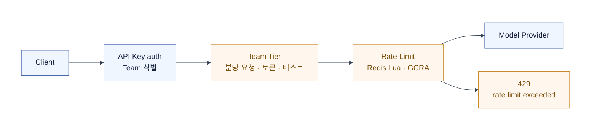
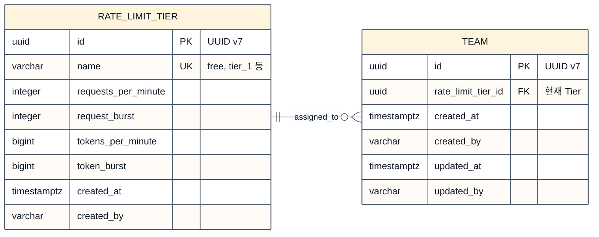
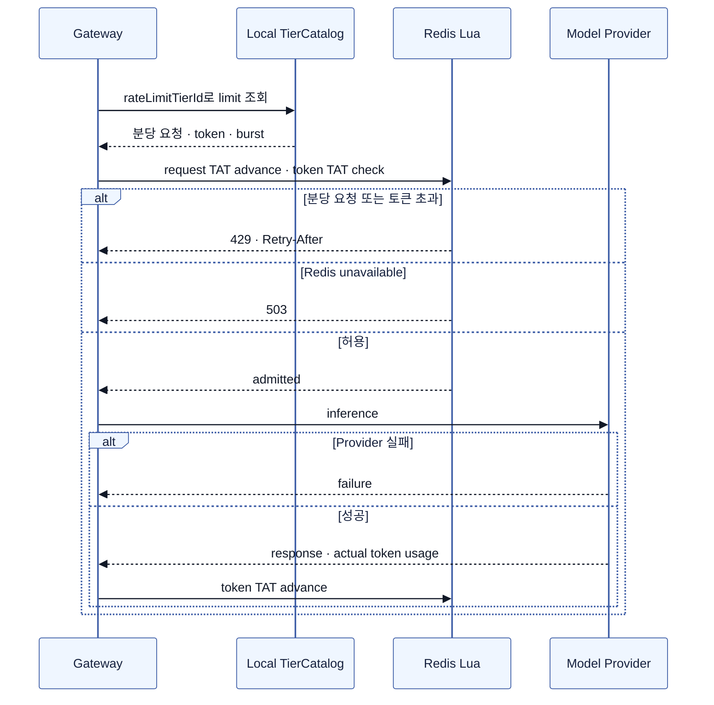

# Phase 1 — Team Tier Rate Limit

Rate Limit은 짧은 시간에 몰리는 Provider 호출량을 제한한다.
Team이 선택한 Tier가 분당 요청 수와 분당 토큰 수를 정하고, API Key는 Team을 식별·인증할 뿐 별도 한도를 갖지 않는다.

Phase 1의 범위는 `default` group 하나다.
모델별 group·concurrency와 기간 단위 제한은 뒤 단계에서 다룬다.

## 1. Tier가 요청 속도를 정한다



| 구성 | 책임 |
| --- | --- |
| Tier | `requests_per_minute`, `request_burst`, `tokens_per_minute`, `token_burst`를 가진 named profile |
| Team | Tier 하나를 선택하는 주체 |
| API Key | 인증 뒤 Team을 찾는 credential. Rate Limit state의 scope가 아님 |
| Admin | Team의 Tier assignment를 관리 |

Tier는 고정 상품 catalog이고, 현재 Team Tier는 Team row에 둔다.
Gateway는 인증 결과의 `teamId`·`rateLimitTierId`로 프로세스 로컬 Tier catalog에서 한도를 찾는다.
Redis에는 Tier policy를 넣지 않고, Team별 GCRA TAT만 둔다.



- `rate_limit_tier`에는 `tier_1`부터 `tier_5`까지 다섯 고정 row를 둔다. 분당 요청·토큰 값은 제품 정책이다.
- Team은 현재 Tier 하나만 가지므로 별도 assignment table이 필요 없다. 업그레이드는 `team.rate_limit_tier_id`를 바꾸는 작업이다.
- Team Tier 변경 뒤에는 인증 cache를 비우고 해당 Team의 Redis 두 TAT를 함께 삭제한다. 다음 요청은 새 Tier의 burst부터 시작한다.

### 초기 Tier 제안

OpenAI처럼 사용량에 따라 Team을 상향하는 다섯 고정 Tier를 둔다.
아래 수치는 이 문서의 예시 정책이며, OpenAI의 현재 모델별 limit을 복제한 값은 아니다.

| Tier | 분당 요청 수 | 요청 버스트 | 분당 token 수 | token 버스트 |
| --- | ---: | ---: | ---: | ---: |
| `tier_1` | 20 | 20 | 20,000 | 20,000 |
| `tier_2` | 60 | 60 | 100,000 | 100,000 |
| `tier_3` | 300 | 300 | 500,000 | 500,000 |
| `tier_4` | 1,000 | 1,000 | 2,000,000 | 2,000,000 |
| `tier_5` | 3,000 | 3,000 | 10,000,000 | 10,000,000 |

Tier 2라면 request interval은 `60초 / 60 = 1초`, token interval은 `60초 / 100,000 = 600µs`다.
각 버스트는 60초 분량이다. rate를 바꾸지 않고 더 관대하게 만들 필요가 생길 때만 버스트를 별도로 키운다.

## 2. 분당 요청·토큰 모두 GCRA로 관리한다

GCRA는 다음 허용 시각인 `TAT`(theoretical arrival time) 하나를 상태로 둔다.
고정 minute counter의 경계 burst 없이, 일정한 회복 속도와 명시적인 burst를 함께 표현할 수 있다.

| 차원 | 시점 | 상태 갱신 | 성격 |
| --- | --- | --- | --- |
| 분당 요청 | preflight | 허용된 요청만 request TAT를 1 request interval만큼 전진 | strict |
| 분당 토큰 | preflight / 성공 postflight | preflight는 token TAT만 확인하고, 성공 뒤 실제 token만큼 전진 | soft |

분당 토큰 제한은 preflight에 token 수를 예약하지 않는다.
tokenizer를 요청 경로에 넣지 않으며, 성공한 Provider 응답의 `res.usage.total_tokens`를 동기로 반영한다.

그래서 여러 요청이 동시에 진행되면 분당 토큰 수를 넘긴 응답도 반환될 수 있다.
그 초과분은 다음 요청을 막는 상태가 되며, 이미 시작한 Provider 호출을 취소하거나 rollback하지 않는다.

`request_burst`와 `token_burst`는 각각 처음에 허용할 수 있는 request·token 양이다.
rate와 독립된 값이므로, steady rate를 바꾸지 않고도 GCRA를 더 관대하거나 엄격하게 조절할 수 있다.

| Tier 값 | 단위 | 역할 |
| --- | --- | --- |
| `requests_per_minute` | requests / minute | 지속 허용 속도 |
| `request_burst` | requests | 즉시 허용하는 request 수 |
| `tokens_per_minute` | tokens / minute | 지속 token 허용 속도 |
| `token_burst` | tokens | 즉시 허용하는 token 양 |

기존 fixed window에서 GCRA로 옮길 때는 `request_burst = requests_per_minute`, `token_burst = tokens_per_minute`으로 시작해 기존 초기 burst를 보존할 수 있다.
그 뒤 관측에 따라 burst만 따로 줄이거나 늘린다.

## 3. GCRA 계산과 Lua 경계

Redis `TIME`의 microsecond epoch를 유일한 시계로 쓴다.
`TAT`도 정수 microsecond로 저장하며, Gateway 시계와 float 누적값은 쓰지 않는다.

| Lua | 함께 다루는 Redis key | 원자적으로 묶는 이유 |
| --- | --- | --- |
| preflight | request TAT · token TAT | 두 제한 판정과 request TAT 갱신을 하나의 admit/deny 결정으로 만든다. |
| token postflight | token TAT | 실제 token 수 반영과 TAT 만료 시각 갱신을 함께 처리한다. |
| Team Tier 변경 invalidation | request TAT · token TAT | 새 Tier가 이전 TAT와 섞이지 않게 함께 삭제한다. |

### Preflight

아래는 Lua 안에서 한 번에 수행할 계산의 의사 코드다.

```kotlin
val now = redisTimeMicros() // Gateway 시계 대신 Redis 시계

// 1 request가 차지하는 시간과 즉시 허용 범위
val requestInterval = ceil(60_000_000.0 / requestsPerMinute)
val requestTolerance = requestBurst * requestInterval

// token은 성공 후에만 알 수 있으므로 지금은 막을지 여부만 확인
val tokenTolerance = ceil(tokenBurst * 60_000_000.0 / tokensPerMinute)

if (tokenTat > now + tokenTolerance) {
  return tokenLimitExceeded()
}

// request는 허용할 때만 TAT를 전진한다.
val requestCandidate = maxOf(requestTat, now) + requestInterval
if (requestCandidate - requestTolerance > now) {
  return requestLimitExceeded()
}

setRequestTat(requestCandidate)
expireAtRequestTat(requestCandidate) // debt가 사라질 때 정리
return admitted()
```

거절된 요청은 어느 TAT도 바꾸지 않는다.
token TAT는 이 시점에는 확인만 하며, 아직 token 수를 모르므로 갱신하지 않는다.

### 성공 postflight

```kotlin
actualTokens?.let { tokens ->
  // 실제 사용량만큼 다음 token 허용 시각을 뒤로 민다.
  val tokenDelta = ceil(tokens * 60_000_000.0 / tokensPerMinute)
  val nextTokenTat = maxOf(tokenTat, now) + tokenDelta

  setTokenTat(nextTokenTat)
  expireAtTokenTat(nextTokenTat) // debt가 사라질 때 정리
}
```

usage가 없는 성공 응답은 P1에서 별도 추정·보정하지 않는다.
Provider 호출 실패도 이미 허용된 request 시도로 남기며 TAT를 되돌리지 않는다.

## 4. Redis key

모든 키는 `{teamId}` hash tag를 쓴다.
한 Lua script가 읽고 쓰는 키는 같은 Redis Cluster slot에 있다.

| 상태 | 키 패턴 | 값 | 만료 |
| --- | --- | --- | --- |
| request TAT | `quota:rate:gcra:v2:{teamId}:group:default:requests` | 정수 microsecond TAT | TAT가 현재가 될 때까지 |
| token TAT | `quota:rate:gcra:v2:{teamId}:group:default:tokens` | 정수 microsecond TAT | TAT가 현재가 될 때까지 |

TAT의 `PEXPIREAT`은 burst tolerance가 아니라 **TAT 자신**을 기준으로 잡는다.
이전 TAT가 남긴 debt가 사라지기 전 state를 지우면 burst를 반복해서 재생성할 수 있기 때문이다.

## 5. 로컬 Tier catalog과 Team Tier 변경

Tier catalog은 Gateway 부트타임에 한 번 적재하는 immutable object다.
TTL·refresh 없이 프로세스가 살아 있는 동안 유지하며, DB lookup·Redis cache miss는 Rate Limit request path에 없다.

| 시점 | 처리 |
| --- | --- |
| Gateway boot | `rate_limit_tier` 다섯 row를 `TierCatalog`으로 적재한다. |
| API Key 인증 | `teamId`와 `rateLimitTierId`를 얻는다. |
| Rate Limit preflight | 로컬 `TierCatalog[tierId]`에서 분당 요청·token·burst 값을 읽는다. |
| Team Tier upgrade | Team FK를 transaction으로 바꾼 뒤, 인증 상태 전파와 Redis TAT 삭제를 발행한다. |

Tier 변경 event가 TAT 삭제보다 먼저 전달되더라도, 다음 요청의 Lua는 새 Tier 값으로 기존 TAT를 해석할 수 있다.
삭제 완료 전의 짧은 구간은 새 Tier rate로 계산되는 것을 허용하고, 삭제 뒤 새 burst에서 다시 시작한다.

## 6. 장애와 Avalanche

Tier policy cache miss가 없으므로 Rate Limit 자체는 Control Plane 조회 avalanche를 만들지 않는다.
Redis Lua timeout·오류는 direct PostgreSQL fallback 없이 503으로 끝낸다.

| 상황 | 처리 |
| --- | --- |
| Redis failover로 TAT 유실 | Team당 burst tolerance만큼의 일시적 여유를 허용한다. |
| Redis 장애 | 빠르게 503을 반환하고 retry loop를 만들지 않는다. |
| Team Tier 변경 event 지연 | 인증 상태 전파가 끝날 때까지 이전 Tier가 남을 수 있으므로 event delivery를 관측한다. |

## 7. 요청 흐름



| 결과 | `type` | `code` | 응답 metadata |
| --- | --- | --- | --- |
| 분당 요청 초과 | `rate_limit_error` | `requests_per_minute_exceeded` | `Retry-After`, request remaining |
| 분당 토큰 초과 | `rate_limit_error` | `tokens_per_minute_exceeded` | `Retry-After`, token remaining |
| Redis timeout·Lua 오류 | `service_unavailable` | `admission_state_unavailable` | 짧은 `Retry-After`, correlation ID |

`Retry-After`는 각 차원의 `candidate - tolerance - now`를 초 단위로 올림해 계산한다.
soft token limit의 초과분이 크면 60초보다 큰 값도 가능하다.

## 8. 검증 항목

| 구분 | 확인할 불변식 |
| --- | --- |
| 분당 요청 | 허용 요청만 request TAT를 전진한다. 연속 거절은 TAT를 바꾸지 않는다. |
| 분당 토큰 | 실제 token 수가 있는 성공 응답만 동기로 반영하며, concurrent overshoot를 허용한다. |
| 정밀도 | 고 TPM에서 10만 회 이상 누적해도 closed-form microsecond TAT와 일치한다. |
| 시간 | Redis `TIME`만 쓰며 TAT가 현재가 될 때까지 state가 유지된다. |
| Team Tier 변경 | 인증 상태 전파와 두 TAT 삭제 뒤 다음 요청이 새 Tier burst에서 시작한다. |
| Cluster·장애 | 모든 Lua key가 `{teamId}` slot에 있고, Redis 오류·failover는 문서화한 503·bounded burst 규칙을 따른다. |

## 9. 고트래픽 확장 검토 — local buffering은 기각

Gateway가 요청을 먼저 local cache에서 허용하고 나중에 Redis TAT에 합산하는 방식은 채택하지 않는다.
GCRA는 요청 허용 순서가 상태의 일부라서, batch delta를 나중에 합치면 전역 Rate Limit이 깨진다.

Redis가 permit을 먼저 발급하고 Gateway가 local에서 소비하는 lease 방식은 정확하지만,
실제 token은 응답 뒤에만 알 수 있어 현재의 strict token preflight·postflight를 없애지 못한다.
현재 예상 유량에서는 그 복잡도를 정당화하지 못한다.

**결정:** Phase 1은 Redis Cluster의 direct Lua GCRA만 사용한다.

현재 예시의 최상위 Tier(`3,000` requests/min)를 모든 Team이 사용하고 성공 요청마다 Lua가 두 번 실행된다고 가정한다.

| 활성 Team 수 | 전체 request RPS | Redis script/s | 권장 구성 |
| ---: | ---: | ---: | --- |
| 1~30 | 50~1,500 | 100~3,000 | `c7gn.large` 1 shard + replica 1 |
| 31~150 | 1,550~7,500 | 3,100~15,000 | `c7gn.large` 3 shard + shard별 replica 1 |
| 151~500 | 7,550~25,000 | 15,100~50,000 | `c7gn.large` 6 shard + shard별 replica 1 |

100 Team 기준 선택은 **3 primary shard × `cache.c7gn.large`와 shard당 replica 1개**, 총 6 nodes다.
Rate Limit state에는 메모리보다 CPU·network가 중요하므로 memory-optimized R 계열 대신 compute-optimized C 계열을 쓴다.

| 지점 | 운영 목표 |
| --- | --- |
| preflight Lua | p50 0.3~0.8ms, p99 2~5ms |
| 성공 postflight Lua | p50 0.3~0.8ms, p99 2~5ms |
| Redis 정책 | `noeviction`, rate-limit 전용 cluster, `EVALSHA`, connection reuse |
| 확장 신호 | shard별 Engine CPU·Lua p99·network·connection 수 |

특정 Team 하나가 hot하면 `{teamId}` hash tag 때문에 한 shard에 고정된다.
그때는 shard 수를 늘려도 해결되지 않으며, 해당 Team의 Tier 상한이나 permit lease를 별도 검토한다.

## 참고

- [OpenAI — Increase usage tiers](https://help.openai.com/en/articles/6643435) — usage tier가 올라가면 대체로 rate limit도 상향되는 구조를 참고했다. 이 문서의 다섯 Tier 수치는 자체 예시다.
- [OpenAI — Troubleshooting rate limits and 429 errors](https://help.openai.com/en/articles/5955604) — request·token rate limit이 별도라는 점을 참고했다.
- [OpenAI — Reviewing API usage and costs](https://help.openai.com/en/articles/10478918/reviewing-api-usage-and-costs) — Provider 응답의 token usage 필드와 streaming usage 수집 방식을 참고했다.
- [Redis — redis-cell](https://redis.io/blog/redis-cell-rate-limiting-redis-module/) — GCRA가 key 하나로 steady rate와 burst를 표현하는 방식을 참고했다.
- [Redis Cluster specification](https://redis.io/docs/latest/operate/oss_and_stack/reference/cluster-spec/) — multi-key operation의 hash tag 제약을 참고했다.
- [Redis Lua API](https://redis.io/docs/latest/develop/programmability/lua-api/) — Lua에서 `TIME`·원자 갱신을 사용하는 근거로 참고했다.
- [AWS ElastiCache — Supported node types](https://docs.aws.amazon.com/AmazonElastiCache/latest/dg/CacheNodes.SupportedTypes.html) — `c7gn`의 memory·network 특성과 node 선택 기준을 반영했다.
- [AWS ElastiCache — Redis 7 enhanced I/O benchmark](https://aws.amazon.com/blogs/database/enhanced-io-multiplexing-for-amazon-elasticache-for-redis/) — direct Redis Lua의 p99 latency 목표를 잡는 비교 기준으로 참고했다. 실제 수치는 동일 Lua·TLS·AZ 조건에서 부하 테스트로 확정한다.
