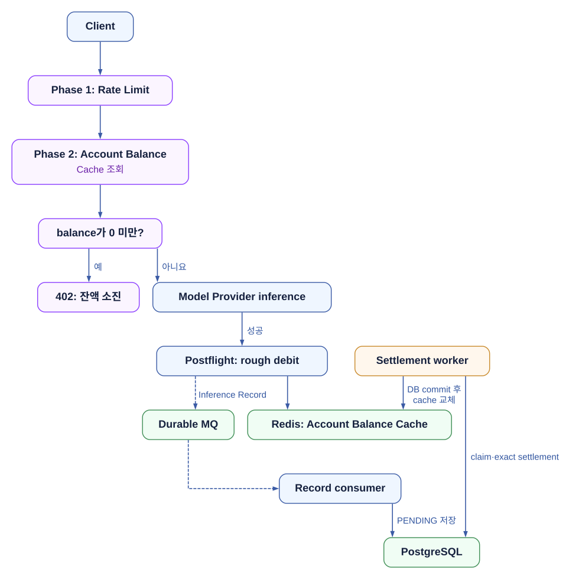
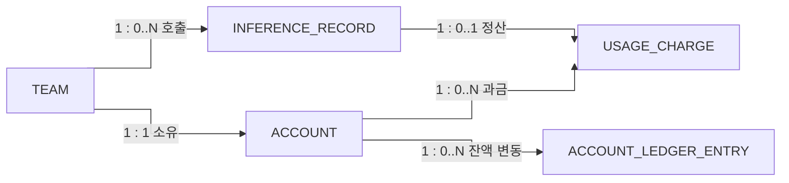

# Phase 2 — Team Balance Control

Phase 1의 Rate Limit이 짧은 시간의 호출량을 제한했다면,
Phase 2는 Team의 현재 잔액을 기준으로 inference를 계속 허용할지를 판단한다.

목표는 음수 잔액을 **없애는 것**이 아니라, 성공한 inference 뒤의 차감을 빠르게 반영해
음수 잔액의 규모와 지속 시간을 줄이는 것이다. `balance_usd = 0`은 허용하고 음수일 때만 거절한다.

| 용어 | 역할 |
| --- | --- |
| Account | Team당 하나인 결제 계정. `balance_usd`가 현재 Account Balance다. |
| Account Ledger | 충전·사용·환불·조정의 append-only 변경 이력. 한 행은 Account Ledger Entry다. |
| Usage Charge | inference의 정확한 고객 사용료. `DEBIT · USAGE` Entry의 근거다. |
| Inference Record | provider 응답에서 얻은 추론 사실. 가격이나 Ledger ID를 직접 갖지 않는다. |
| Account Balance Cache | 정산된 Account Balance를 바탕으로 rough debit을 반영한 Redis의 preflight용 값이다. |

Account와 Account Balance를 별도 테이블로 나누지 않는다.
현재는 Team당 단일 USD Account이고 Account와 잔액의 생성·잠금·감사 주기가 같기 때문이다.
다중 통화나 sub-account가 필요해질 때만 Balance aggregate를 분리한다.

전체 topology는 [Admission Control](./2608-admission-control.md)을 기준으로 한다.
이 문서는 [Phase 1 — Rate Limit](./2608-p1-rate-limit.md) 다음 단계다.

## 1. 요청 경로와 정산 경로를 분리한다

preflight는 Redis만 읽는다. Provider 성공 뒤에는 같은 `inference_id`의 Inference Record를 durable MQ에 남기고,
Gateway가 Redis Account Balance Cache를 rough debit한다.
consumer는 Inference Record만 `PENDING`으로 저장하며 Kafka 재전달로 rough debit을 다시 실행하지 않는다.



Provider 호출마다 PostgreSQL을 읽고 갱신하는 설계는 선택하지 않는다.
유량이 낮아도 retry·burst·동시 요청이 Account row를 hot path로 만들기 때문이다.

## 2. inference_id는 Provider 실행을 식별한다

Data Plane은 Provider 성공 뒤 `InferenceRecord` payload를 durable MQ에 at-least-once로 전송한다.
MQ 종류는 Kafka일 수 있지만, P2가 요구하는 것은 broker 이름이 아니라 아래 계약이다.

- producer는 broker ack를 받기 전 성공 응답을 완료하지 않는다.
- `inference_id`는 독립적으로 과금될 수 있는 Provider dispatch 직전에 발급한다.
  같은 payload를 두 번 호출해도 서로 다른 실행이므로 ID도 다르다.
- Provider timeout 뒤 Retry하거나 다른 Provider로 fallback하면 각 dispatch에 새 `inference_id`를 발급한다.
  고객 Retry를 한 request로 묶는 `Idempotency-Key`와 inference 실행 ID는 다른 개념이다.
- 같은 `inference_id`의 재전달은 허용한다. consumer는 Inference Record insert만 멱등 처리하며 rough debit을 다시 실행하지 않는다.
- payload가 같은 ID와 다른 hash로 재전달되면 기존 Record는 유지하고 warn log·metric을 남긴다.
  정상 재시도로 바꾸거나 새 charge를 만들지 않는다.
- 반복 실패한 message는 운영 대기열로 격리한다. `ERROR_*` Record는 자동 정산하지 않고 대사한다.

Gateway는 Provider 성공 뒤 rough debit과 Inference Record 전달을 각각 시작한다.
broker ack는 Record의 durable handoff만 보장하며 Kafka Retry가 rough debit을 다시 실행하지는 않는다.
결과가 불명확한 Redis mutation은 독립적으로 Retry하지 않고 durable Record 기반 reconciliation에 맡긴다.

Redis에 inference별 marker를 두면 미정산 호출 수만큼 state가 늘어난다.
Hash로 묶어도 field cardinality와 한 Team의 hot slot 문제는 남으므로 Team별 Account Balance Cache만 유지한다.
금전적 정확성은 PostgreSQL의 `usage_charge.inference_record_id` unique 제약과 한 transaction의 Account Ledger Entry·Account Balance 갱신으로 만든다.

## 3. Account, Record, Charge, Ledger 관계

아래는 실행 흐름이 아니라 저장 관계다.
`Inference Record`에는 원본 usage와 재현에 필요한 가격표 revision만 보관하고,
가격·계산 근거는 정산 뒤 `Usage Charge`에 고정한다.

관계선의 `1 : 0..N`은 일대다, `1 : 0..1`은 선택적 일대일 관계다.



**ACCOUNT**

| 필드 | 타입 | 키 | 설명 |
|---|---|---|---|
| `id` | `uuidv7` | PK | — |
| `team_id` | `uuid` | UK | one Account per Team |
| `balance_usd` | `numeric` | — | current Account Balance |
| `created_at` | `timestamptz` | — | — |
| `created_by` | `varchar` | — | — |
| `updated_at` | `timestamptz` | — | — |
| `updated_by` | `varchar` | — | — |

**INFERENCE_RECORD**

| 필드 | 타입 | 키 | 설명 |
|---|---|---|---|
| `id` | `uuidv7` | PK | record ID |
| `inference_id` | `uuidv7` | UK | one ID per Provider dispatch |
| `team_id` | `uuid` | FK | — |
| `provider` | `varchar` | — | — |
| `model_id` | `varchar` | — | — |
| `usage_json` | `jsonb` | — | provider raw usage |
| `request_metadata_json` | `jsonb` | — | allowlisted headers |
| `response_metadata_json` | `jsonb` | — | provider metadata |
| `payload_hash` | `varchar` | — | normalized SHA-256 |
| `settlement_status` | `varchar` | — | PENDING, SETTLED, SKIPPED, ERROR |
| `inference_ended_at` | `timestamptz` | — | — |
| `settled_at` | `timestamptz` | — | — |
| `created_at` | `timestamptz` | — | — |
| `created_by` | `varchar` | — | — |
| `updated_at` | `timestamptz` | — | — |
| `updated_by` | `varchar` | — | — |

**USAGE_CHARGE**

| 필드 | 타입 | 키 | 설명 |
|---|---|---|---|
| `id` | `uuidv7` | PK | — |
| `inference_record_id` | `uuid` | UK | FK; one exact charge per inference |
| `account_id` | `uuidv7` | FK | — |
| `amount_usd` | `numeric` | — | positive exact customer amount |
| `pricing_snapshot_json` | `jsonb` | — | immutable price basis |
| `calculation_json` | `jsonb` | — | usage and calculation breakdown |
| `created_at` | `timestamptz` | — | — |
| `created_by` | `varchar` | — | — |

**ACCOUNT_LEDGER_ENTRY**

| 필드 | 타입 | 키 | 설명 |
|---|---|---|---|
| `id` | `uuidv7` | PK | — |
| `account_id` | `uuidv7` | FK | — |
| `source_type` | `varchar` | — | USAGE_SETTLEMENT, PAYMENT, REDEEM, ADMIN |
| `source_id` | `varchar` | — | settlement batch or idempotency source |
| `amount_usd` | `numeric` | — | always positive |
| `direction` | `varchar` | — | CREDIT or DEBIT |
| `entry_type` | `varchar` | — | USAGE, PAYMENT, REDEEM, REFUND, OPENING_BALANCE, ADJUSTMENT |
| `note` | `varchar` | — | required for ADMIN_ADJUSTMENT |
| `created_at` | `timestamptz` | — | — |
| `created_by` | `varchar` | — | — |

| 데이터 | 핵심 규칙 |
| --- | --- |
| `account.balance_usd` | 현재 권위 잔액이다. usage settlement·payment·redeem·admin command는 이 row를 잠근 transaction에서 갱신한다. |
| `account_ledger_entry` | append-only다. `amount_usd`는 항상 양수이고 `direction`이 증감 방향을 나타낸다. application role에는 `UPDATE`·`DELETE` 권한을 주지 않는다. |
| `usage_charge` | `inference_record_id` unique다. 가격표 snapshot과 계산 breakdown이 이 행에 고정되므로 재처리해도 다른 금액을 만들지 않는다. |
| `inference_record` | 추론 사실이다. `inference_id`는 Provider dispatch를 식별하고, 파생 token column·가격·Ledger ID를 두지 않는다. 정산은 이 Record의 `usage_json`을 입력으로 한다. |

`Account Ledger Entry`의 idempotency key는 `(account_id, source_type, source_id)`다.
사용 정산은 Account별 batch ID를 `source_id`로 쓰고, 결제·redeem·관리자 보정은 각 명령 ID를 쓴다.
Inference Record·Usage Charge·Ledger Entry는 shared ID를 쓰지 않는다.
Usage Charge의 `inference_record_id`는 Record와의 1:1 관계만 표현하며, 여러 Charge는 하나의 usage settlement Entry에 함께 반영될 수 있다.

Account는 0으로 만들고, 이관에서만 `CREDIT · OPENING_BALANCE` Entry를 남긴다.

| `settlement_status` | 의미 |
| --- | --- |
| `PENDING` | durable record가 수신됐고 자동 정산을 기다린다. |
| `SETTLED` | Usage Charge, `DEBIT · USAGE`, Account Balance 갱신이 함께 확정됐다. |
| `SKIPPED_PROVIDER_FAILURE` | Provider 실패 record라 과금하지 않는다. |
| `SKIPPED_INTERNAL` | 내부 Provider 등 과금 대상이 아닌 호출이다. |
| `ERROR_PRICE_NOT_FOUND` | 가격표 revision을 찾지 못했다. 자동 정산을 멈춘다. |
| `ERROR_ACCOUNT_NOT_FOUND` | Team의 Account를 찾지 못했다. 자동 정산을 멈춘다. |

별도 status table은 만들지 않는다. 이 상태는 Inference Record 한 행의 정산 lifecycle이다.

## 4. Exact settlement는 하나의 transaction이다

Settlement worker는 짧은 주기로 `PENDING` Record를 `FOR UPDATE SKIP LOCKED`로 batch claim한다.
동일 Account의 Charge를 묶고, Account가 debit과 Ledger 생성을 함께 처리한다.

1. 가격표와 각 Record의 `usage_json`으로 정확한 Usage Charge를 만든다.
2. 같은 Account의 Usage Charge를 합산해 `debit(USAGE, amount)`을 요청한다.
3. Account는 Balance를 차감하고 `DEBIT · USAGE` Ledger Entry를 자동으로 남긴다.
4. 포함된 Record를 `SETTLED`, `settled_at`으로 전이한다.

1~4는 같은 PostgreSQL transaction이다.
commit 응답이 유실돼 worker가 재시도해도 `usage_charge.inference_record_id` unique와 settlement batch idempotency key가 기존 결과를 돌려준다.
환불·가격 보정은 기존 Entry를 수정하지 않고 `CREDIT · REFUND` 또는 `ADMIN_ADJUSTMENT` Entry를 추가한다.

금액은 모든 PostgreSQL 행에서 USD `numeric`으로 저장한다.
`numeric`과 `decimal`은 PostgreSQL에서 동의어이며, embedding처럼 작은 가격을 위해 fixed scale은 강제하지 않는다.

## 5. Redis는 Team별 Account Balance Cache 하나만 유지한다

Redis String 값은 정수 scaled USD다. PostgreSQL의 `numeric`을 Redis로 보낼 때는
`USD_SCALE = 100_000_000`으로 변환하고, rough debit에는 올림(`ceil`)을 적용한다.

| 목적 | 키 | 값 | TTL |
| --- | --- | --- | --- |
| Account Balance Cache | `quota:{teamId}:account-balance` | 정산된 Account Balance에 rough debit을 반영한 값 | 1시간 + 0~3분 jitter |

`{teamId}`는 Redis Cluster에서 Team별 key를 같은 slot에 두는 hash tag다.
postflight rough debit과 Worker의 Cache 교체는 TTL을 연장하고, preflight read는 TTL을 건드리지 않는다.

### 성공 inference 뒤 rough debit

Gateway postflight는 Account Balance Cache가 있을 때만 한 Lua로 rough debit한다.
Kafka 재전달은 Inference Record 수신만 반복하므로 Redis debit을 다시 만들지 않는다.

Redis mutation 결과가 불명확하면 같은 debit을 독립적으로 재시도하지 않는다.
일시적인 Cache 오차는 다음 정산이 Account Balance 값으로 Cache를 교체하며 해소한다.

### 정산 뒤 Account Balance Cache를 교체한다

Worker는 DB transaction으로 Account Balance와 Ledger를 확정한 뒤, 정산된 Account Balance 값으로 Account Balance Cache를 교체한다.
rough debit을 다시 합산하거나, 정산 금액과의 차이만 계산해 보정하지 않는다.

DB와 Redis는 하나의 transaction이 아니다.
Redis 교체 실패로 DB 정산을 되돌리지 않으며, Account Balance를 기준으로 Cache를 다시 만들 수 있다.

Redis가 정상인데 Cache key만 없으면 Data Plane은 DB의 Account Balance를 읽어 `SET NX`로 Cache를 채운 뒤 판단한다.
Gateway의 DB connection pool이 동시에 허용할 cache miss 조회 수를 제한한다.

Redis 전체 유실 뒤 복구가 완료되면 같은 DB look-aside로 Cache를 다시 채운다.
Redis timeout·failover처럼 상태를 읽거나 쓸 수 없는 동안에는 신규 inference를 `503`으로 fail-closed 한다.

이 `503`은 고객에게 보이는 장애다. 그래서 단일 Redis가 아니라 primary마다 replica를 둔 Redis Cluster를 전제로 한다.
단일 node·shard 장애는 failover로 흡수하고, 전체 cluster·network 장애처럼 비용 상태가 불명확한 request만 fail-closed 한다.

## 6. Soft admission의 한계와 응답

Rate Limit을 통과한 동시 요청은 같은 양수 Account Balance Cache를 보고 함께 시작할 수 있다.
Provider 실행 시간과 Gateway postflight 지연 동안에는 아직 차감되지 않은 금액도 있다.
따라서 negative exposure는 정량 보장이 아니라 운영상 soft bound다.

대략적인 관측 상한은 `허용된 초당 요청 수 × 요청당 최대 추정 사용료 × postflight 지연`으로 잡는다.
Tier의 request rate, Provider의 output cap, `oldest_pending_age`, Account Balance Cache와 Account Balance의 차이, scheduler backlog를 함께 관측한다.

| 상황 | 처리 |
| --- | --- |
| `balance_usd < 0` | 402. 충전 또는 다른 Account mutation 뒤 재시도한다. |
| Redis key miss·key 데이터 유실 | Redis가 정상일 때 DB look-aside로 Account Balance를 읽어 `SET NX`한다. connection pool로 동시 조회 수를 제한한다. |
| Redis shard·cluster unavailable | `503`. primary별 replica를 둔 Redis Cluster의 failover를 전제로, Redis 없이 request를 허용하지 않는다. |
| 가격표 miss | rough debit은 건너뛸 수 있지만 Record는 보존한다. exact settlement는 `ERROR_PRICE_NOT_FOUND`로 멈춘다. |
| worker backlog | pending age와 Account Balance Cache 오차를 alert하고 worker를 확장한다. |

```json
{
  "error": {
    "type": "insufficient_quota",
    "code": "credit_balance_exhausted",
    "message": "Team credit balance is exhausted. Add credits and retry."
  }
}
```

| HTTP | type | code | 의미 |
| --- | --- | --- | --- |
| 402 | `insufficient_quota` | `credit_balance_exhausted` | Balance가 음수다. |
| 429 | `rate_limit_error` | `requests_per_minute_exceeded` | Phase 1 request rate 초과다. |
| 429 | `rate_limit_error` | `tokens_per_minute_exceeded` | Phase 1 token rate 초과다. |
| 429 | `rate_limit_error` | `concurrent_requests_exceeded` | 이후 Concurrency Control의 동시 실행 수 초과다. |
| 503 | `service_unavailable` | `admission_unavailable` | 안전하게 balance 판단을 할 수 없다. |

## 7. OLAP은 나중에 조회 경로를 분리한다

초기에는 PostgreSQL에서 Inference Record와 Usage Charge를 함께 정산한다.
고객 usage query와 장기 inference 분석이 PostgreSQL에 부담을 줄 때 OLAP으로 복제한다.

| 데이터 | near term | long term |
| --- | --- | --- |
| Inference Record | PostgreSQL의 durable settlement input | OLAP 조회·보관 복제본 |
| Usage Charge | PostgreSQL의 exact settlement 결과 | OLAP 조회·분석 복제본 |
| Account Ledger | PostgreSQL append-only 권위 이력 | 필요하면 분석 복제만 추가 |
| Account Balance | PostgreSQL current state | PostgreSQL current state |

OLAP은 ClickHouse일 수 있지만 설계의 전제는 아니다.
ClickHouse Cloud, Redshift Serverless 등은 실제 query 동시성·운영 공수·AWS 의존도를 보고 선택한다.
S3 Parquet은 장기 원본 보관 선택지이며, 고객 API의 저지연 usage query와는 별개의 결정이다.

OLAP은 `PENDING` claim이나 Account Balance update의 source가 아니다.
at-least-once 복제에서는 stable ID 기반 dedup 조회 모델이 필요하고,
Usage Charge의 amount와 pricing snapshot은 재가격 계산 없이 보존한다.

## 8. 검증 항목

- SVG와 Mermaid를 모두 렌더하고, 문서 폭에서 글자·분기·연결선의 가독성을 확인한다.
- Postflight의 broker ack 전 crash, broker ack 뒤 rough debit 전 crash, rough debit 뒤 응답 전 crash를 주입한다.
- 동일 ID·동일 hash와 동일 ID·다른 hash를 각각 재전달한다.
- 정산 뒤 Account Balance Cache가 정산된 Account Balance 값으로 교체되는지 확인한다.
- Account Balance Cache key 삭제·Redis flush 뒤 Account Balance 기반 복구를 확인한다.
- usage settlement와 payment·redeem·admin command를 동시에 실행해 Account row lock과 source idempotency가 유지되는지 확인한다.
- 가격표 revision이 바뀐 뒤에도 기존 Record가 같은 Usage Charge를 만드는지 확인한다.
- `deduction`, fixed money scale, `inference_record.ledger_entry_id`, 별도 status table이 남지 않았는지 검색한다.

## 참고

- [토스페이먼츠 — 자동결제(빌링)](https://docs.tosspayments.com/guides/v2/billing) — 빌링을 자동결제·결제수단 토큰의 의미로 쓰는 사례를 반영했다.
- [Stripe — Billing credits](https://docs.stripe.com/billing/subscriptions/usage-based/billing-credits?locale=en-GB) — billing credit, append-only ledger, credit/debit transaction 용어를 참고했다.
- [OpenAI — Prepaid API billing](https://help.openai.com/en/articles/8264644-what-is-prepaid-billin) — credit balance, auto-reload, 음수 잔액과 별도 spend limit을 참고했다.
- [OpenRouter — FAQ](https://openrouter.ai/docs/faq) — credits, balance top-up, request cost 차감과 Team 공유 credit pool 사례를 참고했다.
- [PostgreSQL 15 — UUID functions](https://www.postgresql.org/docs/15/functions-uuid.html) — PostgreSQL 15의 native generator가 UUIDv4뿐임을 확인했다. 이 설계의 UUIDv7은 application-generated다.
- 제공된 설계 리서치: [입장 통제](https://github.com/sionic-ai/opengateway-claude-skills/blob/docs/og-479-anti-abuse-research/opengateway-research/references/260722_%EC%B5%9C%EB%B3%91%ED%98%84_opengateway-%EC%A7%84%ED%99%94-%EB%A6%AC%EC%84%9C%EC%B9%98/admission-control.md) — preflight/postflight 분리와 fail-closed recovery를 반영했다.
- 제공된 설계 리서치: [정산 아키텍처](https://github.com/sionic-ai/opengateway-claude-skills/blob/docs/og-479-anti-abuse-research/opengateway-research/references/260722_%EC%B5%9C%EB%B3%91%ED%98%84_opengateway-%EC%A7%84%ED%99%94-%EB%A6%AC%EC%84%9C%EC%B9%98/settlement-design.md) — durable record와 batch settlement, Account Balance Cache 교체 경로를 반영했다.
