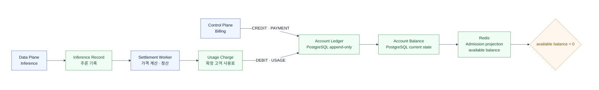
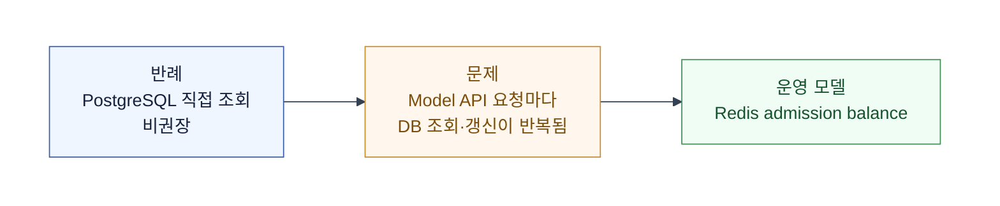
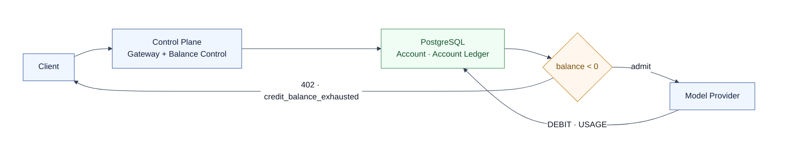
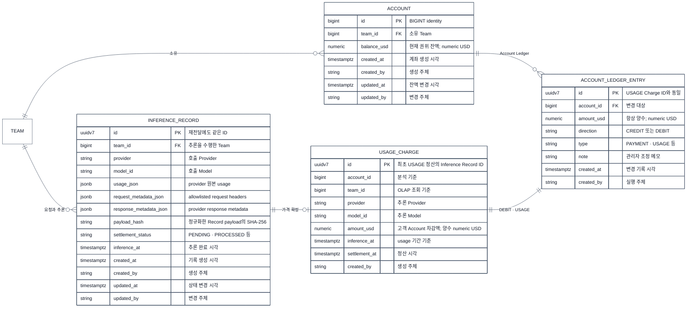
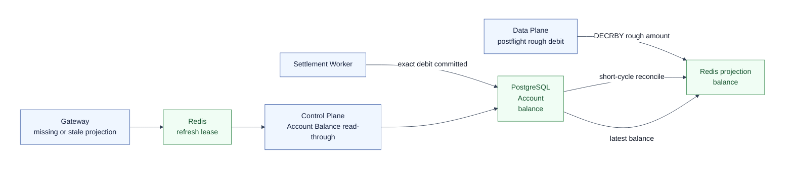

# Phase 2 — Balance Control (Billing의 Team Account Balance)

Billing은 Team의 결제·충전·잔액·사용료를 다루는 상위 도메인이다.

- **Account**: Team당 하나다. API Key는 사용할 Account만 식별한다.
- **admission 기준**: `Account Balance`가 `0`이면 허용하고, 음수면 거절한다.
- **Account Ledger**: 잔액 변경 이력이다. 행 하나를 Account Ledger Entry라고 부른다.
- **Usage Charge**: inference usage에서 확정한 고객 Account 차감액이다.

이 문서의 Gateway는 preflight를 수행하는 현재 진입 컴포넌트다.
전체 topology는 [Admission Control](./2608-admission-control.md)을 기준으로 한다.
이 문서는 [Phase 1 — Rate Limit](./2608-p1-rate-limit.md) 다음 단계다.

## 1. Billing 안에서의 위치



| 모델 | 역할 | 저장 경계 |
| --- | --- | --- |
| Inference Record | 추론 사실 | near PostgreSQL · long OLAP |
| Usage Charge | 확정 고객 사용료 | near PostgreSQL · long OLAP |
| Account Ledger Entry | Charge를 반영한 `DEBIT · USAGE` 이력 | PostgreSQL |
| Account Balance | 현재 잔액 | PostgreSQL |
| Redis | 성공 inference의 rough debit을 반영한 admission projection | Redis |

DB를 요청 경로에 두는 방식은 반례고, Redis projection 방식이 Balance Control의 운영 시작점이다.



## 2. 반례 — PostgreSQL 직접 조회 (비권장)

PostgreSQL Account Balance를 읽어 음수가 아니면 Provider를 호출하고,
완료 뒤 `DEBIT · USAGE`를 반영한다.



Model API는 burst·재시도·동시 호출이 쉽게 겹친다.
유량이 낮아도 원장 DB가 hot path가 되므로 운영 시작점으로는 부적절하다.

## 3. 운영 모델 — Redis admission balance

Redis는 preflight에만 쓰고, 성공 inference의 rough debit을 즉시 반영한다.
정산 scheduler는 PostgreSQL exact balance로 다시 써서 batch 주기 안의 노출을 보정한다.

```mermaid
---
config:
  theme: base
  darkMode: false
  themeVariables:
    background: "#ffffff"
    primaryColor: "#ffffff"
    primaryTextColor: "#111827"
    primaryBorderColor: "#475569"
    lineColor: "#334155"
    edgeLabelBackground: "#ffffff"
---
flowchart LR
  subgraph canvas[" "]
    direction LR
    client["Client"]:::app

    subgraph admissionControl["Balance Control"]
      direction LR
      subgraph preflight["Preflight"]
        direction TB
        balance["Redis\nBalance projection"]:::db
        decision{"balance < 0"}:::ctrl
        rejected["Admission rejected\n402 · 503"]:::ctrl
        balance --> decision
        decision -->|reject| rejected
      end

      subgraph modelCall["Model call"]
        direction TB
        provider["Model Provider"]:::app
      end

      subgraph postflight["Postflight"]
        direction TB
        roughDebit["Data Plane\nrough debit to Redis"]:::app
        mq["Durable MQ\nInference Record"]:::db
        roughDebit --> mq
      end
    end

    subgraph settlement["Settlement — batch"]
      direction TB
      worker["Settlement Worker\nPENDING record polling\nshort-cycle Redis reconcile"]:::app
      account["PostgreSQL\nAccount · Account Ledger\nInference Record · Usage Charge"]:::db
      worker -->|exact settlement| account
    end

    client --> balance
    decision -->|admit| provider
    provider -->|success| roughDebit
    mq -->|Inference Record| worker
  end

  classDef app fill:#EFF6FF,stroke:#3B5BA5,stroke-width:1px,color:#16213E
  classDef db fill:#F0FDF4,stroke:#3F8E55,stroke-width:1px,color:#14532D
  classDef ctrl fill:#FFF7ED,stroke:#C98A2B,stroke-width:1px,color:#7A4E0A
  style canvas fill:#ffffff,stroke:#ffffff,stroke-width:0px,color:#111827
  style admissionControl fill:#F8FAFC,stroke:#CBD5E1,stroke-width:1px,color:#111827
  style preflight fill:#F8FAFC,stroke:#CBD5E1,stroke-width:1px,color:#111827
  style modelCall fill:#F8FAFC,stroke:#CBD5E1,stroke-width:1px,color:#111827
  style postflight fill:#F8FAFC,stroke:#CBD5E1,stroke-width:1px,color:#111827
  style settlement fill:#F8FAFC,stroke:#CBD5E1,stroke-width:1px,color:#111827
```



Inference Record·Charge·usage entry는 최초 usage에서 같은 ID를 쓴다.

`usage_amount_usd = price × usage`

`balance_usd = balance_usd - usage_amount_usd`

PostgreSQL의 금액은 scale을 고정하지 않은 `numeric` USD로 보관한다.
`DEBIT`은 Balance에서 양수 `amount_usd`를 빼며, 음수 금액을 저장하지 않는다.
이 문서에서는 다중 통화와 환율을 다루지 않는다.

## 4. soft admission의 약속과 한계

- 동시에 시작된 요청은 모두 같은 Redis balance를 읽고 통과할 수 있다.
- Provider 실행 중에는 아직 rough debit되지 않아 batch 이전 노출이 남는다.
- rough debit 오차 때문에 exact settlement 뒤 Account Balance가 음수가 될 수 있다.

이는 지출 상한이 아니라 preflight eligibility check다.
`oldest_pending_age`, rough debit 지연, PENDING 금액, batch backlog를 관측하고 alert·backpressure로 대응한다.
강한 한도가 필요하면 Hold를 별도로 도입해 `available balance = Account Balance - active holds`로 계산한다.

## 5. 저장소 설계 — Inference, Settlement, Account

| 상황 | Usage Charge | Account Ledger Entry | 권위 저장소 |
| --- | --- | --- | --- |
| 성공한 사용 정산 | 0개 또는 1개 | `DEBIT · USAGE` | PostgreSQL |
| 결제·redeem·관리자 조정 | 생성하지 않음 | 해당 mutation Entry | PostgreSQL |
| 장기 조회 | OLAP에서 조회 | Account Ledger와 대사 | PostgreSQL |

아래는 실행 순서가 아니라 테이블 관계다. `direction LR`로 좌→우에 배치한다.



- 최초 사용 정산에서는 `Inference Record.id = Usage Charge.id = Account Ledger Entry.id`다.
  shared ID 범위는 한 inference의 최초 `DEBIT · USAGE` 한 건이다.
- 환불과 가격 보정은 기존 행을 수정하지 않고 별도 Account Ledger Entry로 기록한다.
- Account Balance는 현재 권위 금액이고, Account Ledger 합계는 대사·재구성 기준이다.
  Redis는 이를 복사한 TTL projection이다.
- mutable table에는 `created_at`, `created_by`, `updated_at`, `updated_by`를 둔다.
  immutable Entry·Charge에는 기록 시각과 `created_by`만 둔다.
- `created_by`는 사람 또는 `system:settlement-worker` 같은 실행 주체다.
  Account는 0으로 만들며 이관 때만 `OPENING_BALANCE` Entry를 남긴다.
- Account Ledger에는 application role의 `UPDATE`·`DELETE` 권한을 부여하지 않는다.

### Near term — PostgreSQL에서 정산을 함께 확정한다

- `inference_record`와 `usage_charge`는 PostgreSQL에 둔다.
- Account ID는 `BIGINT identity`, Inference Record ID는 Data Plane이 만든 UUIDv7이다.
- provider 원본 usage는 `usage_json JSONB`에, allowlist header와 Provider metadata는 각각 JSONB에 저장한다.

- Data Plane 재전달은 같은 UUIDv7을 사용한다.
- `payload_hash`는 raw JSON이 아닌 정규화한 Inference Record payload의 SHA-256이다.
  같은 ID·같은 hash는 무시하고, 다른 hash면 기존 Record를 유지한 채 warn log·metric을 남긴다.
- scheduler는 `PENDING`을 `FOR UPDATE SKIP LOCKED`로 조회한다.
  처리 실패 transaction은 rollback되어 Record가 `PENDING`으로 남는다.
- Charge는 ID·`account_id`·`amount_usd`가 같을 때만 이미 처리된 것으로 인정한다.

rough debit은 모델 호출 성공 직후 Data Plane이 계산한다.
입력·출력 token과 가격표를 쓰며, exact usage·price는 batch settlement가 확정한다.

정산 transaction은 다음 순서로 한 번에 확정한다.

1. Charge와 `DEBIT · USAGE` Entry를 만든다.
2. 새 Entry일 때만 `balance_usd = balance_usd + signed_amount_usd`를 반영한다.
3. Record를 `PROCESSED`로 전이한다.

결제 webhook은 payment event UUID, redeem은 redemption UUID,
관리자 조정은 adjustment command UUID를 중복 전달에도 유지한다.

| 상태 | 의미 |
| --- | --- |
| `PENDING` | usage 수신 완료. 정산 대기 |
| `PROCESSED` | Charge·Account 차감·Entry가 함께 확정 |
| `SKIPPED_*` | 미과금 정상 종결 |
| `ERROR_*` | 자동 정산을 멈추고 수동 대사하는 예외 |

### OLAP 전환 — 필요해질 때 Inference와 Usage Charge를 분리한다

처음에는 PostgreSQL에서 시작한다. OLAP은 고객 usage 조회가 PostgreSQL에 부담을 주거나,
장기 inference·usage 분석이 필요해질 때 분리한다.

- OLAP은 Inference Record·Usage Charge의 조회·보관용이다.
  PostgreSQL Account Ledger·Account Balance는 계속 권위다.
- Worker는 MQ record를 batch 처리한다. OLAP은 transactional queue나 claim source가 아니다.
- Kafka는 이 durable MQ 역할의 유력 후보일 뿐이다.
- ClickHouse는 현재 유력 후보일 뿐이다. 관리형 ClickHouse Cloud, Redshift Serverless 등은
  실제 유량·운영 공수·AWS 의존도를 보고 선택한다.
- 장기 원본 보관이 먼저 필요하면 S3 Parquet을 추가할 수 있다.
  이것은 고객 API의 저지연 OLAP 조회와 별개의 결정이다.

| PostgreSQL full Record·Charge 제거 조건 | 요구사항 |
| --- | --- |
| 중복 차감 방지 | settlement-status projection에 `inference_id`, `account_id`, `amount_usd`, 상태 보관 |
| 재처리 입력 | MQ 원본 보존 또는 OLAP Record 조회 |
| 둘 다 불가능한 경우 | projection에 정산 입력 또는 durable locator 추가 |
| Charge backfill | stable ID·`amount_usd` 보존, 과거 usage 재가격 계산 금지 |

### Redis key

```text
SET admission:balance:projection:v1:{teamId} "-145000000" EX <3600 + jitterSeconds>

SET admission:balance:refresh:v1:{teamId} "1" NX EX 3
```

- Team당 Account가 하나이므로 admission key는 `accountId`가 아니라 `teamId`를 식별자로 쓴다.
  값은 그 Team Account의 현재 balance projection이다.
- PostgreSQL의 `balance_usd`·`amount_usd`는 scale을 고정하지 않은 `numeric` USD다.
- Redis balance key의 String 값은 마지막 exact balance에 성공 inference의 rough debit을 반영한 `balance_units`다.
  `USD_SCALE = 100_000_000`을 적용한 integer string으로만 다룬다.
- balance TTL은 1시간에 0~3분 jitter를 더한다. scheduler 주기가 1시간이어도 projection을 유지하면서,
  한 번의 reconcile이 많은 Team key를 같은 순간에 만료시키는 avalanche를 피한다.
- 모델 호출 성공 뒤 Data Plane이 `DECRBY rough_amount_units`로 즉시 차감한다.
  충전·redeem code·관리자 조정은 Control Plane이 `INCRBY` 또는 `DECRBY`로 반영한다.
- projection miss에서는 `refresh` lease를 얻은 요청만 Account Balance를 read-through한다.
  같은 Team의 동시 miss는 짧게 Redis를 재조회하고, projection을 신뢰할 수 없으면 503으로 끝낸다.
  Data Plane이 PostgreSQL을 직접 조회하거나 request path에서 반복 재시도하지 않는다.

### OLAP — Inference Record와 Usage Charge

| 데이터 | OLAP에 보관하는 값 | 의미 |
| --- | --- | --- |
| `inference_records` | provider·model·usage·완료 시각 | inference 사실 |
| `usage_charges` | stable ID, Team·Model, 정확한 `amount_usd`, 추론·정산 시각 | 정산 분석 복제본 |
| Account Ledger | 보관하지 않음 | PostgreSQL의 권위 있는 차감 결과 |

- `team_id`, `inference_at`, `model_id`, stable ID로 정렬하고 월 단위 partition을 둔다.
- at-least-once delivery의 stable ID 중복을 제거한 조회 모델이 필요하다.
- 현재 ClickHouse 후보에서는 `ReplacingMergeTree`와 dedup view가 이 역할을 맡는다.
  다른 OLAP을 택하면 같은 중복 제거 보장을 그 저장소 방식으로 구현한다.

| 데이터 | 권위 저장소 | 용도 |
| --- | --- | --- |
| Inference Record | PostgreSQL (near) · OLAP (long) | inference 사실과 usage 조회 |
| Usage Charge | PostgreSQL (near) · OLAP (long) | 확정 고객 사용료와 비용 조회 |
| Account Balance | PostgreSQL | admission과 현재 잔액 |
| Balance projection | Redis | 요청 직전 빠른 판정 |
| Account Ledger | PostgreSQL | 모든 잔액 변경의 audit·대사 |

Account Ledger Entry의 `amount_usd`는 항상 양수다.
Usage Charge는 고객 Account 차감액만 보관하고 Provider 원가·마진은 섞지 않는다.

| direction | type | 의미 |
| --- | --- | --- |
| `CREDIT` 또는 `DEBIT` | `OPENING_BALANCE` | 이관 시점의 기준 잔액 |
| `CREDIT` | `PAYMENT` | 결제 성공으로 충전 |
| `CREDIT` | `REDEEM_CODE` | redeem code 적용 |
| `DEBIT` | `USAGE` | 모델 사용료 |
| `CREDIT` 또는 `DEBIT` | `ADMIN_ADJUSTMENT` | 승인된 운영자 보정; `note` 필수 |

- Account Ledger Entry ID는 mutation ID다.
  최초 usage는 Inference Record UUIDv7을 사용하고, 결제·redeem·관리자 조정은 각 write path의 UUIDv7을 사용한다.
- 중복 write는 같은 ID·`account_id`·`amount_usd`일 때 기존 결과를 유지하며 Account를 다시 갱신하지 않는다.
- 잘못된 잔액 변경은 새 `ADMIN_ADJUSTMENT` Entry로 보정한다.

## 6. Projection 동기화와 실패 응답

Redis projection은 Account Balance에 성공 inference의 rough debit을 먼저 반영하는 TTL cache다.
정산 scheduler가 짧은 주기로 PostgreSQL Account balance를 다시 써서 오차를 보정한다.



- key miss·Redis flush는 Team별 refresh lease로 Account Balance read-through를 한 건으로 제한한다.
  lease를 얻지 못한 요청은 짧게 projection을 재조회하고, 여전히 없으면 503으로 끝낸다.
- Redis timeout·전역 장애에서는 Control Plane read-through에 global bulkhead와 짧은 timeout을 둔다.
  Control Plane이 밀리기 전에 503을 반환하고, Data Plane의 DB 직접 fallback·무한 재시도는 금지한다.
- reconcile이 projection을 다시 쓸 때는 1시간에 0~3분 jitter를 더한다.
  남은 rough debit 오차는 다음 scheduler 주기에 보정한다.

모든 Admission Control 거부 응답은 `type`과 `code`을 함께 쓴다. `type`은 클라이언트의 큰 분기용으로 안정적으로 유지하고, `code`는 Balance·Rate·Concurrency 정책의 정확한 원인을 나타낸다.

```json
{
  "error": {
    "type": "insufficient_quota",
    "code": "credit_balance_exhausted",
    "message": "Team credit balance is exhausted. Add credits and retry."
  }
}
```

| HTTP | type | code | 의미 |
| --- | --- | --- | --- |
| 402 | `insufficient_quota` | `credit_balance_exhausted` | Balance가 음수다. 결제 뒤 재시도할 수 있다. |
| 429 | `rate_limit_error` | `requests_per_minute_exceeded` | Phase 1 Rate Limit의 요청량 초과 |
| 429 | `rate_limit_error` | `tokens_per_minute_exceeded` | 향후 token rate limit 초과 |
| 429 | `rate_limit_error` | `concurrent_requests_exceeded` | 향후 Concurrency Control의 동시 실행 수 초과 |
| 503 | `service_unavailable` | `admission_unavailable` | 안전한 admission 판단을 할 수 없다. 클라이언트는 재시도한다. |

`BALANCE_NEGATIVE`, `PRICE_MISSING`, `ROUGH_DEBIT_DRIFT` 같은 상세 원인은 내부 metric·log에만 남긴다.
rough debit 가격을 찾지 못하면 즉시 차감을 건너뛰고, batch settlement가 exact price를 확정한다.

검증은 다음을 확인한다.

- 모델 호출 성공 뒤 Data Plane이 Redis balance를 즉시 rough debit하는가.
- exact settlement 뒤 짧은 주기로 PostgreSQL Account Balance가 Redis에 다시 반영되는가.
- Redis 유실 뒤 Account Balance read-through로 복구되고, 다음 scheduler가 rough debit 오차를 정리하는가.
- catalog miss에도 rough debit만 건너뛰고 exact settlement는 가능한가.
- Redis·Account Balance drift와 rough debit 처리 지연을 관측·alert하는가.
- Charge·`DEBIT · USAGE`·Account 차감·`PROCESSED`가 하나의 transaction인가.
- Usage Charge backfill·dedup 뒤 Ledger와 stable ID·`amount_usd`가 일치하는가.

## 7. Admission Control 안에서의 위치

Billing은 결제와 Account를 관리하는 상위 도메인이다. Balance Control은 그 데이터를 이용하는 Admission Control의 하위 정책이다. Rate Limit과 Concurrency Control은 독립된 정책이다.

## 참고

- [토스페이먼츠 — 자동결제(빌링)](https://docs.tosspayments.com/guides/v2/billing) — 빌링을 자동결제·결제수단 토큰의 의미로 쓰는 사례를 반영했다.
- [Stripe — Billing credits](https://docs.stripe.com/billing/subscriptions/usage-based/billing-credits?locale=en-GB) — billing credit, append-only ledger, credit/debit transaction 용어를 참고했다.
- [OpenAI — Prepaid API billing](https://help.openai.com/en/articles/8264644-what-is-prepaid-billin) — credit balance, auto-reload, 음수 잔액과 별도 spend limit을 참고했다.
- [OpenRouter — FAQ](https://openrouter.ai/docs/faq) — credits, balance top-up, request cost 차감과 Team 공유 credit pool 사례를 참고했다.
- [PostgreSQL 15 — UUID functions](https://www.postgresql.org/docs/15/functions-uuid.html) — PostgreSQL 15의 native generator가 UUIDv4뿐임을 확인했다.
- [PostgreSQL 18 — UUID functions](https://www.postgresql.org/docs/current/functions-uuid.html) — PostgreSQL 18에서 `uuidv7()`이 추가된 점을 참고했다. 이 설계는 PostgreSQL 15에서 application-generated UUIDv7을 사용한다.
- 제공된 설계 리서치: [입장 통제](https://github.com/sionic-ai/opengateway-claude-skills/blob/docs/og-479-anti-abuse-research/opengateway-research/references/260722_%EC%B5%9C%EB%B3%91%ED%98%84_opengateway-%EC%A7%84%ED%99%94-%EB%A6%AC%EC%84%9C%EC%B9%98/admission-control.md) — preflight/postflight 분리와 fail-closed를 반영했다.
- 제공된 설계 리서치: [정산 아키텍처](https://github.com/sionic-ai/opengateway-claude-skills/blob/docs/og-479-anti-abuse-research/opengateway-research/references/260722_%EC%B5%9C%EB%B3%91%ED%98%84_opengateway-%EC%A7%84%ED%99%94-%EB%A6%AC%EC%84%9C%EC%B9%98/settlement-design.md) — CallRecord 기반 batch 정산과 projection을 반영했다. 성공 record의 rough debit은 즉시 Redis에 반영하고, batch settlement가 exact balance로 보정한다.
