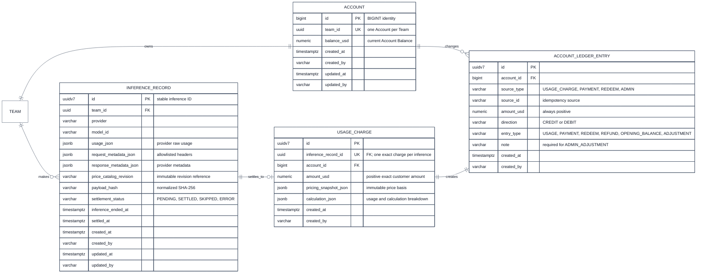

# Phase 2 — Team Balance Control

Phase 1의 Rate Limit이 짧은 시간의 호출량을 제한했다면,
Phase 2는 Team의 현재 잔액을 기준으로 inference를 계속 허용할지를 판단한다.

목표는 음수 잔액을 **없애는 것**이 아니라, 성공한 inference 뒤의 차감을 빠르게 반영해
노출을 작게 만드는 것이다. `balance_usd = 0`은 허용하고 음수일 때만 거절한다.

| 용어 | 역할 |
| --- | --- |
| Account | Team당 하나인 결제 계정. `balance_usd`가 현재 Account Balance다. |
| Account Ledger | 충전·사용·환불·조정의 append-only 변경 이력. 한 행은 Account Ledger Entry다. |
| Usage Charge | inference의 정확한 고객 사용료. `DEBIT · USAGE` Entry의 근거다. |
| Inference Record | provider 응답에서 얻은 추론 사실. 가격이나 Ledger ID를 직접 갖지 않는다. |
| Redis projection | 현재 Account Balance에서 아직 정산되지 않은 rough debit을 뺀, preflight용 값이다. |

Account와 Account Balance를 별도 테이블로 나누지 않는다.
현재는 Team당 단일 USD Account이고 Account와 잔액의 생성·잠금·감사 주기가 같기 때문이다.
다중 통화나 sub-account가 필요해질 때만 Balance aggregate를 분리한다.

전체 topology는 [Admission Control](./2608-admission-control.md)을 기준으로 한다.
이 문서는 [Phase 1 — Rate Limit](./2608-p1-rate-limit.md) 다음 단계다.

## 1. 요청 경로와 정산 경로를 분리한다

preflight는 Redis만 읽는다. Provider 성공 뒤에는 먼저 durable MQ에 postflight record를 남기고,
consumer가 rough debit과 `PENDING` Inference Record 생성을 재시도한다.
응답을 성공으로 끝내기 전 durable MQ의 ack를 받아야 성공 inference가 정산에서 사라지지 않는다.

```mermaid
---
config:
  theme: base
  darkMode: false
  themeVariables:
    background: "#ffffff"
    primaryColor: "#ffffff"
    primaryTextColor: "#111827"
    primaryBorderColor: "#475569"
    lineColor: "#334155"
    edgeLabelBackground: "#ffffff"
---
flowchart LR
  subgraph canvas[" "]
    direction LR
    client["Client"]:::app

    subgraph admission["Admission Control"]
      direction LR
      rate["Phase 1\nRate Limit"]:::ctrl
      balance["Phase 2\nRedis balance projection"]:::db
      decision{"balance < 0"}:::ctrl
      rate --> balance --> decision
    end

    provider["Model Provider\nInference"]:::app
    postflight["Durable MQ\npostflight record"]:::db
    ingest["Postflight consumer\nrough debit · PENDING record"]:::app

    subgraph settlement["Settlement worker — 별도 batch"]
      direction TB
      worker["PENDING claim\nexact settlement"]:::app
      postgres["PostgreSQL\nAccount · Ledger · Charge · Record"]:::db
      worker --> postgres
    end

    redis["Redis\nprojection · pending rough total"]:::db
    denied["402\ncredit balance exhausted"]:::ctrl

    client --> rate
    decision --> denied
    decision --> provider
    provider --> postflight --> ingest --> postgres
    ingest --> redis
    postgres --> redis
  end

  classDef app fill:#EFF6FF,stroke:#3B5BA5,stroke-width:1px,color:#16213E
  classDef db fill:#F0FDF4,stroke:#3F8E55,stroke-width:1px,color:#14532D
  classDef ctrl fill:#FFF7ED,stroke:#C98A2B,stroke-width:1px,color:#7A4E0A
  style canvas fill:#ffffff,stroke:#ffffff,stroke-width:0px,color:#111827
  style admission fill:#F8FAFC,stroke:#CBD5E1,stroke-width:1px,color:#111827
  style settlement fill:#F8FAFC,stroke:#CBD5E1,stroke-width:1px,color:#111827
```



Provider 호출마다 PostgreSQL을 읽고 갱신하는 설계는 선택하지 않는다.
유량이 낮아도 retry·burst·동시 요청이 Account row를 hot path로 만들기 때문이다.

## 2. Postflight는 durable handoff부터 보장한다

Data Plane은 Provider 성공 뒤 `InferenceRecord` payload를 durable MQ에 at-least-once로 전송한다.
MQ 종류는 Kafka일 수 있지만, P2가 요구하는 것은 broker 이름이 아니라 아래 계약이다.

- producer는 broker ack를 받기 전 성공 응답을 완료하지 않는다.
- 같은 `inference_id`의 재전달은 허용한다. consumer의 Record insert와 rough debit은 각각 멱등이어야 한다.
- postflight consumer는 먼저 Redis rough debit Lua를 시도하고, 이어서 Record를 `PENDING`으로 upsert한다.
  Lua 뒤에 죽어도 message가 재전달되어 Record 생성이 재개된다.
- payload가 같은 ID와 다른 hash로 재전달되면 기존 Record는 유지하고 warn log·metric을 남긴다.
  정상 재시도로 바꾸거나 새 charge를 만들지 않는다.
- 반복 실패한 message는 운영 대기열로 격리한다. `ERROR_*` Record는 자동 정산하지 않고 대사한다.

Redis marker는 **rough debit의 best-effort 중복 방지**일 뿐 금융적인 exactly-once 보장이 아니다.
금전적 정확성은 PostgreSQL의 `usage_charge.inference_record_id` unique 제약과 한 transaction의
Account Ledger Entry·Account Balance 갱신으로 만든다.

## 3. Account, Record, Charge, Ledger 관계

아래는 실행 흐름이 아니라 저장 관계다.
`Inference Record`에는 원본 usage와 재현에 필요한 가격표 revision만 보관하고,
가격·계산 근거는 정산 뒤 `Usage Charge`에 고정한다.



| 데이터 | 핵심 규칙 |
| --- | --- |
| `account.balance_usd` | 현재 권위 잔액이다. usage settlement·payment·redeem·admin command는 이 row를 잠근 transaction에서 갱신한다. |
| `account_ledger_entry` | append-only다. `amount_usd`는 항상 양수이고 `direction`이 증감 방향을 나타낸다. application role에는 `UPDATE`·`DELETE` 권한을 주지 않는다. |
| `usage_charge` | `inference_record_id` unique다. 가격표 snapshot과 계산 breakdown이 이 행에 고정되므로 재처리해도 다른 금액을 만들지 않는다. |
| `inference_record` | 추론 사실이다. 파생 token column·가격·Ledger ID를 두지 않는다. `usage_json`과 `price_catalog_revision`으로 정산 입력을 재현한다. |

`Account Ledger Entry`의 idempotency key는 `(account_id, source_type, source_id)`다.
사용 정산은 `source_type = USAGE_CHARGE`, 결제는 payment event ID,
redeem은 redemption ID, 관리자 보정은 admin command ID를 `source_id`로 쓴다.
Inference Record·Usage Charge·Ledger Entry는 shared ID를 쓰지 않는다.
Usage Charge의 `inference_record_id`와 Ledger의 source key가 각 관계를 표현한다.

Account는 0으로 만들고, 이관에서만 `CREDIT · OPENING_BALANCE` Entry를 남긴다.

| `settlement_status` | 의미 |
| --- | --- |
| `PENDING` | durable record가 수신됐고 자동 정산을 기다린다. |
| `SETTLED` | Usage Charge, `DEBIT · USAGE`, Account Balance 갱신이 함께 확정됐다. |
| `SKIPPED_PROVIDER_FAILURE` | Provider 실패 record라 과금하지 않는다. |
| `SKIPPED_INTERNAL` | 내부 Provider 등 과금 대상이 아닌 호출이다. |
| `ERROR_PRICE_NOT_FOUND` | 가격표 revision을 찾지 못했다. 자동 정산을 멈춘다. |
| `ERROR_ACCOUNT_NOT_FOUND` | Team의 Account를 찾지 못했다. 자동 정산을 멈춘다. |

별도 status table은 만들지 않는다. 이 상태는 Inference Record 한 행의 정산 lifecycle이다.

## 4. Exact settlement는 하나의 transaction이다

Settlement worker는 `PENDING` Record를 `FOR UPDATE SKIP LOCKED`로 claim한다.
동일 Account의 payment·redeem·admin command와 usage settlement는 모두 Account row lock을 공유한다.

1. immutable 가격표 revision과 `usage_json`으로 정확한 금액을 계산한다.
2. `usage_charge(inference_record_id unique)`를 만든다.
3. `source_type = USAGE_CHARGE`인 `DEBIT · USAGE` Account Ledger Entry를 append한다.
4. 새 Entry일 때만 `account.balance_usd`에서 양수 `amount_usd`를 뺀다.
5. Record를 `SETTLED`, `settled_at`으로 전이한다.

2~5는 같은 PostgreSQL transaction이다.
commit 응답이 유실돼 worker가 재시도해도 unique 제약과 source idempotency key가 기존 결과를 돌려준다.
환불·가격 보정은 기존 Entry를 수정하지 않고 `CREDIT · REFUND` 또는 `ADMIN_ADJUSTMENT` Entry를 추가한다.

금액은 모든 PostgreSQL 행에서 USD `numeric`으로 저장한다.
`numeric`과 `decimal`은 PostgreSQL에서 동의어이며, embedding처럼 작은 가격을 위해 fixed scale은 강제하지 않는다.

## 5. Redis는 현재 잔액에서 pending rough debit을 뺀다

Redis String 값은 정수 scaled USD다. PostgreSQL의 `numeric`을 Redis로 보낼 때는
`USD_SCALE = 100_000_000`으로 변환하고, 고객 차감에는 올림(`ceil`)으로 보수적으로 반올림한다.
exact settlement와 Redis 보정은 같은 변환 규칙을 쓴다.

| 목적 | 키 | 값 | TTL |
| --- | --- | --- | --- |
| admission projection | `quota:balance:projection:v2:{teamId}` | exact balance - pending rough total | 1시간 + 0~3분 jitter |
| pending rough total | `quota:balance:rough-total:v2:{teamId}` | 아직 정산되지 않은 rough debit 합 | marker 정리 전까지 연장 |
| inference marker | `quota:balance:rough:v2:{teamId}:inference:{inferenceId}` | 해당 rough amount | 정산 SLO + 재전달 여유 |
| cold refresh lease | `quota:balance:refresh:v2:{teamId}` | lease marker | 수 초 |

모든 key는 `{teamId}` hash tag를 쓴다.
각 Lua는 이 표에서 자기 `KEYS`로 받는 key만 접근하므로 Redis Cluster에서도 한 slot에서 실행된다.

### 성공 inference 뒤 rough debit

postflight consumer는 marker·rough total·projection을 한 Lua로 처리한다.

```kotlin
// KEYS: marker, roughTotal, projection — 같은 {teamId} slot
// marker는 amount를 가진 String이며 settlement가 지우기 전까지 유지한다.
if (setIfAbsent(marker, roughAmountUnits, markerTtl)) {
  incrementBy(roughTotal, roughAmountUnits)

  if (exists(projection)) {
    decrementBy(projection, roughAmountUnits)
    extendProjectionTtlWithJitter(projection)
  }
}
```

marker가 이미 있으면 rough debit을 다시 적용하지 않는다.
Redis flush나 marker TTL 뒤의 재전달은 이 보장을 잃을 수 있으므로, 이는 admission UX를 위한 best-effort다.
중복 금융 차감은 `Usage Charge`와 Ledger의 PostgreSQL unique 제약이 막는다.

### 정산 뒤와 projection miss의 보정

Account의 exact balance를 Redis에 단순 `SET`하면, 그 사이 들어온 rough debit을 지울 수 있다.
따라서 settlement와 payment/redeem/admin balance mutation은 post-commit 뒤 아래 Lua를 사용한다.

```kotlin
// settlement KEYS: marker, roughTotal, projection — 같은 {teamId} slot
// exactBalanceUnits는 이번 PostgreSQL commit 뒤 Account의 현재 잔액이다.
val roughAmount = get(marker)
if (roughAmount != null) {
  decrementBy(roughTotal, roughAmount)
  delete(marker)
}

val pendingRough = maxOf(get(roughTotal) ?: 0, 0)
set(projection, exactBalanceUnits - pendingRough)
expireProjectionWithJitter(projection)
```

Lua는 Redis에서 직렬 실행된다. 새 rough debit이 먼저 실행되면 `pendingRough`가 남고,
나중에 실행되면 projection을 다시 차감한다. 어느 순서여도 아직 정산되지 않은 rough total은 사라지지 않는다.

projection miss는 Team별 refresh lease를 얻은 Control Plane만 복구한다.
`Account.balance_usd - pending rough total`로 다시 만들고, lease를 얻지 못한 요청은 짧게 Redis를 재조회한다.
여전히 판단할 값이 없으면 503을 반환한다. Data Plane의 PostgreSQL fallback과 request-path retry loop는 두지 않는다.

Redis 전체 유실은 pending rough total도 잃는 장애다.
이때는 Control Plane이 durable `PENDING` Record의 `usage_json`과 `price_catalog_revision`으로 rough amount를 재구성한 뒤 projection을 재생성한다.
재구성이 끝나기 전에는 해당 Team의 Balance Control을 503으로 fail-closed 한다.
지속 장애에서 운영자가 Balance Control을 우회할 수는 있지만, 이는 음수 노출을 넓히는 명시적 incident decision이다.

## 6. Soft admission의 한계와 응답

Rate Limit을 통과한 동시 요청은 같은 양수 projection을 보고 함께 시작할 수 있다.
Provider 실행 시간과 postflight consumer 지연 동안에는 아직 차감되지 않은 금액도 있다.
따라서 negative exposure는 정량 보장이 아니라 운영상 soft bound다.

대략적인 관측 상한은 `허용된 초당 요청 수 × 요청당 최대 추정 사용료 × postflight 지연`으로 잡는다.
Tier의 request rate, Provider의 output cap, `oldest_pending_age`, `rough_total`, scheduler backlog를 함께 관측한다.

| 상황 | 처리 |
| --- | --- |
| `balance_usd < 0` | 402. 충전 또는 다른 Account mutation 뒤 재시도한다. |
| Redis key miss | 한 요청만 refresh lease로 복구한다. 다른 요청은 짧게 재조회한다. |
| Redis timeout·복구 불가 | 짧은 bounded window 뒤 503. DB 반복 fallback은 하지 않는다. |
| 가격표 miss | rough debit은 건너뛸 수 있지만 Record는 보존한다. exact settlement는 `ERROR_PRICE_NOT_FOUND`로 멈춘다. |
| worker backlog | pending age·rough total을 alert하고 consumer/worker를 확장한다. |

```json
{
  "error": {
    "type": "insufficient_quota",
    "code": "credit_balance_exhausted",
    "message": "Team credit balance is exhausted. Add credits and retry."
  }
}
```

| HTTP | type | code | 의미 |
| --- | --- | --- | --- |
| 402 | `insufficient_quota` | `credit_balance_exhausted` | Balance가 음수다. |
| 429 | `rate_limit_error` | `requests_per_minute_exceeded` | Phase 1 request rate 초과다. |
| 429 | `rate_limit_error` | `tokens_per_minute_exceeded` | Phase 1 token rate 초과다. |
| 429 | `rate_limit_error` | `concurrent_requests_exceeded` | 이후 Concurrency Control의 동시 실행 수 초과다. |
| 503 | `service_unavailable` | `admission_unavailable` | 안전하게 balance 판단을 할 수 없다. |

## 7. OLAP은 나중에 조회 경로를 분리한다

초기에는 PostgreSQL에서 Inference Record와 Usage Charge를 함께 정산한다.
고객 usage query와 장기 inference 분석이 PostgreSQL에 부담을 줄 때 OLAP으로 복제한다.

| 데이터 | near term | long term |
| --- | --- | --- |
| Inference Record | PostgreSQL의 durable settlement input | OLAP 조회·보관 복제본 |
| Usage Charge | PostgreSQL의 exact settlement 결과 | OLAP 조회·분석 복제본 |
| Account Ledger | PostgreSQL append-only 권위 이력 | 필요하면 분석 복제만 추가 |
| Account Balance | PostgreSQL current state | PostgreSQL current state |

OLAP은 ClickHouse일 수 있지만 설계의 전제는 아니다.
ClickHouse Cloud, Redshift Serverless 등은 실제 query 동시성·운영 공수·AWS 의존도를 보고 선택한다.
S3 Parquet은 장기 원본 보관 선택지이며, 고객 API의 저지연 usage query와는 별개의 결정이다.

OLAP은 `PENDING` claim이나 Account Balance update의 source가 아니다.
at-least-once 복제에서는 stable ID 기반 dedup 조회 모델이 필요하고,
Usage Charge의 amount와 pricing snapshot은 재가격 계산 없이 보존한다.

## 8. 검증 항목

- 모든 Mermaid block을 렌더한다.
- Postflight의 broker ack 전 crash, rough debit 뒤 consumer crash, Record insert 재전달을 주입한다.
- 동일 ID·동일 hash와 동일 ID·다른 hash를 각각 재전달한다.
- settlement Lua와 새 rough debit Lua를 교차 실행해 pending rough total이 사라지지 않는지 확인한다.
- projection TTL 만료·Redis flush 뒤 `PENDING` Record 기반 복구를 확인한다.
- 한 Lua가 만지는 모든 key가 동일 `{teamId}` slot인지 확인한다.
- usage settlement와 payment·redeem·admin command를 동시에 실행해 Account row lock과 source idempotency가 유지되는지 확인한다.
- 가격표 revision이 바뀐 뒤에도 기존 Record가 같은 Usage Charge를 만드는지 확인한다.
- `deduction`, fixed money scale, Data Plane PostgreSQL fallback, `inference_record.ledger_entry_id`, 별도 status table이 남지 않았는지 검색한다.

## 참고

- [토스페이먼츠 — 자동결제(빌링)](https://docs.tosspayments.com/guides/v2/billing) — 빌링을 자동결제·결제수단 토큰의 의미로 쓰는 사례를 반영했다.
- [Stripe — Billing credits](https://docs.stripe.com/billing/subscriptions/usage-based/billing-credits?locale=en-GB) — billing credit, append-only ledger, credit/debit transaction 용어를 참고했다.
- [OpenAI — Prepaid API billing](https://help.openai.com/en/articles/8264644-what-is-prepaid-billin) — credit balance, auto-reload, 음수 잔액과 별도 spend limit을 참고했다.
- [OpenRouter — FAQ](https://openrouter.ai/docs/faq) — credits, balance top-up, request cost 차감과 Team 공유 credit pool 사례를 참고했다.
- [PostgreSQL 15 — UUID functions](https://www.postgresql.org/docs/15/functions-uuid.html) — PostgreSQL 15의 native generator가 UUIDv4뿐임을 확인했다. 이 설계의 UUIDv7은 application-generated다.
- 제공된 설계 리서치: [입장 통제](https://github.com/sionic-ai/opengateway-claude-skills/blob/docs/og-479-anti-abuse-research/opengateway-research/references/260722_%EC%B5%9C%EB%B3%91%ED%98%84_opengateway-%EC%A7%84%ED%99%94-%EB%A6%AC%EC%84%9C%EC%B9%98/admission-control.md) — preflight/postflight 분리와 fail-closed recovery를 반영했다.
- 제공된 설계 리서치: [정산 아키텍처](https://github.com/sionic-ai/opengateway-claude-skills/blob/docs/og-479-anti-abuse-research/opengateway-research/references/260722_%EC%B5%9C%EB%B3%91%ED%98%84_opengateway-%EC%A7%84%ED%99%94-%EB%A6%AC%EC%84%9C%EC%B9%98/settlement-design.md) — durable record와 batch settlement, projection 보정 경로를 반영했다.
