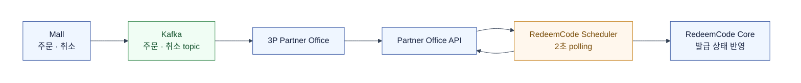
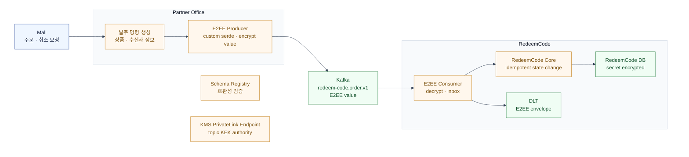

# 컬리페이 RedeemCode — Partner Office 발주 명령 event를 다시 설계한다면

과거 구조에도 Kafka는 이미 있었다.
문제는 Kafka의 주문·취소 데이터를 3P Partner Office에 전달한 뒤,
RedeemCode Scheduler가 Partner Office API를 2초마다 조회했다는 경계였다.

이 문서는 그 방식을 틀렸다고 단정하지 않는다.
실물 상품과 즉시 발급형 RedeemCode의 요구가 다르다는 점에서 출발해,
지금이라면 메시지·PII 경계를 어떻게 다시 둘지 복기한다.

## As-Is: Kafka 뒤의 Partner Office polling



실물 상품은 배송 시작까지의 시간이 길다.
그래서 초 단위 조회 지연과 batch 처리 비용이 있어도 구매 경험을 크게 해치지 않을 수 있다.

즉시 발급형 RedeemCode는 구매 뒤 곧바로 발급 상태가 보여야 한다.
고정 polling은 빈 조회를 계속 만들고, 주문 burst 때 조회 결과 처리가 한꺼번에 몰린다.
이는 고객 어뷰징과는 다른 문제다.
어뷰징과 3P 호출 폭주는 worker의 멱등성·rate limit·backoff로 따로 막아야 한다.

## As-Is의 맹점

Kafka는 Mall에서 Partner Office까지의 전달을 맡지만, RedeemCode Core는 여전히 polling 결과를 기다린다.
따라서 주문·취소가 Kafka에 있어도 실제 발급 상태 반영은 최대 polling 주기만큼 늦어진다.

- **고정 비용과 burst가 공존한다.** 평소에는 빈 API 호출을 반복하고, scheduler 지연 뒤에는 쌓인 주문·취소를 한 번에 처리한다.
- **취소가 늦게 보일 수 있다.** polling 사이에 취소가 들어오면 이미 읽어 온 주문과 경쟁한다. 발급 전에 최신 취소를 다시 확인하는 경계가 필요하다.
- **끝단의 중복·유실은 Kafka만으로 해결되지 않는다.** scheduler가 API 응답을 받은 뒤 죽거나 cursor를 잘못 관리하면, Partner Office API 결과를 다시 읽거나 놓칠 수 있다.
- **복구 기준이 분산된다.** 주문의 진실은 Kafka에, 발급 후보는 Partner Office에, 처리 위치는 scheduler에 나뉜다. 장애 뒤 어느 상태에서 재개할지 한 곳에서 판단하기 어렵다.

실물 상품에서는 이 비용을 배송 리드타임으로 흡수할 수 있었다.
즉시 발급형 RedeemCode에서는 이 지연과 burst가 고객 경험·운영 대응의 직접적인 비용이 된다.

## Partner Office가 맡을 일

Partner Office는 Mall의 파트너 상품 주문을 상품별 발주 명령으로 바꾸는 공통 경계다.
RedeemCode의 발급·취소 처리는 RedeemCode Core가 맡고, Partner Office는 발주에 필요한 상품·수신자 정보를 전달한다.

Partner Office는 앞단에서 받은 주문·취소 요청을 처리한 뒤,
RedeemCode에 발주 명령 event를 발행한다.

## To-Be: Partner Office 발주 명령 event



수신자 이름·전화번호는 이 topic의 암호화된 value 안에서만 전달한다.
Kafka metadata, log, trace, exception, DLT 평문에는 남기지 않는다.

## 전체 value E2EE를 선택한다

발주 명령에는 수신자 이름·전화번호처럼 저장·전달해야 할 개인정보가 들어간다.
특정 field만 암호화하면 새 field가 추가될 때마다 민감값 누락을 다시 점검해야 한다.
그래서 Kafka record의 **value 전체**를 client-side E2EE로 암호화한다.

이는 Kafka의 모든 metadata를 숨긴다는 뜻은 아니다.
topic, partition, opaque key, header, timestamp, message size는 broker에 보인다.
따라서 TLS, SASL, ACL, 보존 기간 정책과 key의 PII 금지는 계속 필요하다.

```text
Kafka record envelope

key     : partner_order_id                   # opaque routing key
headers : schema_id, event_type, encryption_version, kek_id, wrapped_dek, compression
value   : AEAD ciphertext(serialized body)
AAD     : topic + key + allowed headers + event_type
```

아래는 wire 관점의 표현이다. Kafka header는 JSON object가 아니라 `String key + byte[] value`의 목록이며,
동일 key도 여러 번 들어갈 수 있다. `base64(...)`은 binary bytes를 사람이 읽게 적은 표기일 뿐 실제 전송값은 아니다.

```text
topic   = "redeem-code.order.v1"
key     = UTF-8("partner-order-opaque-id")
headers = [
  ("schema_id",          UTF-8("redeem-code.order.v1:3")),
  ("event_type",         UTF-8("REDEEM_CODE_ORDER_REQUESTED")),
  ("encryption_version", UTF-8("e2ee-v1")),
  ("kek_id",             UTF-8("arn:aws:kms:...:key/immutable-id")),
  ("wrapped_dek",        bytes(KMS ciphertext blob)),
  ("compression",        UTF-8("none"))
]
value   = bytes(nonce || aes-gcm-ciphertext || auth-tag)
```

`value`를 DEK decrypt하기 전에는 상품 ID, 수신자 이름·전화번호가 보이지 않는다.
AAD는 `topic`, `key`와 위 header 전체를 canonical form으로 만들며, 복호화 뒤 JSON의 `event_type`이 header와 같은지도 확인한다.

`encryption_version=e2ee-v1`은 wire에서 codec을 고르는 짧은 식별자다.
규격 문서와 공용 codec에는 `e2ee-v1 = JSON UTF-8, AES-256-GCM, 12-byte nonce, 지정 header AAD, KMS GenerateDataKey`처럼 풀어 쓴 계약을 둔다.
record마다 알고리즘 field를 늘리지 않아 지원하지 않는 조합이나 downgrade가 들어오는 것을 막는다.

`kek_id`만으로는 DEK를 다시 만들 수 없다.
KMS는 KEK 자체를 내보내지 않으며, `wrapped_dek`은 producer가 이 record에 사용한 DEK의 KMS `CiphertextBlob`이다.
consumer는 `kek_id`로 KMS key를 찾고, `wrapped_dek`을 넘겨 같은 DEK를 잠시 복원한다.

field별 암호화가 아니다.
아래 JSON body 전체를 serialize하고, 필요할 때만 압축한 뒤 하나의 DEK로 AEAD 암호화한다.
Kafka의 `value`에는 JSON field가 보이지 않고 ciphertext만 남는다.

producer는 Schema Registry 호환성 검사를 통과한 body를 serialize하고 암호화한다.
consumer는 AAD와 허용된 header 조합을 먼저 검증하고, DEK unwrap·복호화·역직렬화를 수행한다.
`schema_id`는 custom E2EE serde가 header에서 단일 source of truth로 관리한다.
E2EE topic에서는 broker나 Registry가 ciphertext value를 검사하지 않는다.

Schema Registry에는 `redeem-code.order-value` subject의 JSON body schema만 등록한다.
`schema_id` header는 그 immutable schema ID를 가리키며, `kek_id`·`wrapped_dek`·`compression`은 Registry가 아닌 E2EE envelope의 runtime metadata다.

각 topic은 별도 KEK와 최소 권한을 사용한다.
producer는 해당 KEK로 DEK를 wrap할 권한만, consumer는 필요한 topic만 unwrap할 권한만 가진다.
운영 재처리 도구는 별도 role·승인·감사 로그 아래에서만 복호화한다.

## Topic과 event type

`redeem-code.order.v1` 하나만 둔다.
발주·취소를 topic으로 나누면 같은 주문의 상태 전이가 서로 다른 partition에 흩어진다.
대신 `partner_order_id`를 key로 쓰고, `REDEEM_CODE_ORDER_REQUESTED`, `REDEEM_CODE_ORDER_CANCEL_REQUESTED`를 `event_type`으로 나눈다.

다른 파트너 상품과 generic `partner.order` topic을 공유하지 않는다.
수신자 개인정보를 다루는 topic의 KEK·ACL·retention을 RedeemCode로만 좁히기 위해서다.
Schema Registry는 이 topic의 허용 type과 schema ID만 받는다.

## 가상 message schema (암호화 전 JSON 계약)

아래는 Partner Office가 만들기 전과 RedeemCode가 복호화한 뒤에만 보이는 논리 JSON이다.
Kafka에는 이 JSON 전체가 하나의 E2EE ciphertext로 들어간다.
자유형 `extra`나 무제한 map은 두지 않는다.

발주 명령 event는 다음과 같다.

```json
{
  "event_id": "uuid",
  "event_type": "REDEEM_CODE_ORDER_REQUESTED",
  "mall_order_id": "opaque-id",
  "order_item_id": "opaque-id",
  "partner_order_id": "opaque-id",
  "order_seq": 1,
  "occurred_at": "2026-09-01T10:00:00Z",
  "product": {
    "partner_product_id": "opaque-id",
    "quantity": 1
  },
  "recipient": {
    "name": "string",
    "phone_number": "string"
  }
}
```

같은 topic·key의 취소 event는 `order_seq`만 증가시킨다.

```json
{
  "event_id": "uuid",
  "event_type": "REDEEM_CODE_ORDER_CANCEL_REQUESTED",
  "mall_order_id": "opaque-id",
  "order_item_id": "opaque-id",
  "partner_order_id": "opaque-id",
  "order_seq": 2,
  "occurred_at": "2026-09-01T10:01:00Z",
  "cancel": {
    "reason": "CUSTOMER_REQUEST"
  }
}
```

`event_type`을 discriminator로 한 `oneOf` schema를 사용해 type별 required field를 강제한다.
모르는 type, 허용하지 않은 field, 자유형 `extra`·무제한 map은 reject한다.
`event_type`은 header에도 복사하고 AAD에 묶는다. consumer는 복호화한 body와 header가 같은지 검증한다.
전화번호와 이름은 `ORDER_REQUESTED`에서만 허용한다.

`mall_order_id`는 고객 주문을 찾는 주문 키이고, `order_item_id`는 그 안의 개별 상품 항목 키다.
`partner_order_id`는 Partner Office가 한 번만 발급하는 발주 transaction 키로, Kafka partition key와 3P idempotency key로 쓴다.
`event_id`는 전송 단위의 중복 제거 키다. 수량이 여러 개면 발주 단위마다 별도 `partner_order_id`를 만들어 부분 취소를 명확히 한다.

## 취소는 최종 상태가 아니라 명령이다

`REDEEM_CODE_ORDER_CANCEL_REQUESTED`는 “발주를 취소해 달라”는 요청일 뿐 `CANCELLED`를 뜻하지 않는다.
RedeemCode Core는 같은 `partner_order_id`의 더 큰 `order_seq`를 받으면 발주 전에는 발급을 막고,
이미 3P 발주를 시작했다면 3P 취소·상태 조회 흐름으로 넘긴다.
3P의 실제 응답이 온 뒤에만 내부 상태를 `CANCELLED` 또는 취소 불가 상태로 확정한다.

## 주문과 취소의 key

같은 발주를 취소할 때 `mall_order_id`, `order_item_id`, `partner_order_id`와 Kafka key는 유지한다.
반면 `event_id`, `event_type`, `order_seq`, `occurred_at`, 취소 사유는 새 event에 맞게 바뀐다.

```text
주문  partner_order_id=PO-123, event_id=EVT-1, order_seq=1
취소  partner_order_id=PO-123, event_id=EVT-2, order_seq=2
```

전송 retry는 같은 business event이므로 `event_id`도 유지한다.
수량이 여러 개이거나 새 발주를 만들면 각 발주 단위에 새 `partner_order_id`를 만든다.

## 압축은 기본값이 아니다

record-level E2EE 뒤에는 Kafka batch compression 효율이 낮아진다.
이 발주 명령은 이름·전화번호·상품 식별자 정도의 작은 message이므로,
envelope header는 `compression=none`, Kafka producer의 `compression.type=none`을 기본으로 둔다.
암호화 뒤 ciphertext는 사실상 압축되지 않아 Kafka batch compression도 이득보다 CPU 비용이 커진다.

향후 큰 payload가 생기면 serialize 뒤, encrypt 전에 per-record Zstandard 압축을 검토한다.
단, 파트너가 제어할 수 있는 값과 수신자 개인정보가 같은 압축 context에 있으면 compression을 끈다.
압축률뿐 아니라 CPU, message size, KMS quota, ciphertext length 관찰 가능성까지 peak traffic으로 검증한다.

## Kafka를 쓴다면

**순서**
`partner_order_id`를 partition key로 사용한다.
같은 주문의 발주·취소는 같은 partition에만 들어오며, RedeemCode Core는 `order_seq`보다 과거인 event를 반영하지 않는다.

**at-least-once**
RedeemCode consumer는 `event_id` inbox와 발주 상태를 같은 DB transaction에서 기록한다.
같은 event가 다시 와도 같은 `partner_order_id`·`order_seq`로 한 번으로 수렴시킨다.
늦게 온 발주 명령은 취소 상태를 되살리지 못한다.

**DLT**
retry가 소진된 event만 DLT로 보낸다.
DLT는 원본 암호문을 단순 복사하지 않고, origin topic·key·header·event ID를 보존한 DLT envelope를 다시 암호화한다.
승인된 reprocessor가 원래 AAD를 검증한 뒤 RedeemCode inbox의 retry/DLT 상태에서 원본 ID와 `partner_order_id`를 보존한 채 재개한다.
운영자는 기본 마스킹 화면을 쓰고, break-glass 승인·감사 로그 아래 memory-only 복호화로만 예외를 조사한다.
발주 이후의 3P 결과는 RedeemCode의 별도 처리 흐름에서 관리한다.

**Schema Registry**
각 topic과 event type은 허용된 subject·schema ID만 accept한다.
Registry는 producer 배포 전 backward-compatible contract와 비밀 field 금지를 검사한다.
payload 호환성 도구일 뿐, 업무 순서·중복·PII 보안을 보장하지는 않는다.

## KMS 장애와 key rotation

KMS 호출은 각 서비스 VPC의 KMS Interface VPC Endpoint(PrivateLink)로만 나간다.
endpoint policy와 KMS key policy는 Partner Office에 `GenerateDataKey`, RedeemCode에 `Decrypt`만 허용하고 public egress는 두지 않는다.
producer는 KMS 장애 때 평문 fallback을 하지 않는 fail-closed 정책을 쓴다.
Partner Office의 발주 명령은 전달 대기 상태로 남기고 alert를 발생시킨다.
consumer는 짧은 수명의 process-local DEK cache를 쓰되, cache가 만료되면 partition을 멈추고 retry한다.
KMS 복구 전에도 진행할 수 없는 건은 `PENDING_UNKNOWN` 운영 상태로 보낸다.

DEK cache는 unique nonce, 최대 record 수와 TTL로 범위를 제한하고 KEK version이 바뀌면 즉시 비운다.
구 KEK는 topic·DLT retention보다 오래 유지하거나, DLT envelope를 새 KEK로 re-wrap한 뒤에만 비활성화한다.
평문은 consumer memory와 3P TLS 요청 body에만 잠시 존재하며 로그·trace·exception·DLT에는 남기지 않는다.

KMS는 대용량 payload 암호화기가 아니라 key authority다.
burst 구간에는 KMS quota를 고려한 짧은 수명의 DEK cache와 key rotation·과거 DLT 복호화 정책이 필요하다.

## 전환과 예외

기존 polling과 event consumer가 같은 주문을 반영하지 않게 `partner_order_id`와 cutover 시각으로 routing fence를 둔다.
polling으로 되돌릴 때도 먼저 consumer lag를 정리하거나 주문 생성 시각으로 경계를 세운다.

E2EE 전환은 consumer를 먼저 배포해 `encryption_version=0` 평문과 암호문을 모두 읽게 한다.
그 다음 producer를 topic별로 점진 전환한다.
문제가 생기면 producer만 version 0으로 되돌리고 consumer의 dual-read는 유지한다.
보존된 혼합 backlog가 소진된 뒤에야 평문 지원을 제거한다.

발주 이후 3P 결과의 retry·reconciliation은 RedeemCode가 자기 처리 상태에서 결정한다.

## 3P와 먼저 합의할 것

- `partner_order_id` 기반 create가 실제로 멱등한가?
- status·취소 API와 retry, rate limit, backoff 계약은 무엇인가?
- 전화번호가 정말 필요한가? 필요하다면 수신·보관·삭제 책임은 누구에게 있는가?
- RedeemCode와 PIN은 어느 권한 경계에서 고객에게 전달하는가?

## 참고

- [컬리몰 상품권 구매 프로세스 개선](https://hyune-c.github.io/portfolio/kurlypay/02_kurlymall-giftcard-process/) — 기존 Kafka + 2초 Partner Office polling과 KMS가 있는 개선 흐름을 복기의 근거로 참고했다. 현재 관점의 topic 분리·inbox·DLT·PII 경계는 학습용으로 새로 정리했다.
- [초당 100만 건, LINE 앱에 Apache Kafka 종단 간 암호화 적용기](https://techblog.lycorp.co.jp/ko/applying-e2ee-to-apache-kafka-in-line-app) — Kafka record value E2EE, DEK-KEK envelope, header metadata, key rotation과 record-level encryption의 압축 trade-off를 참고했다. 본 문서의 Partner Office topic·schema·KMS 권한 경계는 별도 설계다.
