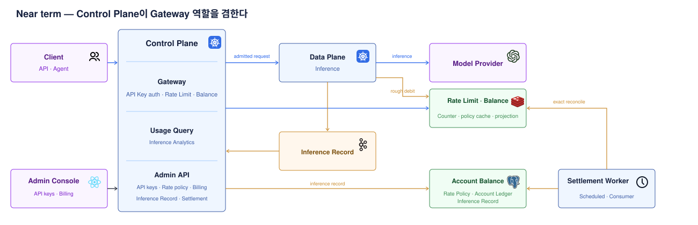
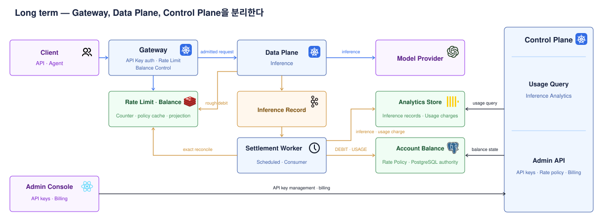

# Admission Control — Model API 요청의 상위 경계

> 목표: Model Provider 호출 전에 요청을 받아도 되는지 판단하는 경계의 전체 흐름을 잡는다.

Admission Control은 인증된 Team·API Key를 기준으로 Provider 요청을 허용하거나 거부하는 상위 경계다.

| 하위 정책 | scope | 판단 상태 |
| --- | --- | --- |
| Rate Limit | Team · API Key | 현재 요청 수 |
| Balance Control | Team Account | rough debit이 반영된 Account Balance |
| Concurrency Control | Team · API Key | 현재 실행 중인 요청 수 |

## 1. 용어를 이렇게 나눈다

`Billing`은 결제·충전·잔액을 함께 다루는 상위 책임이다.
제품 표현은 credit·balance를 쓰더라도 문서의 도메인 경계는 Billing으로 둔다.

| 층위 | 문서·도메인 표현 | 의미 |
| --- | --- | --- |
| 상위 업무 | Billing | 결제, 충전, 영수증, 잔액, 원장 |
| 소유 단위 | Account | Team이 가진 Billing의 소유 단위 |
| 현재 상태 | Account Balance | admission이 읽는 현재 잔액 |
| 잔액 변경 이력 | Account Ledger | 충전·사용·환불·조정의 PostgreSQL append-only subledger |
| inference 사용료 | Usage Charge | inference에서 확정한 고객 Account 차감액 |
| 증감 방향 | `CREDIT` / `DEBIT` | Account Ledger Entry가 잔액을 늘리거나 줄이는 방향 |

| 업무 | 결과 |
| --- | --- |
| 크레딧 충전 | `CREDIT · PAYMENT` Entry와 Account Balance 증가 |
| 사용 정산 | Usage Charge 확정 → `DEBIT · USAGE` Entry → Account Balance 차감 |

## 2. 가까운 운영 형태 — Control Plane이 Gateway를 겸한다

| 컴포넌트 | 가까운 운영 형태의 역할 |
| --- | --- |
| Control Plane | Gateway 역할, API Key 인증, Rate Limit, Balance Control, Admin API, Usage Query, Usage Ingest |
| Data Plane | Model Provider inference, 성공 뒤 rough debit과 inference record 전달 |

| 흐름 | 의미 |
| --- | --- |
| 파란 화살표 | API Key auth → Rate Limit → Balance Control → inference |
| 주황 화살표 | rough debit → record 전달 → 정산 → Redis 보정 |
| Data Plane | 성공 inference 뒤 Redis rough debit 후 durable MQ로 record 전달 |
| Worker | `PENDING` Record 주기 정산과 Redis exact balance reconcile |

## 3. 장기 형태 — Gateway, Data Plane, Control Plane 분리

| 컴포넌트 | 장기 역할 |
| --- | --- |
| Gateway | API Key 인증, Rate Limit, Balance Control request path |
| Data Plane | inference path, 성공 뒤 rough debit과 inference record 전달 |
| Control Plane | Admin API, Rate Limit Policy, Usage Query, Record ingest, Account 상태 |
| Admin Console | Gateway가 아닌 Control Plane 직접 호출 |

| 저장소·처리 | 장기 역할 |
| --- | --- |
| Gateway·Data Plane | PostgreSQL 직접 읽기 금지 |
| OLAP (ClickHouse 후보) | 고유량 inference·usage와 Team·Model·기간별 분석 조회 |
| S3 Parquet | 원본 event 장기 보관·재처리 |
| PostgreSQL | Rate Limit Policy와 Account Balance·Account Ledger의 권위 |
| Redis | Rate counter·policy cache와 성공 inference rough debit이 반영된 balance projection |
| Worker | Charge·`DEBIT · USAGE`·Account 차감을 PostgreSQL transaction으로 확정하고 Redis를 짧은 주기로 보정 |

## 4. Admission Control 안의 정책

`Phase`는 도입 순서다. Phase 2까지 도입한 뒤의 온라인 요청 순서는
`API Key auth → Rate Limit → Balance Control → Inference`다.

| 정책 | 상태 출처 | 상태 |
|---|---|---|
| Phase 1 — Rate Limit | Redis request counter | [문서](./2608-rate-control.md) |
| Phase 2 — Balance Control | Redis projection · PostgreSQL Account | [문서](./2608-balance-control.md) |
| Concurrency Control | Redis in-flight counter | 추후 |

Billing은 결제·충전·원장·Account를 다루는 상위 도메인이다. Balance Control은 Admission Control 안에서 Redis의 rough debit이 반영된 Account Balance projection을 읽는 하위 정책이다.

모든 하위 정책은 공통 오류 형식을 쓴다. `type`은 `insufficient_quota`, `rate_limit_error`, `service_unavailable`처럼 큰 분기이고, `code`는 `credit_balance_exhausted`, `requests_per_minute_exceeded`처럼 정확한 원인이다.

## 5. 구현 순서

1. [Phase 1 — Rate Limit](./2608-rate-control.md)에서 Team·API Key별 요청량을 요청 전에 원자적으로 제한한다.
2. [Phase 2 — Balance Control](./2608-balance-control.md)에서 호출 뒤에 확정되는 사용료를 앞단 balance 판정으로 연결한다.

## 참고

- 제공된 설계 리서치: [전체 개요](https://github.com/sionic-ai/opengateway-claude-skills/blob/docs/og-479-anti-abuse-research/opengateway-research/references/260722_%EC%B5%9C%EB%B3%91%ED%98%84_opengateway-%EC%A7%84%ED%99%94-%EB%A6%AC%EC%84%9C%EC%B9%98/README.md) — Control/Data Plane 분리, admission 우선순위, 비동기 정산 경로를 반영했다. 상세 구현과 확장 로드맵은 Balance Control 문서 이후로 미뤘다.
- [토스페이먼츠 — 자동결제(빌링)](https://docs.tosspayments.com/guides/v2/billing) — 국내 결제 문맥에서 Billing이 자동결제를 뜻하는 사례를 반영했다.
- [Stripe — Billing credits](https://docs.stripe.com/billing/subscriptions/usage-based/billing-credits?locale=en-GB) — Billing, credit grant, credit/debit transaction의 층위를 참고했다.
- [OpenAI — Prepaid API billing](https://help.openai.com/en/articles/8264644-what-is-prepaid-billin) — prepaid billing 아래의 credit balance와 auto-reload 용어를 참고했다.
- [OpenRouter — FAQ](https://openrouter.ai/docs/faq) — add credits와 top up balance 용어를 참고했다.
- [OpenRouter — Organization management](https://openrouter.ai/docs/cookbook/administration/organization-management) — Organization이 공유 credit pool을 가지는 사례를 참고했다.
- [ClickHouse — Use cases](https://clickhouse.com/use-cases) — 고유량 event와 observability 데이터를 위한 실시간 OLAP 구현 후보로 참고했다.
- [ClickHouse — ReplacingMergeTree](https://clickhouse.com/resources/engineering/clickhouse-optimize-table-final) — ClickHouse를 택할 때 at-least-once record delivery의 중복을 제거하는 구현 선택지로 참고했다. 이 문서는 OLAP이 MQ를 직접 consume하지 않고, 별도 Writer가 적재하는 구조를 사용한다.
- [AWS — S3 storage classes](https://docs.aws.amazon.com/AmazonS3/latest/userguide/storage-class-intro.html) — 원본 event의 장기 보관과 비용 계층화 용도를 참고했다.
- [Apache Druid — Introduction](https://druid.apache.org/docs/latest/design/) — 실시간 event OLAP의 대안으로 참고했다.
