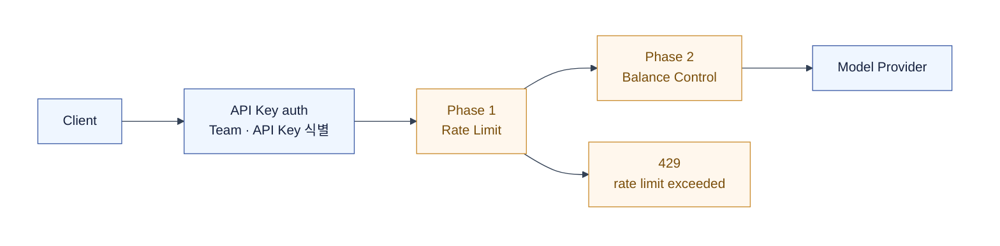
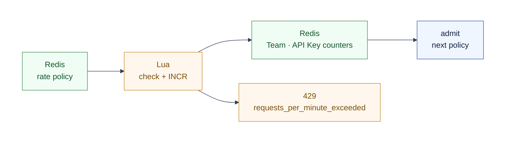

# Phase 1 — Rate Limit (Team · API Key)

Rate Limit은 인증된 요청이 짧은 시간에 과도하게 몰리는 것을 먼저 막는다.
금액·모델 usage·정산을 알 필요가 없으므로 Balance Control보다 먼저 구현한다.

- Team 기본 한도와 API Key 별 한도를 함께 적용한다.
- 두 한도를 모두 통과해야 다음 Balance Control로 진행한다.
- 여기서 세는 것은 인증을 통과한 admission 시도다.
  이후 Balance Control이 거절하거나 Provider 호출이 실패해도 이미 소비한 요청 슬롯은 되돌리지 않는다.

## 1. 왜 Rate Limit이 먼저인가

| 정책 | 입력 | Redis 변경 시점 | 정산 의존성 |
| --- | --- | --- | --- |
| Rate Limit | 인증된 요청 1건 | Provider 호출 전 | 없음 |
| Balance Control | 성공 inference의 rough cost | Provider 호출 후 | exact settlement 필요 |

Rate Limit은 한 번의 request path로 닫힌다. Durable MQ·Inference Record·Postflight가 필요 없다.

## 2. 첫 구현 범위

첫 구현은 `requests per minute` 고정 윈도우만 다룬다.
token per minute, 모델별 가중치, concurrency는 다음 정책으로 미룬다.

- Team limit은 항상 적용한다.
- API Key limit은 설정된 Key에만 추가 적용한다.
- 두 scope 중 하나라도 초과하면 429다.
- 이 단계에서는 분 단위 경계의 burst를 허용한다.
  더 매끄러운 burst 제어가 필요해질 때 token bucket 또는 GCRA로 교체한다.

## 3. Redis key

키는 `admission:<policy>:<state>:v1:{teamId}:<scope>...` 순서를 쓴다.
`{teamId}` hash tag로 Team과 그 API Key의 카운터를 같은 Cluster slot에 둔다.

| 상태 | 키 패턴 | 값 | 만료 |
| --- | --- | --- | --- |
| Team 정책 | `admission:rate:policy:v1:{teamId}:team:requests:minute` | 분당 허용 요청 수 | 1시간 + 0~3분 jitter |
| API Key 정책 | `admission:rate:policy:v1:{teamId}:api-key:{apiKeyId}:requests:minute` | 분당 허용 요청 수 | 1시간 + 0~3분 jitter |
| Team 사용량 | `admission:rate:usage:v1:{teamId}:team:requests:minute:{yyyyMMddHHmm}` | 현재 분의 요청 수 | 해당 분 종료 뒤 삭제 |
| API Key 사용량 | `admission:rate:usage:v1:{teamId}:api-key:{apiKeyId}:requests:minute:{yyyyMMddHHmm}` | 현재 분의 요청 수 | 해당 분 종료 뒤 삭제 |
| policy refresh lease | `admission:rate:refresh:v1:{teamId}` | refresh 진행 표시 | `SET NX EX 3` |

정책 key는 Admin API가 변경 뒤 `DEL`한다. 다음 요청의 read-through가 새 정책을 적재한다.
사용량 key는 정책 key와 다르므로 Admin 수정으로 지우지 않는다.

분 단위 사용량 key에는 jitter를 넣지 않는다. jitter는 rate window의 의미를 바꾼다.
반대로 policy cache TTL에는 jitter를 둬서 많은 Team 정책이 같은 순간에 Control Plane을 재조회하지 않게 한다.

## 4. 원자 판정

두 usage key는 Lua script 한 번으로 처리한다. script는 현재 count에 1을 더한 값이
Team·API Key limit을 모두 넘지 않을 때만 두 counter를 함께 `INCR`한다.

- 새 usage key에만 `EXPIREAT`를 분 경계에 설정한다.
- 제한을 넘는 요청은 counter를 증가시키지 않는다.
- Redis timeout·script 오류·정책을 신뢰할 수 없는 miss는 503으로 fail closed 한다.

## 5. Avalanche와 Stampede

Rate window 자체는 모든 요청이 Redis에서만 처리한다. 위험한 지점은 policy cache miss가
Control Plane 조회를 증폭시키는 경우다.

| 상황 | 방어 | 결과 |
| --- | --- | --- |
| 많은 policy TTL이 동시에 만료 | 정책 TTL에 0~3분 jitter | Control Plane 조회 분산 |
| 한 Team의 동시 cache miss | `refresh` lease를 얻은 요청만 read-through | Team당 Control Plane 조회 1건 |
| lease 대기 요청 | 짧게 Redis를 한 번 재조회 | 채워지면 계속, 아니면 503 |
| Redis flush·전역 장애 | Control Plane read-through에 global bulkhead와 짧은 timeout | DB·CP가 밀리기 전에 빠르게 503 |

긴 구조에서는 Gateway가 Rate Limit을 수행하고 PostgreSQL을 직접 조회하지 않는다.
refresh winner만 Control Plane 내부 policy snapshot API를 호출하고, 나머지는 retry loop를 만들지 않는다.

가까운 구조에서는 Control Plane이 Gateway를 겸한다. 같은 Admission 모듈이 Redis를 읽고,
miss일 때만 Control Plane의 policy source를 조회한다. 별도 Rate Limit 서비스는 만들지 않는다.

고정 윈도우는 분 경계에서 최대 두 배 burst를 허용한다. 이것은 첫 단계의 의도적인 단순화다.
boundary burst가 실제 문제로 관측되면 사용량 key를 token bucket/GCRA state로 교체한다.
정책 key와 Team·API Key의 결합 규칙은 그대로 유지할 수 있다.

## 6. Balance Control로 넘기는 것

Rate Limit이 통과시킨 요청만 [Phase 2 — Balance Control](./2608-balance-control.md)로 보낸다.
Balance는 Team의 Account Balance를 읽고, 성공 inference 뒤 rough debit과 batch settlement를 수행한다.

## 참고

- 제공된 설계 리서치: [Phase 1 — Budget Control](https://github.com/sionic-ai/opengateway-claude-skills/blob/docs/og-479-anti-abuse-research/opengateway-research/references/260722_%EC%B5%9C%EB%B3%91%ED%98%84_opengateway-%EC%A7%84%ED%99%94-%EB%A6%AC%EC%84%9C%EC%B9%98/phase1-budget-control.md) — Team·API Key scope, Redis Cluster hash tag, policy TTL jitter와 fail-closed 원칙만 반영했다. 금액 budget·postflight usage 누적은 Balance Control로 분리했다.
