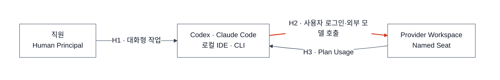
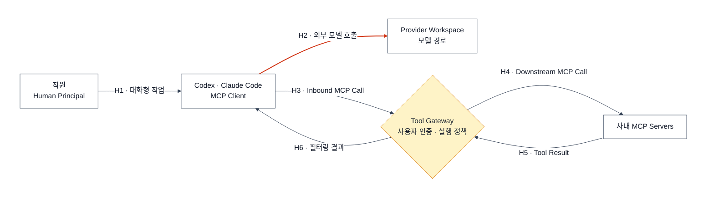
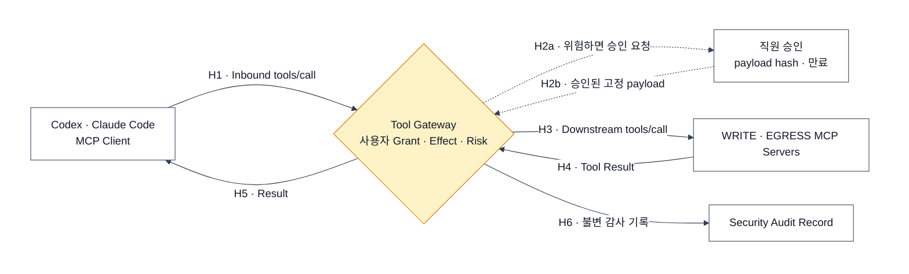

# Internal Human AI — 사람이 AI를 사용하는 구성

> 목표: 직원이 좌석형 AI 플랜을 사용하면서 필요한 경우에만 승인된 사내 tool을 연결한다.
> 범위 밖: 서버·CI 호출은 [Internal Server AI](./internal-server-ai.md)에서 다룬다.

## 서버 구성과 다른 점

| 항목 | Human AI Workspace |
|---|---|
| 실행 주체 | 직원(Human Principal) |
| 모델 연결 | Codex·Claude Code가 provider에 직접 연결 |
| 인증 | 사용자 로그인·Named Seat |
| 비용 | Plan Usage |
| 중앙 관측 | provider workspace + endpoint + tool audit |

사람의 모델 요청을 LiteLLM에 통과시키면 좌석형 플랜이 아니라 API Usage가 된다. 사용자 플랜 credential을 공용 서버가 돌려 쓰는 Subscription Pooling도 하지 않는다.

## 사람 페이즈 0 — Named Seat로 직접 사용

- seat는 실제 사용자에게 배정한다.
- 개인 OAuth token을 공유 서버에 저장하지 않는다.
- source code·shell·network 권한은 endpoint와 provider workspace 정책으로 제한한다.

이 단계에는 LiteLLM·Agent Host·Tool Gateway가 없다.

**다음 신호:** 직원이 승인된 사내 시스템을 AI에서 조회해야 한다.

## 사람 페이즈 1 — Tool Gateway로 사내 도구 사용

Tool Gateway는 provider seat를 인증하지 않는다. 사내 사용자 identity와 tool 권한만 검사한다. 조직 지식 검색이 필요하면 [Knowledge Base](./knowledge-base.md)의 Retrieval API를 READ tool로 연결할 수 있다.

두 MCP 호출은 역할이 다르다.

1. Codex·Claude Code가 Tool Gateway에 보내는 **Inbound MCP Call**은 모델의 실행 제안이다.
2. Tool Gateway가 사용자 권한과 Tool Effect를 검사한다.
3. 허용된 경우에만 Tool Gateway가 새 credential로 실제 MCP Server에 **Downstream MCP Call**을 보낸다.

Tool Gateway는 Kotlin + Spring Boot + Spring AI MCP 애플리케이션 하나로 시작한다. 앞에서는 MCP Server, 뒤에서는 MCP Client다. 처음에는 비민감 READ tool 하나와 `tool-policy.yml`만 둔다.

모델 요청이 회사 gateway를 지나지 않으므로 서버 경로와 같은 prompt·token trace를 강제할 수 없다. provider workspace analytics·endpoint audit·Tool Gateway audit를 조합한다.

**다음 신호:** Jira 수정·배포·Slack 전송 같은 WRITE·EGRESS가 필요하다.

## 사람 페이즈 2 — WRITE·EGRESS는 1회 승인

Approval Request는 tool·arguments hash·사용자·만료·idempotency key에 묶는다. `sensitive_data && untrusted_input` 상태의 외부 송신은 자동 실행하지 않는다.

## 참고 자료

- [OpenAI — Using Codex with your ChatGPT plan](https://help.openai.com/en/articles/11369540-using-codex-with-chatgpt)
- [OpenAI — ChatGPT와 API 과금 분리](https://help.openai.com/en/articles/8156019-is-api-usage-included-in-chatgpt-subscriptions-even-if-i-have-a-paid-chatgpt-account)
- [Anthropic — Using Claude Code with Pro or Max](https://support.anthropic.com/en/articles/11145838-using-claude-code-with-your-max-plan)
