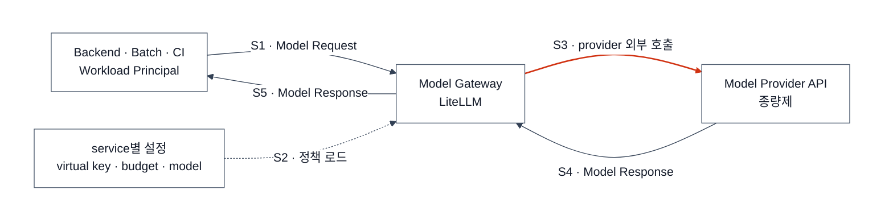
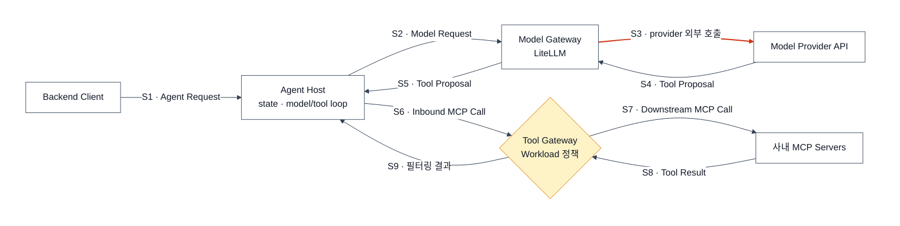
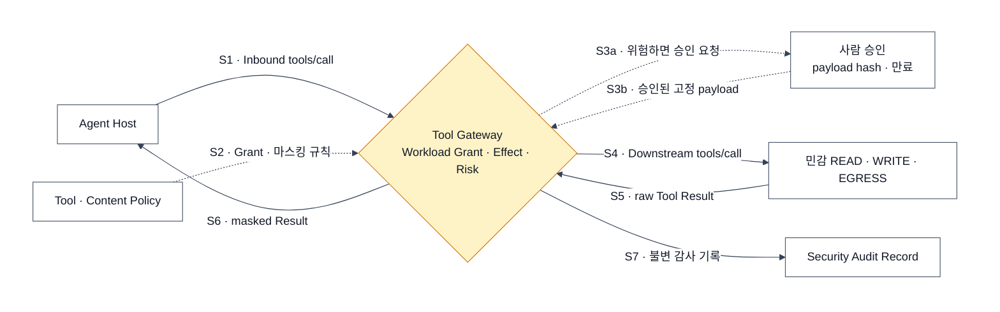

# Internal Server AI — 서버·CI가 AI를 호출하는 구성

> 목표: 사람이 없는 workload의 Model API 호출을 identity·비용·품질 기준으로 통제한다.
> 범위 밖: 사람의 좌석형 사용은 [Internal Human AI](./internal-human-ai.md)에서 다룬다.

## 사람 구성과 다른 점

| 항목 | Server AI Runtime |
|---|---|
| 실행 주체 | backend·batch·CI(Workload Principal) |
| 모델 연결 | LiteLLM을 거쳐 Model API 호출 |
| 인증 | service credential·virtual key |
| 비용 | token·request 기반 API Usage |
| 중앙 관측 | end-to-end model·agent trace |

## 서버 페이즈 0 — LiteLLM으로 Model API 통제

- service·environment마다 Workload Principal과 virtual key를 발급한다.
- provider key는 LiteLLM secret에만 저장한다.
- team·service별 budget과 허용 Model ID를 둔다.
- 사용자 seat나 개인 credential을 workload identity로 사용하지 않는다.

**다음 신호:** 서버가 여러 turn의 상태를 관리하거나 사내 tool을 호출해야 한다.

## 서버 페이즈 1 — Agent Host와 Tool 경로 추가

Agent Host가 loop를 소유한다. Model Gateway가 Tool Gateway를 호출하지 않고, 두 gateway도 서로 연결되지 않는다. 조직 지식 검색은 필수 구성요소가 아니며 필요할 때 [Knowledge Base](./knowledge-base.md)의 Retrieval API를 tool로 연결한다.

Tool Gateway는 Kotlin + Spring Boot + Spring AI MCP 애플리케이션 하나로 시작한다. 앞에서는 MCP Server, 뒤에서는 MCP Client다. Inbound MCP Call을 그대로 proxy하지 않고 Workload Principal·허용 tool·Effect를 확인한 뒤 새 downstream credential로 실행한다.

**다음 신호:** 민감 READ 또는 WRITE·EGRESS가 필요하다.

## 서버 페이즈 2 — 민감 결과와 WRITE·EGRESS 통제

- JSON schema의 민감 field를 먼저 마스킹하고 자유 텍스트에만 detector를 쓴다.
- WRITE에는 idempotency key를 요구한다.
- `sensitive_data && untrusted_input` 상태의 EGRESS는 자동 실행하지 않는다.
- PostgreSQL polling으로 시작하고 독립 worker가 필요할 때만 Kafka와 DLT를 추가한다.

## 관측

OpenTelemetry를 공통 계측으로 사용한다. Prometheus·Loki·Tempo·Grafana로 운영 지표를 보고, agent trace·evaluation은 Langfuse 또는 LangSmith 하나를 선택한다. LangGraph는 장시간 pause·resume이 필요할 때의 Agent Host runtime이지 모니터링 제품이 아니다.

## 참고 자료

- [LiteLLM — Virtual Keys · Budgets](https://docs.litellm.ai/docs/proxy/virtual_keys)
- [Langfuse Observability](https://langfuse.com/docs/observability/overview)
- [LangSmith Observability](https://docs.langchain.com/langsmith/observability-concepts)
