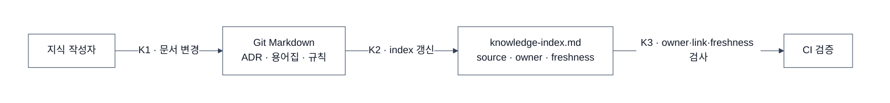
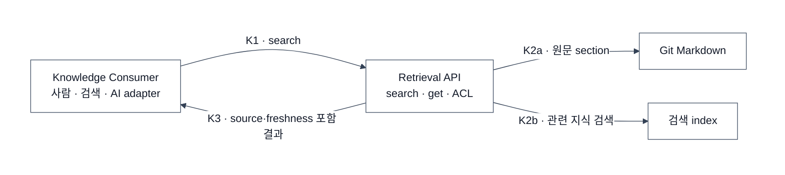
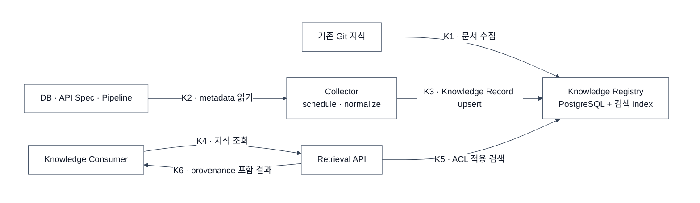

# Knowledge Base — 조직 지식을 만드는 시스템

> 목표: 조직의 문서·규칙·metadata를 수집하고, 출처·소유자·최신성·권한을 유지한 채 검색 가능하게 만든다.
> 관계: Human AI Workspace나 Server AI Runtime의 필수 구성요소가 아니다. 사람·검색 서비스·AI가 필요할 때 소비한다.

## Context Provider와의 관계

이 문서의 최상위 개념은 **Knowledge Base**다.

- Knowledge Base: 지식 원천, 수집 pipeline, registry, 검색 index와 운영 정책을 포함한 전체 시스템
- Retrieval API: Knowledge Base에서 지식을 검색·조회하는 제공 interface
- Context Provider: AI 관점에서 Retrieval API를 부르던 표현. 전체 시스템 이름으로는 사용하지 않는다

AI에서 쓰려면 Retrieval API를 `knowledge.search`, `knowledge.get` MCP READ tool로 감쌀 수 있다. 이것은 소비 adapter일 뿐 Knowledge Base 자체가 Tool Gateway에 종속된다는 뜻은 아니다.

## 지식 레코드

```text
knowledge_id, source_uri, knowledge_type, owner,
updated_at, collected_at, access_scope, content_hash
```

| 지식 종류 | 예 | 시작 원천 |
|---|---|---|
| 의미·규칙 | 용어집, ADR, `AGENTS.md` | Git Markdown |
| 구조 | DB schema, API spec | schema collector |
| 운영 | owner, freshness, 배포·DQ 결과 | 운영 시스템 |

## Knowledge 페이즈 0 — Git 문서와 소유권

**구현:** 중요한 문서의 source·owner·freshness를 `knowledge-index.md`에 기록하고 CI로 검사한다.



**다음 신호:** 사람이나 AI가 여러 파일을 직접 뒤져야 하거나 관련 section을 찾지 못한다.

## Knowledge 페이즈 1 — 검색 index와 Retrieval API



- 긴 문서 전체가 아니라 관련 section을 반환한다.
- 원본 `access_scope`보다 넓게 노출하지 않는다.
- 결과에 `source_uri`와 `updated_at`을 포함한다.
- DuckDB는 로컬 PoC, PostgreSQL은 공유 서비스가 필요할 때 선택한다.

**다음 신호:** DB·API·pipeline metadata 변경을 사람이 따라갈 수 없다.

## Knowledge 페이즈 2 — metadata 자동 수집



OpenMetadata는 connector·lineage·DQ·owner UI가 모두 필요하고 이를 운영할 사람이 있을 때 도입한다. 100명 이하 회사에서는 PostgreSQL과 필요한 collector 몇 개가 보통 먼저다.

## 운영 지표

| 지표 | 의미 |
|---|---|
| freshness lag | 원본 변경이 반영되기까지 걸린 시간 |
| zero-result rate | 검색 결과가 없는 비율 |
| provenance missing | source 없는 결과 비율 |
| denied count | ACL로 차단한 조회 수 |
| collector success | 자동 수집 성공률 |

## 참고 자료

- [OpenMetadata 문서](https://docs.open-metadata.org/)
- [OpenMetadata MCP](https://docs.open-metadata.org/latest/how-to-guides/mcp)
