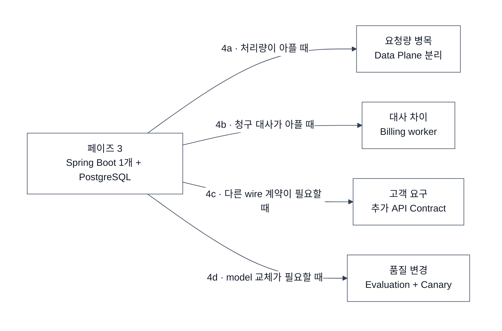

# Public Model API Gateway — 외부 tenant용 점진 구현

> 목표: 외부 고객에게 하나의 Model API 계약을 제공하고 key·사용량·과금·예산·라우팅을 운영한다.
> 전제: 사내 서버의 모델 호출만 필요하면 LiteLLM을 쓴다. 이 문서는 **Model API 자체가 제품일 때만** 구현한다.
> 용어: [유비쿼터스 언어](./UBIQUITOUS_LANGUAGE.md)

100명 이하 회사에서는 페이즈 0~3까지 Spring Boot 앱 하나와 PostgreSQL 하나로 유지한다. 서비스 분리는 실제 병목이 생긴 뒤의 선택이다.

## 페이즈 0 — API key와 Model Proxy

**구현:** `/v1/chat/completions`의 검증된 부분집합 하나만 제공한다.

```mermaid
---
config:
  theme: base
  darkMode: false
  themeVariables:
    background: "#ffffff"
    primaryColor: "#ffffff"
    primaryTextColor: "#111827"
    primaryBorderColor: "#475569"
    lineColor: "#334155"
---
flowchart LR
  subgraph canvas[" "]
    direction LR
    client["Tenant Client"]
    gateway["ai-gateway\nkey 검증 · proxy"]
    provider["Model Provider"]
    pg@{ img: "https://icons.terrastruct.com/dev/postgresql.svg", label: "API Key · Request Record", pos: "b", h: 48, constraint: "on" }

    client -->|"1 · Model Request"| gateway
    gateway -->|"2 · key·model 권한 조회"| pg
    gateway -->|"3 · provider 외부 호출"| provider
    provider -->|"4 · Model Response"| gateway
    gateway -->|"5 · API Response"| client
    gateway -->|"6 · Request Record"| pg
  end

  linkStyle 2 stroke:#D13212,stroke-width:2px
  classDef box fill:#ffffff,stroke:#475569,stroke-width:1px,color:#111827
  classDef icon fill:transparent,stroke:transparent,stroke-width:0px,color:#111827
  class client,gateway,provider box
  class pg icon
  style canvas fill:#ffffff,stroke:#ffffff,stroke-width:0px,color:#111827
```

| 결정 | 선택 |
|---|---|
| runtime | Spring MVC + virtual thread |
| API 계약 | Chat Completions 부분집합 하나 |
| Model ID | 불변 `owner/versioned_model_name` |
| provider key | gateway secret에만 저장 |
| tenant key | hash만 저장, `ACTIVE`·`REVOKED` |
| 본문 | 저장하지 않음 |

최소 schema:

```sql
api_key(id, key_hash, tenant_id, allowed_models, expires_at, status)
request_record(id, tenant_id, api_key_id, model_id, status, latency_ms, requested_at)
```

`tools`와 `tool_calls`는 모델 API payload로 전달할 뿐 gateway가 tool을 실행하지 않는다. MCP는 이 제품의 책임이 아니다.

**다음 신호:** tenant별 월 비용을 답해야 한다.

## 페이즈 1 — Usage와 Charge

**구현:** 요청 사실과 고객 과금 결과를 분리해 저장한다.

```mermaid
---
config:
  theme: base
  darkMode: false
  themeVariables:
    background: "#ffffff"
    primaryColor: "#ffffff"
    primaryTextColor: "#111827"
    primaryBorderColor: "#475569"
    lineColor: "#334155"
---
flowchart LR
  subgraph canvas[" "]
    direction LR
    client["Tenant Client"]
    gateway["Model Proxy\nusage 수집"]
    provider["Model Provider"]
    rating["Rating\nUsage × Price"]
    pg@{ img: "https://icons.terrastruct.com/dev/postgresql.svg", label: "Request · Price · Charge", pos: "b", h: 48, constraint: "on" }

    client -->|"1 · Model Request"| gateway
    gateway -->|"2 · provider 외부 호출"| provider
    provider -->|"3 · response + usage"| gateway
    gateway -->|"4 · Request Record"| pg
    gateway -->|"5 · Usage"| rating
    pg -.->|"6 · 요청 시점 Price"| rating
    rating -->|"7 · Charge Record"| pg
    gateway -->|"8 · API Response"| client
  end

  linkStyle 1 stroke:#D13212,stroke-width:2px
  classDef box fill:#ffffff,stroke:#475569,stroke-width:1px,color:#111827
  classDef icon fill:transparent,stroke:transparent,stroke-width:0px,color:#111827
  class client,gateway,provider,rating box
  class pg icon
  style canvas fill:#ffffff,stroke:#ffffff,stroke-width:0px,color:#111827
```

```sql
model_price(model_id, effective_from, input_price, output_price, currency)
request_usage(request_id, input_tokens, output_tokens)
charge_record(request_id, tenant_id, price_snapshot, amount, currency)
```

- streaming도 terminal event에서 usage를 확정한다.
- price는 요청 수락 시점을 기준으로 snapshot한다.
- dashboard 집계는 Charge Record에서 다시 만들 수 있는 projection이다.
- provider 원가는 Provider Attempt별로 기록하고 tenant Charge와 섞지 않는다.

**다음 신호:** 사용량은 보이지만 tenant 예산 초과를 막지 못한다.

## 페이즈 2 — 예산 상한

**구현:** key 수명주기와 tenant 예산 상태를 분리한다.

```mermaid
---
config:
  theme: base
  darkMode: false
  themeVariables:
    background: "#ffffff"
    primaryColor: "#ffffff"
    primaryTextColor: "#111827"
    primaryBorderColor: "#475569"
    lineColor: "#334155"
---
flowchart LR
  subgraph canvas[" "]
    direction LR
    client["Tenant Client"]
    gateway{"Model Proxy\nkey + budget 검사"}
    provider["Model Provider"]
    pg@{ img: "https://icons.terrastruct.com/dev/postgresql.svg", label: "Budget · Charge", pos: "b", h: 48, constraint: "on" }
    scheduler["Budget Scheduler\nperiod charge 합산"]

    client -->|"1 · Model Request"| gateway
    gateway -->|"2 · key·예산 상태 조회"| pg
    gateway -->|"3 · ACTIVE면 외부 호출"| provider
    provider -->|"4 · Model Response"| gateway
    gateway -->|"5 · API Response"| client
    pg -->|"6 · Charge 합계"| scheduler
    scheduler -->|"7 · ACTIVE·SUSPENDED 갱신"| pg
  end

  linkStyle 2 stroke:#D13212,stroke-width:2px
  classDef box fill:#ffffff,stroke:#475569,stroke-width:1px,color:#111827
  classDef guard fill:#fef3c7,stroke:#d97706,stroke-width:1px,color:#111827
  classDef icon fill:transparent,stroke:transparent,stroke-width:0px,color:#111827
  class client,provider,scheduler box
  class gateway guard
  class pg icon
  style canvas fill:#ffffff,stroke:#ffffff,stroke-width:0px,color:#111827
```

```sql
tenant_budget(tenant_id, period_start, period_end, limit_amount, enforcement_status)
```

- 폐기된 key는 `REVOKED`, 예산 소진 tenant는 `SUSPENDED`다.
- rate limit은 429, 예산 소진은 402로 구분한다.
- 처음에는 DB 조회와 scheduler로 충분하다. Redis cache는 DB 부하가 측정된 뒤 추가한다.
- 초과 노출 상한은 `최대 분당 비용 × scheduler 주기`로 계산해 허용 범위를 정한다.

**다음 신호:** 한 provider 장애가 전체 API 장애가 된다.

## 페이즈 3 — 동일 model failover

**구현:** 같은 Model ID와 API Contract를 제공하는 Venue만 자동 전환한다.

```mermaid
---
config:
  theme: base
  darkMode: false
  themeVariables:
    background: "#ffffff"
    primaryColor: "#ffffff"
    primaryTextColor: "#111827"
    primaryBorderColor: "#475569"
    lineColor: "#334155"
---
flowchart LR
  subgraph canvas[" "]
    direction LR
    client["Tenant Client"]
    gateway["Model Proxy"]
    route{"Model Route\nsame model · same contract"}
    venueA["Venue A"]
    venueB["Venue B"]
    pg@{ img: "https://icons.terrastruct.com/dev/postgresql.svg", label: "Route · Provider Attempt", pos: "b", h: 48, constraint: "on" }

    client -->|"1 · Model Request"| gateway
    gateway -->|"2 · route 조회"| pg
    gateway -->|"3 · route 선택"| route
    route -->|"4a · first attempt"| venueA
    venueA -.->|"4b · timeout·5xx"| route
    route -->|"5 · failover attempt"| venueB
    venueB -->|"6 · Model Response"| gateway
    gateway -->|"7 · API Response"| client
    gateway -->|"8 · attempts 기록"| pg
  end

  linkStyle 3,5 stroke:#D13212,stroke-width:2px
  classDef box fill:#ffffff,stroke:#475569,stroke-width:1px,color:#111827
  classDef guard fill:#fef3c7,stroke:#d97706,stroke-width:1px,color:#111827
  classDef icon fill:transparent,stroke:transparent,stroke-width:0px,color:#111827
  class client,gateway,venueA,venueB box
  class route guard
  class pg icon
  style canvas fill:#ffffff,stroke:#ffffff,stroke-width:0px,color:#111827
```

- 같은 Venue 재호출은 Retry다.
- 같은 model을 다른 Venue에서 호출하면 Failover다.
- Anthropic 등 다른 model로 바꾸는 것은 Model Fallback이며 자동 적용하지 않는다.
- response streaming이 시작된 뒤에는 다른 provider 응답을 이어 붙이지 않는다.
- Model Request 하나에 Provider Attempt가 여러 개 생길 수 있다.

**다음 신호:** 실제 병목에 따라 아래 확장 중 하나만 선택한다.

## 페이즈 4 — 측정된 문제만 분리



Data Plane을 분리할 때만 Request Record 발행에 Kafka/MSK와 DLT를 검토한다. 관리 기능이 같은 앱에서 문제없이 동작하면 분리하지 않는다.

## 관측 도구

| 도구 | 책임 |
|---|---|
| OpenTelemetry | 공통 trace와 metric 계약 |
| Prometheus·Loki·Tempo·Grafana | availability·latency·error·alert |
| Langfuse 또는 LangSmith | sampled generation trace와 evaluation |
| PostgreSQL 원장 | Request·Attempt·Charge의 과금 원본 |

관측 trace는 과금 원장이 아니다. sampling되거나 유실될 수 있으므로 Request Record와 Charge Record는 별도로 보존한다. prompt·response 본문은 기본 미수집이다.

## 페이즈별 완료 조건

| 페이즈 | 완료 조건 |
|---|---|
| 0 | key 폐기·model 권한·streaming 오류 계약 테스트 통과 |
| 1 | provider usage와 내부 Charge를 request 단위로 설명 가능 |
| 2 | 예산 소진 시 402, 월 전환·증액 시 정상 복구 |
| 3 | 동일 model failover와 attempt별 원가 추적 가능 |

## 참고 자료

- [OpenGateway 문서](https://opengateway.ai/docs)
- [LiteLLM Proxy](https://docs.litellm.ai/docs/simple_proxy)
- [OpenTelemetry Collector](https://opentelemetry.io/docs/collector/)
